# Collection implementation journal

23 September 2026 · ShenzhenPDF

**Native Collection redesign: technical 9.2/10 · UX 9.2/10.** Independent native reviews have no remaining major or medium findings in their stated scopes. The final section records the implemented mockup, corrections and release validation. Earlier scores and the 53-target sweep below describe the previous baseline.

## Implemented behavior

**Current Collection rule:** Documents and search show each document once using its latest saved copy. Older versions and the Latest pill belong only in History. This supersedes the earlier all-version browser and badge placements documented below.

Keep local, immutable copies and history while continuing to read original documents. Search open documents, groups and Collection from one palette; recover missing originals; compare PDF and Markdown revisions in two coordinated readers.

The approved proposal is [Reader review and Collection](../../proposals/reader-review-and-collections.md). The latest visual correction is uniform title text on every tab: selection is communicated by fill, outline and weight, without fading other document names.

The reference shows the problem: an inactive title fades into the gray fill. Every tab now uses the same title foreground; selected tabs retain the stronger fill and outline.

<!-- pagebreak -->

## Architecture and responsibilities

| Part | Responsibility | Validation |
|---|---|---|
| Collection store agent | Immutable snapshots, identity, deduplication, index, locking | Temporary stores; failure and laziness tests |
| Comparison agent | PDF/Markdown alignment, colored changes, paired readers | Text, image, scanned and inserted-page fixtures |
| Reader refinements agent | Tab contrast, accessibility, navigation, checkpointing | Geometry, action and state tests |
| Integration | Consent, original-path routing, search, manager, history and recovery | Build, integration tests and isolated app use |
| Independent Astra critics | Technical and UX review after implementation | Ranked findings and scores, up to six rounds |

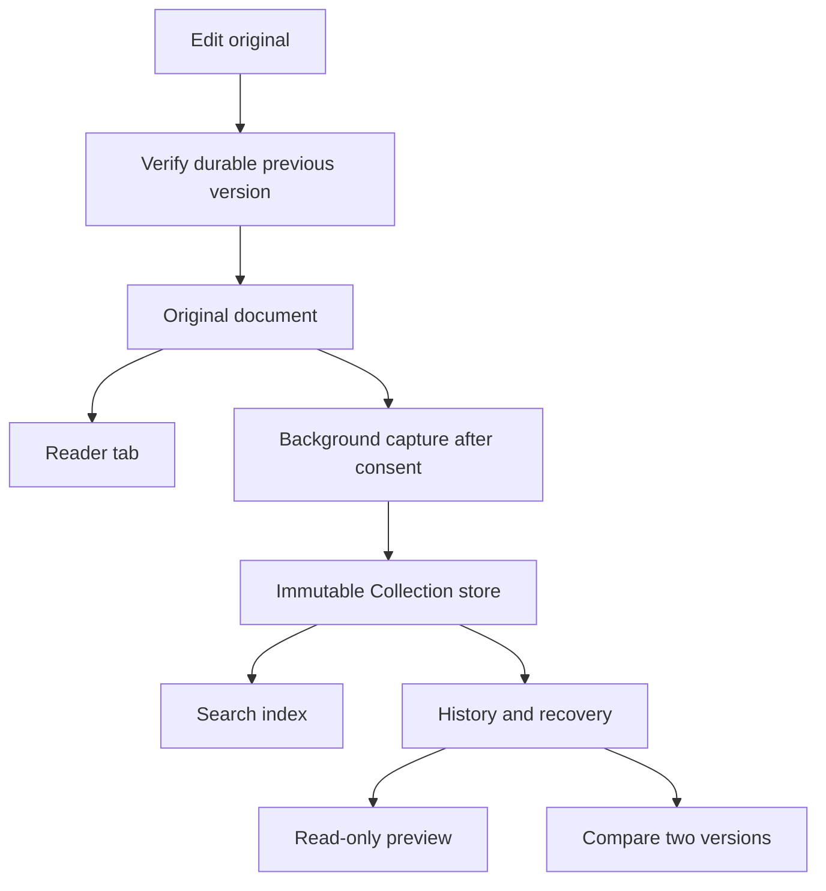
```mermaid
flowchart TD
  O[Original document] --> R[Reader tab]
  O --> C[Background capture after consent]
  C --> S[Immutable Collection store]
  S --> I[Search index]
  S --> H[History and recovery]
  H --> V[Read-only preview]
  H --> D[Compare two versions]
  E[Edit original] --> P[Verify durable previous version]
  P --> O
```

## Decisions and actions

### 1 · Establish ownership and preserve the original

The storage, comparison and reader tasks are independent and have distinct files. Integration owns the coordinator hooks, avoiding simultaneous changes to the same large file. Collection construction and disabled-state reads must not create folders or scan documents.

A successful document open schedules a background capture. The first-use choice precedes copying. A source overwrite checks that the previous revision is durable; a full destination, revoked destination access, interrupted copy or changing source can fail even though reading the original succeeded. Normal reading remains available.

### 2 · Reuse native rendering for comparison

PDF comparison uses two native PDF reader views. Markdown first renders through the existing deterministic print plan, preserving the same pagination and selectable vector text. Alignment and differences are computed away from the UI thread. This keeps comparison separate from the editable source reader and avoids sharing mutable document handles.

<!-- pagebreak -->

## Validation evidence

### Headless checks, implementation pass

| Check | Result | What it establishes |
|---|---|---|
| Collection store / comparison / previous tab / checkpoint / reader actions / tab interactions | Exit 0 | Focused feature behavior, concurrent storage and editing failures |
| Markdown engine and UI/session suites | Exit 0 | Rendering, pagination, navigation and existing reader behavior |
| Agent commands, PDF/Markdown navigation and MCP tests | Exit 0 | Existing agent access remains functional |
| Tab state, strip style/interaction and group model/integration | Exit 0 | Persistent state and group behavior |
| Full app integration | Exit 0 | Native build, hidden-window layout, live isolated app |

### 3 · Close integration gaps before visual review

The first compilation found a category header missing its host declaration and manager actions using synthesized instance variables from another translation unit. Those were corrected without changing the storage contract. A coordinator shortcut hook accidentally matched an icon lookup with the same selector; syntax validation caught it and the hook is now limited to menu validation.

OCR receives an additional check immediately before installing its result, since the original can change while OCR runs. Locator preview and relinking have separate callbacks: previewing a candidate must never silently rebind a missing-document tab.

The coordinator is smaller after extracting palette orchestration, creating space for explicit Collection hooks without raising its size cap.

### Live validation, first integrated build

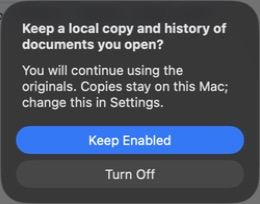

The exact consent wording is displayed. Inspecting the isolated state directory before answering found no Collection folder or copied document. After Keep Enabled, the fixture was captured while its tab continued to use the original path.

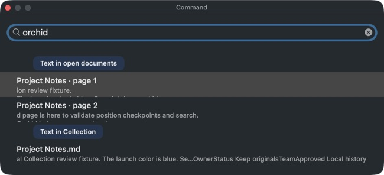

Searching “orchid” returned two page matches in the open Markdown document, followed by Collection text. `col:Project` included the collected open document. The screenshot also exposed multiline snippets clipping in fixed-height rows; these are being normalized to a single line.

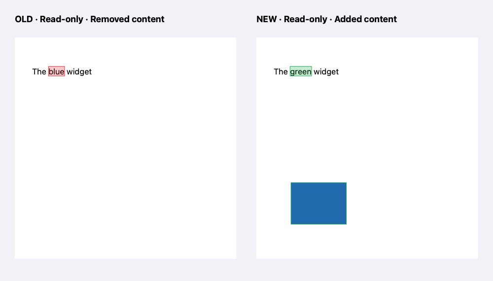

This is a headless rendering of test pages with the actual difference geometry, not a mockup or live-window screenshot. The red word was removed, the green word added, and the new image is outlined in green.

Cmd+Backspace returned from Design Review to Project Notes at page 2; a second press returned to Design Review. The first manager invocation revealed a missing-common-ancestor layout exception. Its constraints are being reordered, with a real hidden-window construction test added to prevent recurrence.

<!-- pagebreak -->

## Independent review rounds

| Round | Technical /10 | UX /10 | Major / medium remaining | Action |
|---|---|---|---|---|
| 1 | 6.8 | 7.0 | Technical: 2 major, 4 medium; UX: 1 major, 4 medium | Repaired; regression fixtures added |
| 2 | 8.0 | 7.2 | Technical: 3 medium; UX: 1 major, 2 medium | Queue/parser fixes; PDF ownership, thumbnail layout and archive identity |
| 3 | 9.1 | 9.0 | No major or medium findings remain | Optimized regressions and live counter retest passed |

## Release preparation

Independent reviews met the requested threshold within three rounds. Release 26.9.23-1 was prepared on `codex/collection-history-release` at metadata commit `418cb5b`. The release workflow reran all 53 test targets successfully and committed validated version metadata. No tag, push, notarization or publication was performed. The journal is delivered in the final dated build; the installed reader remains untouched.

### Review round 1 · Repair decisions

The [technical review](technical-review-round-1.md) reproduced a source-change race, unsafe overwrite during archive export and unrelated-file history merging. Capture now publishes only the fingerprint of the bytes it actually protected. Export installs only to a new destination. Observed saves have explicit identity continuity; generic opens cannot inherit a cancelled edit's pending identity. New regression fixtures also cover reference-style Markdown images, retries and mixed text/image page alignment.

The [UX review](ux-review-round-1.md) exercised the real app and scored it 7.0/10. Its main finding was that path disambiguation replaced the archive's dated title with an internal folder name. Archive identity now has its own persisted display label. The other repairs target spare tab-strip space, search routing, thumbnail captions and recovery context.

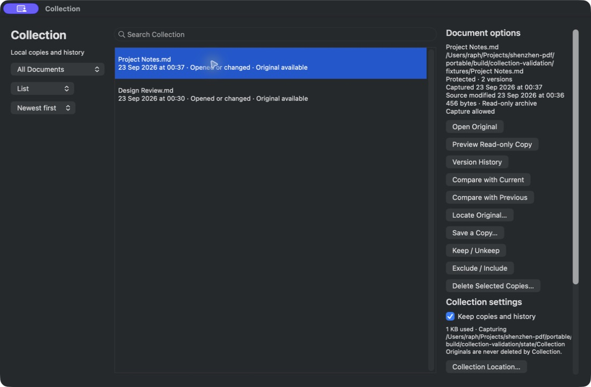

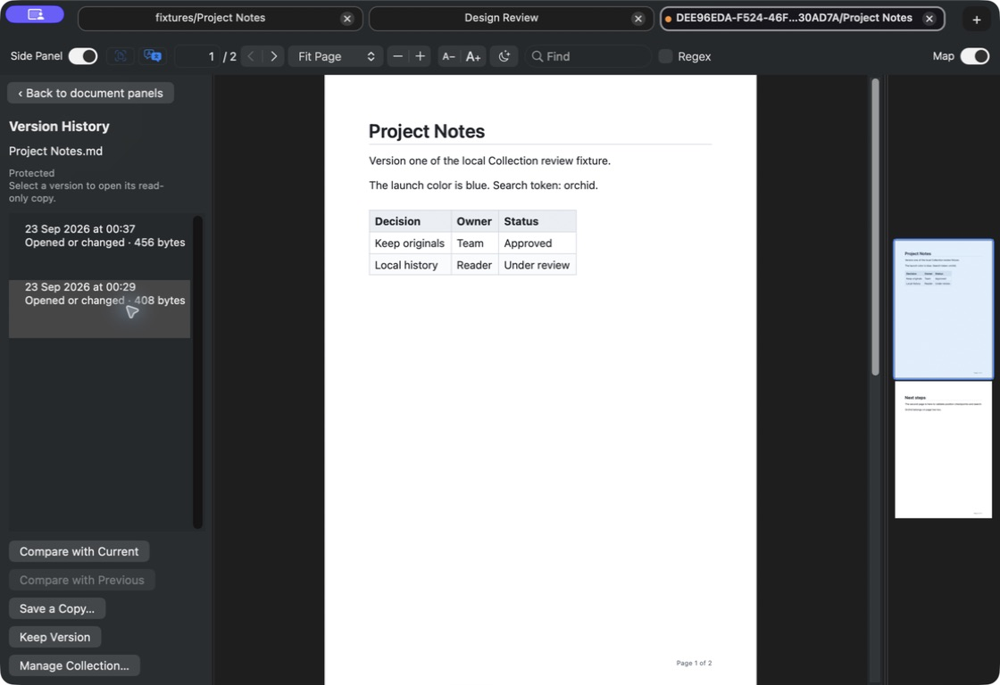

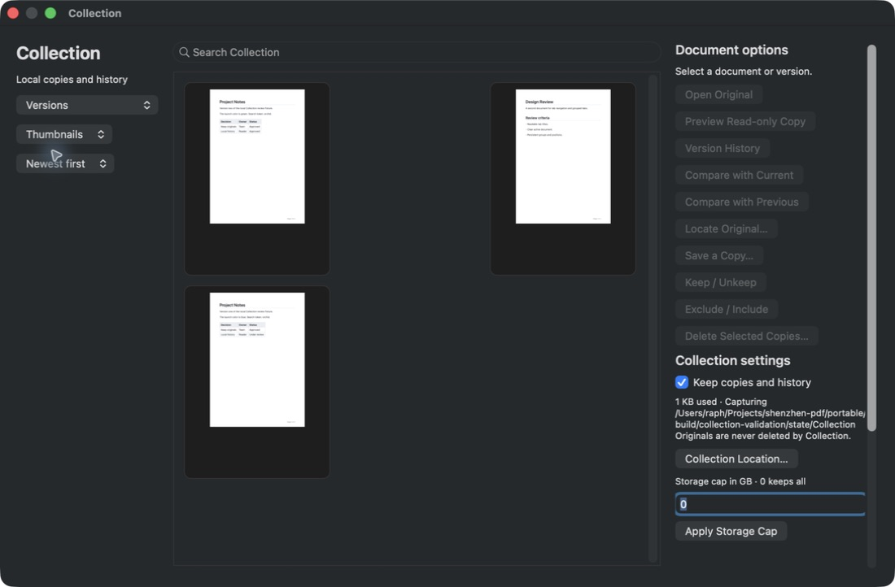

These are before-fix screenshots, retained to explain the changes. Final evidence will follow the next live evaluation.

### Technical round 2 · Queue ordering and parser fidelity

The original six technical findings are closed. A deliberately paused old capture then exposed a race with a subsequent successful save. Capture requests now have per-path generations, checked again under the transaction lock: a superseded request cannot change document identity. The regression retains one history containing both A and B. Focus-driven change detection now supplies the same explicit continuity as the active file watcher.

Asset discovery now uses the reader's actual Markdown parser. Literal code, comments and unsupported HTML cannot pull unrelated neighboring files into Collection. Only rendered image dependencies are considered. This both improves fidelity and avoids copying files that the document merely mentions as syntax examples.

### Live round 2 · Test limits made visible

The second app evaluation confirmed that indexed “Show all” search now returns both PDF and Markdown matches and that archived previews have explicit labels. It also exposed two gaps that the earlier hidden-window checks missed: thumbnail captions disappeared during live layout, and accessibility selection did not update the document actions. The thumbnail regression is being extended through layout and selection synchronization.

A PDF comparison triggered an accessibility crash in PDFKit while traversing a copied page's tagged-content tree (`CGPDFPageCopyRootTaggedNode`, recursive lock abort). This was observed in the isolated validation process, not inferred from a source review. Comparison presentation is being investigated independently; release remains blocked until the same live flow succeeds.

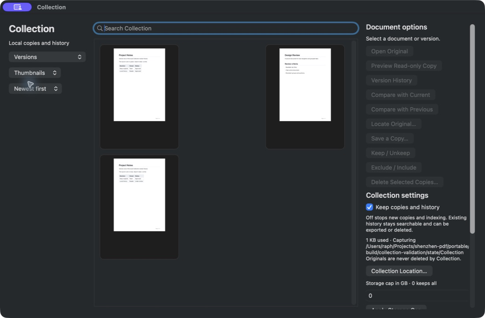

An older restored archive also lost metadata after its original was renamed. The archive resolver now recognizes the original's verified filename aliases for the early schema; unknown dates are explicitly labeled unavailable instead of showing 1970.

### Candidate for round 3

Aligned comparison pages are now serialized and reopened as complete, independent PDF documents on the worker queue. A new presentation test proved the ownership defect: previously the displayed documents had no backing document reference while their pages belonged to other documents. The corrected presentation retains selectable text, annotations, blank counterparts and native accessibility. The original code fails eight ownership/serialization assertions; the new code passes. The observed live crash still requires a live retest.

Thumbnail captions now have explicit constraints. Their regression checks pixels after the run loop and layout, then verifies accessibility selection updates the details and Preview action. Archive labels are preserved in tabs, window titles and palette candidates. Existing Favorites and Actions remain available after the five requested search sections; `col:` remains limited to Collection.

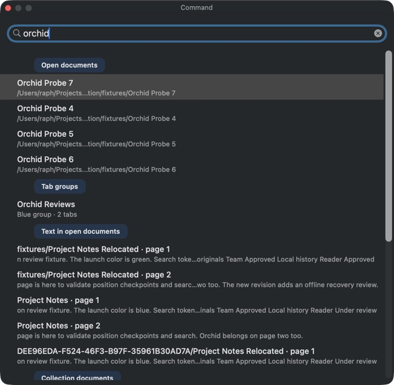

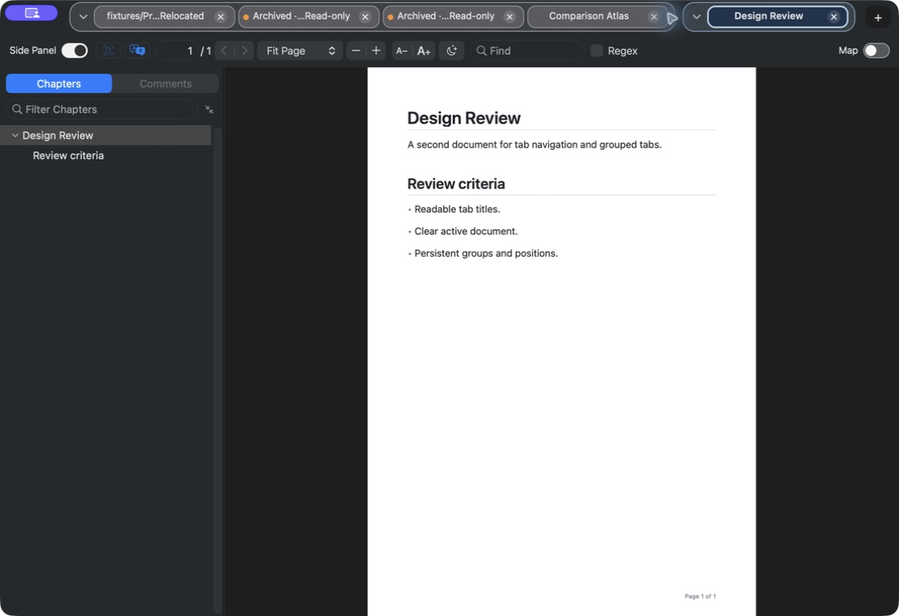

### Round 3 follow-through · Match the production build

The technical critic independently confirmed that the shared-store race now retains one history with both versions, and rated the core implementation 9.1/10 with no major or medium findings. Edit protection publishes a durable epoch under the shared lock, invalidating older queued captures in other processes. It renews metadata without duplicating unchanged snapshots. Activation-time PDF/Markdown cache invalidation now records observed continuity only when a live cached document existed.

The live candidate then exposed an optimized-build issue in the thumbnail repair: `NSCollectionViewItem.textField` is weak. Assigning a newly created label before attaching it to a view let ARC release it early; the later constraint array contained nil and the manager crashed. The label now has a strong local owner until attached. The entire Markdown UI suite now compiles with `-O2`, matching production lifetime behavior, and still checks caption pixels and selection actions. This replaces the misleading confidence from the earlier `-O0` pass.

The Markdown integration file briefly exceeded its 500-line cap. Its checkpoint closure was extracted into a focused integration file; the limit was not raised.

### Final navigation repair

The optimized full release test sweep completed with exit 0, including all 53 discovered test targets. Live round 3 then confirmed the manager and PDF accessibility repairs. Its remaining medium finding was narrower: both comparison readers displayed the aligned appendix, but one counter still described the preceding inserted page. Navigation labels now follow the aligned destination, with deferred scroll updates guarded against stale notifications. The optimized regression verifies that both actual readers and counters reach aligned slot 3, showing old page 2 versus new page 3; it also checks independent navigation and scrolling. The pre-fix code fails four assertions in the same expanded test. The independent live retest passed: linked navigation shows slot 3 in both panes with old source 2/new source 3; unlinking permits the right pane to advance while the left remains on its blank counterpart. The UX critic closed the finding and scored the final candidate 9.0/10; the technical critic independently reran the regression and retained 9.1/10.

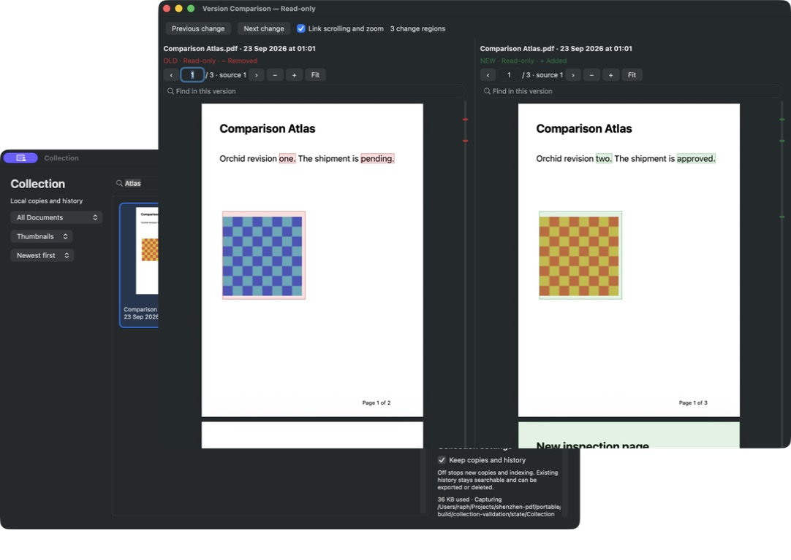

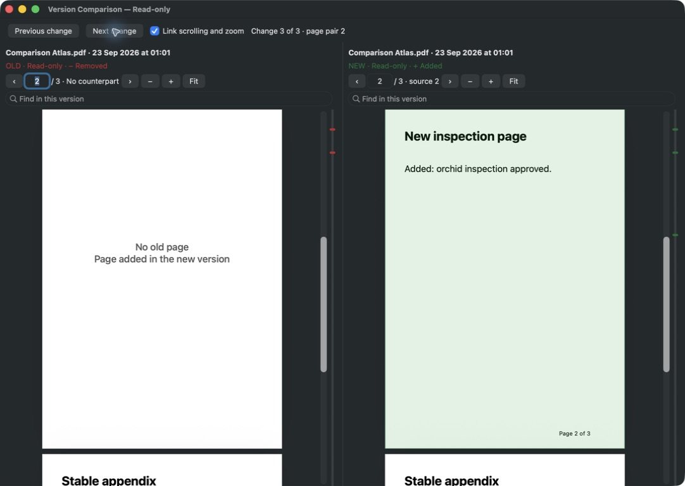

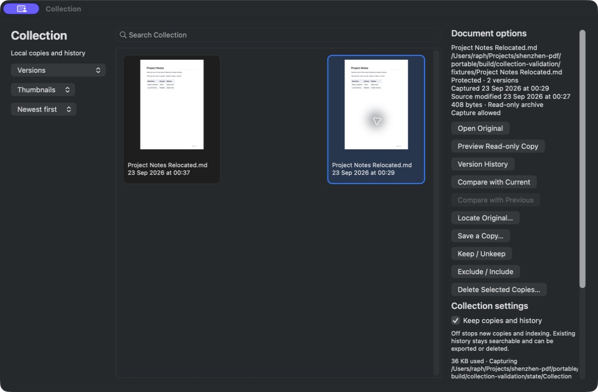

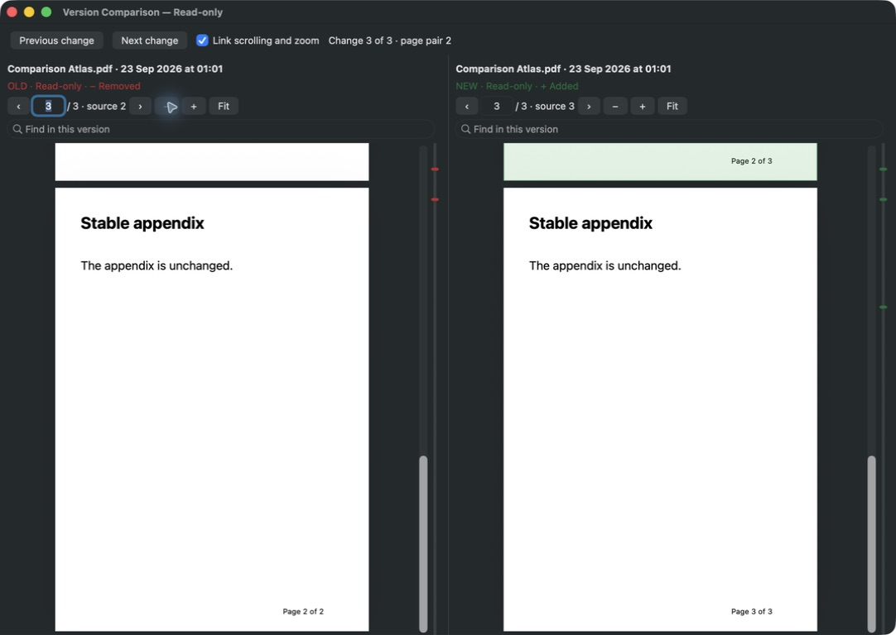

### Final evidence and remaining scope

The native inspection command rendered this journal successfully with no layout diagnostics after adding deliberate page breaks before its summary tables. Screenshots are actual app captures; the explicitly labeled engine figure is a headless render. The reviews retain their earlier failures and state where checks were live, headless or source-only.

Both critics leave only minor follow-ups: start search snippets at word boundaries, make capture reasons more specific, and add direct coordinator tests around externally edited inactive tabs. No major or medium improvements remain in their reviewed scope. The live review used isolated generated documents and state; whole-computer recovery scanning and destructive Collection deletion were covered by bounded tests rather than exercised against personal files.

### Release record

- Implementation: `daf065f0a` — Collection, comparison, navigation and regression tests.
- Visual journal and independent reviews: `77ba17824`.
- Release metadata: `418cb5b` — version 26.9.23, build 1.
- Release preparation command: `./portable/cut-release.sh --prepare-only "Collection history and persistent tab groups"`; exit 0.
- Release notes: [26.9.23-1](../../releases/26.9.23-1.md). Publication remains a separate action.

### Delivered in the reader

The final native app build completed with exit 0. Its bundle reports version 26.9.23, build 1, and passes local ad-hoc code-signature verification; this is a local validation build, not a notarized distribution artifact. The journal was opened and visually checked on page 1 in that build with its chapters, screenshots and minimap visible. The app remains open for inspection, using the isolated validation state.

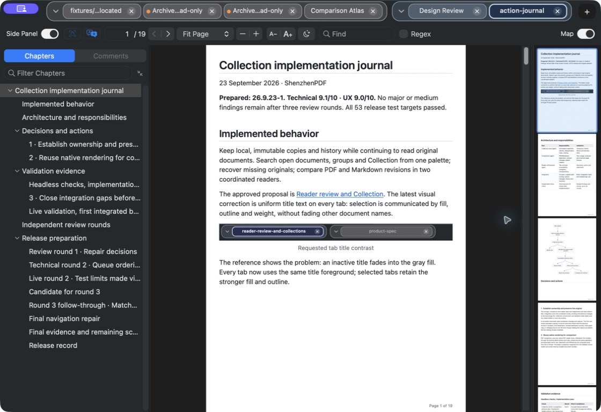

### Requested corrections after preparation

Removed the unsolicited 30-point margin overrides from this journal and the proposal. Native inspection confirms both again use the existing 61.2-point Markdown margins.

Markdown now omits the Comments sidebar tab entirely. Sidebar modes have stable tags so Search keeps its identity when moving between the compact Markdown control and the PDF control. Comment actions remain gray through AppKit menu validation, which previously could re-enable Add Comment. Focused sidebar tests cover switching document types, search activation/clearing and PDF Comments restoration. These follow-up checks are separate from the earlier 53-target release sweep and critic scores.

The sidebar, tab-state and file-size checks passed, as did the rebuilt native app. The build is available in `dist/ShenzhenPDF.app`; the running reader was not restarted.

### Live feedback while reordering grouped tabs

Removed the grouped-tab exclusion from the existing moving-tab preview. The grabbed tab now follows the pointer above its siblings; crossed siblings exchange slots while group headers and other groups remain anchored. Drop uses that same insertion position. A pause over the source group's own tabs or handle remains a reorder, preventing an accidental append or new group. Joining another group still shows its destination outline and the moving tab.

Focused tests cover both directions in General and colored groups, the pointer grab offset, pause behavior, release/reset, and a later group's first slot. The pre-fix code fails the new moving-preview regression. The image below is a headless render of the actual native tab strip during a drag, not a mockup or an app screenshot.

### Collection settings and search design review

The next request was for mockups before implementation: move Collection settings to the left sidebar, display the storage path with Set location and Open location, and place contextual highlighted search matches to the right of each thumbnail. Reading the existing capture code confirmed that the current cap refuses additional storage; it does not prune old documents. The user chose a proposed cleanup policy that removes whole oldest unkept histories. The proposal orders histories by their latest capture, protects every history containing a kept version, and never deletes originals.

A UX designer produced an interactive mockup. The independent Astra critic scored the first round 7.8/10, identifying offscreen previews, lost focus, misleading title-only snippets, and inconsistent post-cleanup totals. Browser validation then caught a state-update echo that rebuilt focused controls, and an iframe resize that happened after the initial scroll request. The revised mockup preserves focus and reveals the correct preview after layout settles.

The second critique scored 9.2/10 with no major or medium findings remaining in the design scope. Dark/light appearances, narrow layouts, search states, version identity, keyboard navigation, settings persistence, cleanup cancellation/protection, and location simulations were exercised. No reader restart or application changes were made for this mockup task. The [proposal and both critiques](../../proposals/collection-settings-search.md) preserve the decisions and verification limits.

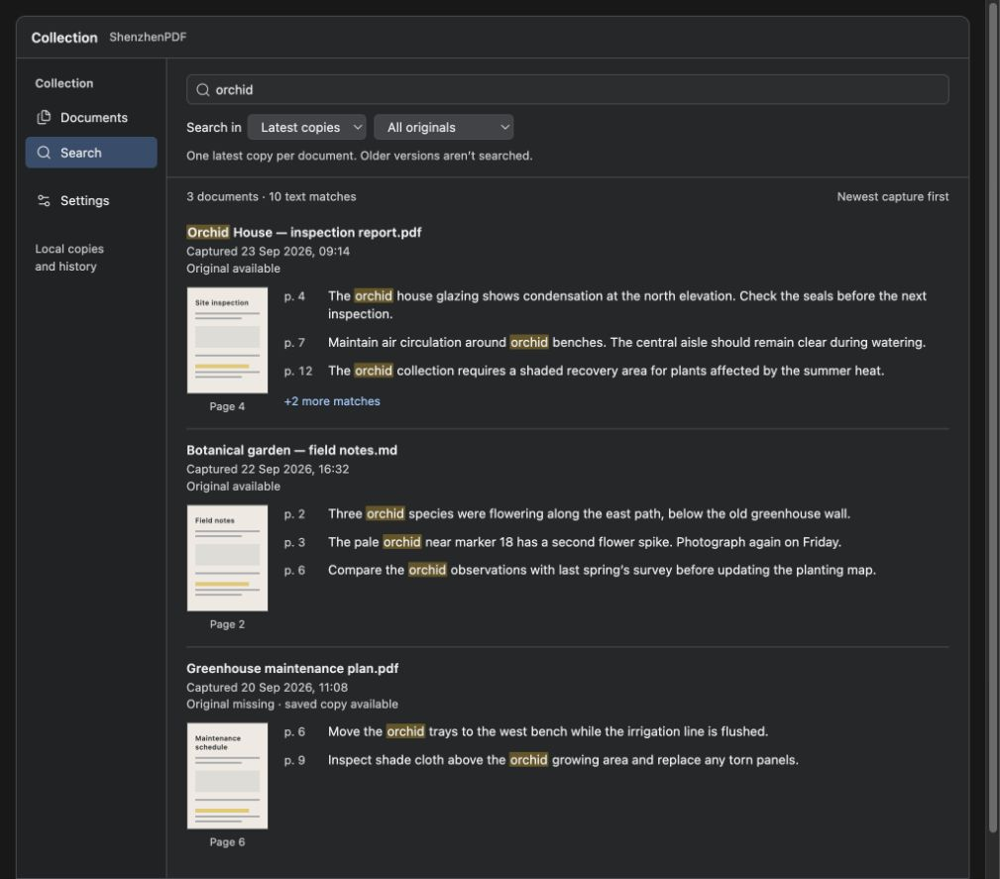

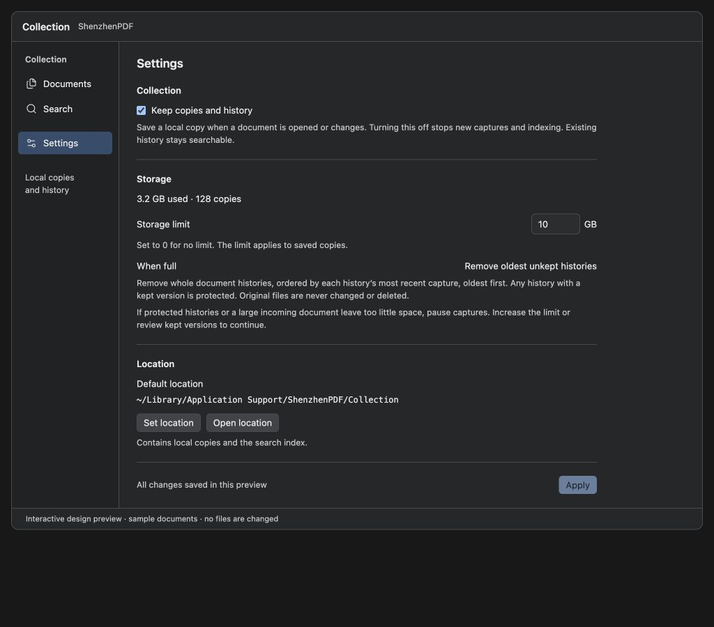

### Integrated Documents search and Collection history revision

The user simplified the navigation: search belongs inside Documents, and storage should default to unlimited. They also replaced whole-history-first cleanup with usage-based cleanup: least-opened documents first, old versions before the documents themselves. The revised proposal uses two passes, first pruning previous versions in usage order and only then removing final Collection copies when necessary. Histories containing a kept version stay protected; originals remain untouched.

The UX designer added a visible History action to each document and a detail view with version dates, capture reasons, protection state and read-only previews. Browser checks confirmed that returning preserves query, scope, expansion, selected preview and focus on the originating action. Cleanup uses the same sample versions as Documents and History: a 2.5 GB limit prunes two previous versions; a 2 GB limit then also removes the least-opened document's final copy and entry. Protected capacity is checked before any removal.

This revision completed two independent review rounds, **8.9/10 → 9.3/10**. The sole medium finding concerned Keep: its whole-history effect was explained below the page preview. Moving that explanation directly beneath the checkbox, connecting its accessible description, and announcing protection changes resolved it. Tests covered current-version protection, protection retained by another version, and the last kept version being unkept. The final critic leaves no major or medium findings in the mockup scope. Native app behavior is unchanged by this design task.

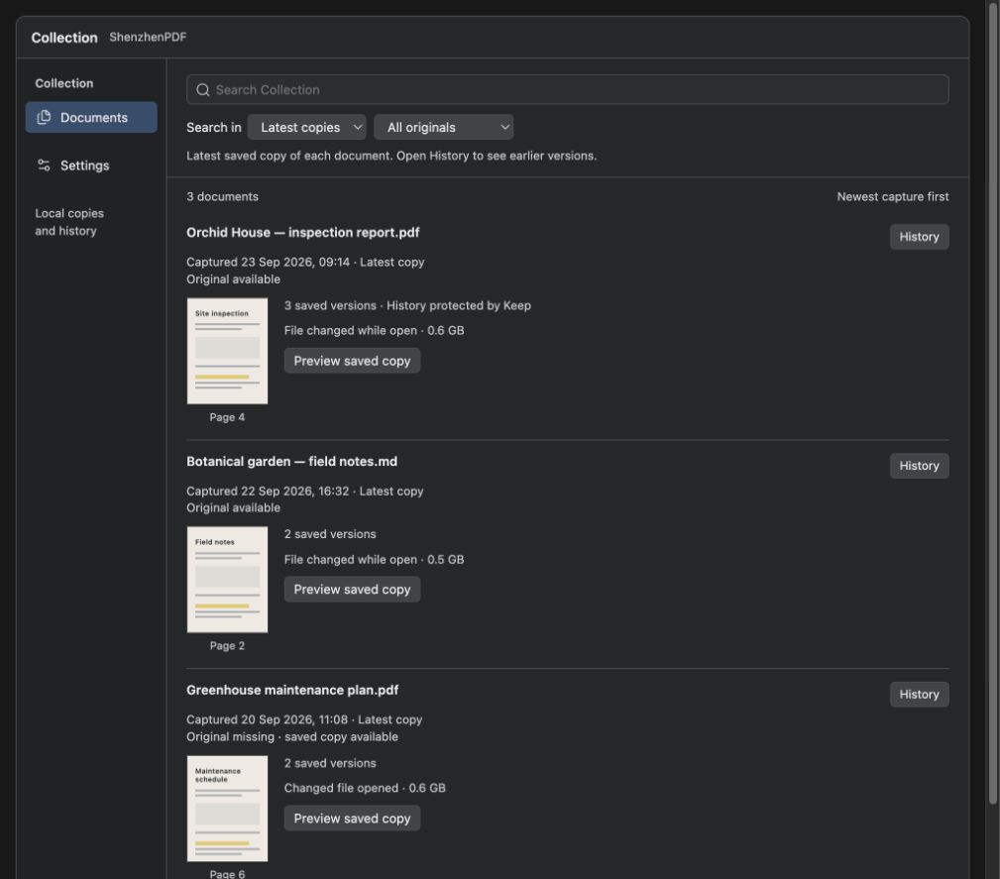

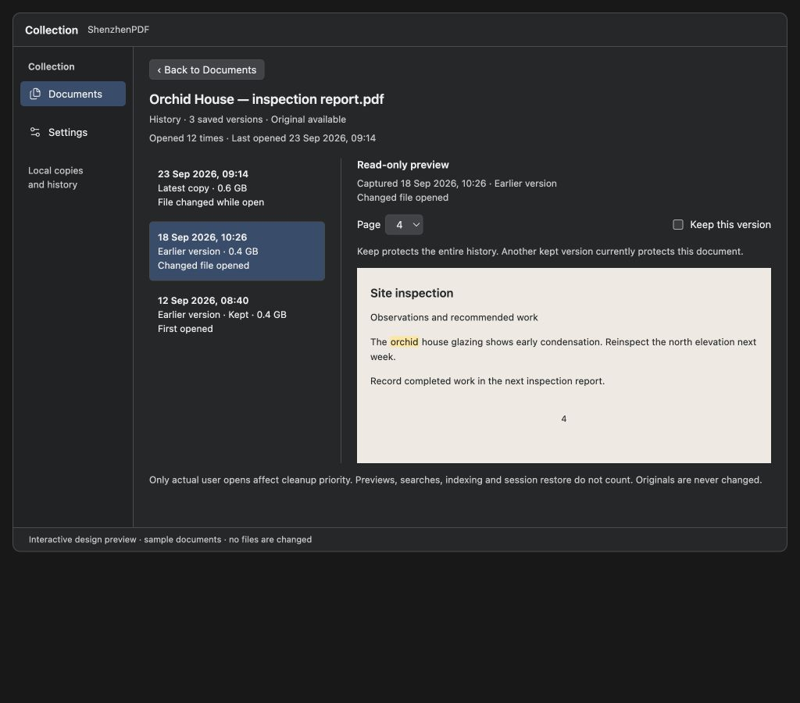

<!-- pagebreak -->

## Native Collection redesign implementation

The reviewed design is now implemented by separate storage, search and manager agents, with History and reader integration handled centrally. Collection has Documents and Settings destinations. Search remains in Documents, beside real page thumbnails; every result identifies its saved version and leads directly to History. Settings shows the location, Set location, Open location, and an unlimited default.

The cleanup policy uses two passes. It ranks histories by explicit user opens, ties by oldest last-open time, and removes previous versions before considering any final document copies. A kept version protects the whole history. Previewing, searching, indexing and restoring a session do not increase open counts. Storage estimates count shared content once; cleanup must fit before it is applied, and unreferenced bytes are removed only after the replacement manifest is durable.

History renders saved PDFs directly and Markdown through the existing canonical renderer. Selecting a saved version changes the actual read-only preview. Its Keep explanation sits next to the checkbox. Browsing state includes search scope, query, selected result, expanded matches, scroll positions and the historical version/page. No Markdown margin changes were made.

### Evidence and decisions during implementation

- Storage, integrity, cleanup, assets and grouped-search suites passed. The native app build and all 23 Markdown/UI integration suites passed with optimized ARC compilation.
- An initial History test created two separate documents by atomically replacing its source without an observed-save continuity ID. Correcting that fixture now proves that distinct latest and older texts appear in the same history.
- The independent technical critic identified a quota ordering issue: counting an explicit open after capture meant cleanup could use an outdated rank. The store agent is integrating the count into capture's transaction before cleanup.
- The critic also demonstrated a real Markdown search phrase split by a generated PDF line break. Preview matching now collapses whitespace and maps highlights back to the original page text; accent-insensitive search and surrounding whitespace follow the same semantics as contextual results.
- Preview and comparison have separate resource limits. History supports PDF copies through the store's 512 MB limit and up to 2,000 rendered Markdown pages. Larger Markdown previews offer Save a Copy; comparison retains its existing 256 MB / 1,000-page budget.
- The UX critic is using a separate app bundle and state with generated garden documents. The installed application and personal Collection remain untouched.

The first independent technical review scored the candidate 7.9/10 before the remaining corrections. This is recorded separately from the earlier mockup's 9.3/10; a new native score follows verification of fixes.

### Native review and visual correction

Actual app use caught an unacceptable gap between the approved mockup and the first native pass. The user called out the buttons. The UX critic scored that candidate **7.3/10**, identifying the permanent ten-button options column, bright navigation buttons and compressed search results as a major visual mismatch. Functional correctness alone was not enough. The visual implementation is being rebuilt around the approved mockup's full-width rows, quiet sidebar, restrained controls and secondary action menu.

The same hands-on review found that Cmd+F did not focus Collection search and shrinking History could scroll its highlighted match out of view. The window now owns its search shortcut; the History reader retains its selected match or reading destination when resized. These fixes receive native regression tests and another live review.

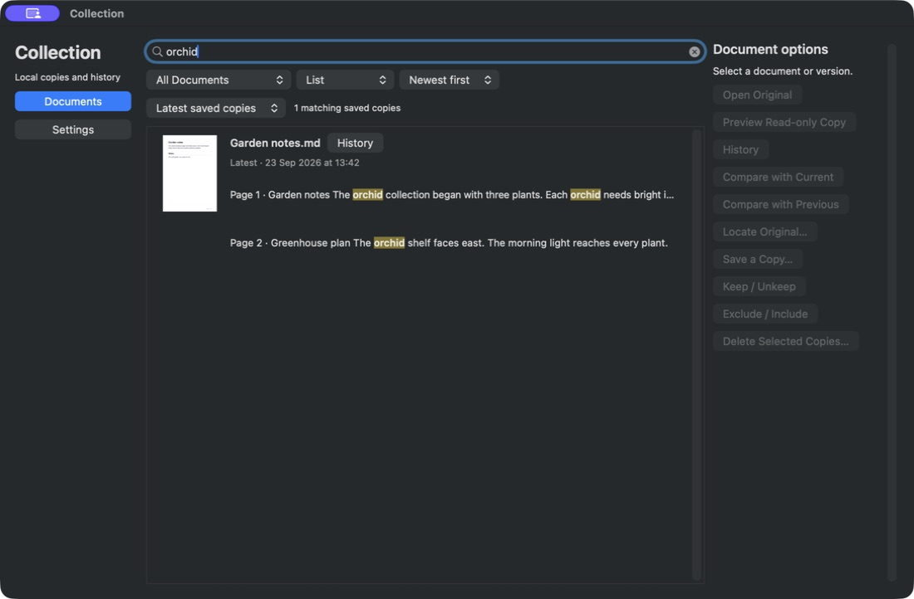

The technical review also reproduced an obsolete preview finishing after navigation and overwriting the newer saved History position. Outgoing controllers now invalidate their preview work, and History preference writes share a lazy serial queue. A semaphore-controlled test proves that a delayed old preview cannot replace the current document's saved position.

### Exact version routing and focused controls

The second live UX round confirmed the new visual direction, Cmd+F, Escape, highlighted-match anchoring on resize, export cancellation and safe cleanup cancellation. It also found an older-version hit opening the latest revision. A new direct-entry regression reproduced this: AppKit selected row zero while constructing a table that forbids an empty selection. The construction guard now starts before the table is configured, preserving the requested historical version and page. The regression failed before the correction and passes afterward.

The custom search control also needed its own field-editor geometry, not only painted geometry. Its focused editor now reserves the same icon space and vertical alignment as its unfocused text. Tests use the actual AppKit field editor. Sidebar accessibility names are explicit, and a proposed finite limit immediately explains its pending cleanup policy while showing the currently applied limit. Draft settings do not write to storage.

The third technical review scores storage, accounting, search and History lifecycle **9.2/10**, with no major or medium findings in that scope. The updated native app and focused manager/History suites pass; the final live visual review is separate.

### Final native visual acceptance

The third hands-on UX review reached **9.2/10**, matching the independent technical review. The native browser now follows the approved mockup: Documents and Settings in a quiet sidebar, full-width contextual results, actual page thumbnails, compact flat controls, and secondary actions collected in More. The ten-button options tower is gone. History places version identity, read-only preview and protection together; Settings separates Collection, Storage and Location.

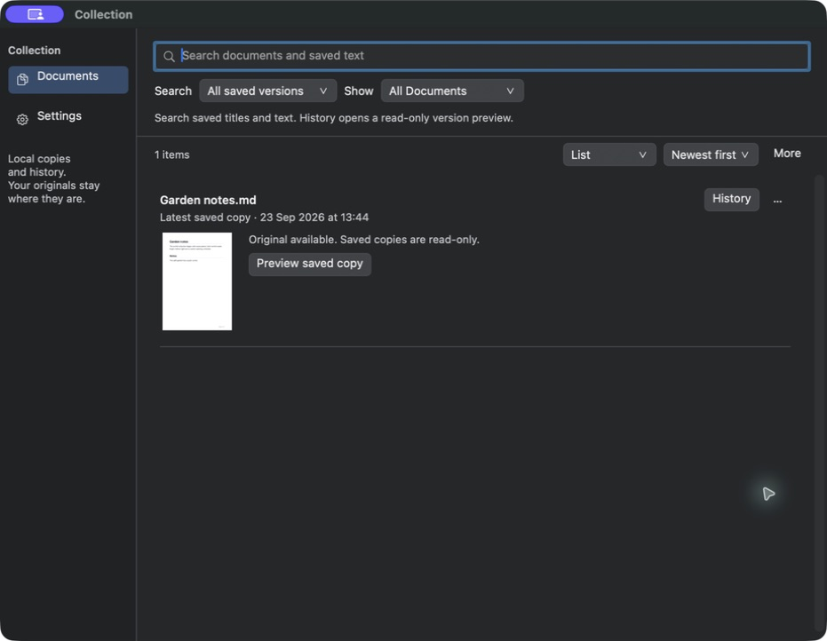

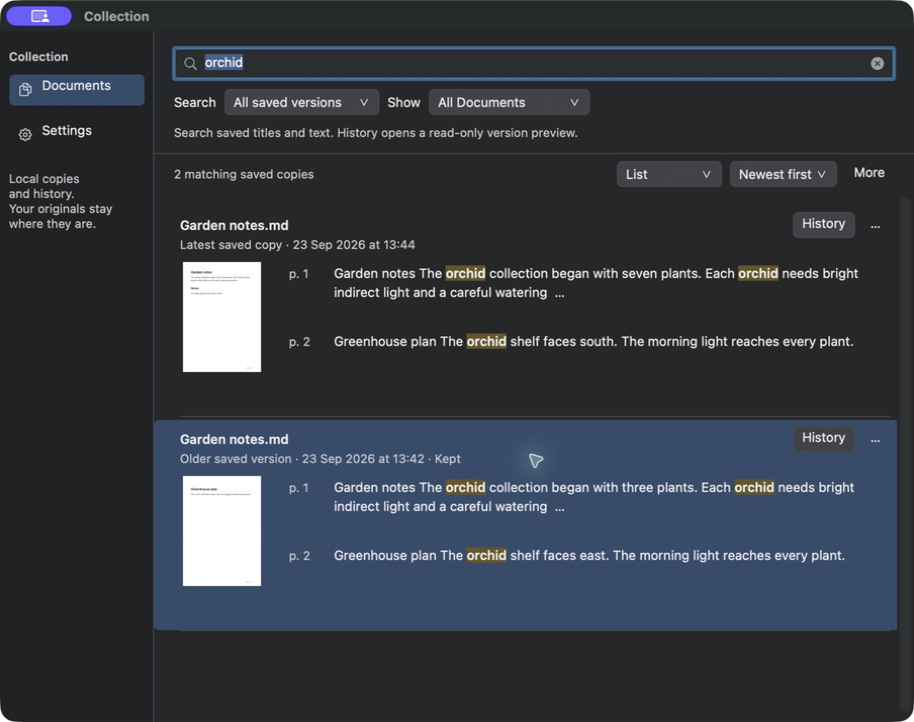

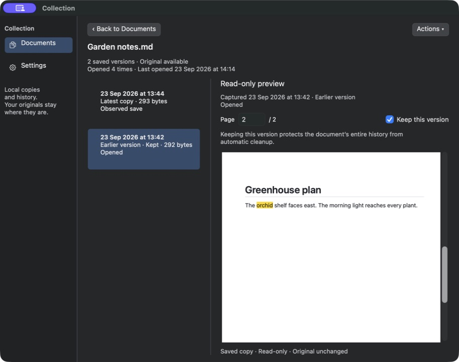

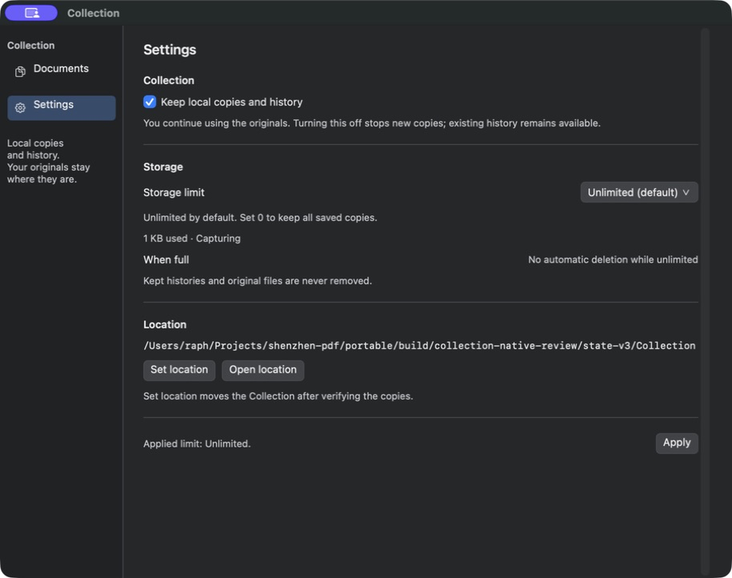

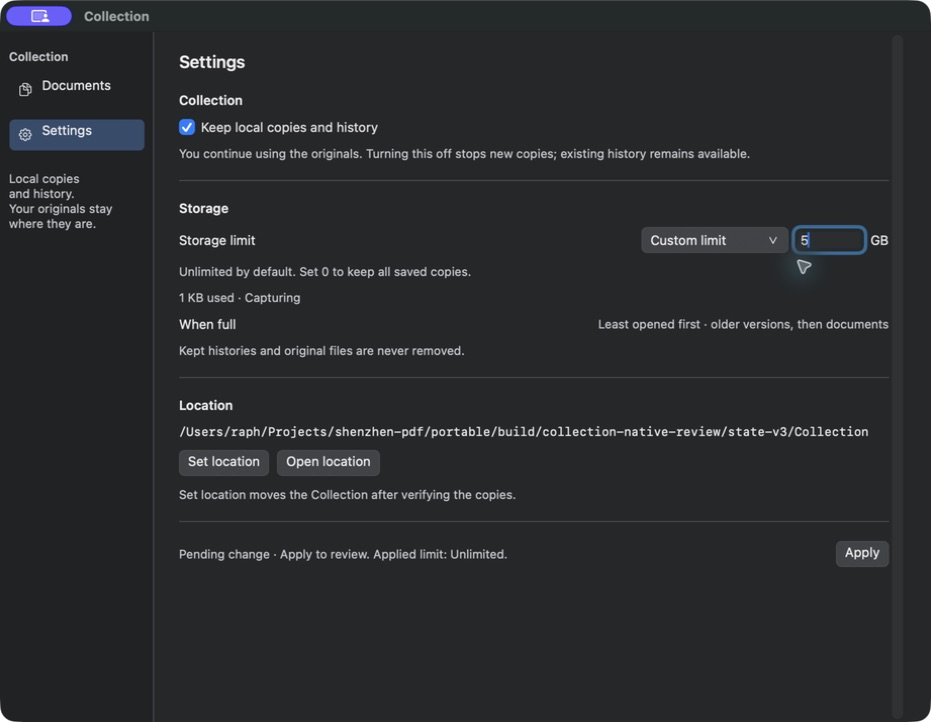

The two minor residuals were corrected after the live review: one result now uses singular wording, and the History table is constrained to its scroll viewport so the selected row retains both rounded corners even with a permanent scrollbar. The new geometry regression failed before the fix and passed afterward. This final image is a headless rendering of the actual History view and generated PDF fixture, not a mockup.

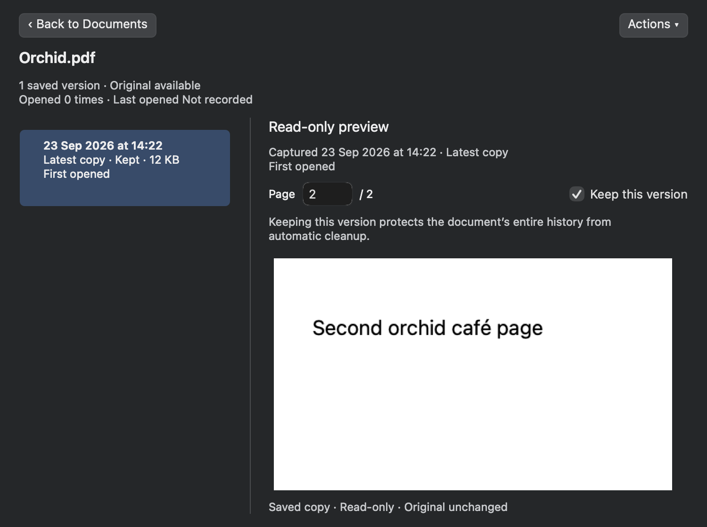

The [technical round-three report](native-technical-review-round-3.md) and [UX round-three report](native-ux-review-round-3.md) give evidence and coverage limits. Live review used generated files, a separate bundle identifier and isolated state. The installed app and personal Collection were untouched. Live light appearance, completed relocation/export and destructive cleanup were not exercised; automated store tests cover cleanup and protected-cap refusal.

### Final validation and prepared release

The final isolated candidate received a targeted live follow-up after the two polish fixes: the selected earlier version and page restored in a fresh process, both History selection corners are visible, and Documents reports “1 item.” The final Documents and History images above now show that candidate. The UX acceptance remains **9.2/10**.

The complete release preparation exited **0** on 23 September 2026: **54 discovered test targets** passed, including all 23 native Markdown/UI integration suites and 56 release-workflow checks. The final native app build exited 0; the source-size ratchet passed for 1,034 maintained files and 35 exact caps. Release notes passed strict validation. Release **26.9.23-1** was prepared on `codex/collection-history-release` in commit `9234a1dbd`; no tag, push, signing for distribution, notarization or publication was performed.

The journal is opened in the final isolated candidate using its separate generated-fixture state. The installed ShenzhenPDF application is unchanged.

### Control alignment and focus correction

The user identified two visual defects missed by the prior review: sidebar symbols sat below their labels, and focusing the search field replaced its rounded outline with a rectangular ring. The previous 9.2 rating did not catch these interaction details.

Single-line buttons inherited AppKit's wrapping mode, so their labels used the top inset while icons used the vertical center. The shared button factory now disables wrapping; contextual search matches explicitly retain multiline wrapping. Search chrome and both AppKit focus-mask entry points now share the same rounded path.

A separate agent added rendered light/dark regression checks. The old code fails: Documents and Settings labels differ from their icons by 4.25 and 3.5 points. The corrected controls pass, along with transparent-corner and filled-edge focus-mask checks. All **24 native UI suites**, the native app build and source-size check passed. This follow-up did not repeat the earlier 54-target release sweep.

Live validation in the isolated Controls candidate confirmed empty and populated focused search, typing, Tab away, and Cmd+F refocus. The installed app remains untouched. The earlier journal is already open in this candidate; Collection is left visible for inspection.

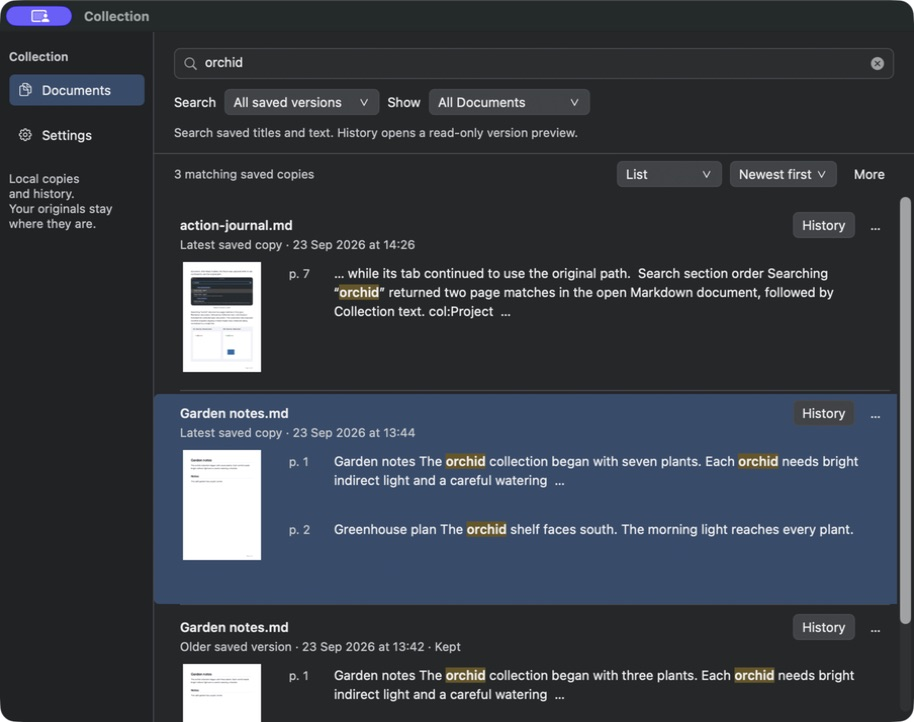

### Additional UX loop and Latest version pills

At the user's request, the UX critic performed another live review after the alignment/focus correction. Empty and populated search, Tab away and Cmd+F refocus, Settings numeric editing, History page editing, version selection, Escape back and secondary menus were exercised. The final scoped score is **9.1/10**, with no observed major or medium finding. The [review report](native-ux-control-review.md) states the remaining coverage boundaries: the host's Tab settings skip buttons, and native window resize automation failed in this round. Neither was represented as a pass.

During that review the user requested a pill identifying the latest saved version for every document. A shared, noninteractive **Latest** capsule now appears in list/search metadata, thumbnail captions and History. Its accessible name is “Latest saved version.” The badge follows the document's canonical latest-version identifier, never the selected row, filter result order or sort order. Older versions retain their identity and cannot receive the badge merely because a search returns them first. The outline and fill remain distinct on selected rows.

A manager agent implemented list/grid integration while the coordinator handled the shared badge and History. Regression checks cover older-first results, a stale row flag, legacy version identity, grid accessibility, no overlap, and keeping the badge on the current version while previewing an older revision. All **24 native UI suites**, the app build and the source-size ratchet passed after this change.

The critic then used the fresh isolated Latest Review app: list and thumbnail badges were correct, reversing the sort preserved their identity, and History retained the Latest pill on the current version while an older version was selected. The same **9.1/10** acceptance includes this follow-up.

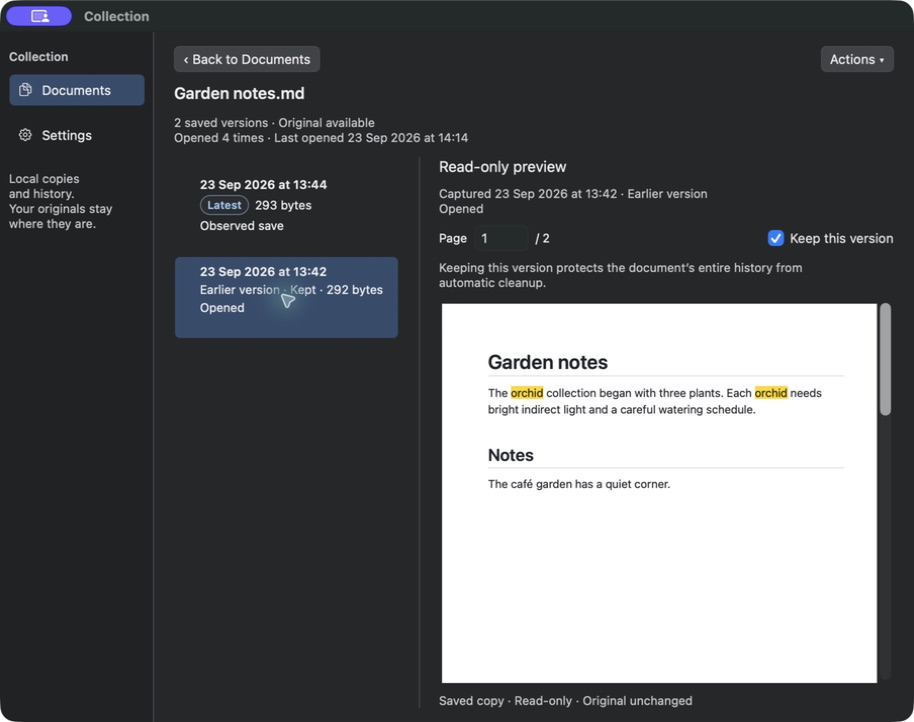

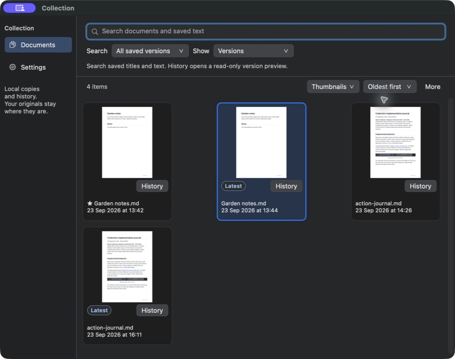

### Correcting Documents versus History

The user clarified that Collection's document browser should never contain separate rows for historical versions. The previous implementation and critic acceptance had misunderstood that product boundary: a Versions filter and all-version search exposed history in Documents, then pills distinguished the resulting duplicates. That was not the requested behavior.

Documents now lists one canonical latest saved copy per document, in both list and thumbnail layouts. Its search reads only those latest copies. The Versions filter and all-version search selector are removed, and saved legacy preferences migrate to All Documents/latest-only search. Kept filtering selects documents with any protected historical version but still displays their latest copy. History retains all previous versions and is the only place with a Latest pill. Document-level deletion continues to confirm deletion of whole histories; individual-version deletion remains in History.

Native regression tests use two actual revisions of one document to prove migration, one-row browsing, old-only query exclusion, latest-text search, older-version Keep protection and badge absence outside History. All **24 native UI suites**, the native app build and the source-size ratchet passed after the correction.

The critic verified the corrected behavior in a fresh isolated Documents Review app seeded with the old Versions/all-history preferences. It opened three latest-only document rows. Kept showed the current Garden notes copy even though its earlier revision supplied the protection. Searching Kept for the old-only “east” returned no result; “south” returned the latest revision on page 2. Thumbnail browsing also showed each document once without a pill.

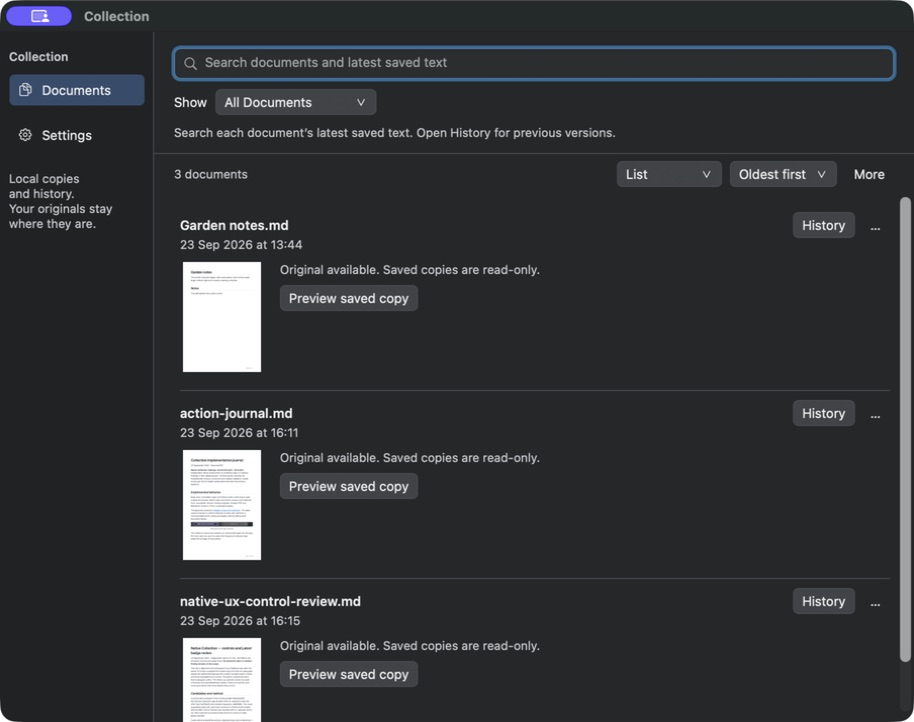

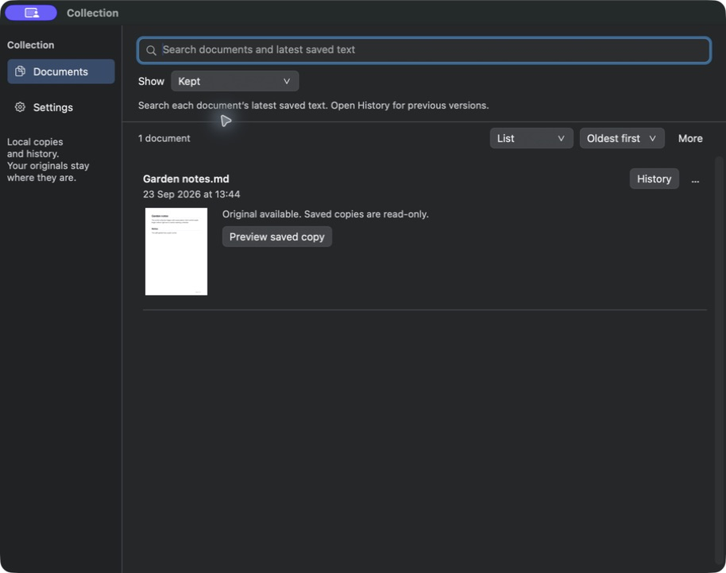

History was checked separately: both Garden revisions remain available, with the old kept copy showing three plants/east and the newer copy seven plants/south. Only the newer History row has the Latest pill, and selecting the older revision does not move it. Escape restores the latest-only Documents context. The corrected Collection view is left visible in the isolated app.

### Release prepared and current app launched

At the user's request, the unchanged application code was prepared again as **26.9.23-1** in release commit `119d3e1b5`. The complete release sweep passed all **54 targets**, including **24 native UI integration suites** and **56 release-workflow checks**. The native app bundle rebuilt successfully and passed strict code-signature verification.

The actual `dist/ShenzhenPDF.app` build was launched with its normal state, and its process and visible reader window were verified. Existing applications were not quit. This was release preparation and a local launch; no tag, push, notarization or publication was performed.

### Crowded tab groups: visibility and placement

The user reported that dropping a tab onto another in a crowded window appeared to lose one member into overflow, and that a group created on the left could jump to the right of General. Both were ordering defects: the layout allocated space from left to right, letting General consume it first, while creation relied on the first occurrence of group members in the full tab array. Hidden General tabs could therefore determine the placement instead of the visible drop.

An implementation agent changed the layout to allocate visibility before drawing positions. Selection is protected, then custom-group tabs receive space before General. Drawing retains the actual group order. When many collapsed group headers compete for space, the active pair receives priority; at widths that physically fit only one tab, selection remains the priority.

The coordinator changed creation to use the target's position among its visible siblings. A left-side group is inserted before its remaining parent tabs; a right-side group goes after them. General stays contiguous on the opposite side. The operation preserves tab objects, active-document identity and reading positions, and the existing session codec persists the resulting order.

The images below are headless renders of the production tab strip, each containing **100 General documents and a two-document Purple group** in a 900-point strip. Both grouped documents remain visible; General's remaining documents are accessible through overflow. These are generated fixtures, not screenshots of the user's app.

The overflow agent reproduced the failure with the previous layout. The placement regression also fails against the previous implementation for both left and right creation and restored order. The corrected code passes **eight tab test suites**: group model, group integration, group interaction, strip geometry, strip interaction, strip style, lifecycle and state. Fixtures cover 50/100 General documents, 700/900-point widths, selection in either group, 12 competing collapsed headers, visible targets near the end of a 66-tab array, and save/restore of 60-tab order and reading state. Source-size checks and whitespace validation pass.

A separate native candidate was built at `portable/build/tab-group-candidate/ShenzhenPDF.app` and passed strict code-signature verification. The currently running `dist` app was neither replaced nor restarted. This fix did not repeat the full release sweep or publish a release.

### Group activation and centered labels

The user clarified that clicking a collapsed group should open it, and that renaming belongs only in the right-click menu. Previously the name area launched Rename while the arrow expanded the group. The whole header now uses the expand/collapse action, which returns to the group's last-used document. Rename remains an explicit context-menu item for both General and custom groups.

Collapsed labels now use centered paragraph alignment and measured font height instead of a fixed drawing box. Document titles use equal left/right clearance, keeping their text centered in the tab while avoiding the close button and read-only indicator.

Five targeted suites passed: group model, group integration, group interaction, strip interaction and strip style. Updated interaction checks cover name clicks, arrow clicks, General, explicit menu rename and group dragging; an integration check verifies expanding a group opens its last-used document without losing its page position. The image above is a production-view render from the headless test, not a screenshot of a running reader. Source-size and whitespace checks pass.

The native candidate at `portable/build/tab-group-click-candidate/ShenzhenPDF.app` built successfully and passed strict signature verification. Running application bundles were left untouched.

### Collection opening crash: uncaptured documents

The user's crash report shows a background sorting exception in `NSNumber compare:` while the Collection manager opens. The manager compared each latest version's capture date directly, but excluded documents and failed initial captures legitimately have no saved version or date. A numeric date compared with a missing date raises an exception and terminates the application.

The sorter now checks for numeric dates before comparing them. Undated entries remain visible after dated entries in both newest-first and oldest-first order, with stable identity ordering between undated rows. No Collection files, versions or preferences are migrated or removed by this fix.

The regression uses the real store APIs to create an excluded document and a failed initial capture alongside saved documents, then asynchronously reloads the actual manager under all three sort modes. It verifies loading completes, all documents remain present, and undated entries follow saved versions in both date orders. All **24 native Markdown/UI integration suites** passed, as did the native build, source-size ratchet and whitespace check.

The signed candidate in `portable/build/collection-sort-fix/ShenzhenPDF.app` was copied into **`dist/ShenzhenPDF.app`**. Strict signature checks and an executable hash comparison verified the replacement. The previous bundle was preserved under `portable/build`; no app was launched or quit.

### One reader History, readable previews, and Collection switching

The user requested normal Cmd+Tab switching, previews for readable collected documents, direct search-result navigation, a single persistent reader History tab, a dated older-version indicator, and automatic relinking when an opened document matches lost-source history. Work was split between preview/companion, sidebar/navigation, and store-identity agents, with the coordinator integrating navigation and the toolbar indicator.

**Why the pictured preview was missing.** Collection treated `PDFDocument.isEncrypted` as if it meant the document was locked. Permission-encrypted PDFs can be readable with no password. Previews now check the actual lock state and use existing transient credentials when needed. Preview pixels and passwords are not persisted. Reusing an unchanged materialized copy also preserves the file identity to which remembered credentials are bound. Truly locked documents still need unlocking; invalid or empty PDFs cannot supply page images.

**One History surface.** The obsolete Collection-only History controller and its rendering helpers were removed. Collection search opens the exact saved version and matching page in the reader, with the query highlighted. History actions open the current original when available, or its latest saved copy when unavailable, and select the reader's regular History sidebar tab. Chapters/Search/History remain available while changing panels. The newest version alone has the Latest badge. History selection is saved per document.

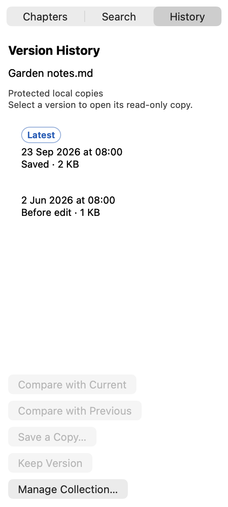

**Version identity stays visible.** Archived documents show a compact rounded indicator after Regex. Older versions include their capture date. Missing originals add “Original missing”; that indicator opens Locate Original, including automatic and manual search. Capture and relink completions refresh open archived tabs' metadata so the status does not become stale.

These images are hidden native-view test renders using generated fixtures, not screenshots of a user's running reader.

**Cmd+Tab.** Collection is an on-demand nested app with a separate bundle identity and application menu. It sends navigation back to its owning reader through private anonymous pipes. Needed PDF credentials travel over those same pipes and stay transient. Closing or quitting Collection cannot invoke the reader's quit/session-shutdown path. No companion starts on normal reader launch. The native package contains the signed helper inside the reader bundle; no separate install is needed.

**Automatic recovery.** Background capture matches the opened bytes against retained versions. A uniquely matching lost history is relinked without losing versions, Keep flags, preferences, or usage counts. Opening older known content records it as the current revision. Available originals, excluded histories, and ambiguous matches are not automatically reassigned. An explicitly replaced original also qualifies when filesystem identity proves that another file occupies its old path; that occupying file and its history remain untouched.

Agent review added protections for out-of-order materialization after rapid result clicks, failed opens affecting unrelated tabs, stale toolbar indicators, and an unrelated file occupying an original pathname. The new last-intent navigation regression fails with the generation guard removed and passes with it restored.

Validation: all **24 native Markdown/UI suites** passed after replacing the obsolete embedded-History suite with reader-History coverage. Focused reader-navigation, companion pipe/lifecycle, and sidebar-mode tests passed. Store, integrity, and cleanup suites passed with latest-hash, historical-hash, ambiguous, excluded, and replaced-original relinking cases. The native build, strict verification of both signed bundles, release-note validation, source-size checks, and whitespace checks passed. The tested candidate was copied into `dist/ShenzhenPDF.app`; hashes of both the reader and nested Collection executable match the candidate. The previous bundle was preserved. The graphical Cmd+Tab interaction itself has not been exercised; no graphical app was launched or quit during this work.

### Remember encrypted PDF passwords securely

Collection now stores successfully authenticated PDF passwords in the macOS Keychain, keyed by the PDF’s SHA-256 content hash. This lets the original and identical archived copies unlock after the session cache is cleared, including after relaunch or a rename. Collection files retain their encrypted PDF bytes; the index contains no password. The companion requests credentials through the existing private pipe.

Persistence runs after authentication and again after initial capture, covering first-use Collection consent. File identity is checked around hashing to avoid associating a credential with replaced content. Keychain work is lazy: ordinary unencrypted opens do not access it. Access never summons a background authentication dialog. A locked or inaccessible Keychain falls back to the reader’s password flow; save failures appear in the reader status.

Validation uses an injected in-memory Keychain adapter with the production credential backend and real encrypted PDF/core/store integration. It covers fresh-backend retrieval, updates, malformed entries, denied access, cleared-session reopening of original and archive, unchanged encrypted archive bytes, replaced-file isolation, and zero Keychain queries for ordinary PDFs or disabled/untracked documents. Existing password and companion suites pass. The native build and strict bundle signature checks pass. Tests do not access the user’s Keychain, so OS Keychain access-control behavior across signing-identity changes is not claimed as verified.

The verified candidate is copied into `dist/ShenzhenPDF.app`, with the previous bundle preserved under `portable/build`. No app is launched or quit. This change adds no visual interface; the prior screenshots remain representative.

### General follows group focus

Removed General’s exemption from automatic collapse. Selecting a tab now expands its group and collapses all others, including General; returning to General expands it and collapses the custom groups. This uses the existing activation and persistence paths without additional launch work.

The model regression starts with General expanded and fails against the old implementation. With the fix, model, integration and native strip interaction suites pass, including returning to General and existing group persistence coverage. The native candidate build, signature verification, source-size and whitespace checks pass. The verified bundle replaces `dist/ShenzhenPDF.app`; the previous bundle is preserved and no app is launched or quit.

### Browse group contents without navigating

Group headers now only expand or collapse their contents. They no longer select the last-used tab or load a different document. Automatic collapse still occurs when the user actually selects a document tab; manually inspecting another group preserves the active tab and reading position. The existing session writer persists manual expansion.

The updated headless integration regression fails twice against the old behavior (last-used navigation and browsing another group) and passes with the fix. Group model, integration and native interaction suites pass.

### Latest means the linked original; recovery stays inline

History and Collection now resolve the latest entry to its linked on-disk original whenever available. Older entries still open immutable saved versions. Existing internal-save and file-watcher capture hooks continue recording revisions; successful background captures no longer replace the reader status with routine Collection messages. Actual capture failures remain visible.

When an original disappears, the reader offers Find Document and Save New Copy As inside History instead of automatically opening a recovery/error sheet. Both recovery actions retain the original tab and its reading position. History’s version context menu uses the configured file explorer to reveal the live original for Latest or the selected materialized historical file.

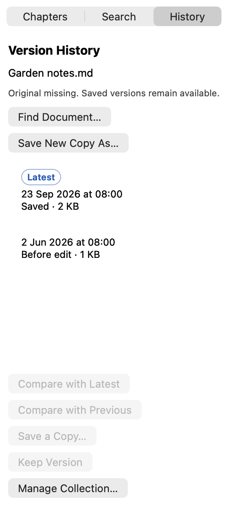

This is a hidden native-view test render, not a screenshot or launch of the user’s app.

Compare with Latest resolves the document’s current Collection identity at action time, so a newly relinked original or an uncaptured live edit is compared correctly. If the original is missing, comparison uses the latest retained version. The scrolling fix removes reciprocal PDFKit destination jumps: source events are coalesced, the peer viewport is moved directly, and delayed peer notifications cannot move the driving pane. Genuine input on either pane makes it the driver.

AI group commands use existing tab-group operations and session serialization. They expose stable group IDs, names, colors, order, collapsed state and membership, with validation before mutation and an optional window-session guard. No background service or new launch-path work is introduced. See [agent interface](../../agent-interface.md) for the API and MCP configuration.

Technical review found and corrected recovery identity and cancellation edges: an unrelated occupant at the old path is never retargeted, previewing a recovery candidate cannot produce duplicate tabs, and delayed History selections are invalidated when the panel hides or the reader switches tabs.

Validation: all **25 native Markdown/UI suites** passed, along with Collection store/integrity/cleanup, group model/integration/interaction, reader navigation, agent command/routing/group persistence and eight MCP checks. Focused comparison tests exercise 160 fractional scroll samples in both directions across page boundaries; the old synchronization code fails the regression with driver movement and reciprocal publications. Tests use hidden native views and temporary fixtures. Subjective trackpad feel in a running user app was not tested.

The final frozen-source native build passed. Strict signature checks verified the reader and nested Collection bundle. The staged replacement in `dist/ShenzhenPDF.app` matches both candidate executables by SHA-256; the preceding bundle is preserved under `portable/build`. Source-size and whitespace checks pass. No user application was launched, quit, or screenshotted.

### Vertical navigation and persistent Group Management

**For readers.** The horizontal sidebar selector is replaced by vertical icon-labelled rows. Chapters, Comments where supported, Search, History where available and Group Management remain readable at narrow widths. Search and Group Management stay reachable even with an empty reader or a document without an outline. Group Management filters group names only, as clarified by the user; disclosure reveals member documents, a row activates the group, and a separate eye control changes tab-bar visibility without navigating or closing documents. Hidden/current status stays explicit.

General follows the same visibility controls. Renaming it creates a regular named group and records that subsequent new documents belong to a fresh General. The renamed group retains its documents, hidden/collapsed state and manager expansion, and receives a regular group accent color. Tab-bar group headers still only browse contents, while Group Management explicitly jumps to a group.

**For AI agents.** Group snapshots expose visibility and the new-document routing policy. Update-group accepts hidden state and jump-group explicitly reveals/activates a group. Native JSON commands and MCP use the same validated model mutations as the UI and the same session YAML; no second configuration or background service is introduced. See [agent interface](../../agent-interface.md).

**Persistence and performance.** Per-window sidebar state lives under `sidebar` in session.yaml: mode, width, visibility, group query, expanded group IDs, list scroll, and new-documents-in-General policy. Tab dictionaries retain group identity/order/hidden state and reading positions. The production YAML codec round trip verifies these fields and the next-open behavior after General is renamed. Normal document reading constructs no management controller and performs no additional Collection work; tests cover this lazy boundary. Group search/scroll changes update memory immediately and coalesce disk saves.

**Review-driven improvements.** The UX designer and independent critic completed four cycles: two on the navigation shell, then two on the integrated manager. Keyboard focus, rounded selection clipping, short-window spacing, hidden/active states, long names and no-match states were refined. Final integrated scores: **9.2/10 appearance and 9.2/10 usability**, with no remaining design blockers in the reviewed native renders and headless interactions. Review documents state the limits: subjective pointing/scrolling and full on-screen keyboard traversal were not tested in a running user app.

Technical review also caught and fixed sidebar reopening on empty/outline-free documents, keeping Group Management visible when jumping to a tab that had its sidebar hidden, stale programmatic mode restoration, and preserving hidden General metadata when merging ungrouped tabs.

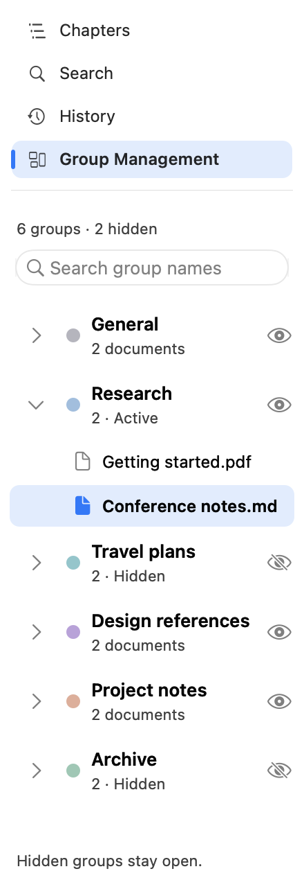

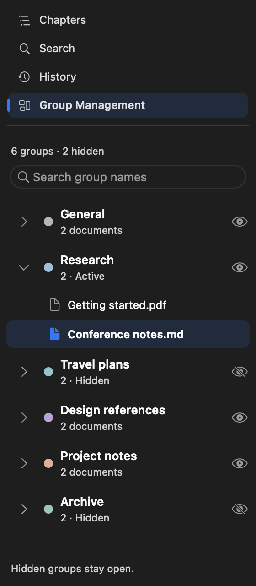

These are production native-view renders using temporary fixture documents. Additional reviewed evidence covers hidden active groups, long names, no matches, search editing, and a short PDF window with all five navigation entries.

Validation: the final focused suites cover navigation keyboard/accessibility behavior, Group Management action separation and name-only filtering, unchanged-refresh editor selection, delayed/constrained scroll restoration, full workspace YAML round trips, group model/strip behavior, agent mutations and MCP protocol. All 25 existing native Markdown/UI suites, state/YAML/launch-policy checks and release-pipeline checks also pass.

The final native build passed. Strict signature checks verified both reader and nested Collection bundles. `dist/ShenzhenPDF.app` now matches the tested candidate’s reader/helper executable hashes, with the prior bundle preserved under `portable/build`. Source-size and whitespace checks pass; the coordinator ratchet decreased by two lines. The running user app was not launched, quit or screenshotted.

### Speed, size and regression pass

Speed was prioritized before size. Independent agents measured group/Collection paths and audited History/comparison while the coordinator checked packaging and ran the broad regression suite.

| Measured path | Before | After |
|---|---:|---:|
| Group normalization, 1,000 tabs in 1,000 groups | 11.34 ms | 0.107 ms |
| Group normalization, 200 tabs in 20 groups | 52.82 µs | 6.91 µs |
| Twenty Collection materializations, 501-document / 5,001-version fixture | 533.52 ms median | 172.55 ms median |
| App bundle, including signatures/resources | 86.64 MiB | 45.92 MiB |

These are bounded generated-fixture measurements, not end-to-end launch or every-document guarantees. The ordinary ungrouped path remains unchanged. Closed Group Management skips snapshots, and hidden History defers its controller/store work until reveal. No cache invalidation scheme or new startup/background task was introduced. Details and reproduction: [group/workspace performance](group-workspace-performance.md), [Collection preview performance](collection-preview-performance.md), and [bundle optimization](bundle-optimization.md).

**Regression correction.** Replacing the obsolete horizontal-selector fixture with the real vertical navigation exposed History's excessive minimum height. Its content now scrolls in short windows, so recovery and version actions remain reachable. Hidden History refreshes also defer work until shown. [Audit and focused checks](history-compare-regression-audit.md).

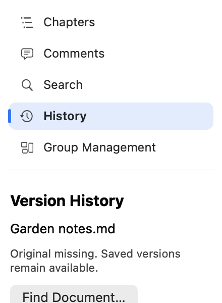

This image is a hidden native-view render; its initial scroll position is shown. The test separately scrolls every lower recovery/action control fully into view.

**Validation.** All 25 native Markdown/UI suites and the Markdown engine suite passed. The broad headless pass also passed core document/password/render/selection tests; reader chrome, shortcut, tab/group/drag/state/YAML tests; sidebar/navigation/workspace tests; Collection store/integrity/cleanup/search/assets/compare/reader-navigation/credentials tests; agent commands, PDF inspection and eight MCP checks; previous-tab, viewport, minimap, cursor, explorer, translation, OCR and launch-laziness checks; release common/workflow checks (56 workflow checks); and the source-size ratchet. Test process exit codes were checked directly. New complexity, unchanged-manifest and hidden-panel regressions pin the removed work; existing archive integrity and encrypted-byte checks remain intact.

The smaller helper's exact optimized source graph passes real Markdown and encrypted-PDF preview tests, including private-pipe password transfer. Independent packaging review found no missing runtime dependency. The final native candidate built successfully; nested and outer strict signature checks, architecture/minimum-OS checks and system-library checks passed. Both executable hashes in `dist/ShenzhenPDF.app` match the candidate. The previous bundle is preserved, and the user's running app was not restarted. Release notes include the reader-visible performance and short-window fixes; AI commands/configuration remain unchanged by this optimization pass.

### Mac sidebar balance — three UX review rounds

The native left panel now has quieter, tighter vertical icon-and-text navigation, a single Groups search header with counts in the footer, and compact History rows above recovery/actions. All enabled navigation labels retain equal readable contrast. History gives dates a whole line, including at the real 176pt minimum with always-visible scrollbars; the Latest pill sits next to time. Secondary version commands remain in a labeled Actions menu.

Three review rounds covered the baseline, three whole-reader layout alternatives, and native light/dark/minimum-size refinements. The independent final review gives beauty 8.9/10 and usability 8.9/10 with no remaining major/medium issue in the reviewed views. [Visual gallery](../../proposals/mac-sidebar-balance/index.html), [implementation journal](../../proposals/mac-sidebar-balance/journal.md), and [design rationale](../../proposals/mac-sidebar-balance/design.md). Native images come from hidden production-view probes; whole-reader comparisons are labeled CSS illustrations.

All 25 native Markdown/UI suites and four sidebar suites pass, including full-date/minimum-size checks, action reachability, original routing, preview cancellation, navigation, group actions, lazy initialization and state restoration. File-size and whitespace checks pass. The native build and both strict signature checks pass; reader/helper hashes in `dist/ShenzhenPDF.app` match the verified candidate. The previous bundle is preserved. The running app was not launched, quit or screenshotted; no release was published.

### Whole-reader UX reset and sidebar availability correction

1 October, native implementation of the approved workspace: replaced the sidebar's vertical list with separated Groups and document icon controls, kept full filenames below that header, moved Find/Regex/match navigation into Find, aligned the reading and real map headers, and reproduced compact tabs, Collection, and ⌘K. Group folding leaves the document unchanged; restored collapse and YAML state are covered. No PDF/Markdown margins or map rendering coordinates were changed.

The team split ownership across tab behavior, Collection/palette, and independent verification. Actual offscreen native views caught narrow-window zoom clipping, first-use revision-pill attachment order, and orphaned Markdown size controls; all were corrected. The reviewer found no unresolved major/medium issue in the reviewed paths. Updater runtime and release pipeline checks passed; no updater identity/endpoint/install changes were made.

See the [implementation record](../../proposals/mac-workspace-rethink/native-implementation.md), [native verification](../../proposals/mac-workspace-rethink/native-verification.md), and [Collection/⌘K record](../../proposals/mac-workspace-rethink/native-collection-palette.md).

1 October, stable tab titles: removed hover-dependent padding that made titles jump and change truncation. Reduced title padding to 6px and overlaid the close button over a trailing fade, also available on keyboard focus. Browser inspection verified unchanged text, font, and geometry across the shared focus/hover style. Native app and dist unchanged.

1 October, workspace/document separation: moved the Groups button into its own sidebar header section, with a vertical divider and additional spacing before the document-panel icons. Verified compact fit and Groups/Chapters switching. Prototype only.

1 October, lean tabs and sidebar icons: corrected the remaining sidebar dropdown to a direct icon row for Groups/Chapters/Find/Comments/History, with names, hover helpers and selected state. Reduced document surfaces to 24px while preserving 12px text; group labels remain 20px. Tabs now follow measured title width rather than stretching short names, capped at 200px. Verified direct mode switching, Markdown Comments removal, dark/light and three widths without overflow; desktop General retains six visible documents. [Evidence](../../proposals/mac-workspace-rethink/decision-and-validation.md). Native app and dist are unchanged.

1 October, direct-controls refinement: other group labels now use spare tab-strip space individually; the stacked-layers All groups button always lists every group, including hidden and empty groups. Replaced the Document tools menu with accessible icons and hover labels. Extended the map to the toolbar's top edge, with direct hide/show controls and a separately scrolling page list. Verified exact 44px header alignment, light/dark and three widths, six-document capacity, hidden-group discovery, map hide/reopen and Markdown OCR disablement. Native app and dist are unchanged; OCR/translation/export retain prototype-only behavior. [Evidence and validation](../../proposals/mac-workspace-rethink/decision-and-validation.md).

1 October, single-sidebar refinement: removed the permanent navigation rail and its layout alternative. A 240px sidebar uses a labeled native view selector for document tasks and Groups, reclaiming 96px for reading. Collection stays in the toolbar. Expanded-group documents now take priority over other group labels; the latter move into a group picker before document overflow. The crowded desktop fixture now displays six documents rather than four at unchanged 12px text. Checked view switching/query retention, History, sidebar hide/reopen, browsing a group without navigation, light/dark appearance and three widths. Evidence and scope are in the [decision record](../../proposals/mac-workspace-rethink/decision-and-validation.md). Prototype only; no native changes.

1 October, after rejection of the three tab alternatives: installed and applied macOS Design Guidelines and Rams, inspected Brave's published compact-tab reference, and verified its geometry against the original implementation. Replaced the rejected treatments with one compact hierarchy: 20px group labels, faint inactive tint, stronger selected group surface, centered icon-free 12px titles inside 28px tabs, one continuous group rail. Removed the alternative picker and consolidated active tab CSS. Capacity now follows available space instead of a fixed two-document demo limit. Independent design review found only a narrow-width title-padding issue, which was corrected. Full-reader light/dark captures, desktop/compact/narrow measurements, keyboard focus and document/group selection checks are in the [decision record](../../proposals/mac-workspace-rethink/decision-and-validation.md). This remains a proposal; native app and dist were not modified.

1 October: reduced the proposal's tab surfaces from 32px to 28px, preserving 12px text and 4px inter-tab gaps; removed title icons and added clearance below/beside the group control. Installed and applied Interface Design from skills.sh. A separate design agent supplied Index, Group tray and Outline alternatives, integrated into the full-reader design controls and a three-treatment comparison. Browser measurements and selection/compact-fit checks are recorded in the proposal. No native app change.

26 September, alignment correction: replaced the proposal's independent panel/toolbar positioning with a shared window grid. Measured equal 44px header rows and matching tab/control centerlines; aligned the tab strip with the navigation column and made the footer span the window. Compact History now respects both toolbar and footer boundaries. Checked pane collapse, compact overflow and console errors; saved new visual evidence. Native app unchanged.

26 September: replaced the proposal's group capsules with a Brave-style horizontal tab strip after inspecting Brave read-only. Individual rounded tabs now include document icons and close controls; compact group labels and an underline communicate membership. Verified group expansion without navigation, closing/reopening, document switching and dark/light/narrow presentation. Updated evidence and limitations in the proposal; no native app change or release.

Follow-up proposal correction: grouped document tabs are fused with the title bar, matching the current app. Removed the redundant app-title/tab-row split, retained compact Cmd+K at the right, and checked desktop/narrow header fit and command-palette access. This changes the proposal only.

The user rejected the component-focused balance pass. A new whole-interface study separates workspace navigation, current-document tasks, reading controls and source/version status. The interactive proposal exercises a synthetic 72-document workspace, search, PDF/Markdown switching, History, comparison and the Collection companion at full and compact sizes. An independent critic found state and search errors in the prototype; these were corrected and targeted browser workflows were repeated. This remains a proposal, not a shipped redesign. [Decision, evidence and limitations](../../proposals/mac-workspace-rethink/decision-and-validation.md).

A separate agent reproduced and fixed the reported Chapters/Comments gray-state bug: workspace/history routes could return before refreshing the active document's navigation availability. The refresh now precedes those routes. Focused regressions, syntax checks and the native build pass. The signed candidate matches `dist/ShenzhenPDF.app`; the previous bundle is preserved and the user's running app was not restarted. [Bug audit and packaging](../../proposals/mac-workspace-rethink/bug-audit.md).

## 1 October — native/mockup similarity correction loops

The user's rejection was warranted: the first native pass retained old sidebar typography, row density and search-field chrome. Two independent baseline reviews rated it 7.7/10 similarity and 7.8/10 UX. We used the approved prototype's **last effective CSS overrides** as the contract. An early audit incorrectly read earlier 36-point rows; the final implementation follows the later 32-point override and 30-point fields. The audit records the correction.

The work was divided between native sidebar presentation, Collection settings/palette polish, responsive layout, and parent integration. A fresh critic who did not implement the reader changes then reviewed actual offscreen AppKit renders. Its first pass (8.9 similarity / 8.8 UX) found two specific issues: table width clipping hid page numbers and the right selection corners, and an archived document could still have an “Original file” footer. Both were fixed. The final independent grades are **9.2/10 similarity and 9.1/10 UX**, with no major or medium interface findings remaining.

User-visible corrections: filenames including extensions in the left panel; compact regular chapter rows, right page labels and rounded blue selection; metadata-first Find results with yellow term highlights; rounded search controls and consistent icon weight; accurate source status with no duplicate pagination; Apply immediately beneath Collection's storage cap; Esc in Command-K; and a quiet boundary around real Collection thumbnails. Narrow windows retain reading space while keeping requested panel widths and visibility. The last compact-panel choice is stored in YAML.

Verification was strengthened where the previous fixtures were misleading. Reader tab titles now intentionally omit extensions; headers must still show the real full filename. Real Collection captures produce two versions for the History render. The probe asserts native clip/table bounds and exercises shrink, map reveal, sidebar reveal and grow restoration. It writes native view renders without ordering any window or touching user configuration. The full Markdown/Collection UI suite and focused regression matrix passed, including updater (32 cases), release workflow (56 cases), launch laziness, YAML persistence, tab lifecycle and reading-theme/minimap checks. No live update or release publication was performed.

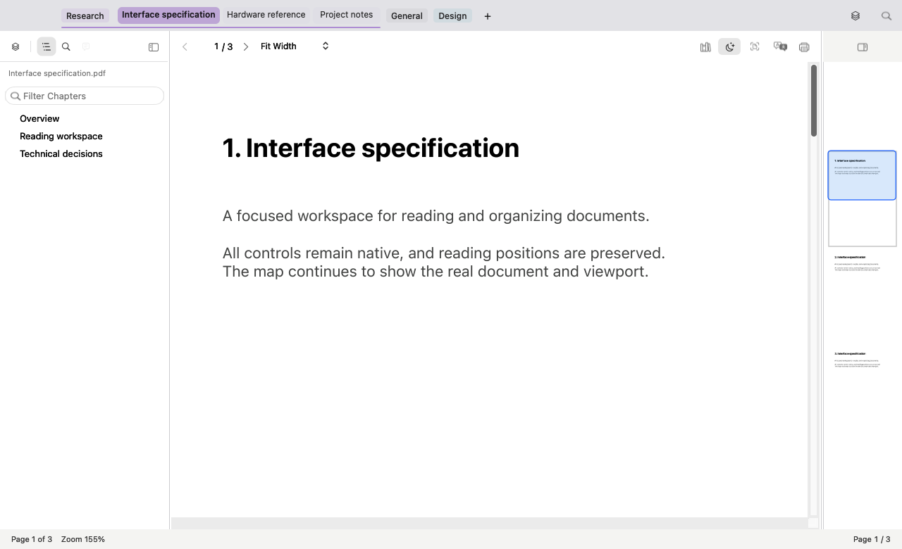
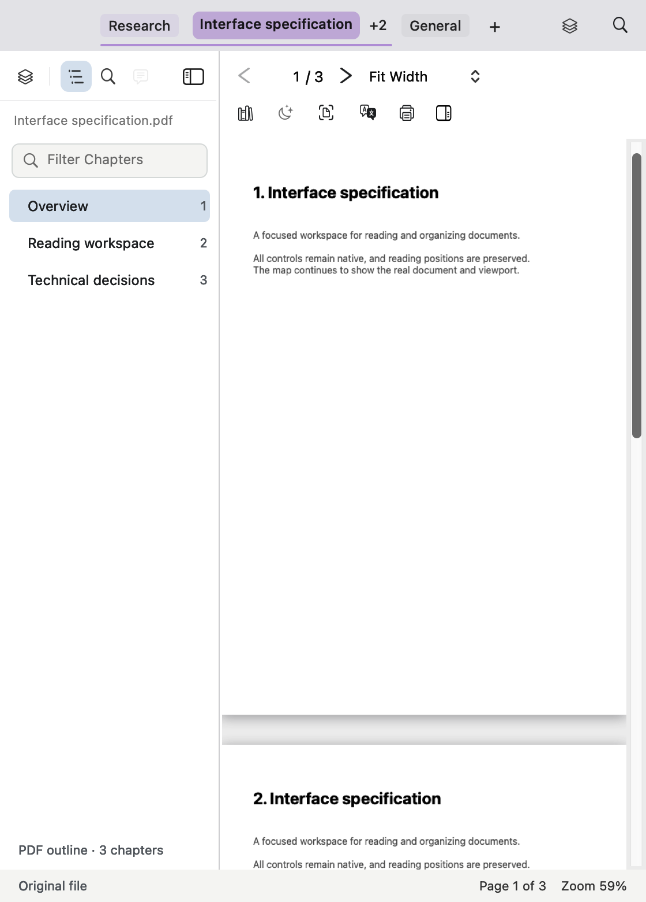
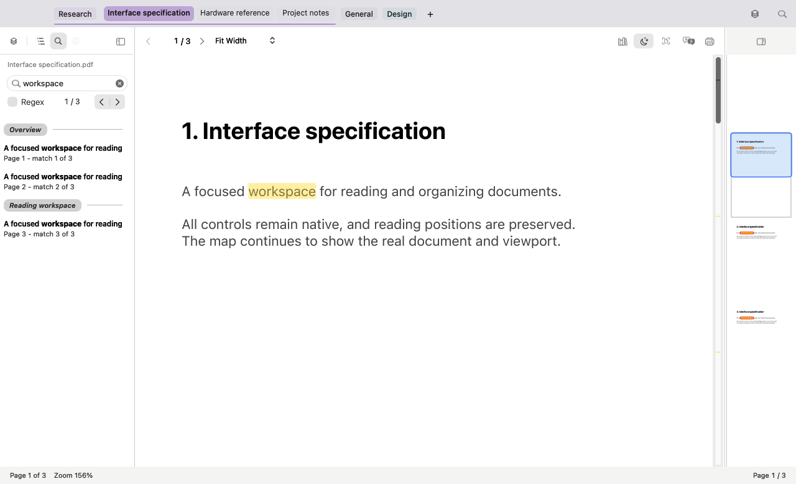
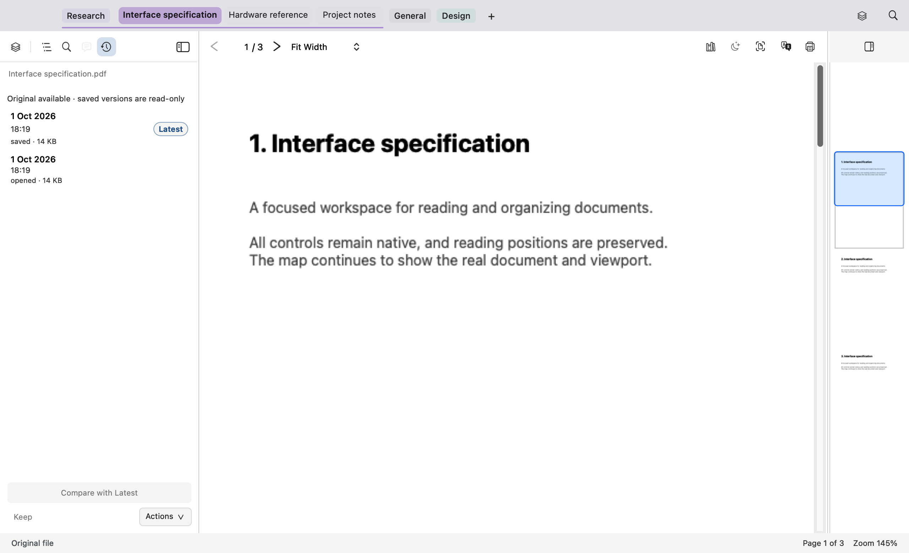
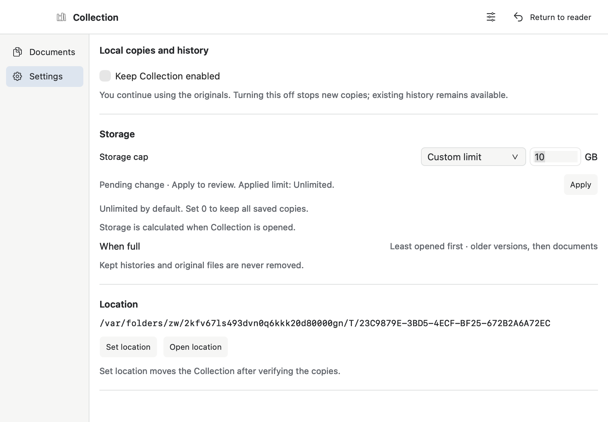

The full ranked review trail and test methodology are in [native verification](../../proposals/mac-workspace-rethink/native-verification.md). Scores describe the interface under the tested states; real PDF content, zoom and minimap rendering are deliberately preserved rather than imitated from the mockup.

Packaging completed after the accepted critique: the reader and Collection helper were rebuilt into `dist/ShenzhenPDF.app`, the strict deep signature check passed, and source timestamps confirm this bundle contains the new native code. This is the local development build (26.9.23/build1), not a published release. The user's running app was left untouched.

## 1 October — readable unavailable icons and map-toggle placement

The user found the disabled icons too faint and the centered map button visually detached. The audit found multiple unrelated dimming paths: AppKit's disabled sidebar color,35–55% drawing opacity, and native inactive-window segment tint. Chrome now uses a shared opaque unavailable color (light `#7a808a`, dark `#9298a2`) across sidebar navigation, toolbar actions, segmented controls, panel toggles, overflow and Collection actions. Enabled icons retain the primary text tint. Capability checks and disabled input behavior are unchanged. The map toggle sits8 points from its header's right edge, aligned with the upper-right command control instead of floating in the middle of the map column.

The production-window probe now rasterizes actual controls in enabled and disabled states under both appearances and requires visible glyph strokes at3:1 contrast. This caught the remaining native sidebar-collapse dimming; it now shares the navigation glyph treatment while retaining button accessibility. The probe also asserts the map button's right-edge constraint. Light/dark PDF, Find and Markdown renders were inspected. Native workspace, sidebar navigation, reading theme, minimap/window chrome, panel-policy and the full Markdown/Collection UI suites passed; no user window was launched or captured.

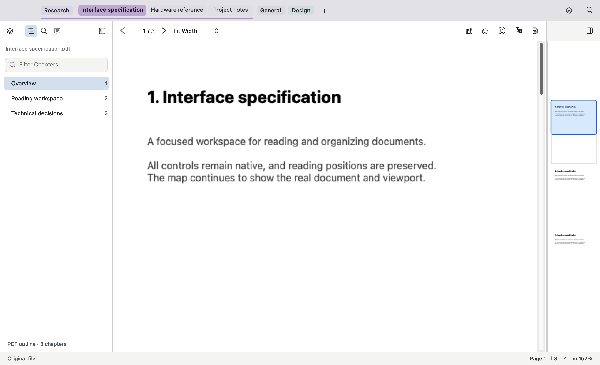
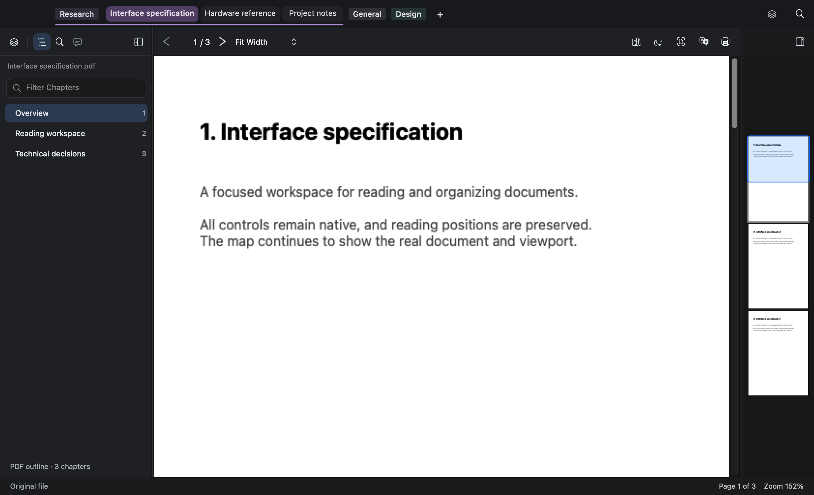

The corrected reader and Collection helper were rebuilt into `dist/ShenzhenPDF.app`; strict deep signature verification passed, and the executable is newer than all native sources. Updater regression tests also passed all32 cases. The app was not launched.

## 1 October — compact Collection grid and group/document search

The user accepted the remaining interface and requested two focused adjustments. Collection's flow layout distributed spare width between thumbnail columns, so horizontal spacing varied while vertical spacing remained fixed. A fixed, left-aligned layout now uses152×226-point cards,8-point gaps in both directions and12-point outer insets. Previews retain their height; captions remain readable with two lines and the existing History action. Layout queries calculate only visible rows, and thumbnail loading remains lazy.

Group Management now searches group names and document names, including filename extensions, without regard to case or accents. A matching group reveals its documents; a document-only match reveals that document beneath its owning group. Search temporarily expands results without altering saved expansion preferences. Clearing it restores those preferences. Empty queries reuse the existing document arrays without scanning titles.

The full Markdown/Collection UI suite and Group Management suite passed with exit0. Native layout checks cover four widths, equal horizontal/vertical gaps, viewport bounds, no overlaps, left alignment and access to the last row. Search regressions cover group matches, document matches, filename extensions and restoration of saved collapse state. File-size checks passed. The light/dark renders below are actual offscreen Collection views with synthetic missing-preview fixtures, used to inspect spacing rather than preview generation. No user window was opened or captured.

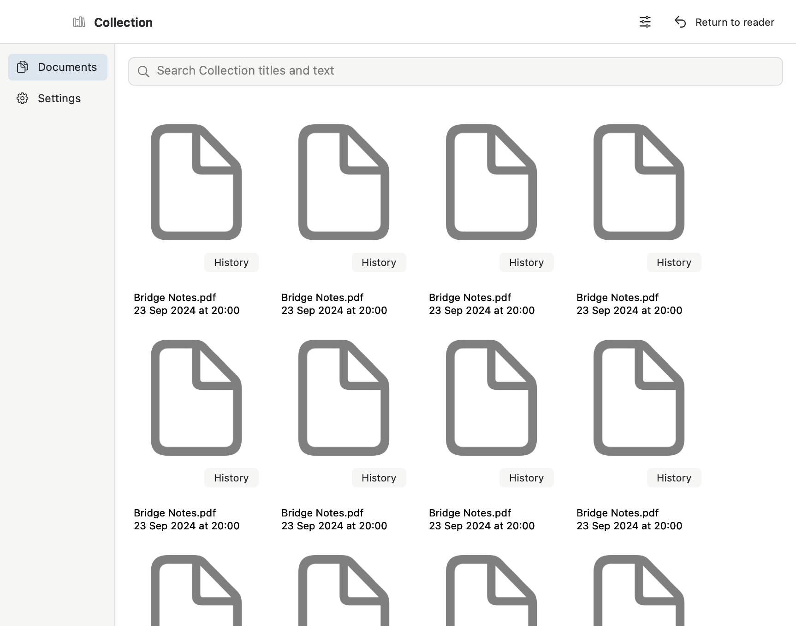
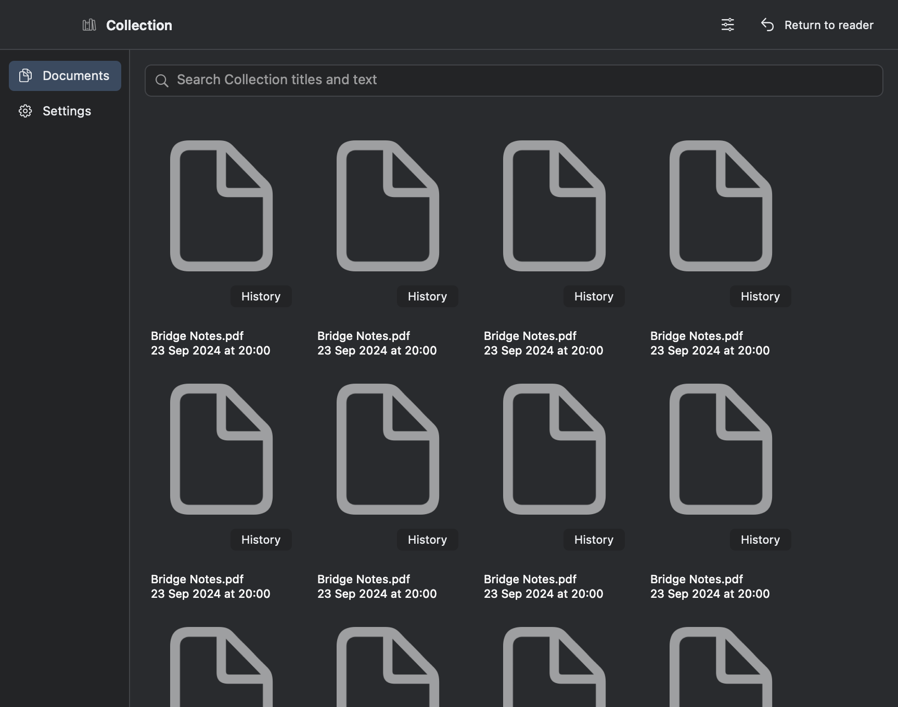

The local `dist/ShenzhenPDF.app` build completed successfully. Strict deep signature verification passed and the executable is newer than the native sources. The app was not launched or published.

## 1 October — make the bundled document formats openable

The format descriptions were ahead of the native entry points: MuPDF already decoded many images and documents, while Open and file drops admitted only PDF/XPS/CBZ/EPUB/Markdown. The native app now shares one lazy extension policy across the picker, pasteboard filtering and tab labels, with a regression asserting that Finder's Viewer registrations match it. File drops work on the reader, empty workspace and tab strip; existing internal tab/group drags retain their own path. Multiple dropped documents become tabs. Directory and remote URL drops are rejected. PDF-only save/edit operations retain their existing capability gates.

Supported families are PDF and Markdown; XPS/OpenXPS; EPUB, MOBI/PalmDOC and FB2; HTML/XHTML and text; modern Office DOCX/XLSX/PPTX/HWPX; image-containing ZIP/TAR/CBZ/CBT; SVG/SVGZ; and the linked bitmap families including PNG/JPEG, BMP/GIF/TIFF, JPEG2000, JBIG2, Netpbm/PFM and PSD. The catalog deliberately excludes unlinked JPEG XR/RAR and unsupported HEIC/WebP/legacy Office. Office files are reflowed reading views, not a promise of Office layout fidelity. The full support and Collection limitations are documented in [Features](../../../../docs/features.md#formats).

A focused headless suite creates31 actual fixtures using system encoders and small self-contained document packages. Each opens through the production C core and renders nonwhite content; picture formats also render byte-identically in light/dark mode. The suite checks picker and Finder registration parity, extension-free tab labels, regular-file drop filtering, and bounded Collection previews for common images. A deliberately invalid image remains cheap to filter and returns an ordinary decoding error when its page is requested. No decoder, Collection capture or indexer is started while filtering a drag. Collection previews use ImageIO downsampling on the existing background queue with a300-pixel bound, preserving the helper's independence from MuPDF.

The full Markdown/Collection UI suite, tab-strip interactions, tab-group interactions, core reading-theme tests, launch-work policy, file-explorer preference and all32 updater tests passed. No user app window was launched, quit or captured. These are direct production-core page renders from the fixture suite:

Packaging completed in `dist/ShenzhenPDF.app`. Strict deep signature validation passed; the built file associations match the source plist and the executable is newer than the production native sources. File-size checks passed after extracting drop routing from the coordinator. This is a local build, not a published release; the running app was left untouched.

## 2 October — search context, navigation and palette latency

The screenshot exposed a real context error: PDF search chose a nearby line intersecting the match rectangle, which could return `/docs` for a match in `/images`. Context now comes from an actual query occurrence, associated with the hit geometry. PDF and Markdown results carry explicit highlight ranges through whitespace normalization and narrow-sidebar cropping. Cards wrap context instead of silently tail-truncating it before the match. Markdown page layout and margins are unchanged.

A separate interaction agent restored type-to-search from passive controls, while leaving text editors and input composition alone. Escape clears Find and returns to the panel and visibility from which it was entered, including fullscreen. An intentional panel or document switch prevents stale restoration. Tab titles again use middle ellipsis with stable geometry when the close button appears. Offscreen pixel checks verify that both title ends survive and that changes in the hidden middle do not change the raster.

The group-navigation agent made entry into Groups reveal the current document without recentering subsequent refreshes. Group headers float within their section and are pushed away by the next group in either scroll direction. Existing filtering, saved collapse preferences and YAML scroll state are preserved. The rendered example below deliberately captures a boundary transition, where the departing header is partially clipped beneath the search area.

The performance agent removed the command palette's120ms debounce and separated immediate document/group names from asynchronous text work. Lazy bounded caches retain session metadata, Collection manifests/index text and extracted open-document text. File identity, size and nanosecond timestamps invalidate stale entries; Markdown image dependencies invalidate pagination when needed. Cancellation and generation guards reject obsolete results. This adds no launch indexing. On the retained128-document/8MiB fixture, cold cache population measured17.75ms, a warm early match0.86ms and a complete warm no-match scan24.39ms. These are cache/search measurements, not end-to-end palette latency; uncached document extraction still completes asynchronously.

Independent review caught three additional PDF parity cases before packaging: line-anchored regexes, repeated whitespace and multiline wildcard rewriting. Added regressions cover all three. The existing core multiline rewrite was extracted unchanged into a shared helper so context follows the same lazy wildcard and trailing-wildcard bounds. Tests also cover adjacent lines, repeated occurrences, Unicode, wrapped phrases, sidebar widths, fullscreen Escape, title pixels, group boundary behavior, cache replacement/deletion and cancelled publication.

The full Markdown/Collection UI suite and focused Collection, Find, group, tab, sidebar, launch-work, core render/selection and updater regressions passed with exit0. All32 updater cases passed. The file-size policy and diff whitespace checks passed. Native views were rendered offscreen; no running user window was launched, quit or captured.

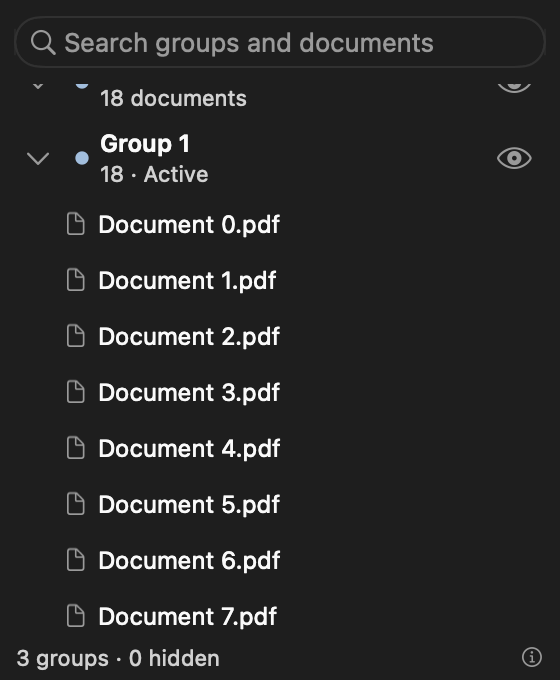

Rebuilt `dist/ShenzhenPDF.app` with the final sources and verified its strict deep signature. This is a local development build, not a published release.

## 2 October — text controls and syntax-highlighted source documents

The user asked for A−/A+ beside zoom and source-language support using the existing code renderer. Split implementation between toolbar/layout, source parsing and Collection/search, with parent integration of file opening, persistence routes and documentation. The macOS design guidelines informed compact controls and accessible labels.

The toolbar now places zoom −/+ after the fit/zoom selector and A−/A+ immediately to their right. Both use the surrounding flat28-point treatment; tooltips say Text Size and report the scale. Other tools wrap at narrow widths. An early offscreen check caught a stretched minus glyph; preserving its aspect ratio only for these two-segment controls fixed it without changing the existing theme icons. Actual Markdown and `.txt` sessions verify that A+ rerenders larger type and that A− restores it. The existing YAML text-scale setting and view-state paths are retained.

A shared extension catalog admits files for every existing offline code lexer through Open, Finder Open With and drop. Text and code route through the existing text session, pagination, themes, search, selection, copy and export. HTML/XHTML is literal highlighted source; Markdown remains formatted and SVG remains an image. The parser constructs a code AST directly rather than wrapping source in fences: backticks, HTML tags, YAML-looking headers, CRLF and indentation survive without interpretation. UTF-8 and BOM-marked UTF-16/32 are accepted; binary data is rejected. Native document classification allocates no source catalog, verified with an initialization-count regression. No new launch indexing or source scan was added.

Collection indexing, thumbnails, history previews and comparison share the source renderer; Cmd+K caches source pages through its existing lazy text path. Source examples never acquire Markdown image dependencies. Independent review found that older unchanged HTML captures would retain empty indexes. Reopening now upgrades the latest saved version’s index in place, with a raw/rendered profile so storage-only tools cannot prevent a later native page-aware upgrade. Tests assert stable version IDs/counts and no repeated index writes after migration.

AI-facing change: the existing inspect/open CLI and MCP commands accept supported text/source documents. Inspection returns the same canonical UTF-16 text and page/block geometry as Markdown, with literal source content. No command shape, updater endpoint or release mechanism changes.

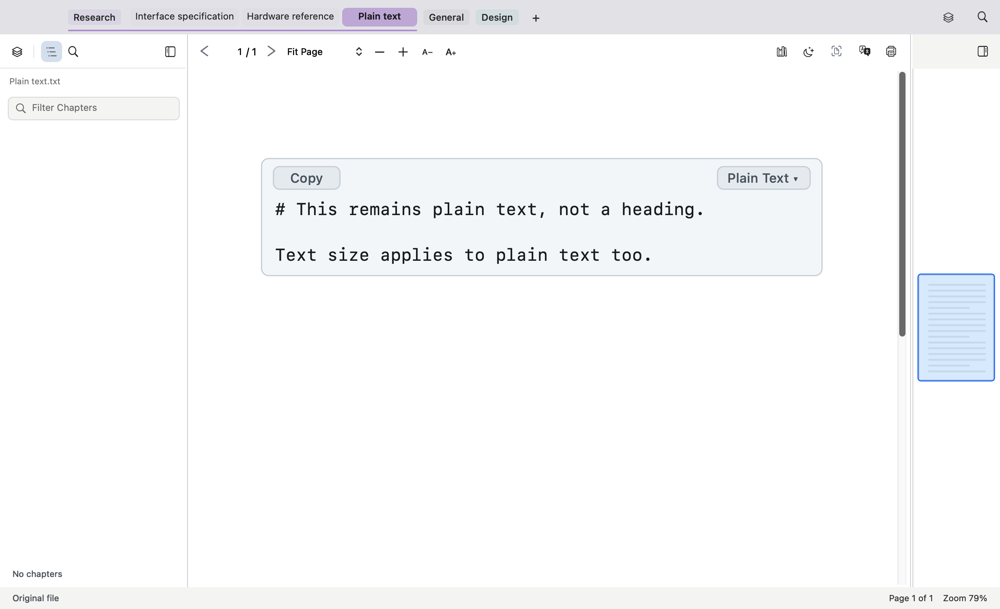
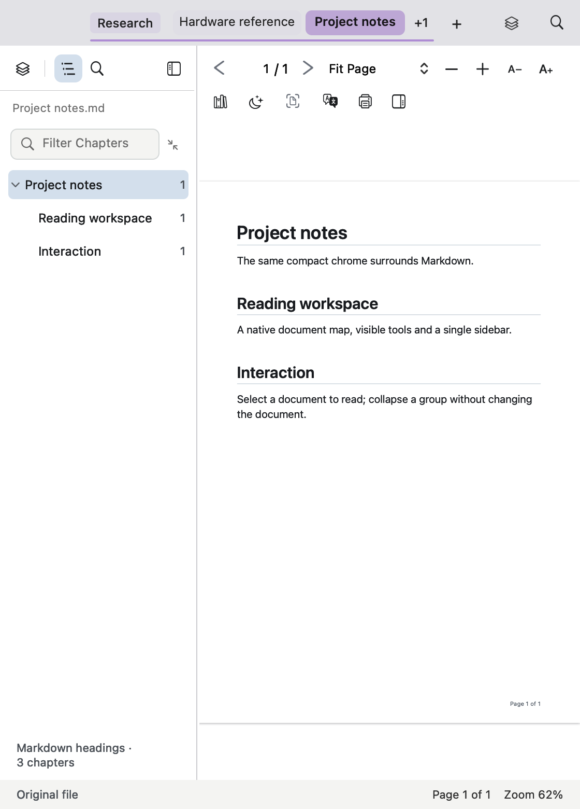
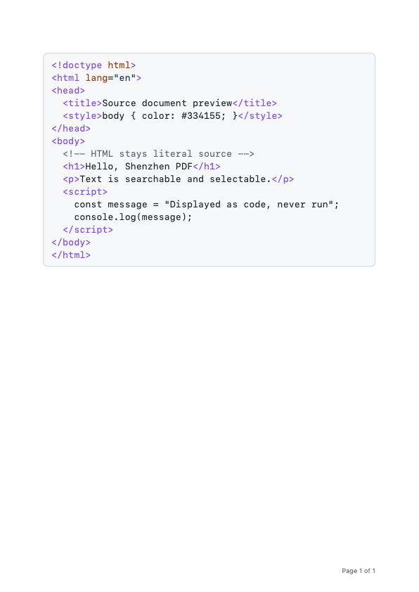
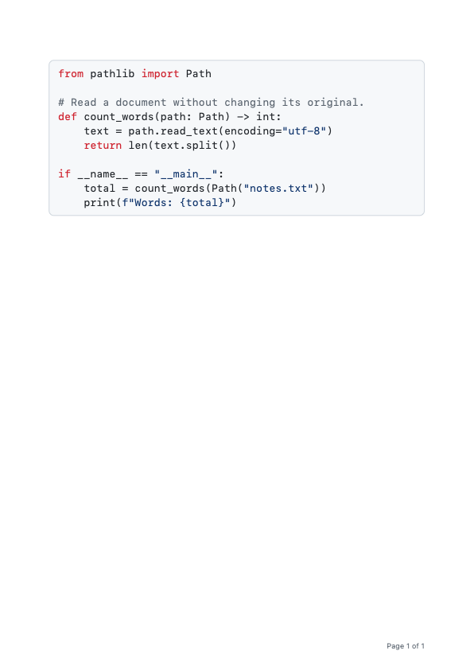

Evidence comes from offscreen native AppKit views and deterministic page renders, not screenshots of the user’s running app. The workspace probe checks light/dark appearance,1280/880/560-point layouts, adjacency, non-overlap, real font-size reflow and updater menu routing. Source tests cover every lexer mapping, literal content, Unicode encodings, binary rejection, search, pagination and font scaling.

Validation passed: the full Markdown engine suite, full Markdown/Collection UI integration suite (including source index upgrades), offscreen workspace probe, format/decode/drop tests, launch-work policy, Collection store/integrity/cleanup/search, native agent/MCP tests and all32 updater regressions. The file-size ratchet and whitespace checks pass. No app windows were launched, quit or captured.

The final speed review extended the laziness check to the actual opening/title policy: native-path checks use the existing native extension list plus constant source pairs; only an explicit complete Open list builds the source catalog. The format regression verifies zero initialization for PDF, image, source and unknown paths before that request.

Final packaging completed in `dist/ShenzhenPDF.app`, including the Collection helper. Strict deep signature verification passed; executable timestamps and bundled file associations match the final production sources. This is a local development build, not a published release. The running app was left untouched.

## 2 October — one Collection layout and explicit retention actions

Removed the Layout submenu and standalone thumbnail-grid mode at the user’s request. Collection now always uses the document list, including when existing settings contain `managerLayout: 1`. The small page previews and highlighted contextual matches within rows remain. Removed grid construction, layout, selection synchronization, scroll-state persistence and obsolete grid tests; extracted the retained lazy thumbnail loader into `SPDFMacCollectionWindowThumbnails.mm`. Show/filter and Sort remain available.

Audited the actual retention rules before explaining them. A Keep mark belongs to a saved version; the current cleanup policy protects a document’s entire history while any version is marked. Removing all marks makes it eligible for future storage-cap cleanup, without deleting anything immediately. Manual deletion is still available. Exclude only stops future captures, while Include allows them again; neither changes originals nor removes existing copies.

Collection menus now say Keep this version / Stop keeping this version and Pause / Resume saving new versions, with explanatory hover text. Filters read Kept histories and Saving paused. Multi-selection performs the explicit action on the whole selection, rather than toggling mixed values in opposite directions. Storage policy and source documents are unchanged.

The full Markdown/Collection UI integration suite passed, including retained encrypted previews, old thumbnail preferences reopening as a list, filter/sort menu mapping, list scroll-state persistence and retention labels/help for both states. Initialization still starts no capture or preview jobs. Inspected the native offscreen search view below; no user app window was opened or captured. File-size and whitespace checks passed.

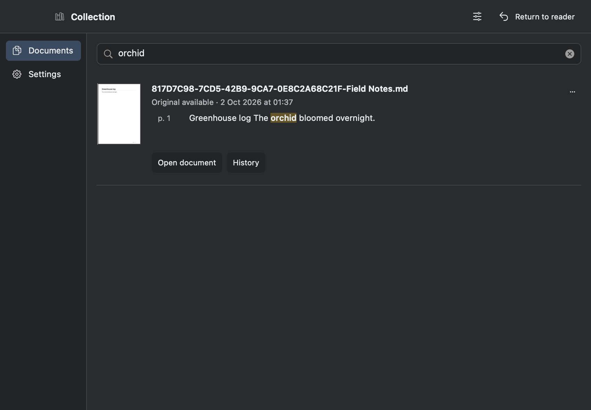

Rebuilt the reader and Collection helper in `dist/ShenzhenPDF.app`; strict deep signature verification passed and the executable is newer than the final native sources. This is a local build, not a published release. The running app was left untouched.

## 2 October — file properties for every supported format

File → Properties (Option+I) and the document context menu now work for every selected file, including text-rendered and missing-file tabs. The File menu entry already existed; its loaded-core-document gate incorrectly disabled it for Markdown and source files. Extracted the routing and format model from the coordinator and panel rather than expanding their size caps.

Properties now describes the actual format. Raster images show stored pixel dimensions, megapixels, embedded DPI, color model/profile, bit depth, transparency, orientation, multiple frames and available EXIF camera settings. ImageIO reads metadata without creating a decoded bitmap; formats it cannot identify fall back to MuPDF's image object, without requesting a rendered pixmap. The fallback may read compressed file bytes. Absent DPI and depth are omitted instead of showing MuPDF defaults. SVG retains vector page dimensions and is not presented as a pixel image. Markdown and source files use a snapshot of their current rendered text for asynchronous word/character counts and show live page dimensions, headings and language. PDF metadata, security, annotation and page statistics remain intact.

All added inspection is invoked by opening Properties. Non-images return before file access in the image reader, non-regular files are rejected, and pictures never start a whole-document text scan. Focused tests cover tagged and untagged PNG/JPEG, EXIF, animated GIF, MuPDF PPM fallback, text, vector, PDF and missing originals, plus File/context-menu routing. The panel construction and text-count completion are checked offscreen. Native build, property-format tests, launch-work policy and all 32 updater tests passed. No running app window was launched, quit or captured.

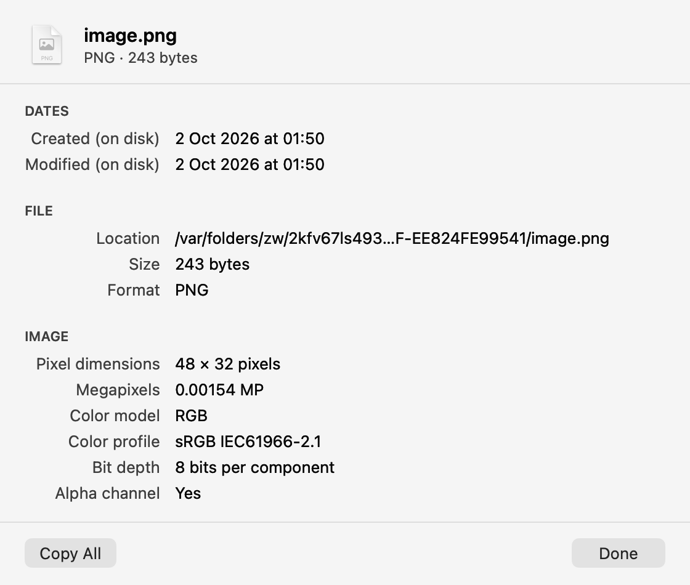
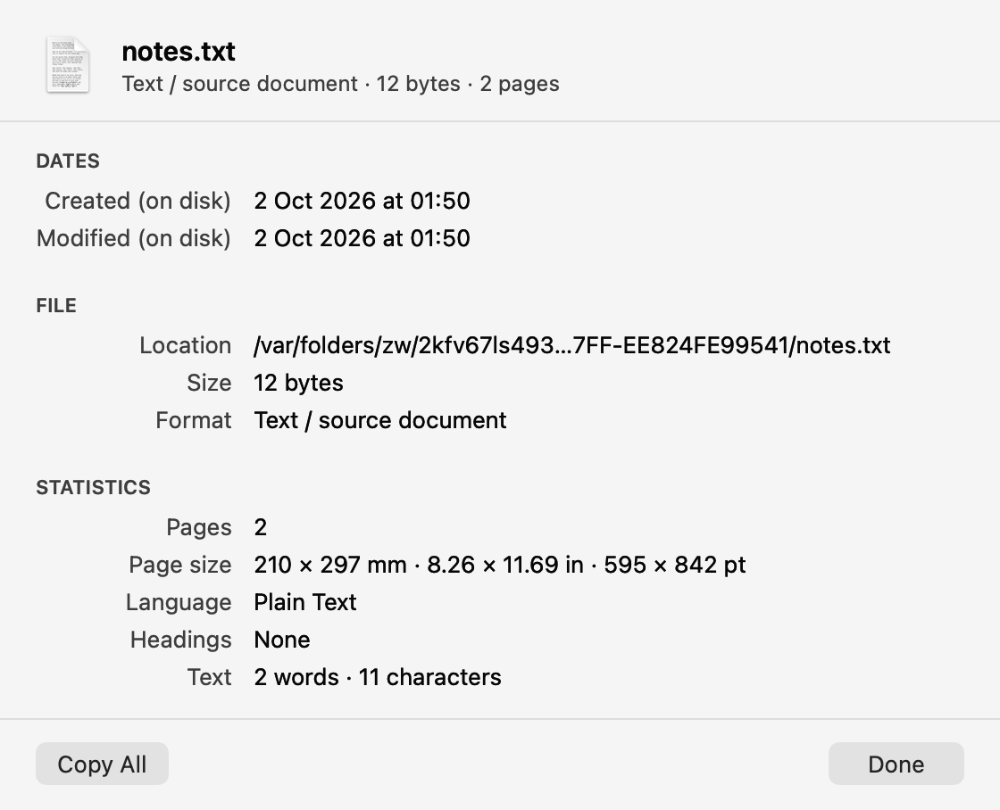

These are hidden AppKit panel renders over an explicit window background, using small generated fixtures. Missing metadata is omitted; the PNG fixture has no embedded DPI. No screenshot of the running application was taken.

Final local packaging updated `dist/ShenzhenPDF.app` and its Collection helper. Strict deep signature verification passed, and the reader executable is newer than every native production source. No publication or app restart was performed.

## 2 October — search hierarchy and direct navigation shortcuts

Search result metadata and snippets are indented twelve points beneath their chapter headings. The existing text sizes, highlight treatment and full-width row hit areas remain, so grouped results are easier to distinguish without reducing the clickable area.

View → Version History now uses Command+H, as requested. The sidebar History icon advertises the shortcut on hover. Hide Shenzhen PDF remains in the application menu without claiming Command+H. Go → Previous Document now uses Command+D and the existing previous-document controller; pressing it twice returns to the starting document, including when the previous tab had been closed. Command+D also works when a search field has focus. The shortcut reference and accessibility help reflect the new assignment. The old Command+Backspace assignment is replaced, leaving that editing shortcut to text fields.

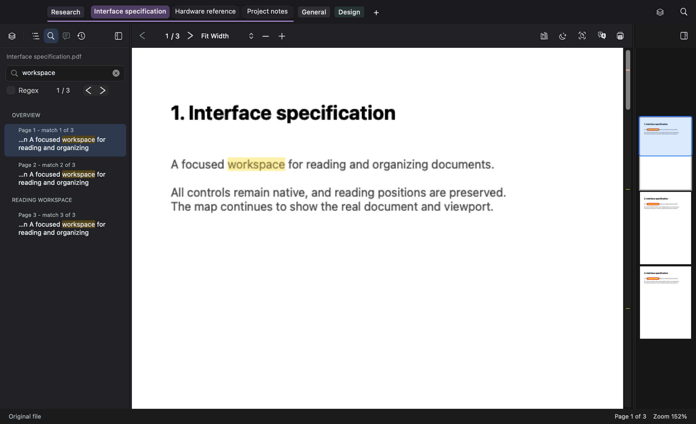

Validation: sidebar layout tests passed at 176, 240 and 400 points, including aligned result metadata/context and preserved highlighted matches. Previous-document tests verify two-press return and reopening a closed target with its original viewport and group. The complete offscreen workspace probe passed across light/dark appearance and narrow/wide layouts; it verifies unique Command+H / Command+D menu bindings, actual AppKit key dispatch and the updater route. No user window was opened or captured.

The final `dist/ShenzhenPDF.app` build and strict deep signature verification passed. Its executable is newer than all native frontend sources. The running app was left untouched.

## 2 October — repeatable map toggle and naming new groups

The map header's hide button and toolbar's show button previously used different AppKit tracking behavior. Both now use the same immediate toggle control. Its mouse-down handler dispatches once without entering a tracking loop that outlives the button's visibility, and consecutive clicks are accepted. This also preserves keyboard and accessibility activation inherited from NSButton. The offscreen workspace probe hit-tests the same window coordinate and sends four consecutive mouse-down events with increasing click counts; every event toggles the real map state. Responsive layout, reader rendering, shortcuts and updater routing checks pass in both appearances.

Creating a group through Add to New Group or by dropping one tab onto another now opens Name New Group after the menu/drag tracking finishes. The suggested color name is actual editable text, focused and selected in full. Enter accepts it; typing replaces it. Keep Default dismisses the prompt without undoing the new group. Existing Rename uses the same focused, prefilled field. The core creation method and agent API remain non-interactive, avoiding modal prompts for automated grouping or restored state.

Focused AppKit tests verify the field-editor selection and Return acceptance without showing a window. Existing tab-group interaction, creation/order and integration tests pass. The initial offscreen native tracking experiment could not activate an unordered stock NSButton, so it was not treated as a reproduction of the reported bug; the final input regression exercises the production immediate handler and real hit-test/layout transitions. No user app window was opened, quit or captured.

Final local build and strict deep signature verification passed for `dist/ShenzhenPDF.app`. Its executable is newer than all native frontend sources. No application restart or release publication was performed.

## 2 October — release candidate interaction and performance pass

The previous map fix was insufficient. Replaced the two alternating controls with one persistent button anchored at the upper-right of the document area. It stays at the same position and retains its view identity through show/hide and narrow toolbar layouts. The automated probe now requires the same actual control at the same coordinate across successive clicks, rather than accepting either of two controls. The user's request to try repeatedly authorized live validation: an isolated copy with its own bundle ID, generated Markdown fixture and temporary state directory accepted all 20 consecutive accessibility-button clicks, alternating Off/On each time. This is live semantic input; stationary-coordinate input and increasing click counts are tested by the hidden AppKit probe. No user reader process or settings were changed.

Groups now records expansion of the selected document's group on entry and publishes that state immediately when revealing its row. In the isolated reader, collapsing General, switching to Chapters and returning to Groups expanded General on all three repetitions; the selected document was visible. This does not force expansion of the top tab bar.

The tab close square already had a subtle rounded background, but moving from the title to the close control inside the same tab returned early without repainting it. Crossing that small hit area now invalidates only its rectangle. The interaction test exercises this exact within-tab movement.

Collection exposes Keep forever / Stop keep forever only with an applied storage cap. History reacts to settings changes, including changes from the separate Collection process. The longer label gets its own row in the narrow History panel. Pause/Resume saving actions and their obsolete deletion guidance are removed; existing saved protection and exclusion state are retained. Cap-only notifications do not re-import recent documents or recapture open documents after cleanup. Focused retention and companion tests pass.

Measured optimization: completing a thumbnail for a 10,000-row result set with eight visible rows now visits eight cells instead of 10,000, without instantiating offscreen cells. The file-search cache previously had a separate static instance in each translation unit; it is now one lazy cache per process with the existing estimated 64 MiB / 256-entry limits. Cross-translation-unit tests prove no cache allocation before an existing file is searched, a single first extraction, and correct replacement/deletion invalidation. These are structural memory reductions, not a measured process-RSS claim. The palette fixture (128 documents / 8 MiB) measured 14.73 ms cold, 0.79 ms warm, and 22.28 ms for a full miss. Group normalization remains linearly bounded.

Focused group, hover, workspace, retention, cache, preview-delivery, palette, companion and launch-work tests passed. The complete release preparation sweep subsequently passed, including 31 rendered format fixtures, 32 macOS updater cases and 56 release-workflow checks. The updater implementation and repository endpoint are unchanged from the last published tag. Version 26.10.2 build 1 is prepared on the working branch; publication remains a separate action.

This image is a hidden native AppKit render, not a capture of the user's reader. The same probe checks repeated input at a fixed coordinate in light/dark appearance and wide/compact layouts. Live validation used the separate temporary reader described above; after testing, only its verified PID was stopped.

Final packaging: `dist/ShenzhenPDF.app` rebuilt successfully as 26.10.2-1. Strict deep code-signature verification passed; the production bundle identifier is unchanged, and the executable is newer than every native frontend source. This is the local development candidate, not a notarized published release. No tag, push, upload or publication was performed.

## 2 October — shortcuts, instant controls and explicit backup opening

Command+G now opens Groups. Find Next/Previous no longer bind Command+G / Shift+Command+G. Return advances a search and Command+Return moves backward, both from the Find field and from the document while Find is active; Shift+Return remains compatible. Other text editors retain Return. The reader probe dispatches G/H/D through actual AppKit menu equivalents. The shortcut window uses a normal titled surface, compact rows, aligned keycaps and a highlighted New! category. Search recognizes action names and key aliases; the launch opt-out still persists.

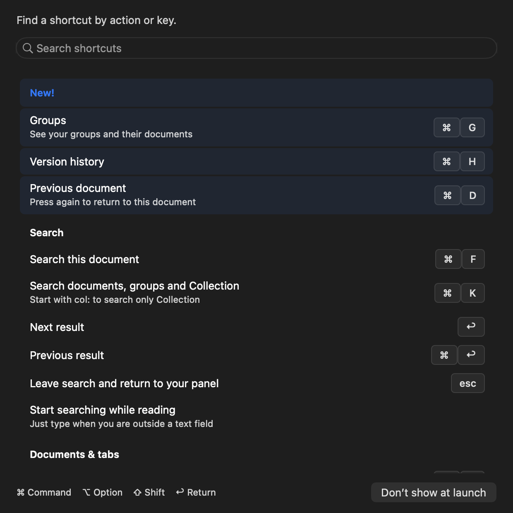
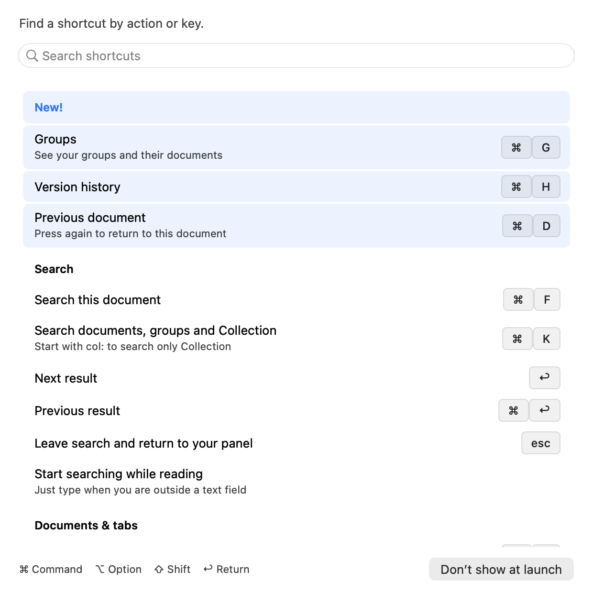

These are offscreen renders of the real native builder; no user window was opened. Geometry checks cover every catalog row and keycap, in addition to search and preference persistence.

Group mouse-up previously discarded click counts greater than one, which explained why quick repeated clicks were ignored. Every click now toggles immediately. Naming and renaming share an anchored, non-animated popover with the suggested name selected; it retains Return acceptance, cancellation and an explicit commit. This removes the sheet-opening animation without a timer or launch-time preload. The sidebar collapse control is momentary, clears its tracking state and never draws a selected/hover background; six successive activations are checked. The map keeps its persistent button and repeated-click checks.

Context-menu previews previously normalized the complete selected text just to show a short label. They now sample at most 256 UTF-16 units plus a composed-character boundary, preserving full text for the actual Copy/Translate actions. The 8-million-character selection fixture produced 100 previews in 0.61 ms. This measures label construction, not the system menu's presentation latency; no universal zero-latency claim is made.

Collection now distinguishes Open original from Open collection copy. A saved copy never redirects to its source. Protected copies join the lazily created Collection Backups group, whose identity survives YAML restoration and whose header/picker show the collection symbol. Opening an ordinary original while this group is selected routes it to General. Copy files are read-only before asynchronous metadata lookup. History continues to open the latest linked original with History selected; search results open without switching to History.

OCR can now accept supported images and creates a separate PDF on a worker before entering the existing OCR workflow. Native text documents such as EPUB and Office files similarly get a PDF rendition before whole-document translation; Markdown/plain text/source files use the existing text-renderer export. Generated names avoid collisions and protected Collection sources request an external destination. Image and native-text conversion tests cover nine format fixtures and multipage TIFF, preserving source bytes and existing output. Existing OCR command, validation and translation-policy tests pass; no tool installation or external OCR/translation run was needed for these routing changes. The shared PDF writer was extracted without changing its Windows entry point.

The combined local build and hidden workspace probe pass, along with focused keyboard, popover, group, sidebar, Collection, conversion and shortcut UI checks. Release candidate 26.10.2-2 passed the complete release sweep, including all 32 updater cases and 56 release-workflow checks. The normal publication/signature trust gates remain unchanged. Final packaging rebuilt `dist/ShenzhenPDF.app` as 26.10.2-2; strict deep signature verification, production bundle identity and source freshness checks passed. The working tree is clean. This is a local development candidate; no app launch, tag, push, notarization or publication was performed for this follow-up.

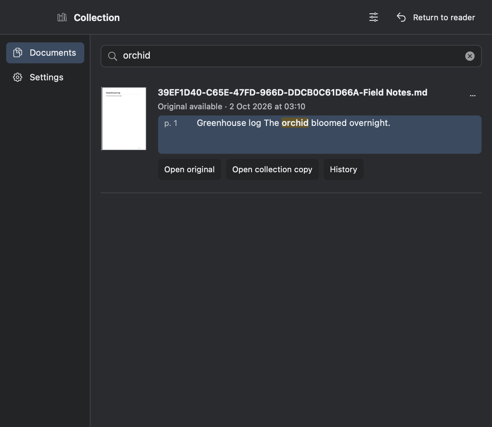

The Collection reviewer verified row geometry at minimum and wide widths, immutable-copy routing despite an available original, and 0400 file permissions before deferred metadata lookup. The displayed long filename is a generated test fixture.

## 2 October — clipboard pictures and a readable release overview

Cmd+V in the viewer now prefers copied local files, then clipboard PNG/TIFF/JPEG image data, then the existing text-to-Find behavior. Native text-field paste keeps precedence through the responder chain. Image paste also works with an empty workspace. The pasteboard data is snapshotted before dispatch; validation, decoding and file creation happen on a worker. Availability checks read advertised types without decoding or creating files. Captures live lazily in the configured state directory's Pasted Images folder, so session restoration does not depend on a temporary directory or on enabling Collection.

The user's follow-up makes the saved state visible: app-owned pasted captures use a red dot in the same reserved title area as the read-only indicator. The flag derives from the restored source path and is cached when that path changes. Save As offers the original image format or PDF. Copying the original bytes preserves metadata, alpha and animation; the shared PDF writer exports every reader-visible page. Saving opens the chosen destination. Failed conversion leaves source and previous destination intact; replacement installs a completed sibling file atomically.

Focused tests use private pasteboards and generated images, leaving the user's clipboard alone. They cover lazy availability, invalid input without storage side effects, file-before-bitmap routing, snapshot stability after clipboard mutation, empty-workspace opening, text fallback, alpha and byte preservation, repeat-paste uniqueness and private file permissions. Export tests cover alpha in PDF, multipage TIFF, GIF byte preservation, existing-output replacement and same-file/symlink/hardlink guards. The actual reader's hidden workspace probe passed without ordering any windows.

Rewrote the candidate notes around reader tasks: organize, keep history, open/paste/save, search, and fixes. Shortcuts have a small table. AI capabilities are separate; implementation details and validation evidence stay in this journal. No publication is implied by preparing this local candidate.

Technical review caught and corrected three Save As integration gaps: archive destinations are refused, overwriting an existing file uses Collection's pre-save protection, and copies from read-only sources become writable private files. The destination identity is captured before protection and checked after conversion; a newly appeared destination is never overwritten. Saved-history notification runs before loading the new destination. Pasted saves retarget the originating tab and persist its reading state; if the user switched tabs meanwhile, the saved tab updates without stealing focus, and a closed tab stays closed. A focused category test covers these transitions and restored marker state. Unsaved status is also exposed to accessibility.

This isolated drawing fixture exercises the production tab renderer; it is not a screenshot of the user's app. The completion-state tests separately verify that Save As removes the marker in the same originating tab.

Release preparation for 26.10.2-3 passed the full test sweep, including the new clipboard/export/persistence suites, 32 updater cases and 56 release-workflow checks. The independent technical critic independently rebuilt the focused suites and found no remaining major or medium issues in this scope. The updater source remains unchanged from the last published release. The prepared notes now provide a 691-word reader overview with a separate AI section instead of the previous dense implementation list.

Final packaging rebuilt `dist/ShenzhenPDF.app` successfully as 26.10.2-3. Strict deep code-signature verification passed, the production bundle identifier is unchanged, and the executable is newer than every native frontend source. No app was launched or restarted. This is the prepared local development candidate; no tag, push, notarization or publication was performed.

## 2 October — image PDF clipboard and unsaved-close protection

Copy as PDF had been enabled for images but called the PDF-only grafting writer. Native images now use the shared page-export writer, with their own document on a worker and the context-click page captured before dispatch. Existing PDF copying retains its original writer. The clipboard receives both PDF data and a uniquely named file URL; delayed work does not replace newer clipboard contents. Private-pasteboard tests verify transparency, multipage TIFF page selection and the existing PDF path.

Closing an unsaved pasted image now offers Save, Don't Save and Cancel. Save uses the same image/PDF picker and only closes after successful output installation. A cancelled or failed save leaves the tab open. Group close obtains approval before removing any members and closes only its approved identity snapshot. Quitting checks unsaved images before session termination and rechecks newly pasted tabs after asynchronous saves. An in-progress ordinary Save As is joined rather than duplicated or interrupted. There is no added launch work; ordinary saved documents skip the warning.

A technical review reproduced and helped correct asynchronous cases that the first tests missed: quit during tab-close save, new unsaved tabs arriving during quit-save, and group cancellation. These cases are covered headlessly; no user app or clipboard is used for validation.

The extended close suite exercises the real group-close implementation and passes cancellation, failed/cancelled saves, ordinary Save As in flight, new unsaved tabs during quit, and changed-source approval invalidation. The final bounded critic review found no remaining major or medium product issues. The complete release preparation suite passed for 26.10.2-4, including all updater and release-workflow cases; preparation did not publish anything.

Final packaging rebuilt `dist/ShenzhenPDF.app` as 26.10.2-4. Strict deep signature verification, production bundle identity and executable/source freshness checks passed. No app was launched or restarted, and no release was tagged, pushed, notarized or published.

## 2 October — History icon click area

The reported lower-half History click failure was investigated in the reader sidebar, not the Collection row. Hidden layout probes found no overlapping panel, and direct reader action tests activated History at five vertical positions. The exact half-height symptom was not reproduced. A concrete mismatch did reproduce: the custom row paints a 28-point target while its inherited NSButtonCell excludes the top and bottom painted edges from its native trackable area.

Added a focused button cell whose native hit test uses the full custom row bounds. Native button tracking remains responsible for release/drag cancellation; disabled and outside points return no hit. Rows also explicitly accept consecutive clicks. The regression tests exercise native cell hit areas and mouse events at five heights in six narrow/light/dark layouts, plus disabled controls and drag-out cancellation. The actual hidden reader probe checks full-height hit routing and History activation. The original implementation fails the new native-hit-area contract; the corrected implementation passes. This is a targeted correction of the confirmed mismatch, not a claim that the user's exact half-button symptom was reproduced. No app was launched, quit or captured.
