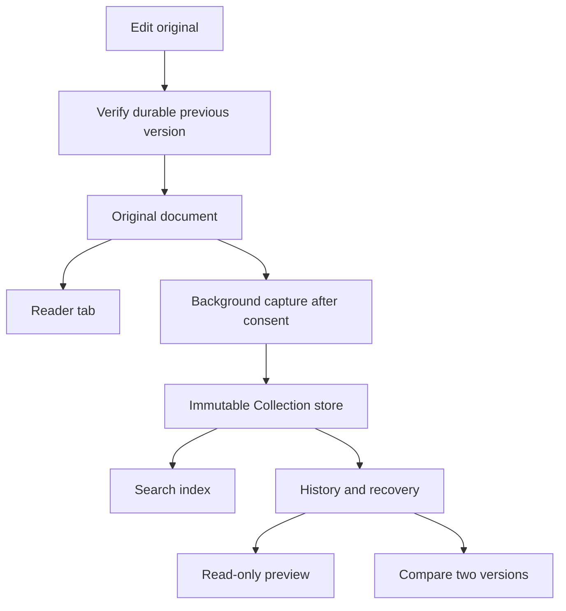

# Collection implementation journal

23 September 2026 · ShenzhenPDF

**Native Collection redesign: technical 9.2/10 · UX 9.2/10.** Independent native reviews have no remaining major or medium findings in their stated scopes. The final section records the implemented mockup, corrections and release validation. Earlier scores and the 53-target sweep below describe the previous baseline.

## Implemented behavior

Keep local, immutable copies and history while continuing to read original documents. Search open documents, groups and Collection from one palette; recover missing originals; compare PDF and Markdown revisions in two coordinated readers.

The approved proposal is [Reader review and Collection](../../proposals/reader-review-and-collections.md). The latest visual correction is uniform title text on every tab: selection is communicated by fill, outline and weight, without fading other document names.

The reference shows the problem: an inactive title fades into the gray fill. Every tab now uses the same title foreground; selected tabs retain the stronger fill and outline.

<!-- pagebreak -->

## Architecture and responsibilities

| Part | Responsibility | Validation |
|---|---|---|
| Collection store agent | Immutable snapshots, identity, deduplication, index, locking | Temporary stores; failure and laziness tests |
| Comparison agent | PDF/Markdown alignment, colored changes, paired readers | Text, image, scanned and inserted-page fixtures |
| Reader refinements agent | Tab contrast, accessibility, navigation, checkpointing | Geometry, action and state tests |
| Integration | Consent, original-path routing, search, manager, history and recovery | Build, integration tests and isolated app use |
| Independent Astra critics | Technical and UX review after implementation | Ranked findings and scores, up to six rounds |

## Decisions and actions

### 1 · Establish ownership and preserve the original

The storage, comparison and reader tasks are independent and have distinct files. Integration owns the coordinator hooks, avoiding simultaneous changes to the same large file. Collection construction and disabled-state reads must not create folders or scan documents.

A successful document open schedules a background capture. The first-use choice precedes copying. A source overwrite checks that the previous revision is durable; a full destination, revoked destination access, interrupted copy or changing source can fail even though reading the original succeeded. Normal reading remains available.

### 2 · Reuse native rendering for comparison

PDF comparison uses two native PDF reader views. Markdown first renders through the existing deterministic print plan, preserving the same pagination and selectable vector text. Alignment and differences are computed away from the UI thread. This keeps comparison separate from the editable source reader and avoids sharing mutable document handles.

<!-- pagebreak -->

## Validation evidence

### Headless checks, implementation pass

| Check | Result | What it establishes |
|---|---|---|
| Collection store / comparison / previous tab / checkpoint / reader actions / tab interactions | Exit 0 | Focused feature behavior, concurrent storage and editing failures |
| Markdown engine and UI/session suites | Exit 0 | Rendering, pagination, navigation and existing reader behavior |
| Agent commands, PDF/Markdown navigation and MCP tests | Exit 0 | Existing agent access remains functional |
| Tab state, strip style/interaction and group model/integration | Exit 0 | Persistent state and group behavior |
| Full app integration | Exit 0 | Native build, hidden-window layout, live isolated app |

### 3 · Close integration gaps before visual review

The first compilation found a category header missing its host declaration and manager actions using synthesized instance variables from another translation unit. Those were corrected without changing the storage contract. A coordinator shortcut hook accidentally matched an icon lookup with the same selector; syntax validation caught it and the hook is now limited to menu validation.

OCR receives an additional check immediately before installing its result, since the original can change while OCR runs. Locator preview and relinking have separate callbacks: previewing a candidate must never silently rebind a missing-document tab.

The coordinator is smaller after extracting palette orchestration, creating space for explicit Collection hooks without raising its size cap.

### Live validation, first integrated build

The exact consent wording is displayed. Inspecting the isolated state directory before answering found no Collection folder or copied document. After Keep Enabled, the fixture was captured while its tab continued to use the original path.

Searching “orchid” returned two page matches in the open Markdown document, followed by Collection text. `col:Project` included the collected open document. The screenshot also exposed multiline snippets clipping in fixed-height rows; these are being normalized to a single line.

This is a headless rendering of test pages with the actual difference geometry, not a mockup or live-window screenshot. The red word was removed, the green word added, and the new image is outlined in green.

Cmd+Backspace returned from Design Review to Project Notes at page 2; a second press returned to Design Review. The first manager invocation revealed a missing-common-ancestor layout exception. Its constraints are being reordered, with a real hidden-window construction test added to prevent recurrence.

<!-- pagebreak -->

## Independent review rounds

| Round | Technical /10 | UX /10 | Major / medium remaining | Action |
|---|---|---|---|---|
| 1 | 6.8 | 7.0 | Technical: 2 major, 4 medium; UX: 1 major, 4 medium | Repaired; regression fixtures added |
| 2 | 8.0 | 7.2 | Technical: 3 medium; UX: 1 major, 2 medium | Queue/parser fixes; PDF ownership, thumbnail layout and archive identity |
| 3 | 9.1 | 9.0 | No major or medium findings remain | Optimized regressions and live counter retest passed |

## Release preparation

Independent reviews met the requested threshold within three rounds. Release 26.9.23-1 was prepared on `codex/collection-history-release` at metadata commit `418cb5b`. The release workflow reran all 53 test targets successfully and committed validated version metadata. No tag, push, notarization or publication was performed. The journal is delivered in the final dated build; the installed reader remains untouched.

### Review round 1 · Repair decisions

The [technical review](technical-review-round-1.md) reproduced a source-change race, unsafe overwrite during archive export and unrelated-file history merging. Capture now publishes only the fingerprint of the bytes it actually protected. Export installs only to a new destination. Observed saves have explicit identity continuity; generic opens cannot inherit a cancelled edit's pending identity. New regression fixtures also cover reference-style Markdown images, retries and mixed text/image page alignment.

The [UX review](ux-review-round-1.md) exercised the real app and scored it 7.0/10. Its main finding was that path disambiguation replaced the archive's dated title with an internal folder name. Archive identity now has its own persisted display label. The other repairs target spare tab-strip space, search routing, thumbnail captions and recovery context.

These are before-fix screenshots, retained to explain the changes. Final evidence will follow the next live evaluation.

### Technical round 2 · Queue ordering and parser fidelity

The original six technical findings are closed. A deliberately paused old capture then exposed a race with a subsequent successful save. Capture requests now have per-path generations, checked again under the transaction lock: a superseded request cannot change document identity. The regression retains one history containing both A and B. Focus-driven change detection now supplies the same explicit continuity as the active file watcher.

Asset discovery now uses the reader's actual Markdown parser. Literal code, comments and unsupported HTML cannot pull unrelated neighboring files into Collection. Only rendered image dependencies are considered. This both improves fidelity and avoids copying files that the document merely mentions as syntax examples.

### Live round 2 · Test limits made visible

The second app evaluation confirmed that indexed “Show all” search now returns both PDF and Markdown matches and that archived previews have explicit labels. It also exposed two gaps that the earlier hidden-window checks missed: thumbnail captions disappeared during live layout, and accessibility selection did not update the document actions. The thumbnail regression is being extended through layout and selection synchronization.

A PDF comparison triggered an accessibility crash in PDFKit while traversing a copied page's tagged-content tree (`CGPDFPageCopyRootTaggedNode`, recursive lock abort). This was observed in the isolated validation process, not inferred from a source review. Comparison presentation is being investigated independently; release remains blocked until the same live flow succeeds.

An older restored archive also lost metadata after its original was renamed. The archive resolver now recognizes the original's verified filename aliases for the early schema; unknown dates are explicitly labeled unavailable instead of showing 1970.

### Candidate for round 3

Aligned comparison pages are now serialized and reopened as complete, independent PDF documents on the worker queue. A new presentation test proved the ownership defect: previously the displayed documents had no backing document reference while their pages belonged to other documents. The corrected presentation retains selectable text, annotations, blank counterparts and native accessibility. The original code fails eight ownership/serialization assertions; the new code passes. The observed live crash still requires a live retest.

Thumbnail captions now have explicit constraints. Their regression checks pixels after the run loop and layout, then verifies accessibility selection updates the details and Preview action. Archive labels are preserved in tabs, window titles and palette candidates. Existing Favorites and Actions remain available after the five requested search sections; `col:` remains limited to Collection.

### Round 3 follow-through · Match the production build

The technical critic independently confirmed that the shared-store race now retains one history with both versions, and rated the core implementation 9.1/10 with no major or medium findings. Edit protection publishes a durable epoch under the shared lock, invalidating older queued captures in other processes. It renews metadata without duplicating unchanged snapshots. Activation-time PDF/Markdown cache invalidation now records observed continuity only when a live cached document existed.

The live candidate then exposed an optimized-build issue in the thumbnail repair: `NSCollectionViewItem.textField` is weak. Assigning a newly created label before attaching it to a view let ARC release it early; the later constraint array contained nil and the manager crashed. The label now has a strong local owner until attached. The entire Markdown UI suite now compiles with `-O2`, matching production lifetime behavior, and still checks caption pixels and selection actions. This replaces the misleading confidence from the earlier `-O0` pass.

The Markdown integration file briefly exceeded its 500-line cap. Its checkpoint closure was extracted into a focused integration file; the limit was not raised.

### Final navigation repair

The optimized full release test sweep completed with exit 0, including all 53 discovered test targets. Live round 3 then confirmed the manager and PDF accessibility repairs. Its remaining medium finding was narrower: both comparison readers displayed the aligned appendix, but one counter still described the preceding inserted page. Navigation labels now follow the aligned destination, with deferred scroll updates guarded against stale notifications. The optimized regression verifies that both actual readers and counters reach aligned slot 3, showing old page 2 versus new page 3; it also checks independent navigation and scrolling. The pre-fix code fails four assertions in the same expanded test. The independent live retest passed: linked navigation shows slot 3 in both panes with old source 2/new source 3; unlinking permits the right pane to advance while the left remains on its blank counterpart. The UX critic closed the finding and scored the final candidate 9.0/10; the technical critic independently reran the regression and retained 9.1/10.

### Final evidence and remaining scope

The native inspection command rendered this journal successfully with no layout diagnostics after adding deliberate page breaks before its summary tables. Screenshots are actual app captures; the explicitly labeled engine figure is a headless render. The reviews retain their earlier failures and state where checks were live, headless or source-only.

Both critics leave only minor follow-ups: start search snippets at word boundaries, make capture reasons more specific, and add direct coordinator tests around externally edited inactive tabs. No major or medium improvements remain in their reviewed scope. The live review used isolated generated documents and state; whole-computer recovery scanning and destructive Collection deletion were covered by bounded tests rather than exercised against personal files.

### Release record

- Implementation: `daf065f0a` — Collection, comparison, navigation and regression tests.
- Visual journal and independent reviews: `77ba17824`.
- Release metadata: `418cb5b` — version 26.9.23, build 1.
- Release preparation command: `./portable/cut-release.sh --prepare-only "Collection history and persistent tab groups"`; exit 0.
- Release notes: [26.9.23-1](../../releases/26.9.23-1.md). Publication remains a separate action.

### Delivered in the reader

The final native app build completed with exit 0. Its bundle reports version 26.9.23, build 1, and passes local ad-hoc code-signature verification; this is a local validation build, not a notarized distribution artifact. The journal was opened and visually checked on page 1 in that build with its chapters, screenshots and minimap visible. The app remains open for inspection, using the isolated validation state.

### Requested corrections after preparation

Removed the unsolicited 30-point margin overrides from this journal and the proposal. Native inspection confirms both again use the existing 61.2-point Markdown margins.

Markdown now omits the Comments sidebar tab entirely. Sidebar modes have stable tags so Search keeps its identity when moving between the compact Markdown control and the PDF control. Comment actions remain gray through AppKit menu validation, which previously could re-enable Add Comment. Focused sidebar tests cover switching document types, search activation/clearing and PDF Comments restoration. These follow-up checks are separate from the earlier 53-target release sweep and critic scores.

The sidebar, tab-state and file-size checks passed, as did the rebuilt native app. The build is available in `dist/ShenzhenPDF.app`; the running reader was not restarted.

### Live feedback while reordering grouped tabs

Removed the grouped-tab exclusion from the existing moving-tab preview. The grabbed tab now follows the pointer above its siblings; crossed siblings exchange slots while group headers and other groups remain anchored. Drop uses that same insertion position. A pause over the source group's own tabs or handle remains a reorder, preventing an accidental append or new group. Joining another group still shows its destination outline and the moving tab.

Focused tests cover both directions in General and colored groups, the pointer grab offset, pause behavior, release/reset, and a later group's first slot. The pre-fix code fails the new moving-preview regression. The image below is a headless render of the actual native tab strip during a drag, not a mockup or an app screenshot.

### Collection settings and search design review

The next request was for mockups before implementation: move Collection settings to the left sidebar, display the storage path with Set location and Open location, and place contextual highlighted search matches to the right of each thumbnail. Reading the existing capture code confirmed that the current cap refuses additional storage; it does not prune old documents. The user chose a proposed cleanup policy that removes whole oldest unkept histories. The proposal orders histories by their latest capture, protects every history containing a kept version, and never deletes originals.

A UX designer produced an interactive mockup. The independent Astra critic scored the first round 7.8/10, identifying offscreen previews, lost focus, misleading title-only snippets, and inconsistent post-cleanup totals. Browser validation then caught a state-update echo that rebuilt focused controls, and an iframe resize that happened after the initial scroll request. The revised mockup preserves focus and reveals the correct preview after layout settles.

The second critique scored 9.2/10 with no major or medium findings remaining in the design scope. Dark/light appearances, narrow layouts, search states, version identity, keyboard navigation, settings persistence, cleanup cancellation/protection, and location simulations were exercised. No reader restart or application changes were made for this mockup task. The [proposal and both critiques](../../proposals/collection-settings-search.md) preserve the decisions and verification limits.

### Integrated Documents search and Collection history revision

The user simplified the navigation: search belongs inside Documents, and storage should default to unlimited. They also replaced whole-history-first cleanup with usage-based cleanup: least-opened documents first, old versions before the documents themselves. The revised proposal uses two passes, first pruning previous versions in usage order and only then removing final Collection copies when necessary. Histories containing a kept version stay protected; originals remain untouched.

The UX designer added a visible History action to each document and a detail view with version dates, capture reasons, protection state and read-only previews. Browser checks confirmed that returning preserves query, scope, expansion, selected preview and focus on the originating action. Cleanup uses the same sample versions as Documents and History: a 2.5 GB limit prunes two previous versions; a 2 GB limit then also removes the least-opened document's final copy and entry. Protected capacity is checked before any removal.

This revision completed two independent review rounds, **8.9/10 → 9.3/10**. The sole medium finding concerned Keep: its whole-history effect was explained below the page preview. Moving that explanation directly beneath the checkbox, connecting its accessible description, and announcing protection changes resolved it. Tests covered current-version protection, protection retained by another version, and the last kept version being unkept. The final critic leaves no major or medium findings in the mockup scope. Native app behavior is unchanged by this design task.

<!-- pagebreak -->

## Native Collection redesign implementation

The reviewed design is now implemented by separate storage, search and manager agents, with History and reader integration handled centrally. Collection has Documents and Settings destinations. Search remains in Documents, beside real page thumbnails; every result identifies its saved version and leads directly to History. Settings shows the location, Set location, Open location, and an unlimited default.

The cleanup policy uses two passes. It ranks histories by explicit user opens, ties by oldest last-open time, and removes previous versions before considering any final document copies. A kept version protects the whole history. Previewing, searching, indexing and restoring a session do not increase open counts. Storage estimates count shared content once; cleanup must fit before it is applied, and unreferenced bytes are removed only after the replacement manifest is durable.

History renders saved PDFs directly and Markdown through the existing canonical renderer. Selecting a saved version changes the actual read-only preview. Its Keep explanation sits next to the checkbox. Browsing state includes search scope, query, selected result, expanded matches, scroll positions and the historical version/page. No Markdown margin changes were made.

### Evidence and decisions during implementation

- Storage, integrity, cleanup, assets and grouped-search suites passed. The native app build and all 23 Markdown/UI integration suites passed with optimized ARC compilation.
- An initial History test created two separate documents by atomically replacing its source without an observed-save continuity ID. Correcting that fixture now proves that distinct latest and older texts appear in the same history.
- The independent technical critic identified a quota ordering issue: counting an explicit open after capture meant cleanup could use an outdated rank. The store agent is integrating the count into capture's transaction before cleanup.
- The critic also demonstrated a real Markdown search phrase split by a generated PDF line break. Preview matching now collapses whitespace and maps highlights back to the original page text; accent-insensitive search and surrounding whitespace follow the same semantics as contextual results.
- Preview and comparison have separate resource limits. History supports PDF copies through the store's 512 MB limit and up to 2,000 rendered Markdown pages. Larger Markdown previews offer Save a Copy; comparison retains its existing 256 MB / 1,000-page budget.
- The UX critic is using a separate app bundle and state with generated garden documents. The installed application and personal Collection remain untouched.

The first independent technical review scored the candidate 7.9/10 before the remaining corrections. This is recorded separately from the earlier mockup's 9.3/10; a new native score follows verification of fixes.

### Native review and visual correction

Actual app use caught an unacceptable gap between the approved mockup and the first native pass. The user called out the buttons. The UX critic scored that candidate **7.3/10**, identifying the permanent ten-button options column, bright navigation buttons and compressed search results as a major visual mismatch. Functional correctness alone was not enough. The visual implementation is being rebuilt around the approved mockup's full-width rows, quiet sidebar, restrained controls and secondary action menu.

The same hands-on review found that Cmd+F did not focus Collection search and shrinking History could scroll its highlighted match out of view. The window now owns its search shortcut; the History reader retains its selected match or reading destination when resized. These fixes receive native regression tests and another live review.

The technical review also reproduced an obsolete preview finishing after navigation and overwriting the newer saved History position. Outgoing controllers now invalidate their preview work, and History preference writes share a lazy serial queue. A semaphore-controlled test proves that a delayed old preview cannot replace the current document's saved position.

### Exact version routing and focused controls

The second live UX round confirmed the new visual direction, Cmd+F, Escape, highlighted-match anchoring on resize, export cancellation and safe cleanup cancellation. It also found an older-version hit opening the latest revision. A new direct-entry regression reproduced this: AppKit selected row zero while constructing a table that forbids an empty selection. The construction guard now starts before the table is configured, preserving the requested historical version and page. The regression failed before the correction and passes afterward.

The custom search control also needed its own field-editor geometry, not only painted geometry. Its focused editor now reserves the same icon space and vertical alignment as its unfocused text. Tests use the actual AppKit field editor. Sidebar accessibility names are explicit, and a proposed finite limit immediately explains its pending cleanup policy while showing the currently applied limit. Draft settings do not write to storage.

The third technical review scores storage, accounting, search and History lifecycle **9.2/10**, with no major or medium findings in that scope. The updated native app and focused manager/History suites pass; the final live visual review is separate.

### Final native visual acceptance

The third hands-on UX review reached **9.2/10**, matching the independent technical review. The native browser now follows the approved mockup: Documents and Settings in a quiet sidebar, full-width contextual results, actual page thumbnails, compact flat controls, and secondary actions collected in More. The ten-button options tower is gone. History places version identity, read-only preview and protection together; Settings separates Collection, Storage and Location.

The two minor residuals were corrected after the live review: one result now uses singular wording, and the History table is constrained to its scroll viewport so the selected row retains both rounded corners even with a permanent scrollbar. The new geometry regression failed before the fix and passed afterward. This final image is a headless rendering of the actual History view and generated PDF fixture, not a mockup.

The [technical round-three report](native-technical-review-round-3.md) and [UX round-three report](native-ux-review-round-3.md) give evidence and coverage limits. Live review used generated files, a separate bundle identifier and isolated state. The installed app and personal Collection were untouched. Live light appearance, completed relocation/export and destructive cleanup were not exercised; automated store tests cover cleanup and protected-cap refusal.
