# Native Collection — controls and Latest badge review

23 September 2026 · Independent native UX critic · **9.1 / 10** for the reviewed controls and badge flows. **No observed major or medium finding remains in this scope.**

The user's alignment and rectangular-focus feedback was valid. My earlier 9.2 review accepted the broader layout but did not adequately assess the relationship between the custom rounded search surface and its actual AppKit focus outline. The earlier screenshots show that rectangular outline. This follow-up explicitly checks focused/unfocused and populated/empty states; it does not treat the prior score as evidence that those details were correct.

## Candidates and method

Controls were reviewed in the running isolated `ShenzhenPDF Collection Controls.app` (bundle suffix `v5`, separate `state-v5`) after fixes `7ad796bf1` and rendered regression `a8d3f509b`. The newly requested Latest pills were then reviewed in a freshly built isolated `ShenzhenPDF Latest Review.app` (bundle suffix `v6`, separate `state-v6`). Root reported successful builds and all 24 native UI suites before handoff.

I used native accessibility actions, keyboard input and screenshots. I did not quit any app, operate the installed app, alter system keyboard preferences, modify production code or confirm destructive actions. The journal remained open in the isolated reader. A temporary custom-limit draft was restored to Unlimited without applying it.

## Ranked conclusions

### 1. Search alignment and focus shape — closed by actual retest

The query, placeholder, magnifier and cancel affordance are vertically aligned. The focus outline now follows the field's rounded corners. Removing focus with Tab removes that outline cleanly while preserving the quiet rounded border. Cmd+F returns focus and selects the query without shifting the baseline.

I checked populated focused, populated unfocused, empty focused and empty unfocused states separately. The result is consistent with the approved mockup's restrained rounded control, while retaining a visible native keyboard-focus indicator.

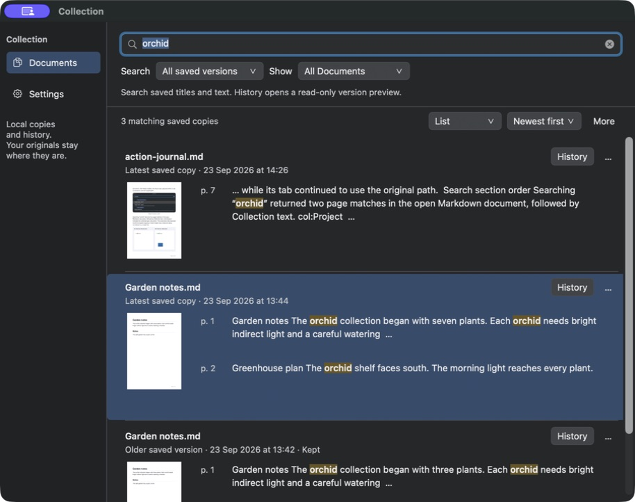

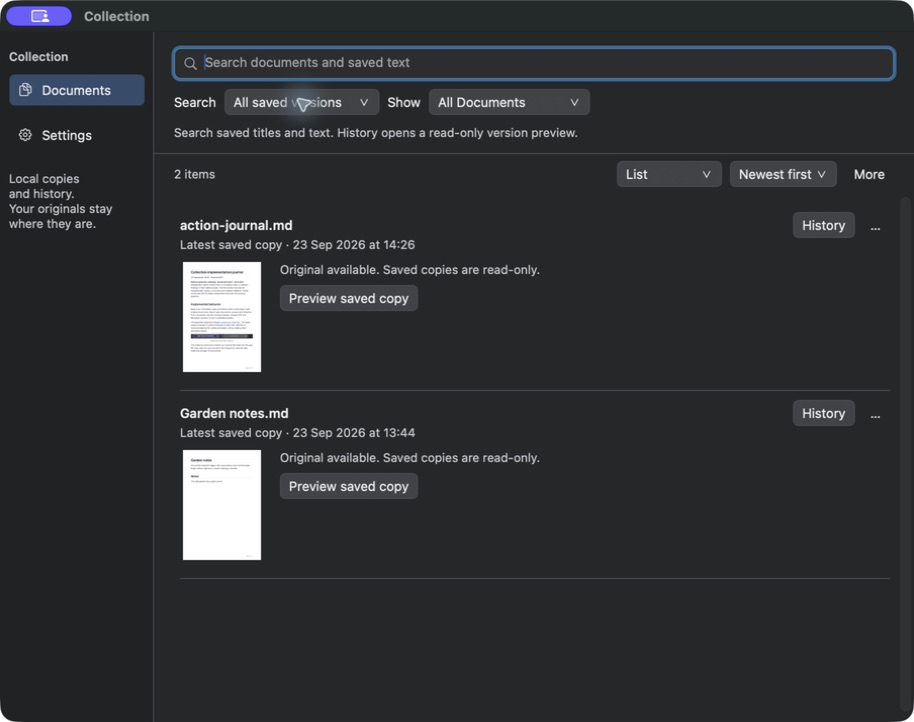

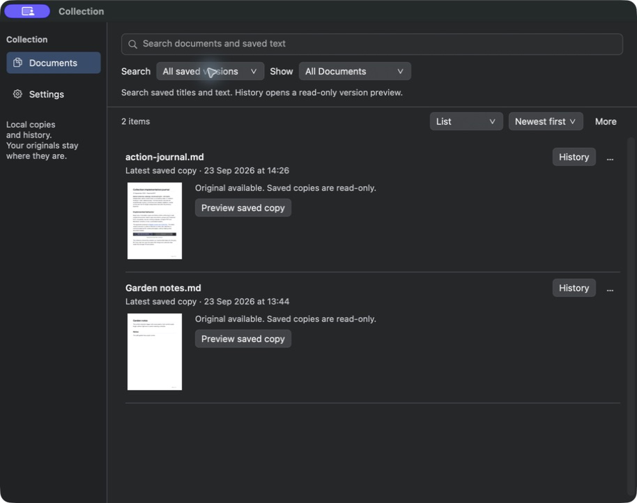

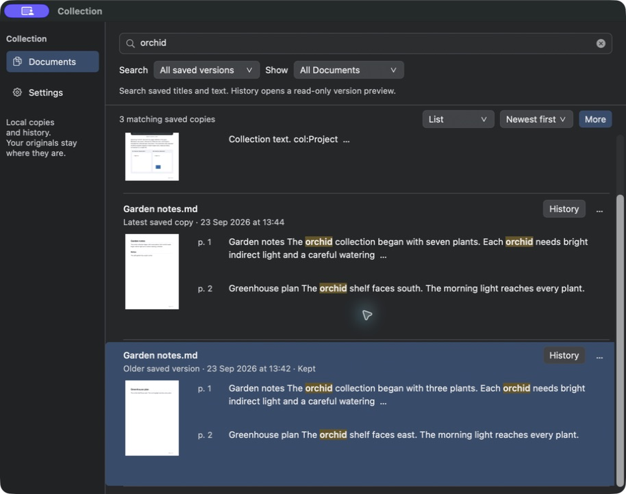

### 2. Native control alignment and screen cohesion — passed within observed states

Documents and Settings icons align with their labels in both selected and unselected rows. Their accessible names remain explicit. Scope/filter labels, dropdown titles and arrows, History/Preview/More labels, Back and Actions share coherent vertical placement. Settings keeps the same flat surfaces and typography. The focused numeric cap and History page fields also have rounded outlines.

The scope dropdown opens and dismisses with Escape. More exposes the existing secondary commands. History Actions exposes compare/export commands with the oldest-version Previous action disabled. Exact older-page navigation still opens the dated old content, and Escape returns to Documents with its query and selection.

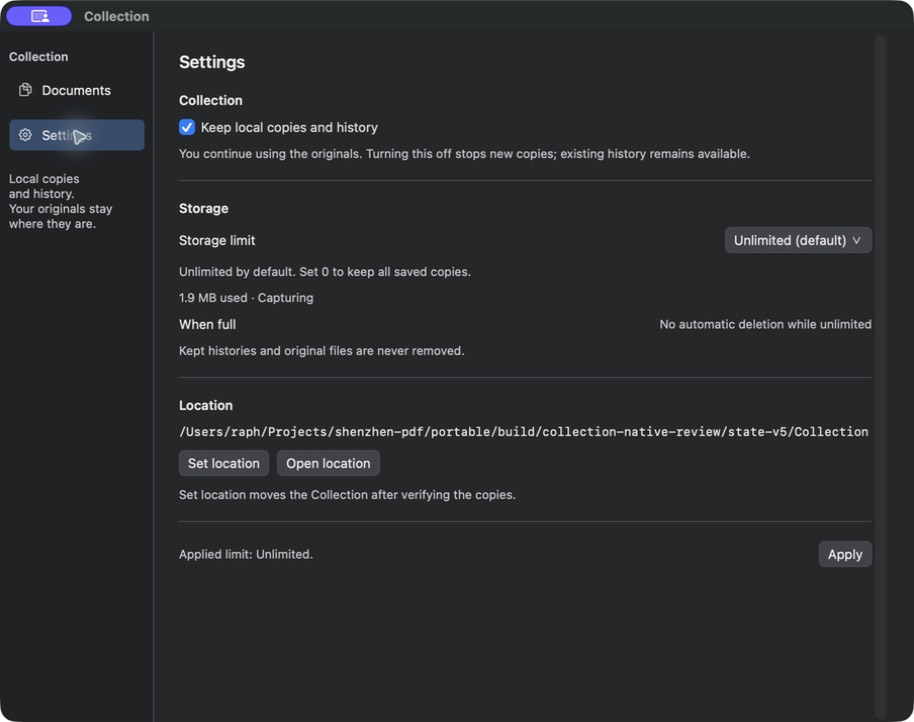

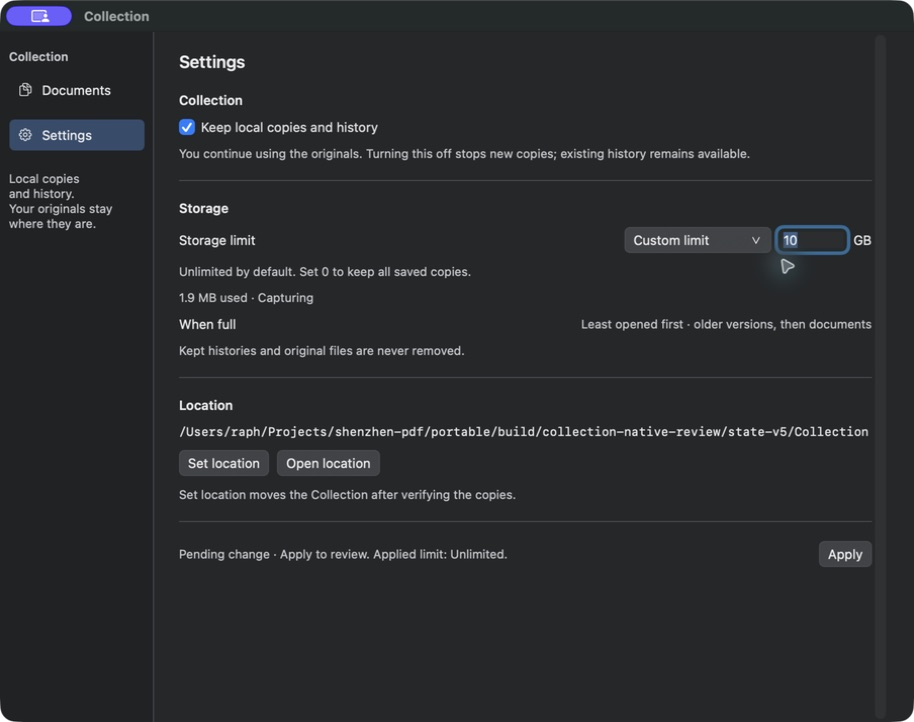

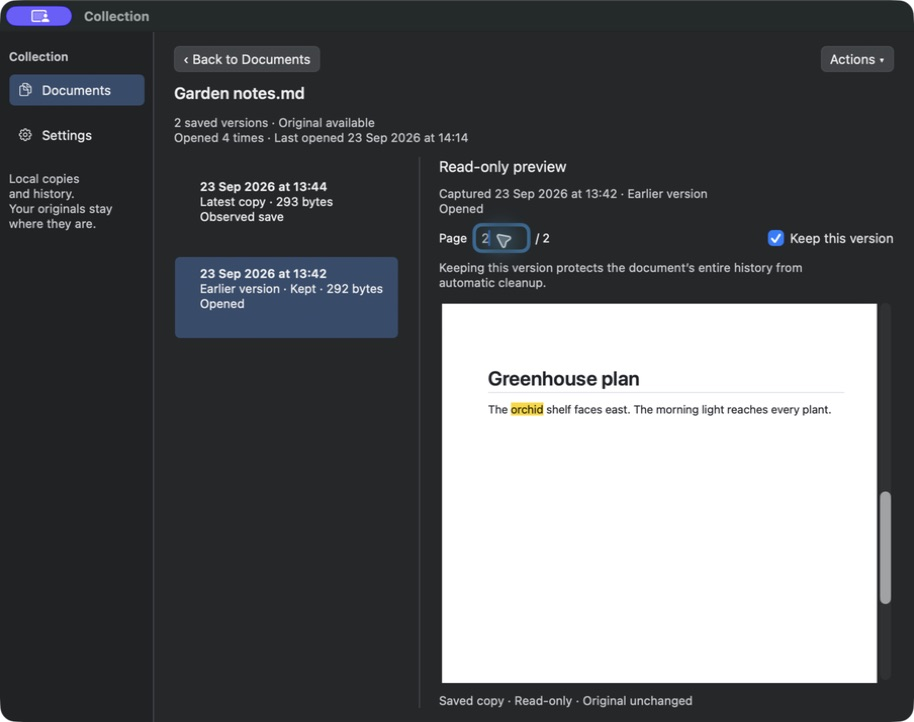

### 3. Latest pills — passed in list, grid and History

**Superseded by the product-intent correction below:** this records the V6 implementation tested at that time. Documents must show only each document's latest copy, with Latest pills confined to History.

The new Latest pill is small, legible and visibly distinct from a button. Its outlined capsule fits beside capture metadata without competing with History. The native accessibility tree exposes static text named **Latest saved version**, rather than another actionable control.

List browsing and content-search results badge the actual newest saved version; older revisions retain their Older label and no pill. In History the badge remains on the newest row when an older row is selected. It is legible both against the normal pane and the muted selected background. In the thumbnail grid it sits in the caption/action area outside the page image.

I reversed version sorting to Oldest first. The oldest Garden notes revision remained unbadged, while its newer revision retained Latest. The same distinction held for two journal revisions. Badge identity therefore remained correct when the first displayed item was older.

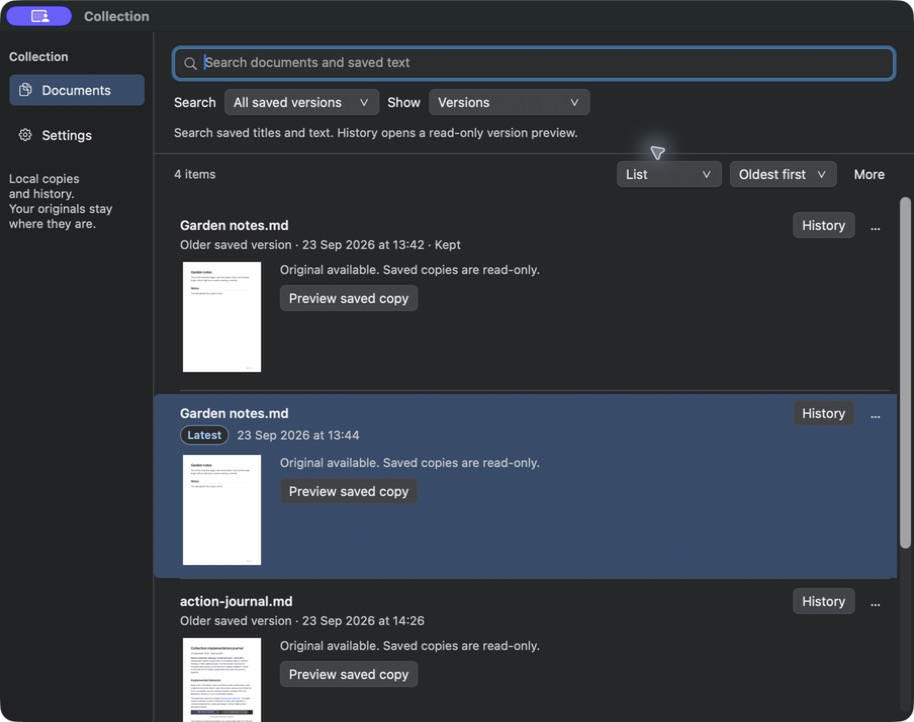

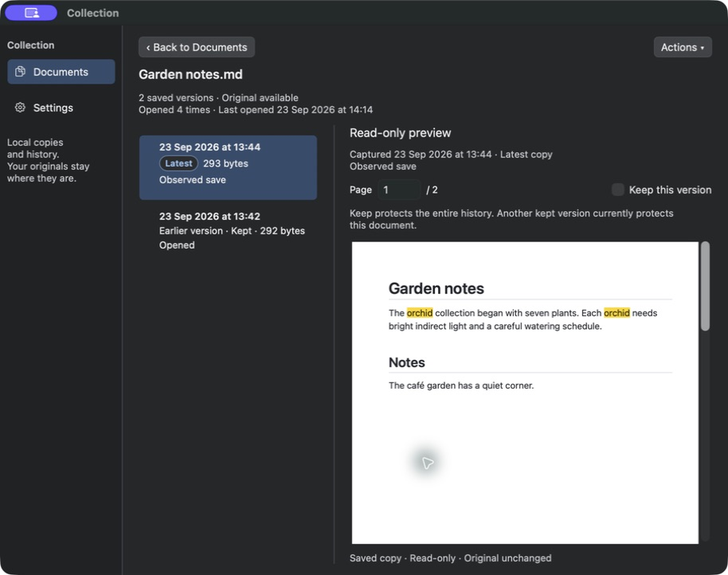

## Limits and residual findings

There are no new ranked defect findings from the states exercised in this loop. That is narrower than a claim that every keyboard-focus state or window size was observed.

- The host's normal Tab navigation skips buttons/dropdowns and moves from search to the table. Option+Tab inserted a tab character in the editor instead of enabling all-control traversal; I cleared it. I did not change system keyboard settings. Keyboard focus outlines on dropdowns, History, More and Back were therefore **not independently observed**; their normal and activated/menu states were observed. The implementation's rendered tests are separate evidence, not a live test I performed.
- Attempts to resize or move the isolated window failed with the computer-use service's `windowNotFoundAtPosition` error despite a refreshed screenshot. Semantic actions and captures continued working. I stopped coordinate retries; this loop does **not** add fresh narrow-resize evidence. Earlier native resize checks and the reported headless geometry tests retain their stated scope.
- This pass reviewed dark appearance. Light appearance, exhaustive keyboard traversal and all unrelated storage/comparison behavior were not rerun.

The focused control matrix and the actual Latest-badge checks justify **9.1 / 10** for this scoped follow-up. The lower, narrower score is deliberate: the earlier review missed user-visible detail, and the coverage limits above remain explicit. The observed alignment, focus shape and badge behavior meet the current requested corrections.

## Addendum — Documents semantics corrected and retested

The user clarified that Documents means **one entry per document, showing its latest saved copy**. Multiple versions and Latest pills belong only in History. My V6 acceptance above did not establish the correct product semantics and is superseded by this bounded V7 retest.

I reviewed the actual isolated `ShenzhenPDF Documents Review.app` (bundle suffix `v7`, `state-v7`), whose cloned state was deliberately seeded with the legacy Versions view and all-versions search preference. It opened All Documents with exactly three documents, each represented once by its latest capture. The Versions filter and search-scope selector were absent. List and thumbnail layouts contained no Latest pills.

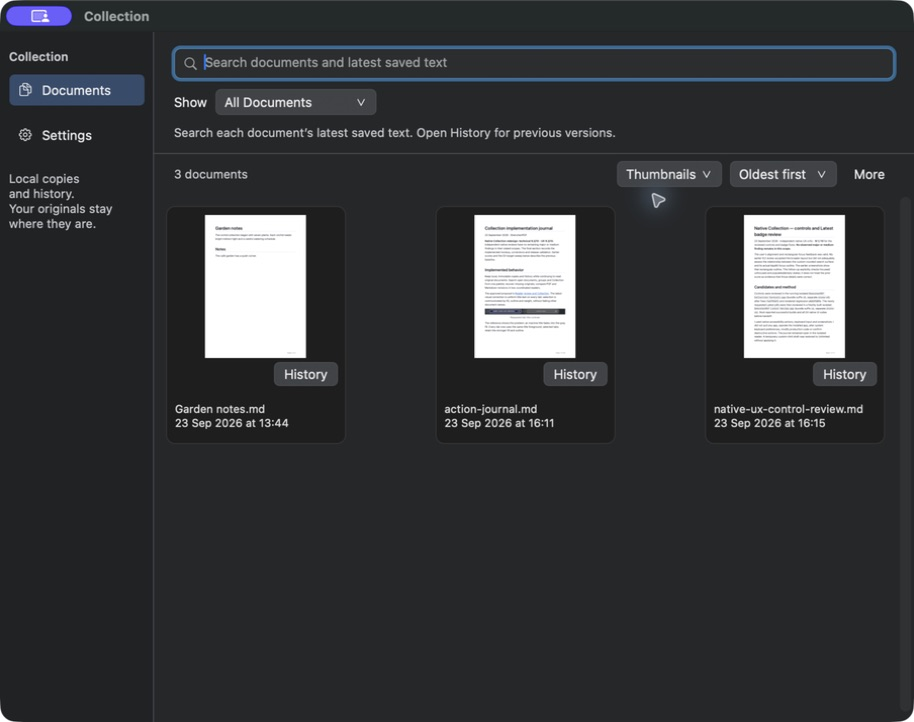

Kept showed Garden notes at **13:44**, its latest unkept copy, because the earlier **13:42** version is kept. Searching this isolated Kept result for **east**, which occurs only in its earlier saved text, returned zero matches. Searching **south** returned one Garden result with the latest version's page 2 context and thumbnail. Its accessible preview ID matched latest version `8C8EFDC0-F3B9-4A0F-A4B2-D2EFB8844925`.

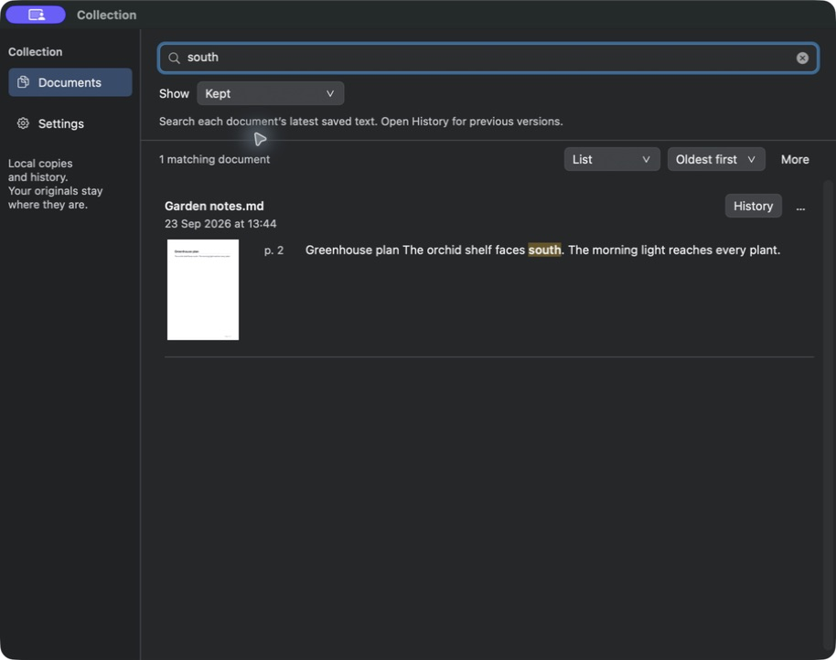

History still contained both saved versions. The newest preview read “seven plants” and “south”; selecting the older kept version read “three plants” and “east”. Latest remained a static capsule on the newest History row when the earlier row was selected. Escape returned to Documents with its prior presentation and selection.

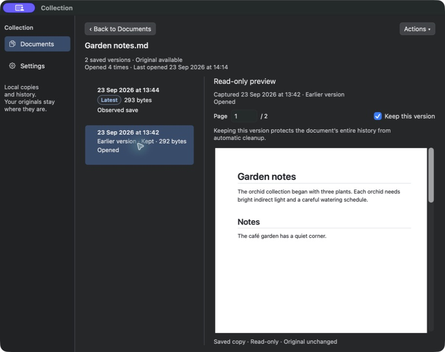

**Result: passed, with no new defect finding in this bounded retest.** No new broad score is assigned. The isolated app was left on All Documents, List, with an empty query. No regular app was operated or quit, and no saved version or Keep state was changed.
