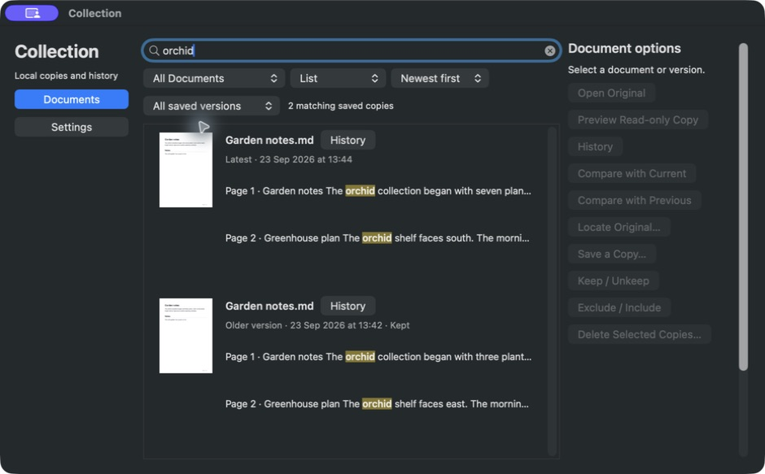
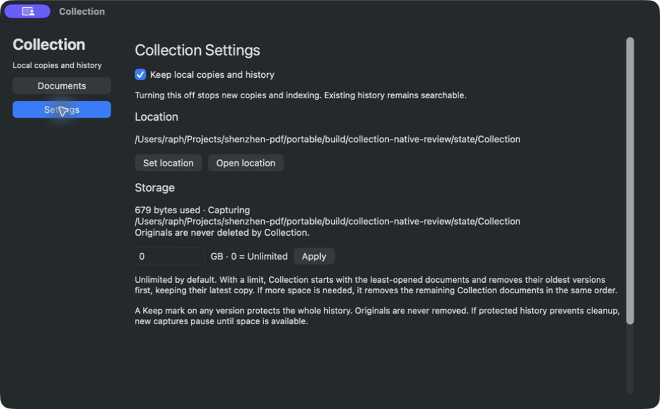
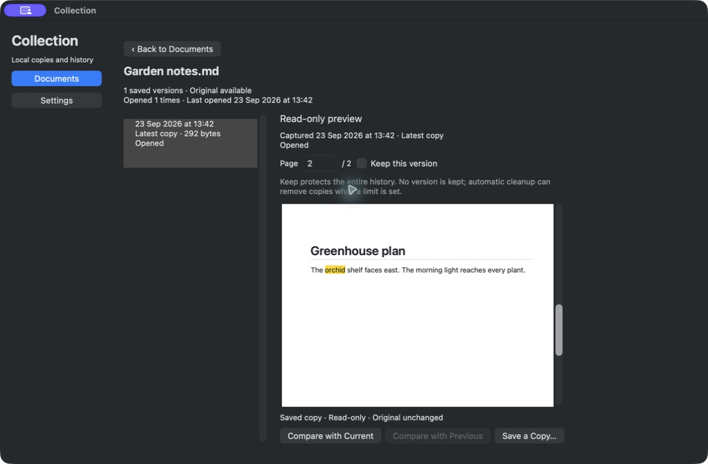
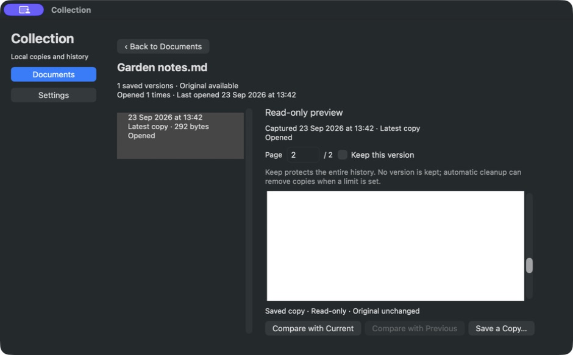

# Native Collection redesign — independent UX review, round 1

23 September 2026 · **7.3 / 10** · Not accepted. One major and two medium findings remain.

This score is for the actual AppKit candidate, not the approved mockup. The user explicitly clarified during review that the native implementation must look like the mockup and rejected the current buttons. Functionality is promising; visual fidelity is substantially below that requirement.

## Method

I inspected the proposal, native layout/search/settings/history sources and focused tests, then operated only `portable/build/collection-native-review/ShenzhenPDF Collection Review.app` using its separate generated fixtures/state. I did not quit or restart any app or interact with the user's regular app. The screenshot evidence below is from this isolated native app. I reviewed its default 1100-point width and dragged it down to the minimum permitted width of 940 points. The actual minimum outer height was constrained by layout; I do not claim independently measured 940×560 geometry. I created a second Garden notes revision by changing only the disposable generated fixture in place.

## Ranked findings

### NUX-1 · Major · Native hierarchy and styling do not match the approved design

The approved Documents screen has a quiet icon sidebar, full-width separated document rows, a trailing History action and contextual Preview action. The native screen dedicates 224 points to a permanent Document options column with ten identically weighted push buttons, even when all are disabled. The 22-point Collection sidebar title, vivid blue navigation pills, three stacked filter rows, and border-heavy table make it look like a utility control panel. The approved design uses a 12-point sidebar caption, muted slate selected navigation, restrained 13-point controls and generous full-width content.

At 940 points, the options tower compresses useful match text into a single truncated line despite each hit consuming 53 vertical points. There are no clear document separators. History buttons sit immediately after short filenames instead of sharing a trailing alignment. The latest and older revisions are identifiable, but the reading hierarchy remains weak. These are structural differences; merely rounding the existing buttons will not satisfy the user's direction.

**Required correction:** remove the options tower from Documents; expose secondary operations in an accessible More/context menu and retain directly visible History/Preview actions. Use the approved layout and exact visual tokens below. Keep the native AppKit controls, keyboard semantics and actual thumbnail/history rendering.

Settings also needs the approved section order and hierarchy: Collection, Storage, Location, with separators; an explicit Storage limit label; a separate When full row; the concise default-unlimited explanation; and a distinct application status/Apply row. The current path is duplicated under Storage, which adds noise. Avoid explaining the entire limited-storage policy at full length when unlimited storage is active.

### NUX-2 · Medium · Cmd+F does not focus Collection search

From the selected result table after returning from History, Cmd+F leaves the Collection search unchanged and typing does not enter a new query. Tab eventually returns to the search field, but the conventional search shortcut does not work in this search-centered native window.

**Required correction:** route Cmd+F in the Collection window to Documents and select its search text; preserve the rest of the browsing state. Provide a clear keyboard route to the selected result's History and return. Do not redirect the main reader's find command when Collection owns focus.

### NUX-3 · Medium · Shrinking History loses the selected match from view

Search `orchid`, click the page-two match, and observe the real Markdown preview showing **Greenhouse plan** and highlighted **orchid**. Drag the lower-right corner from approximately `(1097,719)` to `(937,557)`. The page field remains 2, but the preview shows only the white body below its content. Re-entering page 2 and Return restores the heading and highlight. This is a lost scroll anchor, not missing PDF rendering.

**Required correction:** preserve the explicit selected page/search destination across viewport resize, then restore its useful visible anchor. Verify both enlarging and shrinking at the minimum supported size, without relying on a stale PDFKit current-page notification.

## What worked in the actual candidate

- Documents and Settings are the only navigation destinations. Search is integrated into Documents.
- Searching `orchid` finds page-one and page-two contexts beside an actual saved-page thumbnail. Words are highlighted and capture date/latest identity are present.
- Clicking the page-two hit opens a real rendered Markdown preview on page two with a highlighted match.
- Keep persists, updates the version row and immediately replaces its adjacent explanation with the whole-history protection message.
- Back restores the query, selected result and page-two thumbnail. Settings navigation retains the query.
- After the fixture changed from three plants/east-facing to seven plants/south-facing, all-version search showed both exact saved revisions with separate dates and correct contexts; the older one retained Keep.
- Settings displayed zero/unlimited initially and the actual isolated Collection path, plus the exact **Set location** and **Open location** actions. Controls were visible at narrow width.
- History action buttons did not horizontally overflow at the exercised narrow width. The preliminary source-only concern about their intrinsic width was not reproduced.

## Concrete native visual specification

The authoritative live mockup source is `/Users/raph/.codex/visualizations/2026/09/22/01a0c848-cbcc-75d2-b4b9-ae08e106371d/collection-settings-search.html`. Committed visual references are `portable/docs/proposals/assets/collection-mockup/history/final-documents.png`, `final-settings.png` and `round2-history.png`.

| Element | Approved values and hierarchy |
|---|---|
| Dark palette | Window `#252729`; sidebar `#202224`; pane `#2b2d2f`; text `#ededee`; secondary `#c6c9cc`; line `#484b4e`; control `#404346`; selected `#334c6c`; link/accent `#9ac8ff`; query highlight `#685521`. |
| Light palette | Window `#fafafa`; sidebar `#edeeef`; pane `#ffffff`; text `#202124`; secondary `#50545a`; line `#d9dbde`; control white; selected `#d9e8fc`; accent `#075dbb`; highlight `#ffe59a`. |
| Typography | System 13-point regular body; 17-point semibold section title; 13-point semibold document heading; 12-point secondary metadata. |
| Controls | Flat fill, 1-point border, radius 5, minimum height 26, horizontal padding 9. Search height 31, radius 6. Preserve a visible keyboard focus ring. |
| Sidebar | Width 154; background distinct from main pane; trailing separator; 12-point secondary Collection caption; navigation height 32, 15-point outline icon, left-aligned title, transparent inactive background, muted selected fill. Note below navigation. |
| Toolbar | Insets 16 top/20 horizontal/13 bottom, lower divider. Full-width search; one labeled scope/filter line with 8-point gaps; explanatory scope sentence in 12-point secondary text. Retain layout/sort functionality compactly without another toolbar tower. |
| Results | Horizontal insets 20; count and sort above rows. Each document has 13 top/15 bottom padding and a bottom divider. Heading at left, History at trailing edge; date/status metadata below. Thumbnail 84×110 with 16-point gap to contexts. |
| Matches | Separate 39-point page-label column and flexible text column with 6-point gap. Two or more readable wrapped lines, about 1.45 line spacing, rather than one truncated line in a 53-point-high button. Borderless hit target with subdued selected background. |
| History | Full content width; version list 225 and 20-point gap; thin vertical separator with 20-point detail inset. Dates semibold; selected row slate with subtle border and radius. Page control left and Keep right; protection explanation immediately beneath. Reader expands to available width and height. |
| Settings | Content max width 710, insets 20 vertical/25 horizontal. Section bottom padding and margin 19 with divider. Collection→Storage→Location. Storage label left/input+GB right. Monospaced path, no repeated path under storage. |

The selected slate and restrained surface boundaries are essential to matching the mockup. Avoid introducing card shadows, decorative gradients, bright primary fills on every control, or a second visual theme.

## Coverage limits and next round

This round did not complete live PDF history, comparison, export, relocation, cleanup confirmation, process-relaunch persistence, light appearance, or systematic keyboard traversal. Their presence in code/tests is not a live UX pass. A native replacement must be reviewed again against the mockup, then cover the deferred flows. The requested score above 9 with no major/medium issues is not met by this candidate.
