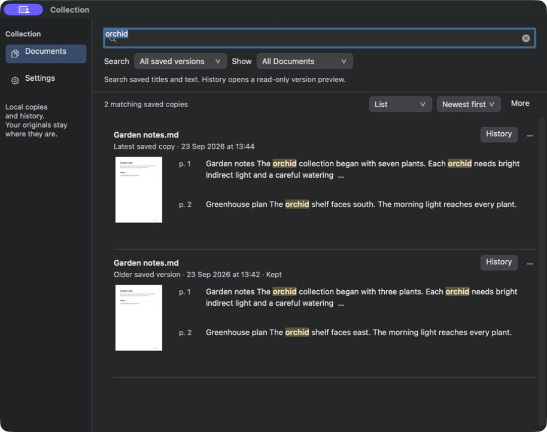
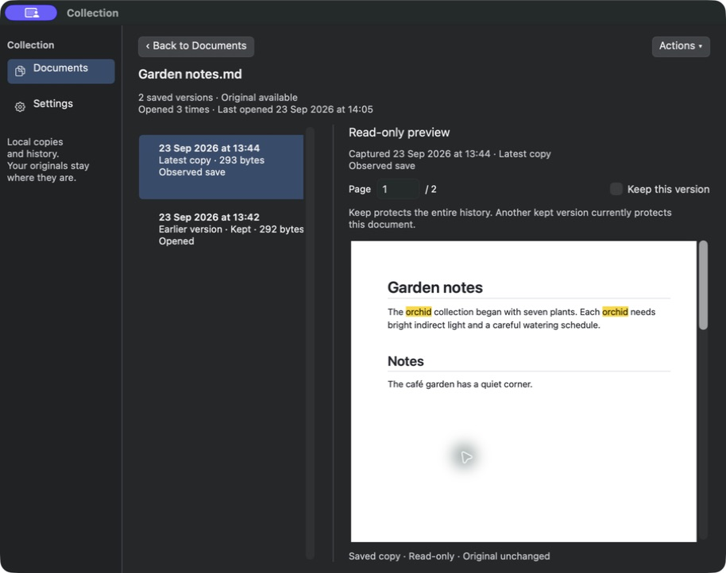
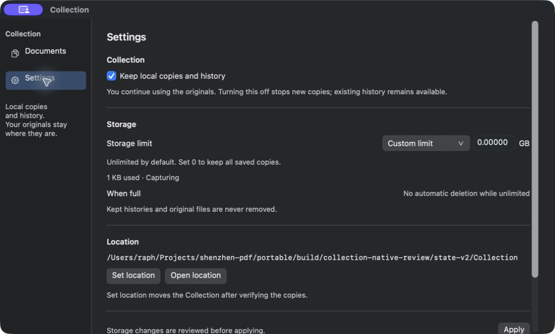
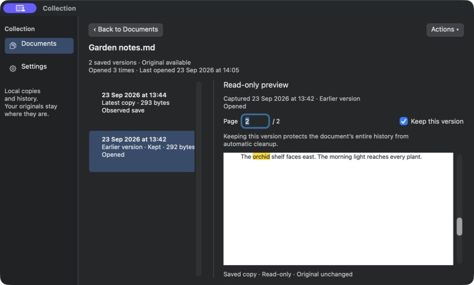

# Native Collection redesign — independent UX review, round 2

23 September 2026 · **8.1 / 10** · Not accepted yet. One major and three medium findings remain.

The actual native visual rewrite is substantially closer to the approved mockup: quiet icon navigation, restrained controls, full-width separated rows, real multiline contexts, trailing History actions and a structured Settings page replace the former options tower. The visual direction is now correct. A wrong-version History regression and three smaller issues prevent acceptance; this score is not borrowed from the mockup.

## Candidate and evidence

I operated only `portable/build/collection-native-review/ShenzhenPDF Collection Preview.app`, bundle identifier `engineering.casimir.shenzhenpdf.collectionnative20260923v2`, with its isolated `state-v2` and generated Garden notes fixture. Root supplied this build after the native build and 23 UI suites passed. I neither restarted nor quit any app and made no production changes.

The supplied Collection frame was narrower than the nominal 1100-point default; the actual screenshot was 914×722 pixels. Resizing produced a 931×560 screenshot. Those are screenshot dimensions, not a claim of independently measured window content bounds. Native tests cover the nominal geometry separately. The screenshots below are actual native output, not renders of HTML.

## Findings requiring another candidate

### NUX-4 · Major · An older saved page opens the latest revision instead

Reproduced twice: search `orchid`, choose All saved versions, then activate the older **13:42 · Kept** result's page-two context, which says the shelf faces **east**. History opens the **13:44 · Latest copy** at page **1**, showing **seven plants**. Escape returns to Documents with the older row selected and its page-two thumbnail, so the selected result context itself was retained.

Clicking the older version inside History then works: the dated metadata changes to 13:42, Keep is checked, and the actual preview contains **three plants** and **faces east**. Thus the failure is specifically initial entry into History, not inability to materialize the older revision.

Document `D3E60840-7A2C-47E0-85D6-C6D02F35F63E`; older version `B7F824CA-B078-4118-ABF6-253DFF651021`; latest version `8C8EFDC0-F3B9-4A0F-A4B2-D2EFB8844925`.

**Required retest:** initial entry from an older exact page hit must retain both version and page; test first entry, re-entry, restored selection and manual switching. The requested saved version must never silently become the latest.

### NUX-5 · Medium · Focused search text overlaps the magnifier's reserved area

The focused query is drawn at the field's upper-left edge, while the magnifier sits below it. In the initial screenshot, `orchid` appears above/over the icon rather than vertically centered after it. The same misalignment appears after Cmd+F and replacing the query with `cafe`. This is conspicuous in the primary control on a screen whose purpose is search.

**Required retest:** empty placeholder, focused editor, selected text, ordinary entered text and cancel icon must share a coherent 31-point field layout at both supported widths. Preserve the custom flat surface while using correct native editing/text/search-button rectangles.

### NUX-6 · Medium · Custom sidebar buttons lose their accessible names

The native accessibility tree reports Documents as `toggle button Description: copy, Value: on` and Settings as an unnamed `toggle button off`. Their visual labels are correct, but a screen-reader user is given an icon description or no destination name.

**Required retest:** expose explicit Documents and Settings labels and their selected state after the icon/style customization. This is not an objection to the muted styling.

### NUX-7 · Medium · Pending custom limit still promises unlimited behavior

Choose Custom limit. The input becomes 10 GB, but the adjacent When full row still says **No automatic deletion while unlimited**. Changing the input to a smaller value leaves that message unchanged. There is no pending/applied label clarifying the mismatch. A user deciding whether to apply the new cap sees the opposite of its intended cleanup behavior until the final review alert.

**Required retest:** changing the draft mode/value should immediately show the proposed cleanup policy and an explicit unapplied state, while preserving the actual applied setting until Apply. Alternatively label the applied policy and pending policy separately. Do not describe the new finite limit as unlimited.

## Closed findings and successful live checks

- **NUX-1 visual structure:** the permanent ten-button options tower is gone. Full-width rows, quiet 154-point sidebar, separators, flat controls, multiline text with a separate page column and trailing History now follow the approved hierarchy. Settings has Collection→Storage→Location, separators, a single monospaced path and an explicit Unlimited selector. The search-field defect above remains distinct from this broader correction.
- **NUX-2 keyboard search:** Cmd+F switches to Documents, selects the Collection query, and typing `cafe` replaces `orchid`. Accent-insensitive results highlight `café`. Escape from History restores Documents and the query.
- **NUX-3 resize anchor:** after manually selecting the older revision and page two, shrinking the window retains the highlighted `orchid` sentence in the viewport. The heading moves above the viewport, but the requested matching text remains visible; the earlier blank-body failure is closed.
- **History fidelity:** manual version selection updates the real Markdown content, capture date, latest/earlier state, reason and Keep explanation. Muted selected rows and the version/detail separator now follow the mockup.
- **History actions:** Actions exposes Compare with Current, Compare with Previous and Save a Copy. Compare with Previous is correctly disabled for the oldest version. Save a Copy opens a native sheet with `Garden notes copy.md` and explains it creates a separate editable copy. Cancel returns to History.
- **Document actions:** the result More menu exposes all ten existing operations, including open, preview, History, both compare operations, locate, export, Keep, exclude and delete. They remain discoverable without the visual tower.
- **Protected cap refusal:** applying a 100-byte cap while a version is kept shows an actionable refusal to increase the cap or review Keep selections.
- **Cleanup review/cancel:** I temporarily unkept the disposable older revision through More. Applying the same cap showed a review of two saved versions, one document history and 1 KB recovered, with explicit irreversible wording. Cancel retained both versions. I restored Keep through More and returned the selector to Unlimited. No deletion was confirmed; the applied cap remained unlimited.

## Next verification

The next candidate should target the four findings above, then capture final Documents, History and Settings views. Live PDF History, light appearance, actual comparison rendering, relocation, export completion and a fresh process-relaunch persistence check remain outside this round's coverage. Export and cleanup cancellation were exercised; completed export and deletion were not. The current native screen is visually much closer to the requested design, but the requested score above 9 with no major or medium issue is not met yet.
