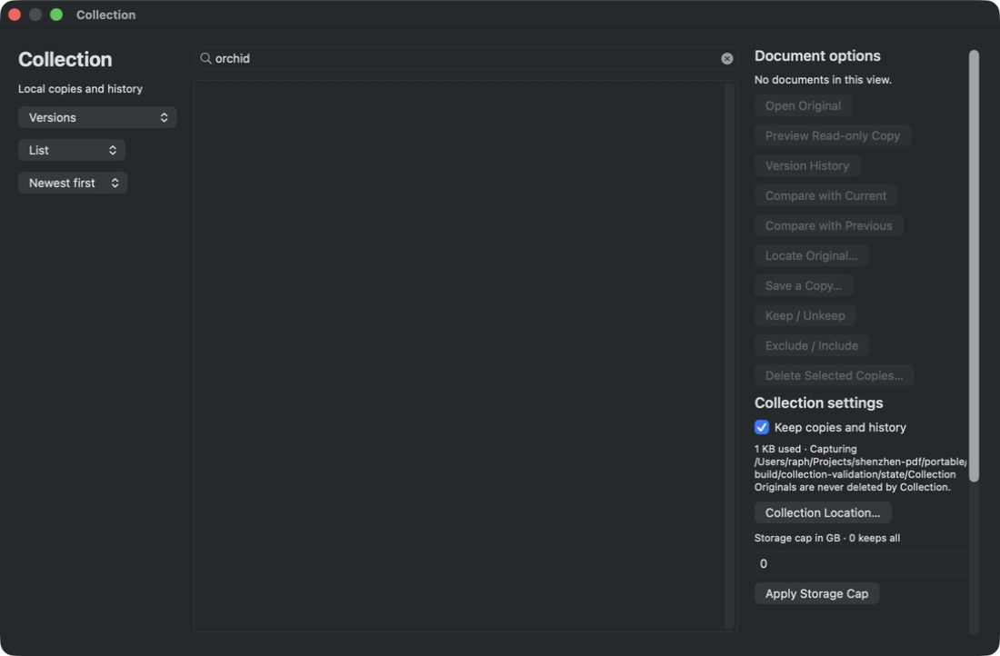
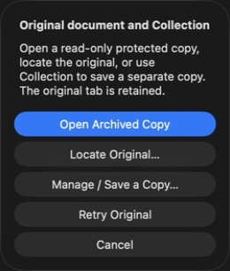
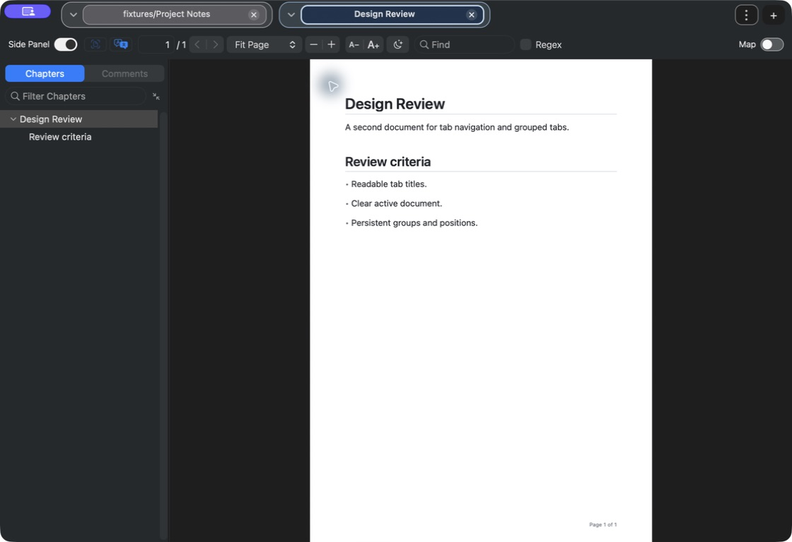
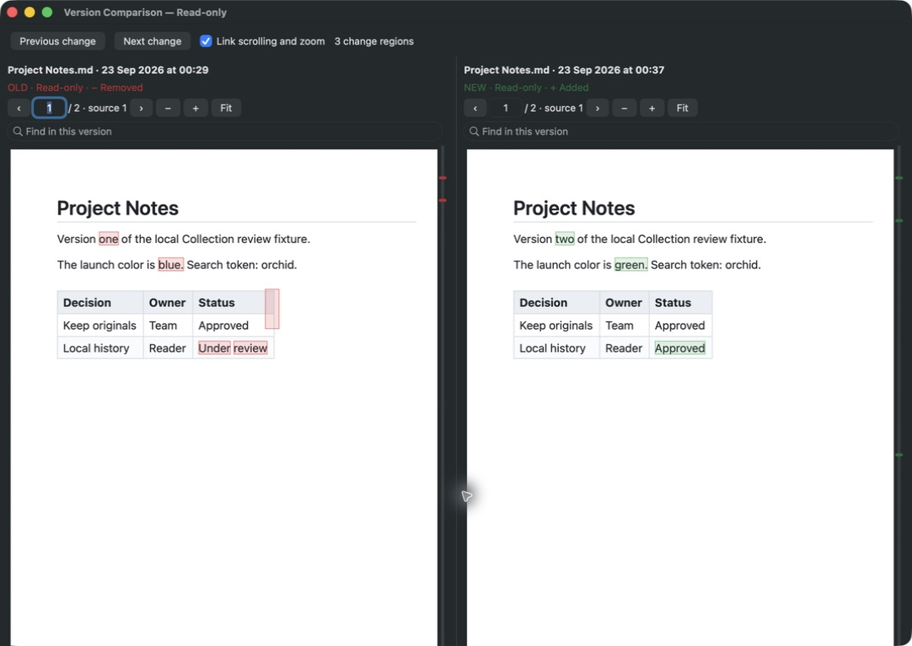

# Independent UX review · round 1

23 September 2026 · Astra critic · **7.0 / 10**

The ordinary Collection flow works, and the selected-tab contrast now matches the requested direction. The manager, sidebar history, actual two-reader comparison, scoped search and manual recovery are usable. However, archived previews lose their identity, and several discovery paths conceal existing content. This is below the 8/10 acceptable threshold and below the requested 9/10 target. **One major and four medium findings remain.** This score is independent of the technical critic's score.

## Method and scope

I read the repository instructions, approved proposal, implementation journal and requested tab-contrast reference. I then used the actual isolated app through `cua_repl` for approximately twelve minutes, after root handed over exclusive UI ownership. Candidate: `portable/build/collection-validation/ShenzhenPDF Collection.app`, with its baked isolated state directory. I used semantic accessibility actions and keyboard input, including native tab and group menus. All screenshots below came from that app through `cua_repl`.

Only generated fixture documents were opened or manipulated. Project Notes already had two protected revisions: blue/under-review and green/approved, with an added second-page paragraph. For recovery I renamed the fixture to `Project Notes Relocated.md`, then explicitly linked that exact file through the app. The relinked name is deliberately retained. Collection was restored to enabled at the end. I neither stopped nor relaunched an app, and did not touch the installed application.

## Ranked findings

### 1. UX-R1-01 · Major · Archived preview lacks persistent identity

**Reproduction:** Project Notes tab menu → Version History → select the oldest row. A separate tab opens with old content, but its visible and accessibility title becomes `DEE96EDA-F524-46F3-B97F-35961B30AD7A/Project Notes`. Its small orange dot provides no meaningful explanation. There is no persistent **Archived copy · read-only · date** badge. After the source was relinked under a different name, this archive's title became simply `Project Notes`, still without an archive designation.

The sidebar shows the selected capture date, but this does not identify the reader itself and disappears when the sidebar is hidden. Returning to the archived tab also rebuilt the history list without its previous selected row. A user can mistake a recovered revision for an ordinary source document. The intended Collection title appears to be overwritten by ordinary duplicate-filename disambiguation.

**Recommendation:** give archive identity its own persistent, accessible reader badge; derive its name and capture date from archive metadata, and keep UUID storage paths out of tab/window titles. Verify the badge across tab switching, sidebar hiding, duplicate names, relocation and relaunch.

### 2. UX-R1-04 · Medium · Show all loses existing text-search matches

**Reproduction:** Cmd+K → `col:orchid` produces a Project Notes Relocated text result and snippet. Select **Show all in Collection…**. The manager opens with `orchid` in its search field and **No documents in this view**. Its previous Versions view is retained. The matching document exists and opens correctly from the palette result itself.

The manager's query matches title/path/reason rather than the indexed text that produced the result. Persisted filters can further narrow a command promising all matches.

**Recommendation:** carry the actual Collection query semantics into the manager, choose an appropriate all-matches view, and visibly explain any active filters. A Show all route must contain at least the results already shown in the palette.

### 3. UX-R1-05 · Medium · Thumbnail versions have no visible captions or accessible items

**Reproduction:** clear the manager query, choose Versions and then Thumbnails. Three actual page previews render, but the large caption areas below them are blank: no filename or capture date appears. The accessibility tree exposes an empty `collection`, with no named/selectable thumbnail children.

Two revisions of the same document are particularly difficult to distinguish. List view retains the expected title and capture date, so this is a thumbnail presentation defect rather than absent metadata.

**Recommendation:** render visible title/date captions and expose each item with a selectable accessible name and selected state. Verify the real grid at normal and minimum window sizes, including revisions with similar first pages.

### 4. UX-R1-03 · Medium · Recovery alert omits the missing-source context and archive date

**Reproduction:** rename Project Notes.md within the fixtures directory; switch to Design Review, then back to the original tab. Recovery opens automatically, titled **Original document and Collection**, with generic choices. It never says **Original unavailable**, names neither the document nor missing path, and omits the saved copy's capture date. **Open Archived Copy** is the default action without identifying which revision it will open.

The recovery actions themselves are present. Locate Original subsequently shows the reference date/hash, and manually choosing the exact relocated file successfully retains both revisions. The problem is the first decision's missing context.

**Recommendation:** state that the original is unavailable, identify its filename/path, show the latest protected date, and explain that the default opens a distinct read-only archived tab. Keep the language appropriate for temporary drive disconnection as well as moves.

### 5. UX-R1-02 · Medium · Group layout overflows a tab while substantial strip space is unused

**Reproduction:** with Project Notes, its archive and Design Review open, create a new group for Design Review and change its color to Blue. Both General and Blue report expanded. General contains the two Project Notes tabs, but its archive is hidden in overflow. The 1120-pixel reader window still has approximately 340 pixels of unused strip between the Blue group and overflow controls.

Three documents should remain directly discoverable at this width. The group allocation appears to constrain one group before distributing available space.

**Recommendation:** distribute remaining strip width to groups that still have hidden tabs before using overflow. Add geometry coverage for uneven groups and a long archive title.

### 6. UX-R1-06 · Minor · Collection-off behavior is not explained beside its switch

Turning off **Keep copies and history** changes the status to Capture off, and existing versions and their preview/export actions remain available, as expected. The nearby wording only says that originals are never deleted. It does not explain that off stops future capture/indexing while preserving saved history, search and export.

**Recommendation:** add the promised short explanation beside the switch. Avoid making a user infer whether switching off removes their protection history.

### 7. UX-R1-07 · Minor · Collection text result omits page information

The `col:orchid` result has a useful single-line snippet and selecting it opens the live original, populates Find with `orchid`, and moves to match 1 of 2. Unlike the requested text-result format, the palette row does not show the page. The first snippet also begins in the middle of a word (`l Collection review fixture…`).

**Recommendation:** show the available page information and trim snippets at a word boundary. Preserve the successful live-original routing and highlighted search behavior.

## What worked in this candidate

| Flow exercised live | Observed result |
|---|---|
| Manager and right options | Dedicated window; left view/layout/sort controls, central list, persistent independently scrolling options; capture dates, path, status and actionable controls visible. No construction exception. |
| History | Tab menu opens the existing left sidebar; dates, reasons and sizes visible; selecting an older version opens distinct old content. |
| Comparison | Compare with Previous opens one window containing two real readers. Filenames/dates, old/new and read-only labels remain visible. Removed words are red, added words green, and red/green change rails appear. Next change moves both readers to page pair 2 for the added paragraph. Linked mode defaults on. |
| Tab appearance | Uniform title foreground is visibly improved. Selection is clear through its fill, outline and weight; group boundaries are legible. |
| Tab/group accessibility | Tabs expose names, selected state, group context and shortcut help. Show Tab Menu / Show Group Menu expose native commands. Creating a group and changing its color to Blue worked. |
| Cmd+Backspace | Two presses toggle between Design Review and the archived Project Notes tab. In Find, the shortcut deletes query text and leaves the active tab unchanged. |
| Scoped Collection search | `col:orchid` contains Collection text only, including the collected document already open; selecting the match opens the live original with Find populated and the match selected. |
| Missing-original recovery | Missing tab triggers recovery. Locate dialog names the protected date/hash. Explicit manual selection of the exact relocated fixture relinks the live source and retains both history revisions. |
| Capture off | Saved versions and preview/export actions remain available; enabling again succeeds. |

## Coverage limits and next round

This round did not independently replay first-use consent: the supplied journal contains root's live screenshot and no-pre-consent-copy observation. I did not freshly prove all five search sections simultaneously, five-result caps, background arrival ordering, group persistence across a process restart, closed-tab reopening, automatic recovery search ordering, exports, destructive deletion, failure retries, multiple windows, or PDF/scanned-PDF comparison. The comparison exercised here was Markdown with actual old/new text, table layout and page-two additions. Zoom unlinking, independent comparison search and every marker click were not systematically tested.

These limits are not passes. The next round should first retest the five significant findings in a rebuilt candidate, then cover the missing high-value flows with bounded generated fixtures. In particular, archive identity must remain explicit after restart, and both PDF and Markdown comparison need live coverage before assigning a release-ready score.
