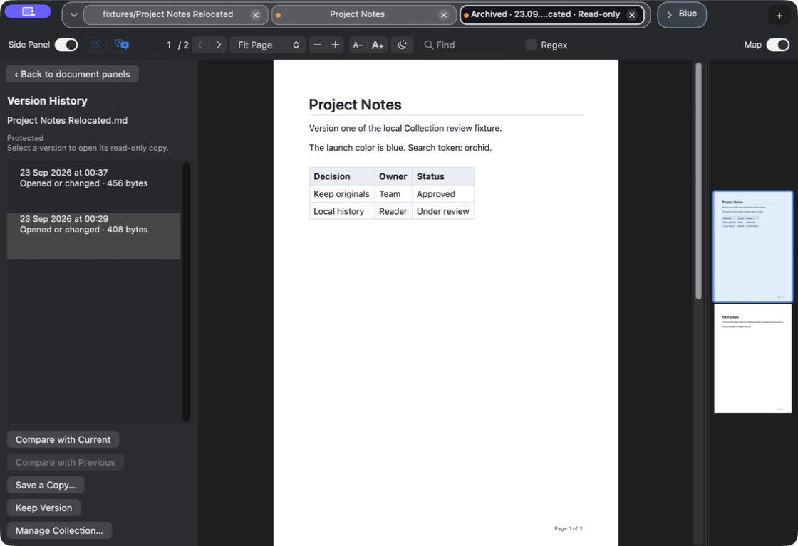
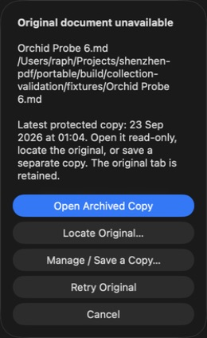
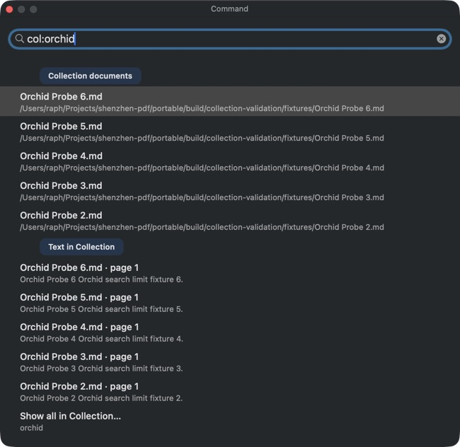

# Independent UX review · round 2

23 September 2026 · Astra critic · **7.2 / 10**

Several significant round-one failures are repaired: Show all retains text matches, the recovery prompt gives the missing source and capture date, grouped tabs use available space, and Collection-off behavior is explained. Broader live tests also confirmed exact search section order, result caps, closed-tab return and restart recovery. The candidate is still below the 8/10 acceptable threshold: **one major and two medium findings remain**, including a newly discovered PDF comparison crash under accessibility inspection. The 9/10 target is not met.

This grade describes the rebuilt candidate actually used, not fixes made in source during the review. I made no implementation changes.

## Actual-app method

Used the isolated `portable/build/collection-validation/ShenzhenPDF Collection.app` through `cua_repl`, with exclusive UI ownership. I verified its executable path and initial PID 91758. A PDF comparison action caused that process to crash; the next app observation opened a restored process, PID 92336. Later I deliberately stopped only that verified isolated executable and relaunched the exact bundle to test persistence. No installed app was stopped or changed.

Generated data comprised the two Project Notes revisions from round one, Design Review, the new Comparison Atlas PDF pair, and seven small Orchid Probe Markdown files created under the designated fixtures directory. Root supplied the PDF bytes and atomically replaced the baseline only after I confirmed its first protected revision. The app captured the replacement as a second version. Probe 6 was temporarily moved and restored to exercise recovery. All seven Probe tabs were closed at the end; their history remains available. The Blue group was renamed Orchid Reviews.

## Ranked remaining findings

### 1. UX-R2-01 · Major · PDF comparison crashes during accessibility inspection

**Steps:** open generated Comparison Atlas.pdf, verify its first revision is Protected, atomically replace it with the generated three-page revision, then select it in Collection. The right panel shows Protected and 2 versions. Click **Compare with Previous**, then inspect the resulting window through the normal accessibility API.

The tool returned `noWindowsAvailable`. The manager/comparison disappeared, the owned process changed from 91758 to 92336, and the next observation showed the restored ordinary reader. This is a real process crash, not merely a failed automation click.

**Evidence:** macOS report `/Users/raph/Library/Logs/DiagnosticReports/ShenzhenPDF-2026-09-23-010235.ips` identifies PID 91758 and the isolated bundle ID `engineering.casimir.shenzhenpdf.collection20260923`. Its main-thread stack contains `_os_unfair_lock_recursive_abort`, `CGPDFPageCopyRootTaggedNode`, PDFKit accessibility-root construction and `accessibilityChildren`; the abort says **Trying to recursively lock an os_unfair_lock**.

**Scope:** the accessibility traversal is part of the proven reproduction. I have not established that mouse-only use without an accessibility client crashes. A comparison window must nevertheless remain usable with accessibility enabled. Round-one Markdown comparison succeeded; this newly exercised PDF path did not survive long enough to assess its changes.

**Recommendation:** remove the unsafe PDFKit state/accessibility interaction while preserving useful document accessibility, then repeat this exact live path. Inspect text and image replacements, the inserted page's empty counterpart, unchanged appendix alignment, navigation and rails after the crash is fixed.

### 2. UX-R1-05 · Medium · Thumbnail captions and selection remain incomplete

The rebuilt thumbnail view still renders page images above blank caption areas. It now exposes buttons, an improvement over the empty round-one accessibility collection, but each button's accessible name is only its full source path. Two versions of the same document therefore still have identical names and no capture date.

Clicking the Comparison Atlas thumbnail through its accessible button changes that button to selected, but the right panel continues to say **Select a document or version**, with all document actions disabled. This persists after a subsequent observation and Tab key. Selecting the corresponding list row correctly updates the options and enables the controls.

**Recommendation:** verify captions after real layout/rendering, give each version a dated accessible name, and route accessible selection through the same selection/details update as list and pointer interaction. A controller-level initial-frame assertion is insufficient to catch this rendered behavior.

### 3. UX-R1-01 · Medium, reduced from major · Archive identity is improved but inconsistent

Newly opened archived tabs now have an explicit accessible label such as **Archived · 23.09.2026, 00:29 · Project Notes Relocated · Read-only**, and the visible title retains Archived and Read-only even when shortened. This resolves the most serious ordinary-tab ambiguity.

Three related residual cases remain:

- The new preview's window title still contains a UUID path, despite its repaired tab label.
- A restored archive materialized before the source rename first appeared as plain Project Notes. Selecting it opened the manager; it later acquired the fabricated date **01.01.1970, 08:00**. Newly materializing the same historical revision under the current filename worked. The lookup appears sensitive to the materialized basename after a source rename.
- Normal Cmd+K text results still show the old archive as plain Project Notes and the newly materialized one as a UUID/path title, without Archived/read-only identity. The same document is explicitly labeled in its tab but ambiguous in search.

**Recommendation:** use the same archive metadata label for tabs, window titles and palette results. Resolve renamed materializations by their verified document/version identity. If metadata is unavailable, say so instead of turning a missing timestamp into the Unix epoch.

### 4. UX-R1-07 · Minor, partly resolved · Snippet starts inside a word

Collection text results now display the page. Some snippets still begin mid-word, such as `l Collection review fixture` or `n review fixture`. Trim excerpt starts to a word boundary. This does not prevent opening the correct search match.

## Findings closed by live retest

| Finding | Actual result |
|---|---|
| UX-R1-04 · Show all loses text matches | `col:orchid` returned Comparison Atlas and Project Notes text matches. Show all opened All Documents with both matching documents, despite the previously selected Versions view. |
| UX-R1-03 · Recovery lacks context | Moving Probe 6 produced **Original document unavailable**, the filename/full path and latest protected capture date. Restoring its file and pressing Retry Original returned to page 2. |
| UX-R1-02 · Avoidable group overflow | With four tabs in General and Design Review in the blue Orchid Reviews group, both expanded, all five tabs fit directly in the 1120-pixel window. No overflow control was needed. |
| UX-R1-06 · Off explanation missing | The persistent options panel now explains that off stops new copies/indexing while existing history remains searchable, exportable and deletable. |
| UX-R1-07 · Page label missing | Scoped Collection text matches now show a page number; only snippet-boundary polish remains. |

## Additional live acceptance coverage

**Search limits:** seven collected, open Orchid Probe files were eligible for `col:orchid`. The palette displayed exactly five Collection title matches, then exactly five Collection text matches, then Show all. There were no open-document or group sections in explicit scope.

**Normal search order and deduplication:** I renamed the blue group Orchid Reviews and closed Probe 1, 2 and 3. Searching `orchid` displayed the five sections in the specified order: Open documents (four matching Probe names), Tab groups (Orchid Reviews), Text in open documents (five results), Collection documents (only the three closed Probe documents), Text in Collection (five results). The open Probe files were excluded from the normal Collection-name section. These were actual captured files, not injected palette rows.

**Closed-tab return:** navigate Probe 6 to page 2, activate Probe 5, close the inactive Probe 6 through its accessible Close Tab action, then press Cmd+Backspace. Probe 6 reopens selected at page 2 in General. Round one's two-press toggle and editable-field behavior had already passed.

**Restart persistence:** after verifying PID 92336's exact isolated executable, I stopped only that PID and relaunched the exact validation bundle. Probe 6 restored at page 2; General remained expanded, and Blue remained collapsed with its group identity. The archive's explicit new label persisted as well, alongside the known erroneous legacy epoch label. This checks real persisted recovery rather than only in-memory state.

**External PDF capture:** Comparison Atlas baseline was protected before replacement. Its new selectable text, changed checkerboard image and inserted page appeared in the live original reader. Collection then showed two versions and reason Observed save. The subsequent comparison failure is recorded above rather than treated as a comparison pass.

## Remaining coverage limits

Automatic recovery ordering is still untested live. The available locator exposes Search This Computer and manual choice, with no folder-limited search option, so I did not start a whole-computer search to locate synthetic fixture copies. PDF comparison remains blocked by the crash; no PDF highlight/alignment claim follows from its successful capture. Export, deletion, storage-failure retry and multiple-window workflows also remain outside this round's live evidence.

Round three should retest the crash with accessibility traversal, thumbnail captions/selection after actual layout, and all archive naming/rename cases. Fixes reported as completed in source during this review need the next built candidate and independent live verification before their findings can close.
