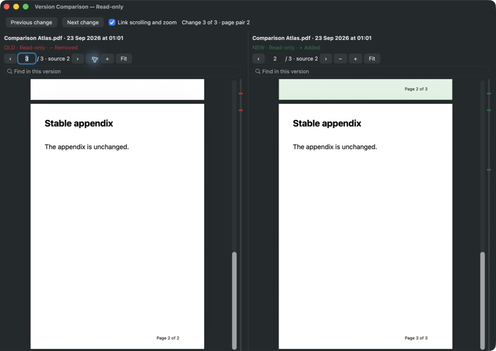
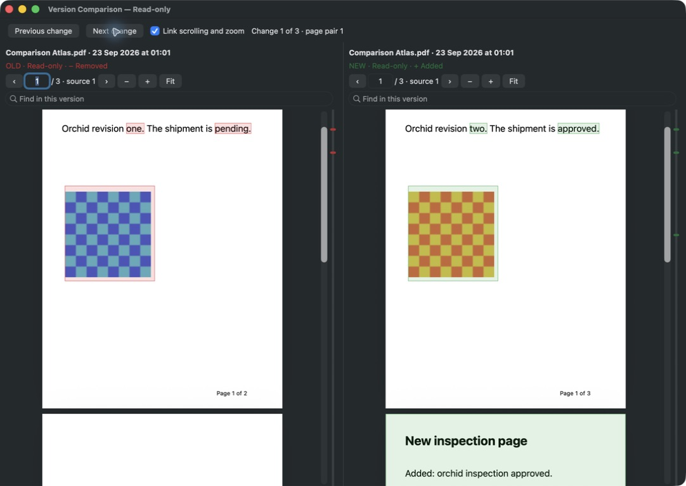
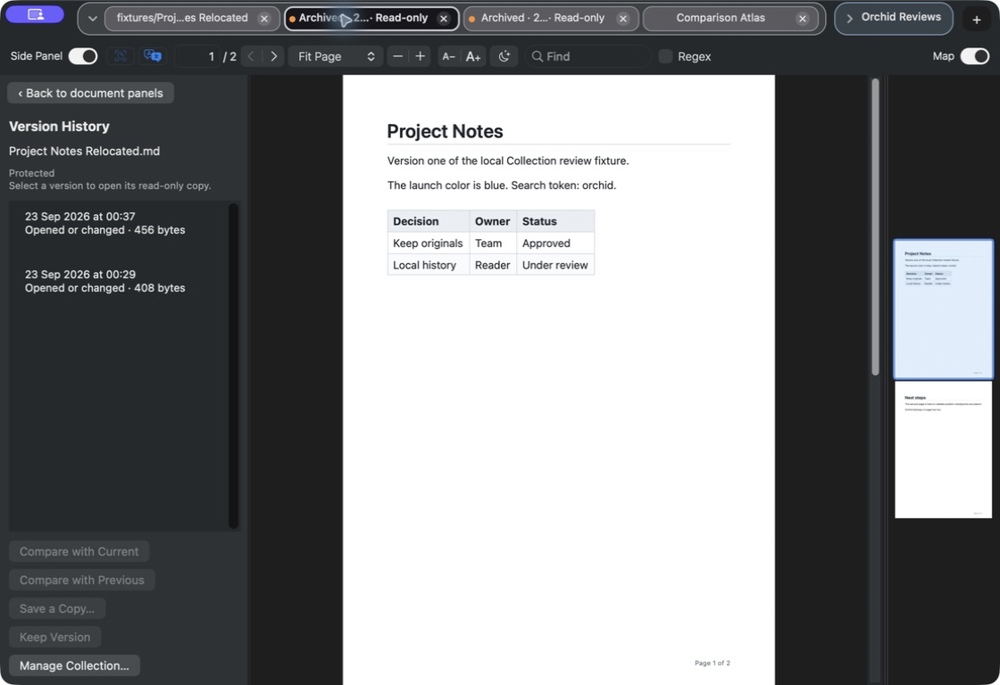
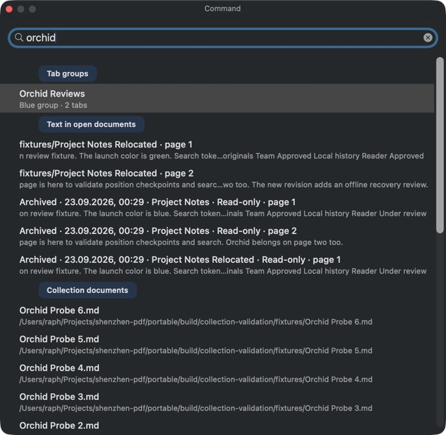
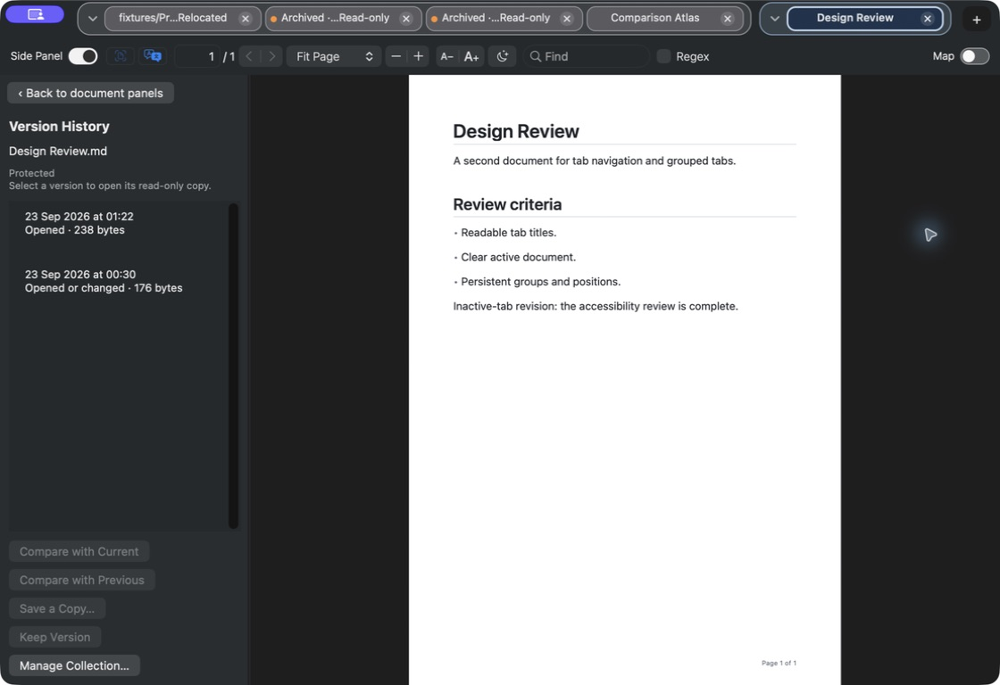
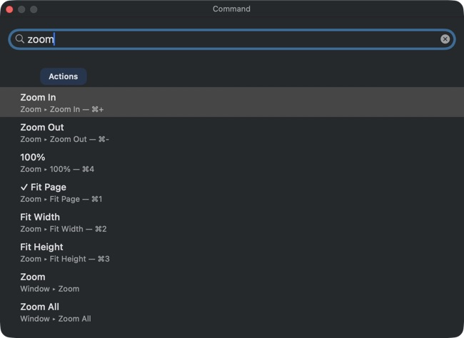

# Independent UX review · round 3

23 September 2026 · Astra critic · **Final 9.0 / 10**

The final candidate meets the requested threshold in the exercised flows. Actual PDF comparison survives accessibility inspection, linked and independent page navigation now show correct counters, thumbnail captions and selection work, archived previews retain honest identities in tabs/window/search, and the inactive-source edit kept its history. **No major or medium finding remains in the exercised flows.** The score reflects a usable, coherent experience with minor polish opportunities and the coverage limits below.

## Candidate history and preserved failure evidence

This round began with a freshly rebuilt isolated app. Activating the legacy renamed archive succeeded, with its correct date and explicit Archived/read-only window title. Opening Manage Collection then crashed twice; a third attempt through Cmd+K → `col:Atlas` → Show all also crashed. The first two app observations silently relaunched the app, making the crashes initially look like inert buttons. The third reported App quit.

The three macOS reports are `ShenzhenPDF-2026-09-23-011558.ips` (PID 98653), `011606.ips` (PID 99059) and `011619.ips` (PID 3046), under `~/Library/Logs/DiagnosticReports`. They show an exception in NSArray construction during a collection item's view loading/layout. Root traced this to weak caption-outlet ownership under the optimized production build, repaired it, ran optimized UI tests and supplied a replacement bundle while the isolated app remained stopped.

**UX-R3-01 · Major, closed by replacement retest:** the replacement successfully opened the manager both from History and from Show all. Its list and thumbnails laid out normally, and repeated accessibility observations remained stable. The earlier failures remain evidence of the initial candidate and are not counted as successful tests.

I used only the exact isolated validation bundle through `cua_repl`, generated fixtures and its isolated state. I made no implementation changes. Screenshots below are from the actual app, not mocks.

## Final repair and independent live retest

### UX-R3-02 · Medium, closed by final candidate · Linked comparison's other page counter

**Reproduction:** open Comparison Atlas → Compare with Previous. Click Next change three times, reaching the inserted page at comparison slot 2. The left pane correctly says No counterpart and the right says source 2. Click the left pane's next-page arrow once.

Both readers visibly move to the unchanged appendix, correctly aligning old source page 2 with new source page 3. The left counter says comparison page 3 / source 2, but the right counter remains comparison page 2 / source 2. Its rendered page footer says Page 3 of 3. The mismatch persists through a screenshot and a fresh full accessibility observation. A thin tail of the preceding page is still visible above the appendix, which may explain PDFKit's reported current-page ambiguity; it does not make the stale source label useful to the reader.

**Recommendation:** update both pane counters from the explicit aligned navigation target, then keep them consistent with the dominant visible page during free scrolling. Retest inserted/deleted counterpart slots, navigation from either pane, linked mode and unlinked mode. Do not infer the other pane's label from a stale current-page notification.

**Final live retest:** after the counter repair was rebuilt into the isolated app, I reopened Comparison Atlas from the manager and repeated the exact reproduction. At inserted slot 2, the old pane said No counterpart and the new pane source 2. Clicking the old pane's next arrow moved both counters to comparison slot 3, correctly identifying old source 2 and new source 3. Clicking the new pane's previous arrow returned both counters to slot 2 with the correct counterpart labels. With linking disabled, clicking the new pane's next arrow advanced only that pane to slot 3 / source 3; the old pane stayed at slot 2 / No counterpart. Re-enabling linking and navigating to the first change synchronized both panes to slot 1 / source 1. Full native accessibility observations and screenshots remained stable throughout.

## Significant findings closed in the replacement

### UX-R2-01 · PDF accessibility crash: closed

From the actual manager, select Comparison Atlas and click Compare with Previous. The two-reader window opened and survived repeated full accessibility traversal, screenshots, three Next change actions, page navigation, unlinking, independent search, a rail click and closing. No new crash report appeared after the replacement was installed.

PDF text replacements are red on the old version and green on the new version. The changed checkerboard image is also outlined/tinted on both sides. The inserted page is fully highlighted green opposite an explicit **No old page / Page added in the new version** counterpart. The unchanged appendix remains aligned despite the inserted page and has no broad content-change highlight. The counter defect found earlier in this round is closed by the final live retest above.

Clicking the marker rail navigated both readers to Change 2 of 3. With linking off, navigating the old reader left the new reader at its own scroll position. Searching `approved` in the new pane produced a 1 / 2 result count and selected the matching text. Filenames, capture dates, old/new labels, read-only labels and red/green legends remained present.

### UX-R1-05 · Thumbnail captions and accessible selection: closed

Versions → Thumbnails shows both Project Notes revisions with visible filename/date captions. Accessible button names contain the same dates. Clicking the oldest tile through its accessibility button highlights that tile, populates the right panel with the 00:29 capture and enables applicable actions; Compare with Previous remains disabled for the oldest revision. This verifies actual rendered geometry and action routing.

### UX-R1-01 · Archive identity and renamed preview lookup: closed for exercised paths

The legacy archive created before the original's rename now opens its old content without redirecting to the manager. Its tab and window title say **Archived · 23.09.2026, 00:29 · Project Notes · Read-only**. The newly materialized copy has the equivalent explicit identity with the relocated name. Normal command-palette text results now retain these archive labels and dates instead of showing UUID paths or ordinary-source names.

The old persisted epoch label from round two appeared on first launch before that tab was activated; activation repaired it using the correct metadata, and the replacement launch retained the corrected value. I did not create a new epoch-dated preview in this candidate.

## Additional live verification

**Inactive source edit:** with an archived Project Notes tab active, I appended one line to the generated Design Review.md fixture. Returning to Design Review displayed the new paragraph. Its left History sidebar showed the new 238-byte revision and the prior 176-byte revision, with Protected status. A read-only manifest check confirmed one Design Review document entry containing two versions, rather than a split history.

**Existing commands:** Cmd+K → `zoom` displayed an Actions section with Zoom In/Out, 100%, Fit Page/Width/Height and window zoom commands. Normal `orchid` search placed Actions after the document/group/Collection sections. Explicit `col:Atlas` continued to show only Collection title/text and Show all, and that route opened the matching manager entry successfully.

## Minor recommendations and coverage limits

1. **UX-R1-07 · Minor, remaining:** start text snippets at word boundaries; `n review fixture` and `on review fixture` still appear. This does not prevent correct result activation. The earlier missing-page-label portion of this finding was closed in round two.
2. **UX-R3-03 · Minor, remaining:** distinguish an external edit observed on tab activation from a routine Opened capture reason. The tested contents, dates and history continuity were correct; the reason could explain the event more precisely.

Earlier rounds provide the live evidence for exact five-section ordering, five-result limits, normal open-document deduplication, scoped search, two-press/closed-tab return, recovery context, manual exact-file recovery, group layout, uniform tab foreground and restart/page persistence. This round did not rerun all those checks after unrelated fixes. Automatic whole-computer recovery ordering, destructive deletion, failure retries, multi-window behavior and independent export remain outside my live coverage. PDF comparison was text/image-bearing; scanned-PDF behavior was not separately exercised live.

The final score is **9.0 / 10**. The previously blocking failures were independently reproduced and then closed through actual-app retests, including the final rebuilt counter repair. The remaining recommendations are minor. This is an assessment of the exercised experience, not a claim of exhaustive coverage; the untested cases above prevent a stronger confidence claim. Earlier failing screenshots and crash evidence remain in this report to preserve the review history.
