# Reader refinements — 5 October 2026

## Requested behavior

1. Rotate images and save their orientation.
2. Display a complete, selectable, multiline path in Properties.
3. Drag the window from empty areas at the top of both side panels.
4. Remove the bottom bar; show a source-status pill only for non-original documents, at the bottom of the left panel.
5. Make the first Fit Page after Fit Width settle image geometry correctly.

## Implementation and reasons

Image rotation is an explicit background edit, using the existing ⌘R / ⇧⌘R commands. JPEG changes orientation metadata without reencoding its compressed pixels. Other ImageIO-writable formats permute decoded samples without resampling or converting the color space. Existing EXIF orientation is applied before the new turn. Temporary-file encoding, an unchanged-source check, and atomic replacement keep a failed edit from damaging the source. Collection protects the previous version before writing; completed edits refresh the reader and Collection. Read-only copies require saving a copy. Formats without a writable encoder require a PNG copy. Rapid rotation commands queue in order; the queue is created only on the first image edit.

Properties keeps the complete path rather than a truncated presentation. Character wrapping handles long filename components; the noneditable field retains native partial/full selection and copy.

Dedicated header drag surfaces route empty space through the existing macOS window-drag/double-click policy. Sidebar buttons keep their full native hit targets. The old bottom footer is removed. Collection copies, read-only working copies and unsaved images get a compact source pill in the sidebar. History and Groups reserve the same bottom space, so their content does not sit behind the pill. Original files have no source pill. Existing OCR/translation progress panels remain available.

Fit Page establishes its required scrollers before calculating zoom. A scroller left over from another fit mode must not consume space used in the calculation. The pane-divider targets end above macOS's bottom-edge window resize zone, preventing the footer removal from creating competing resize targets.

## Native layout evidence

These are synthetic document fixtures rendered through the production reader into offscreen PNGs. The user's running app was not launched, quit or captured.

Original document: full-height reader, no footer or redundant source label.

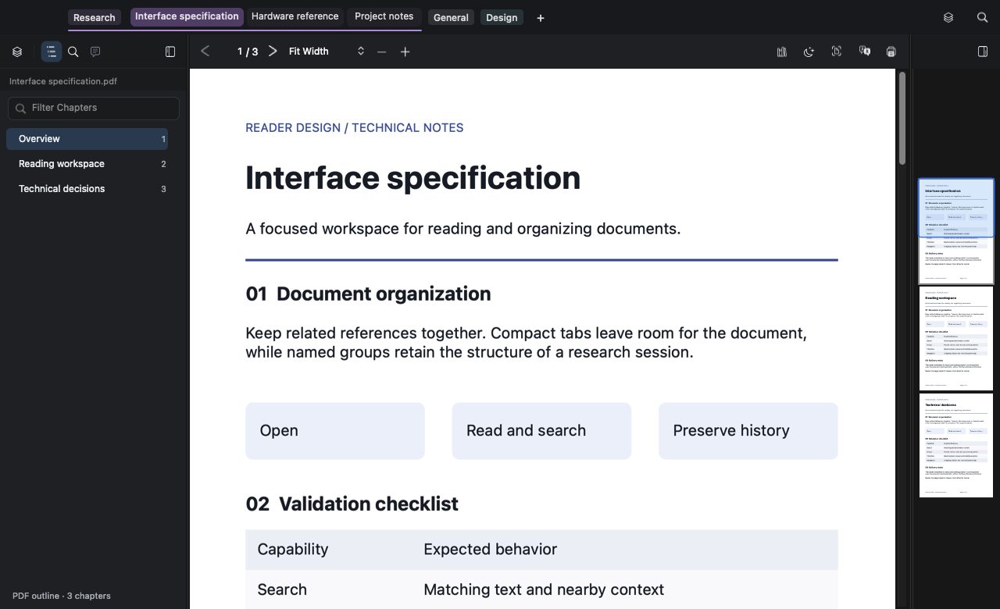

Collection copy: source identity appears at the bottom of the left panel.

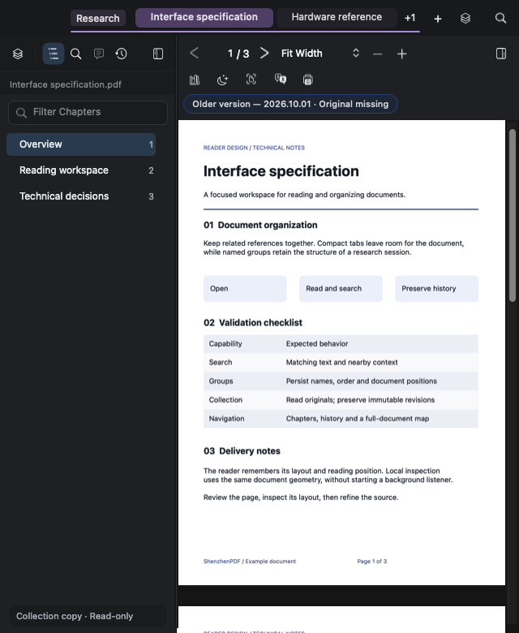

## Verification

- Image file tests: PNG, JPEG and TIFF reopen in MuPDF with the saved dimensions after clockwise/anticlockwise turns. Four turns preserve decoded pixels, including JPEG without reencoding. Invalid angles leave the file unchanged.
- Pixel tests: packed monochrome, 16-bit grayscale, wide-gamut RGB/alpha and mirrored EXIF orientation retain their samples and color space. Unequal X/Y resolution metadata turns with the pixels.
- Integration test: no encoding or Collection protection at reader setup; read-only and cancelled protection never write; rapid repeated commands run serially and each completed edit updates history and the reader.
- Properties model/panel tests pass. Compiling the new path test against the previous Properties panel fails its full-path selection/wrapping assertion.
- Production workspace probe passes at 1280, 880, 640 and 560 points, in light/dark themes, including PDF, Markdown, Find, History, hidden panels and presentation. It checks empty header hit routing, stationary repeated map clicks, the full History target, divider hit/cursor/drag coverage, footer removal and the source pill.
- Fit tests exercise the real Fit Width → Fit Page action sequence on a single image and compare the first/second results. With the old fit calculation, the stale-scroller regression fails as expected.
- Window chrome, sidebar navigation, tab state, Properties, launch-work policy, page wheel and updater tests pass. The updater suite covers 32 cases; the workspace probe also checks the native Check for Updates menu route without accessing the network.
- macOS app build, source size limits and whitespace checks pass. The coordinator shrank by extracting existing rotation routing; no source cap was raised.

A separate pre-existing renderer issue surfaced while constructing the unequal-DPI fixture: `mupdf/source/fitz/load-png.c` assigns the PNG X resolution to both axes in its image-info reader. This batch verifies preservation/swapping of the file metadata itself and does not modify the vendored renderer.

No release was published for this batch.

## Follow-up: continuous panel separator

The six-point exclusion added above also shortened the divider drawing, leaving a visible discontinuity at the bottom of the left panel. The divider now paints to the bottom edge. Only hit testing and resize-cursor coverage exclude the native six-point window-resize zone. The same correction applies to the map divider.

The production workspace probe now checks that the painted divider reaches the bottom and that the native bottom-edge zone remains passive, alongside its repeated click and divider-drag checks. The app is rebuilt in `dist`; the user's running instance is unchanged.

Magnified offscreen-render detail, before and after:

Pixel inspection confirms that all ten bottom separator pixels now have the same color; the prior render had six black pixels at its end.

The continuity assertion fails against the prior coordinator (38 failures across the probe layouts) and passes with the fix. Build, signature verification and source-size checks pass.

## Follow-up: fit-mode transitions and standalone-image colors

The Cmd+3 report exposed another viewport-measurement issue: Fit Height on a wide image needs a horizontal scrollbar. With legacy scrollbars, adding that scrollbar reduces the available height after the fit was calculated. Fit Width has the corresponding vertical-scrollbar problem on tall images. The extracted fit preparation now establishes scrollbar ownership before measuring either axis. Near an aspect-ratio boundary, where adding a scrollbar makes itself unnecessary, a single-page fit settles within both axes instead of oscillating between presses.

Native offscreen evidence uses blue and red image-edge bands to make clipping visible. Fit Page shows the complete image; Fit Height keeps both bands visible while allowing horizontal scrolling. Both panel separator lines reach the bottom in each mode.

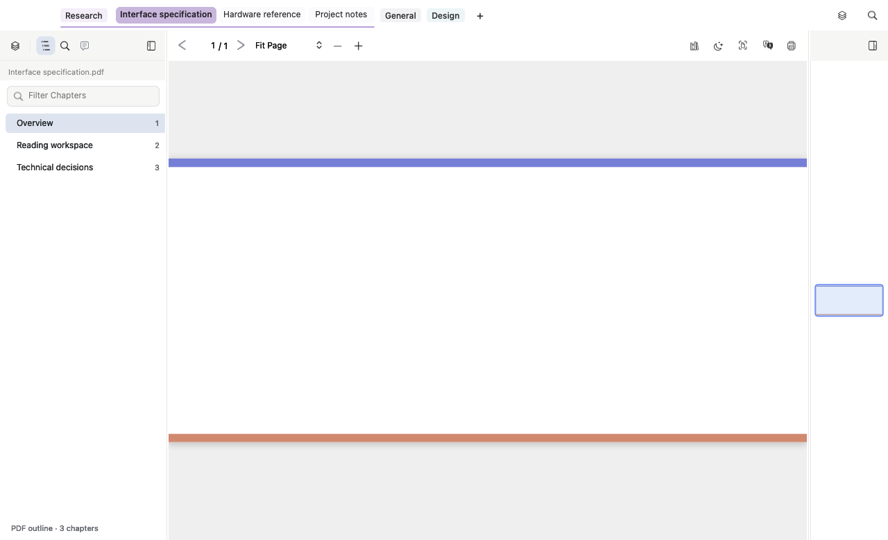
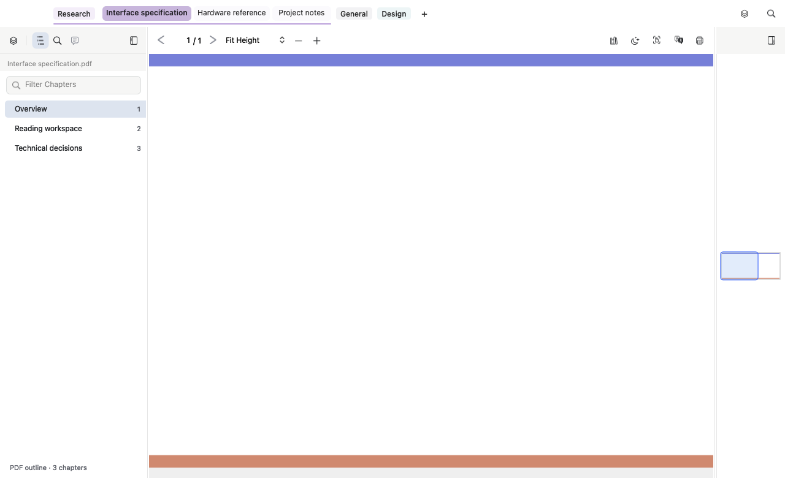

The user clarified that color inversion affects standalone image tabs. These now honor **Keep Image Colors in Dark Theme**: enabled preserves the original pixels, disabled applies the dark reading theme. Byte-identical copies with generic suffixes are classified by MuPDF's actual format only on the first dark render that needs preservation. Opening and light rendering perform no new metadata lookup; the tests assert this deferred classification. The existing scanned-PDF exception remains unchanged.

Validation:

- Real Fit Page/Width/Height actions, transitions and repeated commands, with tall, wide and boundary-aspect images under legacy and overlay scrollbars. First-fit bounds, repeated zoom/frame equality and full-height panel separators pass. The previous reader fails eleven repeated-fit assertions across the same cases.
- Full production reader probe passes across four widths, both themes, PDF/Markdown/text, Find/History, hidden panels, presentation, click/drag routing and native updater-menu routing. The edge-band evidence comes from a separate offscreen fixture, never the user's app.
- Core theme and recolor tests pass, including enabled/disabled preservation, cropped renders, generic-suffix copies, lazy classification, unchanged scanned PDFs and unchanged print output. The previous core fails five new color/classification assertions.
- Reading-theme chrome, window chrome, page wheel, launch-work policy and all 32 updater tests pass. Source-size and whitespace checks pass. Existing oversized files shrank through extraction; no cap was raised.
- Rebuilt and signature-verified `dist/ShenzhenPDF.app` with its Collection helper. No running user app was restarted and no release was published.

## Follow-up: history deletion and deduplication

Collection already stores document/asset bytes by SHA-256: identical content shares one object, including across separate document histories. Consecutive identical captures are suppressed. A → B → A can retain three chronological events while storing only two content objects; Markdown asset changes can also require a new event despite an unchanged source hash. This behavior is retained.

Older History rows now offer **Delete version…** on right-click. The latest row linked to an available original offers **Delete all previous backups…** instead. The latter preserves the latest saved snapshot, document/source identity and original file; it removes older snapshots, including manually kept versions, after an explicit confirmation. A missing original's latest backup remains individually deletable. The Collection bulk action uses the same previous-backups wording and scope.

Deletion snapshots the chosen version/document before confirmation, so changing selection cannot change the target. Previous-backup cleanup chooses the latest version atomically under the manifest lock, protecting a new capture made while the confirmation is open. Existing garbage collection removes only unreferenced objects, indexes and preview files. No work is added to construction or launch.

The headless UI suite verifies native menu labels and targets, cancel behavior, deferred mutation, and selection changes during confirmation. Compiling the current tests against the prior History controller fails the new context-action assertions. An isolated store fixture verifies A → B → A deduplication, kept-history pruning, latest/source preservation, persistence after reopening, individual deletion, missing originals and shared-object survival/reclamation. Its initial rewrite fixture was corrected to pass the same explicit document-continuity identity used by real edit/external-change captures; a replacement file intentionally starts a separate history.

Collection store, integrity and cleanup tests and the full Markdown/UI integration suite pass. The app and Collection helper are rebuilt in `dist`; the user's running app is untouched. No release is published by this change.

## Follow-up: comparison belongs to history

Collection displays the latest saved copy, so its **Compare with Latest** command compared that copy with itself. The command and its unused routing were removed from Collection. **Compare with Previous** remains useful there. Older History rows now offer **Compare with Latest** on right-click; the latest History row omits it. Context comparison snapshots the clicked version rather than reading whatever row is selected afterward.

The complete headless Markdown/UI integration suite passes. Native Collection and History menu tests fail against the prior layout/controller, proving the removed command and new context action are covered. The active document and updater flow are unchanged.

## Follow-up: scrolling crowded tabs without losing groups

The old admission algorithm gave the active group's documents first claim on width, then omitted other group headers. A crowded group consequently showed a large `+59` count while hiding the rest of the workspace. With the tab-navigation agent, this was replaced by continuous document geometry and a clipped, scrollable lane. Compact collapsed headers remain pinned in actual group order around the expanded group's lane whenever they fit. If there are too many headers to fit, the full strip becomes scrollable rather than dropping groups.

Mouse-wheel and two-finger horizontal/vertical trackpad input scroll the lane without selecting a document. Left/right `+` counts appear for offscreen entries and can be clicked to move through the list. New selections reveal their tab; manual scrolling, hover and ordinary refreshes do not snap back. Add Document and All Groups remain separate controls. Renaming/hiding is explicit: hover a group name for stable rename/hide targets, use the group's context menu, or toggle an eye in All Groups. Hiding does not close documents or change the reader. Scroll buttons and group actions expose VoiceOver actions/labels.

Native offscreen production-strip evidence with 60 documents and adjacent collapsed groups:

Root integration persists manual scroll per window in `session.yaml` under `windows[].sidebar.tabStripScroll`. Restoration uses existing in-memory window state, and wheel bursts coalesce into one save after 200 ms. No store access or saves happen during initial wiring; repeated workspace application cannot reset a manual scroll.

Validation covers pinned headers before/after a 60-document group; bilateral indicators and edge clamping; real NSEvent trackpad deltas; explicit selected-tab reveal; restored/manual scroll retention; 20 collapsed groups forcing the continuous-strip fallback; stable hover targets, rename/hide routing and All Groups eye controls; accessibility; and existing drag/drop, title, geometry and style behavior. The old GroupLayout compiles with the final harness and fails the pinned-header regression. Previous workspace code fails the new scroll restoration/callback checks. YAML roundtrip and coalesced-save tests pass.

Repeated scroll plus layout work measured 0.049 ms/input at 60 tabs, 0.127 ms at 200 and 0.522 ms at 1,000, so no additional geometry-cache architecture was needed. Full reader probes pass at four widths in both themes with PDF/Markdown/text, Find/History, panel click/drag, hidden/presentation layouts and updater-menu routing. Tab group integration, lifecycle/state, window chrome, launch-work policy and all 32 updater tests pass. Source-size and whitespace checks pass. The rebuilt `dist` app is signature-verified; the running user app is untouched. No release is published here.

## Correction: compact pills, overlay hover controls

The first hover implementation reserved blank width for rename/hide icons even when they were absent. This contradicted the compact-tab design. Group width now follows the name with 14 points of total inset and a 48-point minimum; Collection Backups adds only its existing identifying icon width. Hover controls overlay the trailing title, fading that text inside a transparency layer just like document-tab close buttons. Neither title geometry nor pill width changes on hover, and the action overlay stays clipped to the rounded pill.

The compact-width assertion fails against the previous layout and passes with this correction. Group click/drag/scroll/hover, tab geometry/style and the full production reader probe pass. The app is rebuilt and signature-verified in `dist`; no user window was launched or interrupted.

## Correction: group visibility through the eye

All Groups now shows only the group name and document count. The eye is the same symbol in both states: normal label color for visible groups and gray for hidden groups. Clicking it updates the tint immediately; tooltips and accessible labels still explain Show/Hide without adding visible status text.

Headless group interaction tests and source-size checks pass. The image above comes from the native offscreen fixture, without opening or capturing the user's app.

## Correction: keep only the hover eye

Removed the rename icon and its hover hit target. Only the hide eye now overlays the trailing 20 points, so more of the group name remains visible. Right-click **Rename Group…** still opens the existing name popup anchored to that group. Group-name clicks keep their collapse/expand behavior, including the area formerly occupied by the pencil.

Headless interaction checks cover the recovered name-click area, retained context rename, stable pill geometry and hide action. Source-size checks pass.

## Correction: overflow lists over the lane

Removed the permanent 30-point reserve at each end of the scrolling lane. The viewport now uses its full available width. When needed, a compact `+N` control overlays the edge with the document-tab height and corner radius. The underlying tabs fade into that control through a transparency layer; no space is reserved when the control disappears. Number widths are measured so large counts remain readable.

Clicking either count opens a native, group-labelled list of the documents offscreen on that side. It leaves the scroll position and selected document unchanged until a document is chosen. Offscreen collapsed groups contribute their member documents to the list. Mouse and trackpad gestures remain the scrolling mechanism. VoiceOver uses the same list action, and overlay hit testing prevents clicks/hover from falling through to covered tabs or groups. Menus are built only on request; ordinary layout and launch allocate none.

Headless interaction tests cover full-width viewport geometry, bilateral lists with no scrolling, accurate document membership, selecting from a list, collapsed-group fallback, overlay hit/hover isolation and VoiceOver. Existing tab geometry/style tests and the full native reader workspace probe pass. Repeated scroll/layout work remains about 0.05 ms at 60 tabs and 0.56 ms at 1,000. Source-size and whitespace checks pass. Native images come from offscreen fixtures; the running user's app is untouched.

## Release candidate: visible and hidden eyes

Hidden groups again use the barred eye, with the gray tint retained. Visible groups use the normal eye. The picker still shows only names and counts, and updates the symbol and tint together when visibility changes.

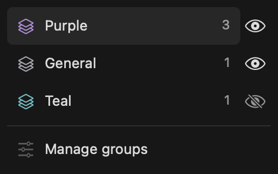

Headless group interaction tests pass. The release draft contains a brief updater overview followed by a detailed list covering tabs/groups, images/fit, history management, reader layout, and separate AI/configuration notes.

## Release validation: live API grouping and format contract

At the user's request, the live app API organized 76 existing tabs into seven contextual groups. Project documents and a few ambiguous PDFs were read locally to identify their subject; no document was closed or added. The final API snapshot retained every original path, its assigned order, and the previously selected document. `session.yaml` was independently decoded and its tab order matched the API snapshot. Private document names and paths remain in local test evidence, outside this public journal.

The test exposed slow bulk group creation: each member was being selected/rendered and each intermediate arrangement saved. A 29-document command exceeded the 30-second response timeout, although its mutation completed. Group state was re-listed before continuing to avoid creating duplicates. Bulk API creation now validates first, changes membership as one batch, selects only its final member, and saves once. A 256-member headless test asserts one selection/one save, exact membership order, and retention of outside tabs.

The release sweep also caught an older format test expecting unconditional picture-color preservation. It now explicitly passes Preserve Images when testing the enabled preference, then separately checks that disabling the preference recolors the same images. All 31 actual format fixtures pass, including image formats, e-books and Office examples.

## Empty reader, dependable toolbar pairs, and offline grouping

The empty document canvas kept a minimum page size, so its message was not necessarily centered in the visible viewport. It now uses the available viewport and lazily adds a centered welcome view: a document illustration, supported-format guide, drop hint, and a real accessible **+ Open document** button. Loaded documents allocate no welcome view.

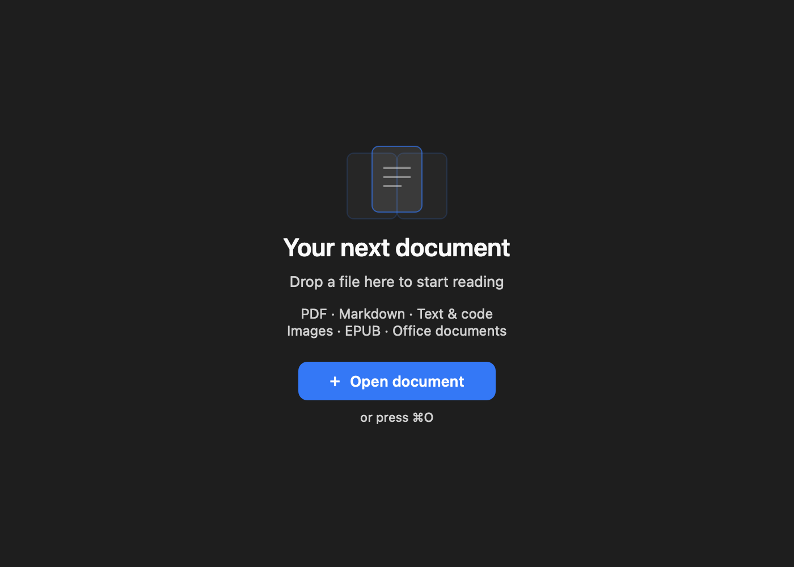

The toolbar previously combined custom segment drawing with native segment tracking geometry. Pointer dispatch now uses the exact drawn rectangles, with explicit momentary selection during the action. Tests caught and fixed AppKit returning `-1` for programmatically selected momentary segments. Zoom and text-size pairs have separate rounded containers and a 12-point gap; pressed feedback is clipped to the clicked half. Native keyboard and accessibility handling remain in place.

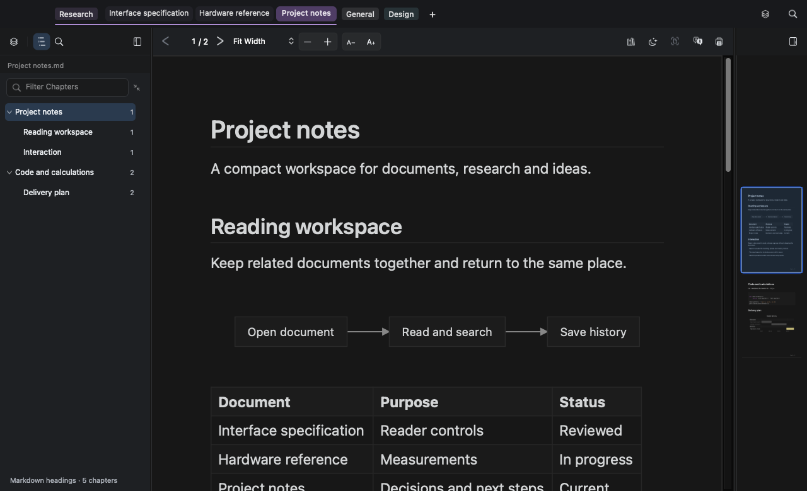

Group API commands now operate on saved session YAML when the reader is closed. The same group operations and tab decoder run in a headless host; the transaction locks and atomically saves the session while preserving original tab dictionaries, unrelated windows, and settings. It reads no document contents and launches no reader window. Live API routing remains available when the reader is running.

Validation: temporary offline session tests pass without an NSApplication instance, including group roundtrip, inaccessible document paths, unchanged bytes for listing/rejected actions, and preservation of other windows and reading fields. Toolbar tests dispatch repeated clicks across the edges of both segments. Welcome tests check centered placement, the open action, lazy allocation and removal. The native full-workspace probe passes across reader sizes and themes. Agent/MCP tests, 32 updater cases, and the source-size ratchet pass. Images above are headless fixture renders; the user's running application was not restarted or captured.

### Toolbar alignment refinement

The editable page number previously reserved 30 points even for one digit, while its total used a different font. The counter now uses one monospaced-digit font, a shared baseline, and a width fitted to the current page number. Zoom measures the longest menu item instead of adding 49 points to a hardcoded label. Its title is centered explicitly because AppKit ignores the popup alignment setting. Paired buttons retain their grouping and separate hit targets but use a faint fill, no outer border, and a quieter divider. The toolbar image above is updated to this design. Native workspace geometry and click regression probes pass; verification did not launch or capture the user's app.

### Group collapse controls in both menus

Added explicit tab-bar collapse/expand buttons beside the visibility eyes in the right All Groups picker and left Group Management panel. The sidebar's existing disclosure remains independent: it controls the document list inside that panel. These new buttons reuse the persistent group operation and never select another document. Expanding one group updates the other picker toggles too. The right picker grows from 236 to 264 points, preserving its 198-point title/count rows.

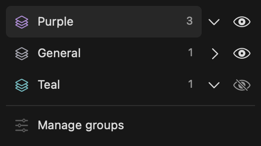

Validation: picker tests assert unchanged title width, one toggle for each group, and immediate double-click roundtrips. Sidebar tests verify a distinct collapse action without navigation. The full native workspace probe and file-size checks pass. The app is rebuilt in dist without restarting the user's running reader.

### Group Management pointer, menu and drag repair

The drag path rebuilt the entire table into a temporary collapsed presentation and disabled normal state publishing until drag completion. A missing completion callback could leave disclosure visually inert. Dragging now keeps the table, search and expanded groups intact; stale drag state no longer controls row visibility or persistence. Disclosure publishes its state before rebuilding to prevent reentrant refresh from restoring older expansion.

The table selects immediately on mouse-down, retains native drag tracking, and commits document navigation on release only if the press did not become a drag. Document icons use macOS file-type imagery instead of switching between generic outline/filled icons. A pending document identity keeps incidental refreshes from selecting the old document during activation. Removed the redundant group-save/table-refresh before document opening. The existing inactive preloader prepares every inactive document, including main-thread source checks; invoking it on pointer-down would add work and potential permission handling to the press. No new speculative document loader was added.

Document context menus now come directly from the tab strip, including copy/reveal/editor/Collection and group actions. Added **Close Document** to that shared menu. Tab-bar expand/collapse uses outward/inward arrows distinct from the panel's list-disclosure chevrons.

Drops between document rows carry a before-document anchor, including within the same group; dropping on a heading appends to that group. Native table autoscroll is retained. Regression tests cover both scroll edges, unchanged expanded rows during drag, cancellation, stale-token/foreign-source rejection, same-group and cross-group insertion, duplicate-path identity, YAML positions, and document-menu delegation. Sidebar, group, API and full native workspace probes pass. The running app remains untouched.

### Per-document image colors and a separate default

Added an image-color button immediately beside night mode. It and Cmd+Shift+I change the selected document's image-preservation choice; the View menu now describes the positive action as **Invert Image Colors in Dark Theme**. A separate **Keep Image Colors in Dark Theme by Default** Settings item has no shortcut and changes only the seed for new documents. The icon switches between outline and filled photo states, with an explicit action tooltip.

Session YAML already stored each open tab's choice, but closing and reopening a file seeded the global default again. Explicit toggles now also merge into document memory, and new tabs restore that file-specific value before falling back to the default. This adds no file reads or rendering work to launch. Existing documents are unaffected by changing the default. The native workspace probe verifies independent choices, session roundtrip, file reopening, new-document defaults and toolbar layout at narrow/wide widths.

### OCR PDF image-color override

A supplied OCR photo PDF reproduced the report in the production C renderer: dark rendering with and without image preservation produced identical output. The image-region cache had a deliberate legacy exception that returned no preservation regions for image-backed pages, forcing full-page scans through dark recoloring regardless of the document's choice.

Removed that exception. Full-page images now honor the explicit preservation flag like embedded figures and standalone pictures. On the supplied PDF, the preserved dark render now exactly matches the normal render, while the recolored dark render remains different. The source document was read only; private PDF/renders are not checked into this journal.

Regression coverage includes a synthetic full-page image with invisible OCR text. It verifies exact pixel preservation when enabled and recoloring when disabled, alongside the existing embedded-image and standalone-picture suites. Both core recolor and production render-theme suites pass. No new launch or analysis work is introduced; the existing lazy image-region cache is retained.

### Saved searches no longer replace Group Management

The delayed PDF tab-restore stage called `startFindForCurrentQueryResetSavedIndex:NO revealMatch:NO`, which correctly avoided moving the viewport but still unconditionally opened the Search panel. That could override Group Management after document activation had already restored it. Search restoration now refreshes results without requesting a panel change. Explicit searches (resetting the query or revealing a match) retain their normal Search-panel behavior. Applied the same rule to the corresponding Markdown/text entry point.

The native reader regression probe starts a saved query while Groups is selected, waits for actual search results, and checks that Groups remains selected both immediately and after completion. It also verifies that an explicit search still opens Search, for PDF and Markdown fixtures. No user document or saved query is altered by this fix.

### Monochrome document extension badges

Replaced the Group Management document icons with compact extension badges, using theme-aware text and a subtle rounded background. The badge shows the actual lowercase extension separately from the document title; the matching extension is removed from the displayed title to avoid duplication. The full path remains available on hover. Badge creation only measures the extension string and does not consult the filesystem or system icon service.

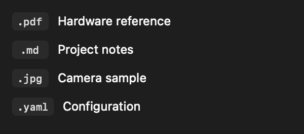

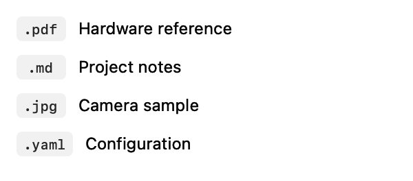

Validation: inspected native offscreen badge renders in both appearances. Group Management and sidebar workspace suites pass, as do source-size and whitespace checks. The dist app rebuild and strict signature verification pass. The running reader was not restarted or captured.

### Earlier, accelerating drag scrolling

Group Management now overrides the table's native autoscroll step with a wider activation zone: 64 points, capped at one third of the visible height for short panels. Speed increases quadratically toward the edge, from a gentle step to 28 points per native tracking callback. Beyond the edge it stays capped; the scroll position is clamped to the document bounds. The central area and pointers outside the panel horizontally do not initiate scrolling. Native drag tracking remains responsible for callbacks; this adds no timer or idle work.

Headless native-table regression tests check both directions at 40, 20 and 1 point from the edge, verifying early activation and increasing speed. They also check a quiet center and capped behavior just outside the edge. Group Management and sidebar workspace suites pass.

### Drag-scroll driver correction

The previous tests invoked `autoscroll:` directly and proved the speed calculation, but did not prove that NSTableView's drag session called it. The reported failure exposed that missing integration coverage. Group Management now starts an explicit 60 Hz scrolling driver at source-drag begin and invalidates it at drag end/cancellation. It reads the current pointer in window coordinates and runs in the drag-tracking mode as well as common modes, so a stationary pointer continues scrolling. Native autoscroll is suppressed while this driver is active to avoid double scrolling. The acceleration is now 60–840 points per second at the nominal timer cadence. There is no timer before a drag or after it ends.

New headless tests run the tracking-mode timer with a stationary pointer at both edges, verify cancellation stops further movement, and assert that the controller's real source callbacks install/remove the driver. Existing distance/acceleration and sidebar suites also pass. This is stronger integration coverage than the previous direct-hook tests; no live user-app drag was performed because repository instructions prohibit launching or capturing it for verification.

### Compact reader toolbar

Reduced vertical padding from 8 to 4 points and the standard toolbar height from 44 to 36 points. Wrapped layouts shrink from 76 to 68 points. Text, icons, 28-point controls, and horizontal spacing retain their sizes. The map header and toggle move with the same spacing so the right edge stays aligned. Initial construction and presentation-mode restoration use the new height too.

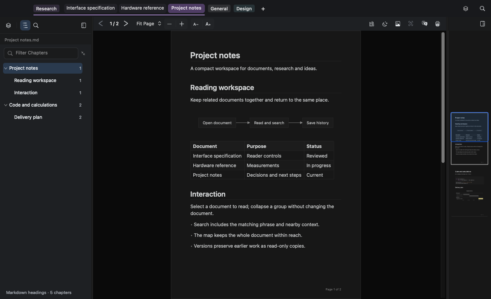

The full native workspace probe passes across PDF, Markdown, narrow/wide windows, themes, version indicators and presentation mode. Its control-bounds checks now cover vertical containment as well as horizontal containment. Inspected light narrow and dark wide offscreen renders; text and controls remain unclipped.

### Button routing after window moves

Expanded the invisible native-window interaction probe to move the fixture between presses and send multi-click counts to different controls. The initial test reproduced missed command-search presses and a sidebar selection miss. Reader-window button presses now resolve from the current content hit target before native window routing can reuse an earlier multi-click target. Text inputs keep native double-click selection; modal/sheet routing remains native. Standalone workspace icons use explicit press/release tracking with release-outside cancellation, while retaining native keyboard/accessibility actions.

The icon glyph remains 16 points, but its target becomes 24 rather than 28 points. Explicit alignment and hit rectangles remove native bezel overhang. Edge tests also exposed the zoom popup reaching into the next-page target; a small additional gap separates them. Tests verify left/center/right icon clicks, repeated presses after window moves, complete sidebar button heights, both themes, map/divider interactions, and draggable space beside the command icon. Synthetic window moves are allowed to settle before posting their mouse-up events, avoiding AppKit reprojecting queued test events against an earlier frame origin. Full workspace and window-chrome suites pass; the user’s app was not launched, quit, or captured.

### Missing-document recovery action

The tab recovery action only forwarded to History, explaining why it appeared ineffective when that panel was already open. It now invokes the locator directly; available originals omit the action, and stale menu actions also check availability. The empty canvas uses the tab's existing missing-file state to offer a centered Locate document button without adding disk work to rendering. Other errors and ordinary empty views retain Open document.

The locator offers automatic search and manual selection. Collection-backed recovery keeps its existing exact-hash search; missing paths without Collection metadata get bounded, cancellable filename scanning on the background queue, with explicit unverified-candidate labels. Confirming a location reloads the missing tab in place. No search starts until the user requests it.

Headless tests exercise the real context action while intercepting window presentation, assert both locator choices, verify recovery is absent for available files, and check missing-view action wiring and reset. Full workspace, Collection store and reader-navigation tests pass. The reported source path was confirmed absent without modifying it.

### Lost source represented in History

History now inserts a presentation-only Missing document row above stored versions when the original is unavailable. It has a recovery context action and cannot be compared, exported or deleted as a saved snapshot. The newest actual snapshot shows Latest copy. The underlying version array remains unchanged; table selection, context menus and comparison availability account for the extra row. Reload preserves the selected version by ID.

Rechecking an original during preview also refreshes source availability, removing the missing row and restoring Latest when the source returns. Native History tests cover the missing entry, copy label, recovery-only menu, version selection/deletion, narrow layout and reconnection; the complete Markdown/UI integration suite passes.

## Sidebar centering and overflow underline — 2026-10-06

Added the separator after the panel toggle and centered visible document tools between it and the Groups separator, preserving the toggle frame. The overflow fade previously erased group underlines underneath both +N badges; its clipping region now excludes the underline. Native sidebar tests and tab-strip interaction tests pass, including light/dark pixel checks underneath both badges. No user app was launched or captured.

## Multiword palette lookup — 2026-10-06

The prior matcher required an adjacent phrase in the title or basename. Replaced it with all-terms matching and a relevance hierarchy that favors document names over folder context. This fixes “assembly R2” for an Assembly guide in an Original R2 directory while putting a document actually named assembly R2 first. All matching stays in memory. Palette tests pass, covering exact-name priority, reordered words, whitespace and revision rejection; existing cache/laziness checks also pass.

## Preserve icon proportions — 2026-10-06

Audited custom NSImage drawing in app chrome. Replaced fixed square destination stretching with a shared aspect-fit helper for reader toolbar, sidebar, group controls and Collection buttons. Segmented controls now preserve proportions regardless of segment count. Existing proportional native image views and document rendering remain unchanged. Geometry checks cover actual SF Symbols at several sizes; sidebar and group interaction tests pass.

## Brighter tabs — 2026-10-06

Used the existing group colors as document-folder markers: more recognizable pastel accents and visible inactive tints, with richer selected fills. The reading canvas stays visually quiet and layout is unchanged. Native light/dark fixture renders were inspected. Contrast/model/integration checks passed; the first render check caught the new Orange selected fill becoming too close to the Collection-copy rim, so Orange was adjusted before the complete suite passed.

## Restore tab pairing and add file rename — 2026-10-06

Root cause: center-hover detection discarded all sibling tabs before dwell detection, explicitly turning every same-group drag into a reorder. Restored sibling center pairing without changing quick/edge reorder or other-group joining. Extended native interaction tests to cover General/custom sibling pairing and overflow positions. Added a native Rename Document sheet and no-overwrite filesystem operation; update live path/state without reopening the document. Collection hash verification runs on a lazy serial background queue, preserving UI response and rename order. Added filesystem safety tests. No user app was launched, quit or captured.

## Stable tab drag zones — 2026-10-06

Confirmed two competing rules: midpoint crossing moved a sibling immediately, then center-hover grouping suppressed that movement after its delay. Aligned grouping and reordering boundaries to 20%/80%, leaving the middle 60% stationary. An unarmed center release cancels without reordering. Kept the existing group preview and naming flow. Headless tests cover middle-zone traversal, pre/post-dwell target geometry, early release, and left/right edge reorder in both General and custom groups.

## Read-only rename and empty ⌘K recency — 2026-10-06

Added a permission preflight and Save As choice to Rename Document. Reused the atomic copy/install helper and rebased the same Collection ID before adopting the writable path, removing the old alias transactionally. Existing tab state is retained, read-only copy metadata is cleared and the old recent entry is removed. Tests cover rebase identity/history retention and failure preserving the original binding.

The user clarified that recency ordering applies only before typing in ⌘K. Added a persisted lastViewedAt activation timestamp and an empty-query-only sorting key; tests explicitly assert typed-query order is unchanged. No app launch or screenshots.

## Regex click tracking and spacing — 2026-10-06

Headless production-reader hit testing showed Regex receiving the hit (cell result 5), but native tracking dispatched zero actions and left its state unchanged. A dedicated native-checkbox subclass now owns mouse press/release while retaining AppKit drawing and keyboard/accessibility. The existing options gap increases by two points; a 24-point frame provides reliable box/label targets. Nine-point repeated-click checks and native activation pass. The broad workspace probe also exposed four pre-existing disabled-icon pixel-contrast failures following the earlier aspect-fit change; these are unrelated to this fix and were not relaxed. Focused Regex validation passes. No user app was launched, quit or captured.

## 2026-10-07 — Group list collapse/expand all

Added a 26-point unbordered chevron beside the Groups search field, with a
4-point gap and a tooltip/accessibility label describing the next action.
Mixed expansion collapses all first; the next click expands every group. This
only folds the manager's document lists, without navigating or hiding tabs.
Filtered results can also be folded without losing the query. The existing
expandedGroups state and a validated groupSearchCollapsed flag round-trip in YAML.
No document I/O or new launch-path work is introduced.

Validation: group-management and sidebar-workspace suites passed, including
repeated toggling, filtered results, state restoration and narrow-panel geometry.
Native offscreen fixtures were generated under /tmp/sz-group-toggle-evidence;
the search-row alignment was visually inspected. No user app was launched.

## 2026-10-07 — Actual group-control mouse routing and current-document reveal

The isolated group-controller test (including direct mouseDown) did not reproduce
inert controls, while the production reader's button-routing probe failed all
nine expansion clicks. Replaced native cell tracking with explicit press/release
handling for all group action buttons. Targets have zero alignment insets,
accept the first mouse, cancel outside releases, and ignore unrelated/older
queued events. The press rectangle stays stable during tracking. Native drawing,
keyboard activation and accessibility labels remain intact.

Replaced the generic chevron with rectangle.compress.vertical /
rectangle.expand.vertical symbols. Added a scope target button to clear any
blocking filter, expand the selected document's group, and reveal its selected
row using the existing pinned-header-aware scroll routine.

Validation: the production reader headless probe now routes mouse clicks across
a 3×3 grid for collapse/expand and top/middle/bottom clicks on the current-document
button. It asserts expansion state, cleared query, selected row and viewport
containment. The invisible test window is allowed to settle before posting
synthetic events, avoiding pending window-server coordinate changes. Group
management and sidebar YAML persistence suites also pass. No user app launched.

## 2026-10-07 — Search placeholder and referenced expansion icons

The empty native search cell reserved the invisible cancel-button area. A focused
cell override returns that space only while empty; entered queries keep native
cancel-button geometry. Placeholder wording is measured against the actual text
rectangle and font on resize, choosing full wording, “docs”, or a shorter label
at the narrowest widths. The icon is a lazy cached template vector: an unfilled
rounded square with diagonal arrows pointing inward or outward, matching the
user's reference while retaining monochrome theme tint and existing click targets.

Group geometry tests cover fitting complete words at minimum through wide panel
sizes. The actual-reader mouse-routing checks are retained. Native offscreen
renders in /tmp/sz-group-placeholder-evidence were visually inspected; no user
app was launched.

## 2026-10-07 — Tab-title alignment and confirmed group closure

Document labels used a floored Y origin and a rectangle two points taller than
its centering calculation, unlike group labels. Both now share the measured
text rectangle helper and drawing options, preserving middle truncation for
document names and tail truncation for groups.

Restored Close Group… in manager context menus and routed that menu and the
tab-bar group menu through one confirmation method. Its native alert names the
group and document count, defaults to Cancel, and explains that files/history
remain. Confirmed closure delegates to existing unsaved-image protection.
Internal group moves retain the lower-level close path without a second prompt.

Tests cover identical title geometry, menu routing from both locations, Cancel
versus confirmation, and existing unsaved-image close behavior. No user app was
launched or restarted.

## 2026-10-07 — Horizontally scrolling group search

Applied the reader search field's single-line, scrollable, non-wrapping and
clipping cell settings to Groups search. The native editor owns scrolling;
placeholder sizing remains separate. The headless field-editor test inserts
300 characters, completes the otherwise display-driven layout, and checks
horizontal movement to the end and back to the beginning without losing text.
Group management tests pass; no user app is launched.
