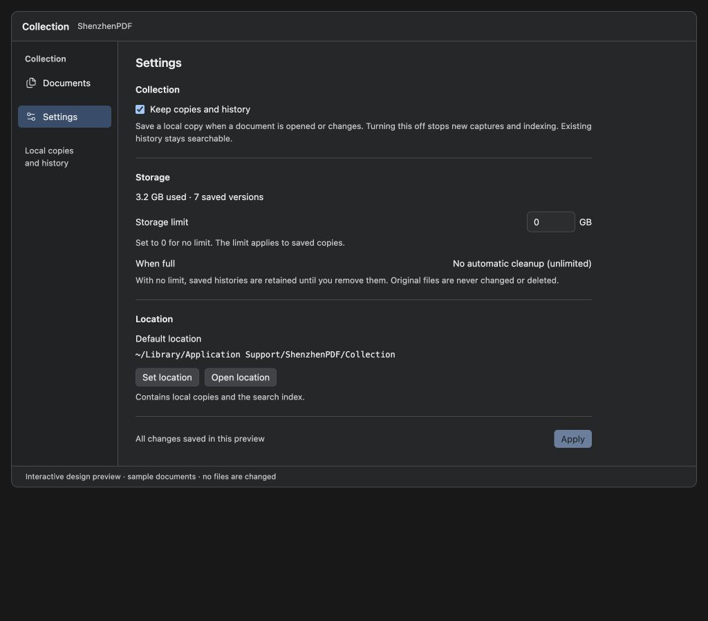

# Collection settings and search — design proposal

23 September 2026. Interactive mockups only; no application behavior changed by this proposal.

## Requested changes

- Put Collection settings in a dedicated **Settings** destination in the left sidebar.
- Search lives directly in **Documents**, with no separate Search destination.
- Each Collection document exposes **History**, including from filtered results, with dated versions and a read-only preview.
- Show the current storage path, initially `~/Library/Application Support/ShenzhenPDF/Collection`.
- Use **Set location** and **Open location** as the folder actions.
- Show each search result with a document thumbnail on the left and contextual text matches on its right. Highlight the query and identify the page and saved version.

## Storage-cap policy

The current implementation refuses captures requiring additional storage when the configured cap is reached; it does not automatically remove existing copies. The revised design defaults to **unlimited storage**. A zero cap means unlimited storage.

The user's revised policy supersedes the earlier whole-history-first proposal. Rank eligible documents by **fewest opens**, using oldest last-opened time to break ties. First remove older saved versions, oldest version first within each ranked document, retaining its latest copy. Only if that is insufficient, remove the remaining Collection documents in the same least-opened order. Stop as soon as sufficient space is recovered. A history containing any version marked Keep remains protected as a whole. Collection never removes the original source file.

An open means an explicit user open in ShenzhenPDF; background capture, indexing, session restoration, and stepping through history previews must not inflate usage counts. The usage tie-breaker and this counting rule are proposed implementation details for deterministic behavior.

If protected histories or an oversized incoming capture prevent the cap from being met, pause new captures and explain how to increase the cap or review protected histories. Estimate whether sufficient space can be recovered before deleting anything; do not remove histories when the incoming capture still cannot fit. Lowering a cap should show its cleanup consequences before applying the change.

## Location and search behavior

Set location selects a destination and moves the existing Collection, retaining the old location until the copy is verified. Open location reveals the current Collection folder. In the mockup, both flows are simulations and do not modify or reveal files on this Mac.

Search distinguishes the latest saved copies from older versions. A hit identifies its version and page; selecting it changes the thumbnail/preview to that page. Matching text stays highlighted within complete words and readable context. Additional matches can be expanded without losing the document grouping.

Sidebar selection, search scope, layout preferences and applied Collection settings should survive app relaunch. Merely opening Settings must not apply pending changes.

History is a document detail view, not another global sidebar destination. Its visible entry remains available in browsing and search results. The view identifies the document, capture date, latest/older status, and protection state; selecting a version updates its read-only preview. Returning restores the prior query, filters and originating document context.

## Review

An independent UX designer and Astra critic completed two review rounds within the four-round limit: **7.8/10 → 9.2/10**. The final review leaves no major or medium findings within the mockup scope.

That score applies to the previous design. The subsequent integrated-search/history revision completed its separate two-round review: **8.9/10 → 9.3/10**, with no major or medium findings remaining.

- [History revision round 1](collection-history-design-review-round-1.md)
- [History revision round 2](collection-history-design-review-round-2.md)

The revised mockup was checked in the browser: fresh Documents and unlimited defaults; historical version/page selection; Keep state and its whole-history effect; query, scope, expansion, preview and focus on return; persisted History selection after reload; and cleanup updates to actual simulated versions and document entries. The second round moved the protection explanation directly beneath the Keep control, with an accessible description and live status distinguishing the current kept version, another kept version, and no protection.

The following evidence records the earlier design, before this revision:

- [Round 1 — findings](collection-settings-search-review-round-1.md)
- [Round 2 — acceptance](collection-settings-search-review-round-2.md)

Browser validation covered dark and light appearances, 1024/736/390-pixel viewports, contextual and title-only results, empty results, expanded matches, version identity, keyboard preview entry/return, navigation state, and applied settings after reload. Cleanup cancellation, protected capacity, unlimited storage, and post-cleanup location totals were checked using simulated data. JavaScript syntax checks passed and no browser console errors were observed.

The first review exposed misleading title-only snippets, lost keyboard focus, offscreen narrow previews, and stale location totals. The revised design addresses each: title matches have a separate saved-copy action; version and context are accessible; previews appear beside their result in narrow layouts and reveal themselves after layout settles; all storage views use the same simulated state.

These are interactive design proposals. Automatic cleanup, location migration, and the new native search layout have not been implemented by this design task.

