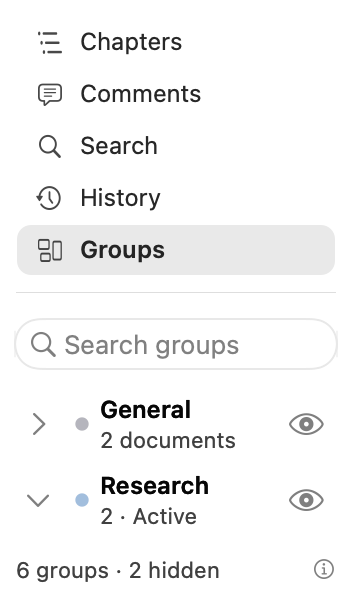
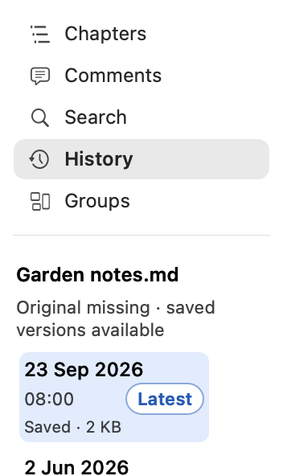
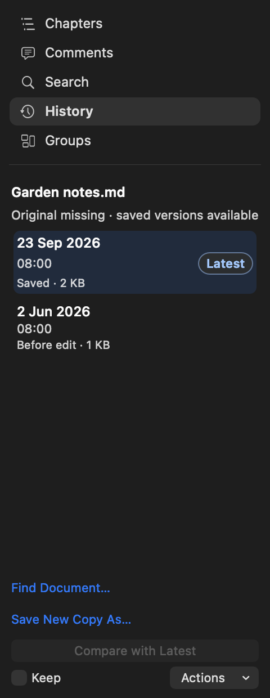

# Mac sidebar balance — implementation journal

24 September 2026. Request: rebalance the native Mac left panel through a few UX loops. Designer and independent critic worked alongside implementation; a separate technical audit checked state and action semantics.

## 1. Diagnose the whole panel

Five navigation rows consumed 161pt before task controls. Groups repeated a summary above search. History stacked a heading, filename, explanation and five buttons around 82pt versions. In a short window, controls displaced useful content.

The design study compared three arrangements in the same reader: compact stacked navigation, a second side-by-side navigation column, and bottom-docked modes. The compact stack preserves document width and the requested vertical icon-and-text navigation. The other alternatives either consumed more reader width or separated modes from their content.

[Design rationale](design.md) · [Whole-reader CSS comparison](comparison.html) · [Baseline critique](reviews/01-baseline.md) · [Proposal critique](reviews/02-proposal.md)

## 2. Implement and inspect native views

Navigation now uses 26pt rows without gaps, a neutral selected fill, and equally readable enabled labels. Its five-mode height is 139pt. Groups has one search header, 36pt groups, 26pt documents, and counts/help in the footer. Group search remains group-name-only. Explicit Hidden and Active text survives at minimum width.

History puts versions before recovery/actions. A filename replaces the repeated panel heading. Versions occupy 56pt rows; Compare with Latest remains the primary action, with Keep and a labeled Actions menu for secondary commands. Missing-source recovery stays explicit and nonmodal. Selecting Latest disables self-comparison and explains how to compare with Previous.

The native width probe exposed an inherited 196pt intrinsic width in the navigation control. Removing that horizontal requirement allows the actual 176pt minimum. Borderless test windows now assert their true dimensions instead of inheriting a titlebar minimum.

Two complete groups fit at 176×296pt. The list retains 81pt; the first group begins at 193pt. This is an offscreen production AppKit view, not a screenshot of the running application.

## 3. Critic refinement

The native History review caught a clipped date beside the Latest badge at minimum width. Two always-visible scrollbars can reduce the inner table to 122pt. The final row gives the date a complete first line, time and Latest the second line, and reason/size the third. It respects the system scrollbar preference rather than forcing overlay scrollbars. A regression assertion checks that the full date fits.

The independent final review grades beauty 8.9/10 and usability 8.9/10, with no remaining major or medium issues in the reviewed native views. These are bounded visual-review scores, not participant research or a running-app acceptance score. The persistent five-mode stack remains a tradeoff at very short heights. [Final review](reviews/03-native-final.md).

## Validation and delivery

- All 25 native Markdown/UI suites pass, including History action availability, preview cancellation, original-file routing, recovery, short-window action reachability and the new complete-date assertion.
- Navigation, Groups, sidebar workspace and outline suites pass. Existing workspace checks cover lazy Collection initialization and state restoration. YAML persistence and reader integration wiring are unchanged.
- Independent source audit found no definite regression. No new launch work, Collection indexing or document rendering was introduced.
- File-size ratchet and whitespace checks pass.
- Native candidate build passed. Strict signature verification passed for the reader and nested Collection app. Both executable SHA-256 hashes match the staged bundle now in `dist/ShenzhenPDF.app`; the previous app is preserved under `portable/build/dist-before-sidebar-balance-ltf575cf`. No release was published.

The native evidence covers production components inside hidden hosts. Whole-reader comparisons are explicitly labeled CSS illustrations. No app was launched, quit or screenshotted. Live VoiceOver, trackpad feel and the complete running-reader composition remain outside this validation.
