# Whole-reader redesign: decision and validation

25 September 2026. **Interaction proposal, not a shipped interface redesign.** The separate Chapters/Comments enablement fix is built in `dist/ShenzhenPDF.app`; see [bug audit](bug-audit.md).

## Latest revision: visible group labels, direct tools and full-height map

1 October 2026. Other group labels now use remaining tab-strip space individually, after allocating readable slots to the expanded group's documents. The previous all-or-nothing rule and narrow-width blanket hiding were removed. In the checked 1248px Hardware view all four group labels fit; at 736px Hardware and General fit. The crowded General view still shows six documents at desktop width.

The right-side group manager now uses a stacked-layers icon labeled **All groups**. Its list always includes every group, including hidden and empty groups, independently of which labels fit in the bar. Hidden groups are identified in the list. Choosing a group still expands it without navigating to a different document, and Manage groups remains available.

The Document tools menu was removed. Reading theme, OCR, translation and export/print are direct 28px icon buttons with accessible names and hover helper text. Collection remains a direct icon. OCR is disabled for Markdown with an explanatory helper label. These retain the proposal's existing behavior; OCR, translation and export are still simulated/native-integration placeholders, not newly implemented native commands.

The map now spans both the toolbar and reading rows, matching the left sidebar's top edge. Its header has a direct Hide map icon; a direct Show map icon appears in the toolbar while hidden. The map pages scroll independently below the header. A shared row size keeps the map header aligned when the tools wrap at narrow widths; tools remain visible instead of returning to an overflow menu.

Validation: all three desktop headers measured top=45px and height=44px. Checked light/dark appearance, desktop/736px/352px content widths, no horizontal overflow, retained six-document capacity, map hide/reopen, PDF/Markdown OCR enablement, and the presence of a deliberately hidden Research group in All groups. No browser console errors were observed. Native app and dist remain unchanged.

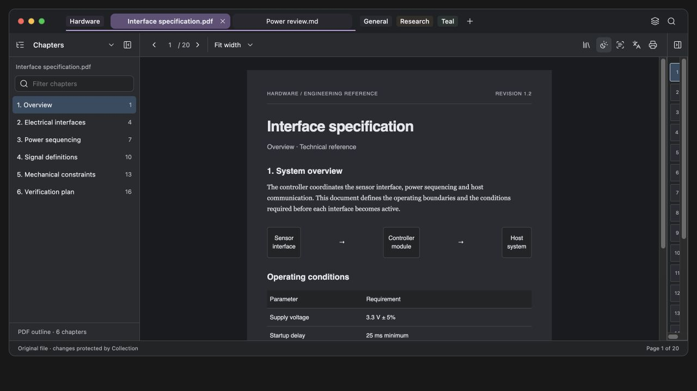

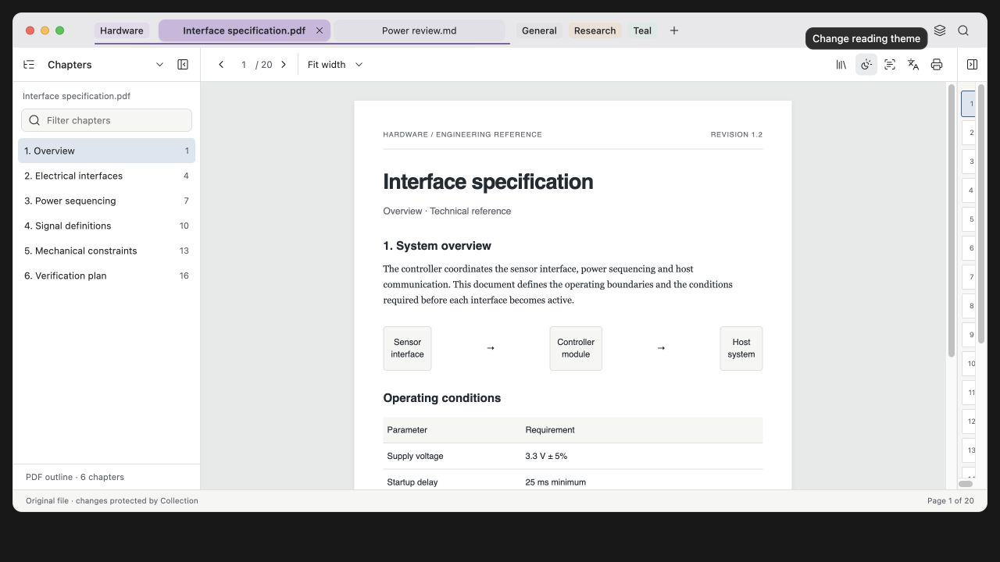

## Previous revision: single sidebar and document-first tab capacity

1 October 2026. Following the user's acceptance of the tab direction and rejection of the double left panel, the permanent navigation rail was removed. One 240px sidebar contains a native labeled view selector with an icon, its current task content, and a close control. Chapters, Find, Comments (PDF only), History and Groups share this surface. Collection has a direct toolbar button. The old rail/chooser design alternative is removed. List rows are 32px with unchanged 12px text. Compared with the previous 104px rail plus 232px task pane, the document gains 96px of width.

The last expanded group now has priority. Expanding a different group collapses the previous group without changing the document. Other group labels remain when there is spare room; otherwise they yield their space to document tabs and remain reachable through the group picker. After that, excess documents use a counted overflow control. The selected document stays among the displayed members of its expanded group. Compact tabs share available width, retaining 12px centered text, with full-title tooltips. Inactive tabs use the space normally reserved for the hidden close control; hover or keyboard focus reveals that control with symmetric title padding. The group picker also links to management; hiding a group there remains a separate persistent action.

At 1248px content width, the General fixture shows six documents instead of the previous four, at approximately 145px per tab, without strip overflow. At 736px and 352px the checked group showed two and one respectively, keeping the same text size. Light and dark whole-reader views were inspected. Sidebar view changes preserve the Find query; History is reachable from the same selector; closing the sidebar returns all 240px to the viewer and exposes the reopen button. Browsing Hardware while reading Driver datasheet did not change the document. No browser console errors were observed. These remain prototype checks; native app and dist are unchanged.

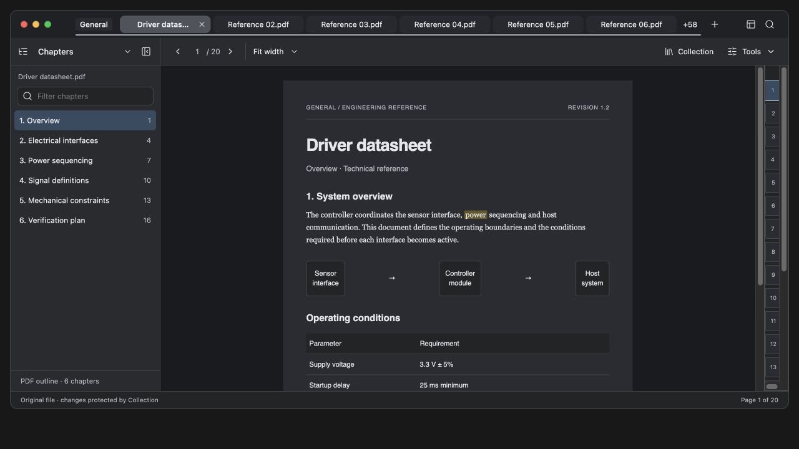

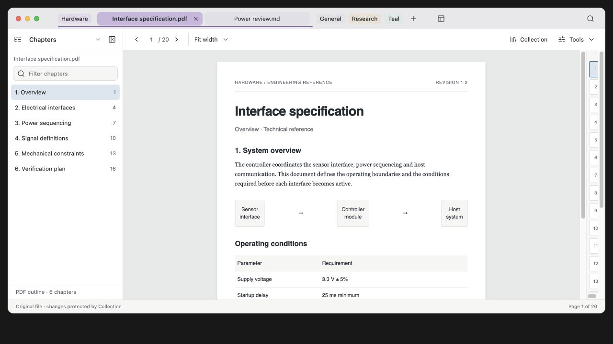

## Previous revision: one reference-led compact tab system

1 October 2026. The user rejected all three alternatives below. They are historical evidence, not recommended options. The live prototype now contains one tab treatment; the Index/Tray/Outline picker was removed.

### References and design decision

Read and applied two different skills: [macOS Design Guidelines](https://www.skills.sh/ehmo/platform-design-skills/macos-design-guidelines) and [Rams Design Review](https://www.skills.sh/arosenkranz/agent-config/rams). These are third-party guidance, not Apple certification or evidence of user approval. The applicable principles are compact desktop controls, system typography, visual hierarchy, coherent geometry, equal readable title contrast and keyboard focus. Touch-sized desktop controls were not adopted.

The concrete visual reference is Brave's [compact horizontal tab design](https://github.com/brave/brave-browser/issues/40044), including the published before/after images. The [implementation](https://github.com/brave/brave-core/pull/24876/files) supplies verifiable dimensions: 28px compact tab height, 4px tab gaps, 8px radius and compact group-header insets. The reference image was inspected in the browser. This is a specific established design reference, not a claim to reproduce every current Brave build.

The rejected variants gave group labels, inactive documents and the active document similar button-like prominence. The revision retains one compact group label and one thin continuous group rail. The selected document has a stronger group-colored surface; inactive documents retain only a faint tint. There is no extra group enclosure or selected perimeter. Adaptations for Shenzhen are centered titles, no favicons, the user's equal title colors, and a 44px unified Mac titlebar with 8px clearance above/below each 28px tab. Group labels are 20px tall with unchanged 12px text. The expanded label-to-tab gap is 12px; document-to-document spacing remains 4px. Close controls reserve equal space on both sides of the centered title and appear on selection, hover or keyboard focus.

The active tab rules were consolidated, removing the superseded alternatives and successive geometry overrides. The prototype now estimates capacity from available strip width instead of always rendering exactly two members per group. Selection stays visible, document order stays stable, additional members have explicit overflow, and group expansion does not navigate. Window drag space and utility controls are reserved. This is a proposal-level allocator; native dragging and exact native title metrics remain implementation work.

### Validation and independent review

Browser checks at 1248px, 736px and 352px content widths found no tab-strip overflow. Measured desktop values: 28px tab height, 12px text, zero title icons, 4px inter-tab gap, 12px label clearance, 8px bottom clearance; all top-bar control centerlines were 23px from the fragment top. Title center error was less than 0.01 CSS px. The selected purple title contrast is 6.15:1 in dark appearance and 7.95:1 in light appearance (rounded from the concrete palette). Expanded General without navigation, selected a General document, returned to Hardware, switched PDF/Markdown, and reached the close control by keyboard; Comments remained absent for Markdown. No browser console errors were observed.

An independent designer applied both skills and reviewed the complete light and dark reader captures. It found no serious tab-design issue, and flagged asymmetric title padding only at ≤420px. That padding was corrected to remain symmetric. This is a bounded design review, not a user-acceptance score or a native regression pass. Native app and dist are unchanged.

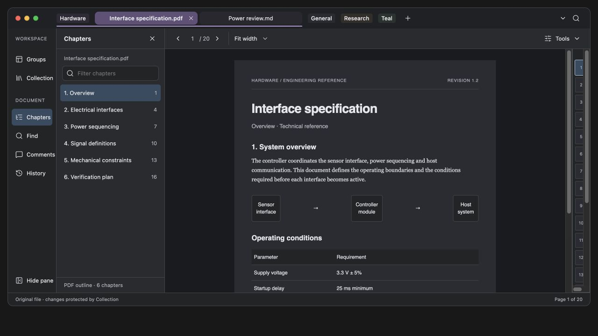

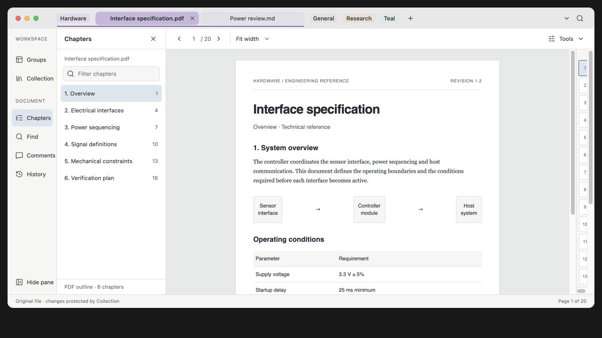

## Rejected revision: smaller tab surfaces and three alternatives

1 October 2026. Applied the requested reduction to the tab surface, preserving 12px/16px title typography and the 4px inter-tab gap. Tabs are now 28px high rather than 32px; the tab surface has 10px clearance to the toolbar below, and the group label has 12px clearance to the first tab. File/favicons were removed from document titles. The corrected Brave baseline remains the default.

Design intent: a person comparing technical documents must identify the active document quickly, while the reading surface remains dominant. Existing Mac typography and semantic group colors stay intact. The spacing change separates document selection from the toolbar and group control without introducing extra gaps between document tabs. Surface size changes; text and document layout do not.

Used the [Interface Design skill found on skills.sh](https://www.skills.sh/dammyjay93/interface-design/interface-design), installed at `/Users/raph/.codex/skills/interface-design/SKILL.md`. A separate design agent applied the same skill and supplied three alternatives: **Index**, **Group tray**, and **Outline**. [Agent rationale and tradeoffs](tab-options-notes.md). The full-reader design controls now offer all four treatments. `tab-options.fragment.html` shows the three alternatives together, with the same type and geometry; `tab-options.css` records the agent's scoped variants.

Browser measurements confirmed 28px tab surfaces, 12px text, zero title icons, 12px group-label clearance and unchanged 4px tab gaps. All three alternatives kept 12px text and had no horizontal overflow at the checked desktop and 352px browser widths. Selecting a different document in the comparison moved the selected styling correctly. No console errors were observed in the comparison. These are prototype-only changes; native UI, drag behavior and rendering are unchanged.

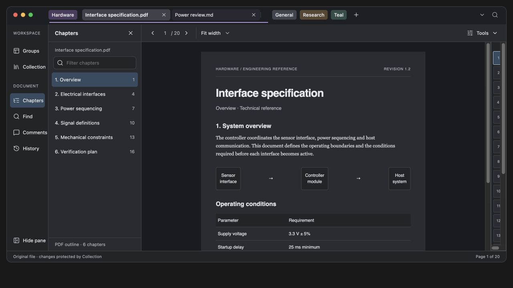

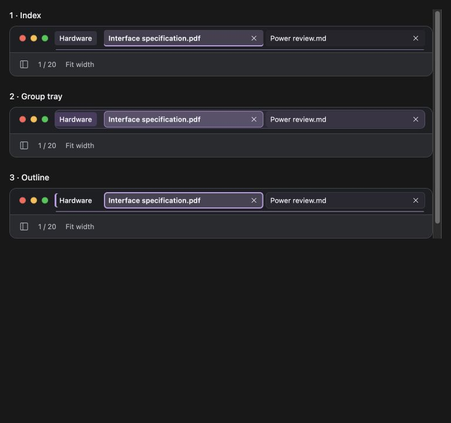

## Previous revision: shared alignment grid

26 September 2026, after the alignment feedback. The window now uses one grid for navigation, the task pane, document controls, canvas and footer. The pane heading sits alongside the reading toolbar, instead of starting a row below it. Workspace heading, pane heading and reading toolbar have the same 44px height and top coordinate. Tabs begin at the navigation column's right edge. Group labels, document tabs, close buttons and title-bar search share the same vertical center. Navigation uses 36px rows, 16px icons and consistent 8px gaps. The footer spans the entire window.

Browser geometry confirmed identical header tops/heights and identical tab-control centerlines; the tab start and rail edge differed by under 0.01 CSS px from rounding. The compact History drawer begins exactly below the toolbar and ends at the footer, including the older-version status row. No horizontal overflow was observed in either checked size. Closing the task pane returns its width to the canvas. No browser console errors were observed. These remain prototype checks, not native app changes.

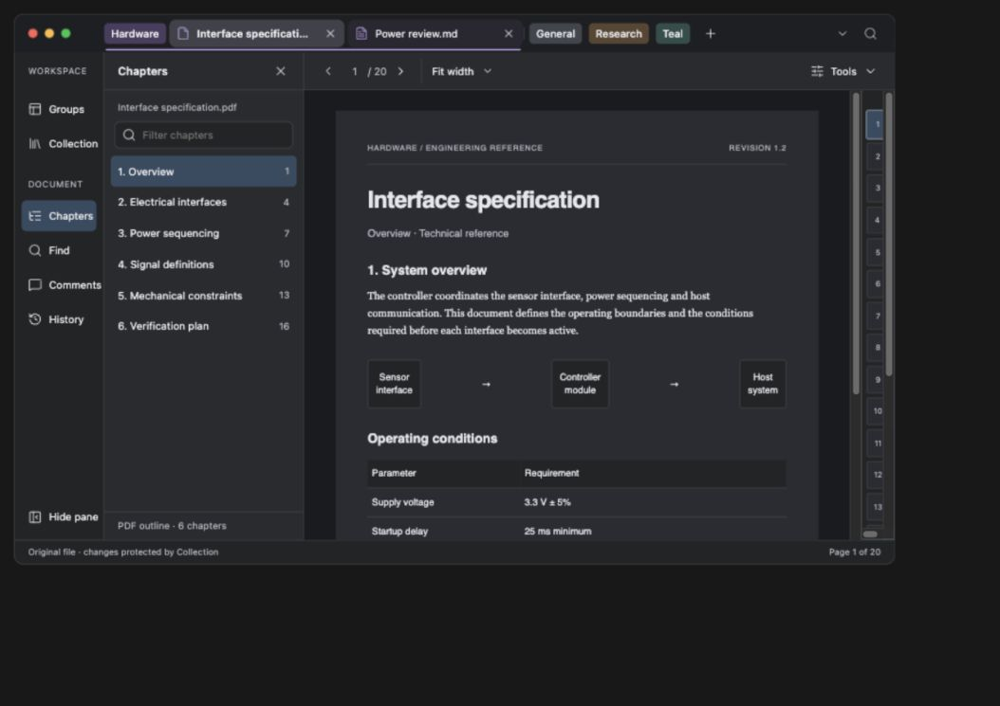

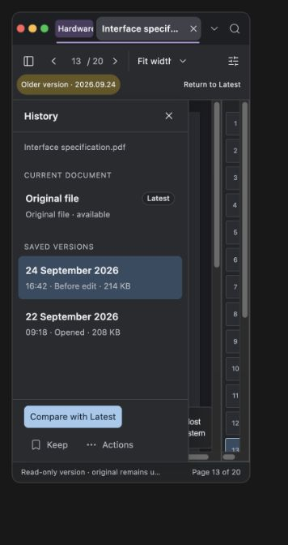

## Previous revision: Brave-style tabs

26 September 2026. The user requested Brave's tab system. Read-only inspection of the already-running Brave window supplied the horizontal tab shape, spacing, selected surface, close control and trailing plus/dropdown arrangement. No Brave tabs or settings were changed. Brave's [compact horizontal tabs issue](https://github.com/brave/brave-browser/issues/40044) was also consulted as a supplementary primary source.

The proposal now uses individual rounded tabs with file icons, trailing close buttons, a distinct selected surface and equal title foreground colors. Compact colored group labels and a continuous line beneath expanded members replace the enclosing capsules. Tabs remain fused with the title bar. Clicking a group label expands/collapses its members without switching the document; selecting a document collapses the other groups. The plus opens a synthetic document picker, and the trailing dropdown opens the complete group inventory. These are local prototype interactions, not native file operations. Dragging, full context menus and cross-window group transfers remain outside this visual revision.

Browser checks covered expanded groups without document changes, closing/reopening a tab, PDF/Markdown switching, dark/light appearance, and a 323px-wide header without horizontal overflow. Browser console errors: none observed. Close state and expanded groups join the prototype's existing saved state. The following images supersede the older tab styling below.

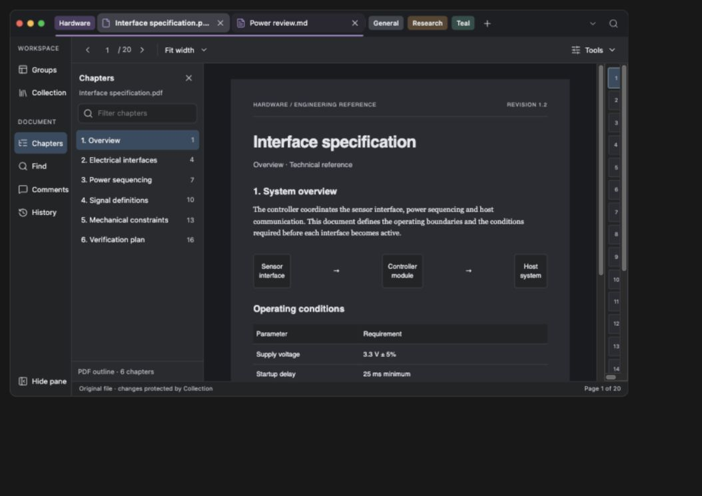

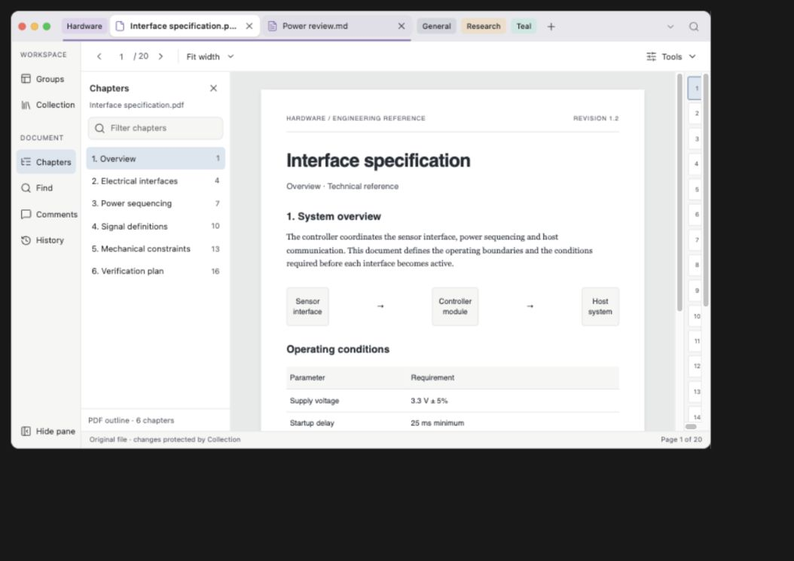

## Previous revision: tabs share the title bar

Following user feedback, grouped document tabs now sit beside the window controls in the top bar, preserving the current app's organization. The separate application-title row and lower tab row are removed. Cmd+K remains at the right as a compact search control. This returns the previous tab row's height to the document and task pane. The header fits desktop and narrow widths without horizontal overflow; its search button still opens the command palette. Earlier captures below record the preceding review; this is the updated composition.

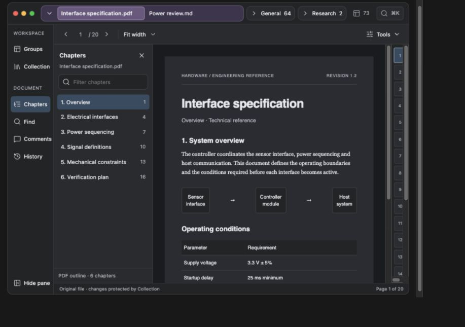

## Why the previous pass failed

It optimized the vertical size of individual components while retaining the wrong hierarchy. Global workspace management, current-document navigation, search and saved-version management still competed in one stack. Synthetic component tests established that controls fit, not that the entire reader made sense. The previous numerical scores did not establish that outcome.

This pass began with the native reader's source and a read-only accessibility inspection of the running interface. It observed a 72-tab session with four groups and 63 documents in General, plus a toolbar mixing reading, Find, Regex, OCR, translation and Map. No app was launched, quit, navigated or screenshotted. The mockup uses synthetic filenames/content rather than the user's documents.

## Proposed organization

| Area | Responsibility | What changes |
|---|---|---|
| Unified title bar and grouped tabs | Choose the current document; find anything across the workspace | Window controls, grouped tabs, inventory overflow and compact Cmd+K share one row. Retains group identity, stronger selected-tab color and ordered document/group/text/Collection search scopes. |
| Task rail | Choose what to do | Workspace: Groups and Collection. Document: Chapters, Find, Comments where supported, History. Icons precede labels. |
| Single task pane | Show the chosen task's content | List/query begins at the top. No permanent five-row selector above it. One task owns one pane. |
| Reading toolbar | Navigate and size the document | Page controls and zoom stay together. Occasional tools live in a labeled Document Tools menu. |
| Source/version status | Explain which bytes are being read | Older date plus Return to Latest persists after History closes. Missing original remains a readable saved copy with recovery choices. |
| Collection companion | Browse saved documents and settings | Preserves its separate-window role, Documents/Settings navigation, latest-only list, thumbnail with contextual matches. |

**Final prototype dimensions and naming supersede the initial alternatives' draft numbers.** The rail is 102px at wide sizes, 92px below 780px; the task pane is 218px/208px. Its cost is roughly 80px more horizontal space than the prior 240px sidebar when open. It returns the full pane height to information. Closing the pane leaves only the rail. At 650px or narrower, or content height below 370px, a labeled vertical panel chooser replaces the persistent rail and the task pane becomes a closable drawer. It never scales down the whole interface to fit.

Groups keeps the user's **group-name-only** filter. Finding a document among 72 uses Cmd+K; no additional search scope or separate membership model was introduced. The root prototype retains the familiar Chapters/Comments names rather than renaming them Outline/Notes. Collection stays a companion, not a cramped rail pane. The comparison view is an interaction study of the paired reader task; native window ownership is an implementation decision, not changed by this file.

The design controls expose the second alternative: a compact panel chooser at every width. It saves the rail's width but costs an extra action when changing tasks. They also expose document condition and window-content height. This is a deliberate tradeoff to evaluate, not a hidden replacement for the requested vertical navigation.

## Primary-source study

Apple Preview distinguishes document sidebar views from page/zoom commands, and supports hiding the sidebar and customizing the toolbar. That supports separating navigation content from persistent reading commands; it does not prescribe ShenzhenPDF's group or Collection model. [Preview: view PDFs and images](https://support.apple.com/en-by/guide/preview/prvw11470/mac).

Pages distinguishes its navigation sidebar from contextual formatting/document controls. The useful lesson is scope separation, not blindly adding a second permanent inspector to a reader. [Pages: use sidebars](https://support.apple.com/guide/pages/use-sidebars-tan0870f78aa/mac).

The visualization skill supplied an inspectable interaction surface and alternative controls. The design method here was scope inventory, task-flow mapping, state/return contracts, responsive whole-window inspection, and independent criticism. It is not evidence from participant research.

## Review and corrections

The independent critic inspected the entire reader at 1024px and challenged workflows, not isolated sidebar images. The first prototype exposed lost document state, fabricated search hits, incorrect hidden-group display and weak modal behavior. These were corrected before presenting it:

- Document switching retains page, query/Regex, zoom, selected version and scroll position per document. Markdown has no Comments destination; returning to PDF restores supported navigation.
- The complete 72-document synthetic inventory exists; General can expand into 63 rows. Expansion does not change the document. Hiding the active group removes its strip and leaves the document readable with explicit status.
- Find, Cmd+K and Collection use finite fixture text; no-match and invalid-pattern states are explicit. Text hits carry a document/page destination. Map markers derive from actual results.
- History keeps dated read-only identity outside the pane. Latest page 7→older page 13→Return to Latest restores page 7. The selected version and original file are not conflated.
- Dialogs make the underlying interface inert, move focus inside, contain Tab traversal and restore the invoker. Collection's lower settings scroll into view at the minimum fixture.
- At 560×380, the older-version badge initially clipped. It now occupies a separate toolbar row with its complete date and an always-visible Return to Latest action.

[Independent review record](critic.md).

## Browser checks actually performed

| Check | Observed result |
|---|---|
| Whole reader 1024×720 | Task rail, full-height pane, page and Map fit; ordinary reading controls remain grouped. |
| Busy groups 800×500 | General exposes 63 rows in a bounded list; page remains readable; no horizontal window overflow. |
| Compact 560×380 | Chooser exposes workspace/document tasks; closed History retains full dated status and Return to Latest. |
| Compact Collection settings | Dialog 272px inside a 346px mock window; lower Set location/Open location controls reached and captured; no horizontal overflow. |
| PDF→Markdown→PDF | Markdown Comments absent; PDF Comments restored; original document page 7 retained. |
| Search and empty result | Power sequencing gives 3 fixture matches; nonsense gives 0; closing pane keeps 0 map markers. |
| Global text jump | Sensor selects Interface specification, page 1, with 1 real fixture match. |
| Revision return | Latest page 7→older page 13→Return to Latest returns to 7. |
| Active group hidden | Its tab strip is hidden; reader continues showing the same document; source status identifies the hidden group. |

The medium/compact HTML fixtures use the same fragment with only the configured content height changed to 418/296px. This makes 800×500 and 560×380 browser captures fit their complete mock window; they are not tall pages cropped to look compact. Icons are initialized asynchronously by the visualization runtime; evidence was captured after the placeholders became real SVG icons.

## Evidence and limits

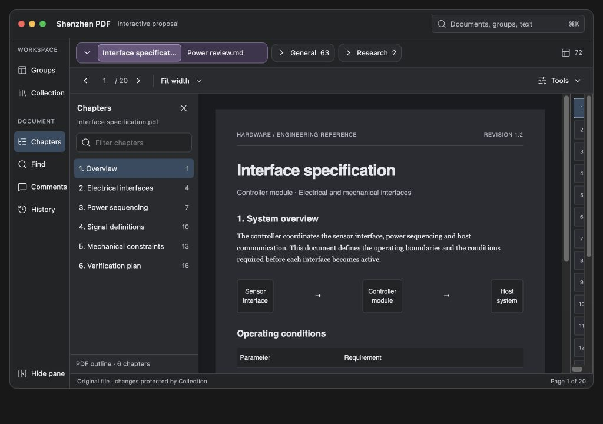

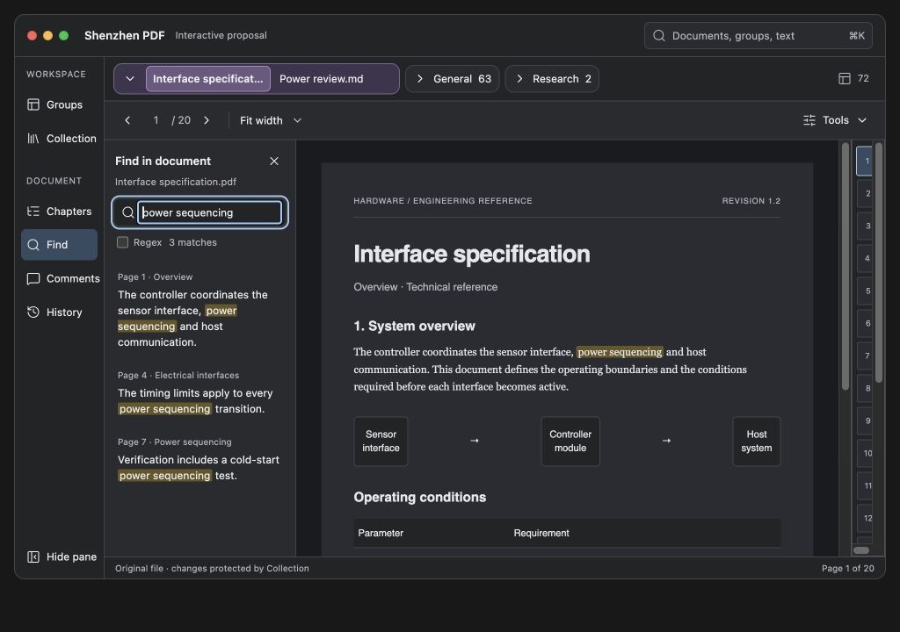

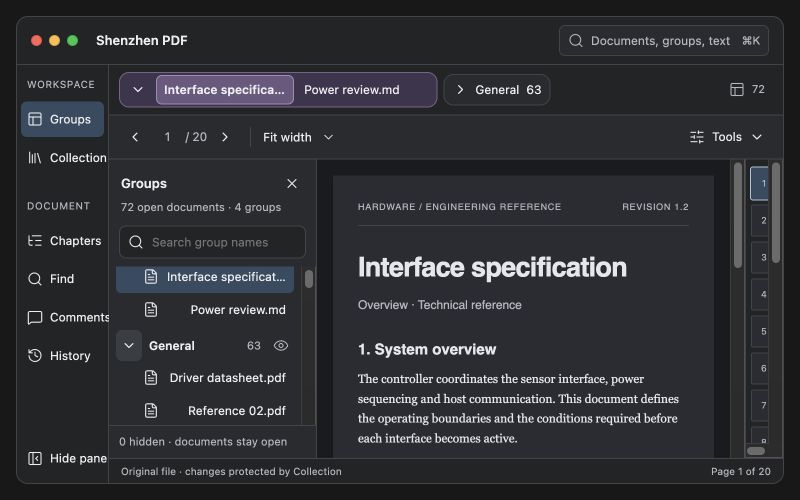

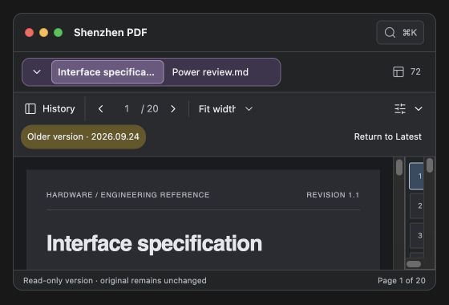

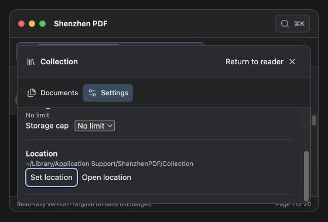

These are browser prototype captures, not the native app. Viewport dimensions include the preview wrapper’s 16px margins; the compact mock window itself is 528×346px. PDF/Markdown rendering, drag-and-drop group movement, native file dialogs, OCR/translation, actual archive writes, VoiceOver, every keyboard binding and production comparison performance are outside this prototype. Native actions show their destination without operating on files. The example document body is synthetic and repeated across fixtures; identity/selection/return behavior is the tested part. No claim is made that this browser prototype proves native YAML persistence or fixes unreported production bugs.

Before implementing the redesign, the native integration work must preserve one tab/group model, one current-document Find state, stable version identity, per-document return points, YAML geometry/state and zero additional startup work. Replace layout composition first, not those models. The visual proposal remains separate from the tested native bug fix.

Final search checks also verified that “timing” labels and opens page 4 with its literal passage, and `col:sensor` opens Bench measurements at page 1 with one highlighted match and saved-copy status. The final browser console showed no errors.
