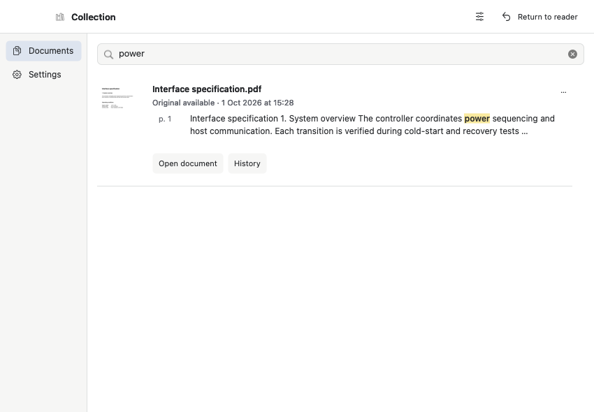
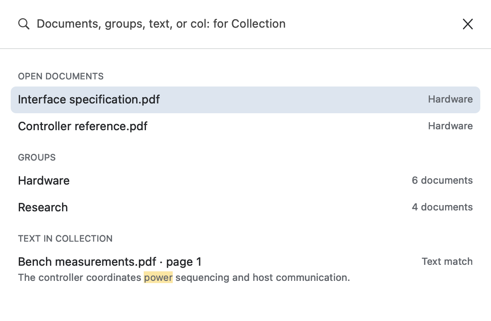

# Native Collection and command palette

1 October 2026. The approved reader workspace composition is implemented with the existing AppKit controls and the existing Collection/search models. All images below are offscreen renders of native views. No reader application was launched or captured.

## Collection

The companion window uses the approved 125-point navigation column, compact integrated header, search above results, and 65 × 88-point page previews beside document titles, source status, search contexts and actions. Browsing keeps one latest entry per document; History remains exclusively in the reader sidebar. Existing filters, thumbnail layout and sorting live in the header's view-options control. Their persisted values still use the existing Collection settings.

The illustrated PDF is created by the test, captured into its isolated Collection, found through real indexed text, and rendered through the lazy thumbnail queue. The assertion checks that the displayed revision is the document's latest version. The Open document action still follows the existing original/source resolution.

Return to reader sends an activation request on the existing companion IPC channel. It keeps the Collection window and browse state intact. Settings retains the unlimited default, verified location migration, storage protection and explicit Apply flow for destructive cap changes.

## Command palette

The palette is 550 points wide, with a borderless search header, 30-point document/group rows, muted uppercase section labels and right-aligned metadata. Text matches retain a second line of highlighted context. All existing ranking, cancellation, keyboard navigation, favorites and command actions remain in their original models and dispatchers.

Palette presentation was extracted out of the coordinator. The separately testable view constructor is used by production and the offscreen probe. The search cell is freshly constructed, rather than copying an attached AppKit cell, to avoid transferring AppKit's private observer ownership. The cell keeps the icon, static text and field editor aligned.

## History and verification

History uses the same flat buttons and selection colors. Its document title can be suppressed when the surrounding sidebar already names the document. Pull-down controls measure their visible label, rather than their longest hidden command; the regression suite confirms History still fits a 176-point sidebar.

Validation completed:

- Full production-optimization Markdown/AppKit integration runner, including Collection windows, real Markdown/PDF search and thumbnails, History, comparison, rendering and navigation: exit 0.
- Collection palette model, general palette results and companion IPC suites: exit 0.
- Palette appearance constructor: offscreen light/dark rendering, aligned title/metadata, search geometry, compact rows and text-context height.
- Collection style suite: icon/text alignment within 1.5 points and rounded control/field-editor focus masks.
- Collection constructor still starts no thumbnail/capture work and creates no store directory. Palette work remains invoked only when opened.

No updater, release identity, installation or document-rendering code was changed in this component work.
