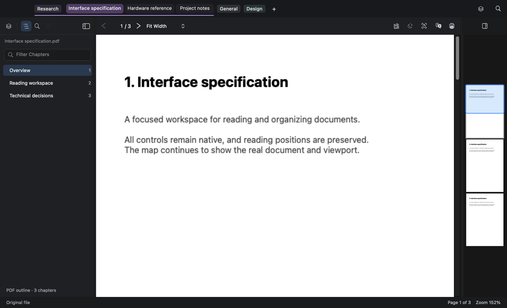
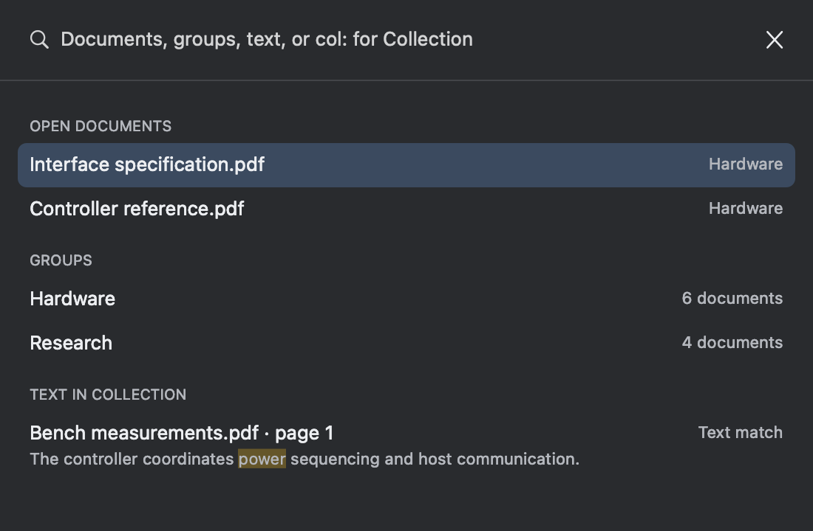
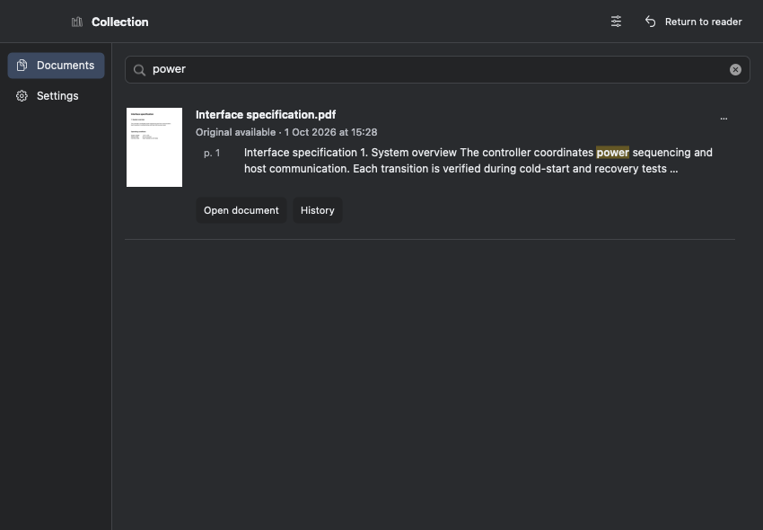

# Native workspace implementation

The approved `reader-workspace.fragment.html` is the visual reference. This is an implementation pass, not a new design proposal.

## Work plan

1. Compact titlebar tabs and group labels: preserve document focus when toggling groups, remove extensions from tab labels only, use stable title geometry and hover-close fade, keep all groups discoverable.
2. One sidebar: separated Groups control followed by document icons, filename with extension below the header, real Find controls in the Find panel. Align the reading controls and real map header with the sidebar header.
3. Collection and command palette: reproduce the approved compact hierarchy with real previews, search, settings, history, and keyboard behavior.
4. Integration: offscreen renders of the actual native views at multiple widths and appearances; focused behavior, YAML restoration, Markdown, Collection, updater and release-pipeline regression tests; fix issues before rebuilding dist.

## Design contract

The reader needs to move quickly among many grouped technical documents. Document content remains the focal area. Compact neutral surfaces and subdued separators retain room for content; group accents identify membership, with a stronger selected tab. System typography remains readable at 12 points in tabs, with 24-point tab surfaces, 20-point group labels, and 44-point aligned panel/reading headers. Icons have hover help and accessibility labels. Groups remain separate from document tools. No renderer margins or page coordinates change.

## Ownership

- Tab agent: strip layout, drawing, hover, drag geometry, group activation, accessibility and related tests.
- Collection/palette agent: Collection companion and Cmd+K native presentation and focused tests.
- Verification agent: actual-reader offscreen probe; updater/release pipeline and regression review.
- Integrator: sidebar, toolbar, real map host geometry, Find focus routing, integration and build.

## Verification notes

Initial updater and release pipeline suites passed, including 56 release-workflow checks. Sidebar tests now verify one aligned icon row, non-overlapping targets at minimum width, correct visual keyboard order, disabled-item skipping, selected accessibility state and retained focus. Native windows are never ordered on screen by the visual probe; the user's running app remains uninterrupted.

## Implementation decisions

The sidebar continues using the existing stable mode tags and YAML state. The real search field is reparented instead of replaced, preserving queries, delegate behavior and result navigation. Both PDF and Markdown use the same page host top anchor. The real minimap, thumbnail queue and drag behavior are retained; only its header space changes. Cmd+K presentation is extracted from the oversized coordinator into a focused category.

## Integration review and corrections

- Variable-width document tabs exposed an old equal-width drag assumption; the strip now shifts neighboring tabs by the dragged tab's real width. Compact hit targets no longer overlap the next tab.
- Find moves the existing search field into the sidebar, preserving queries, regex and result navigation; its empty-state wording now refers to the visible field.
- At narrow widths, direct document tools wrap into a second row. The fit label stays readable and tools remain visible. Markdown retains its existing text-size controls.
- Older-version status occupies a separate toolbar line, avoiding crowding page/zoom controls. The full-reader probe caught and corrected the first-use constraint attachment order before it could ship.
- The real map header aligns with the first sidebar/reading row, including at narrow widths; the map's renderer and interactions remain intact.
- History uses the same flat control style and the shared sidebar filename, avoiding duplicate headings. Collection return-to-reader uses existing companion IPC.
- Fresh workspaces expose General immediately without adding persistence or layout callbacks to normalization.

## User-facing changes for future release notes

Compact titlebar tabs show names without extensions, preserve their position when close controls appear, and keep the current document visible while a group is folded. An all-groups picker remains available on the right. The single sidebar has direct, labeled-by-tooltip icons and a separate Groups control. Find, regex and match navigation live in its Find panel. Reading tools and the real map share aligned headers. Collection and ⌘K use the same compact surfaces, hierarchy and controls.

## AI-facing notes for future release notes

Existing group commands and YAML schemas remain compatible. Presentation is extracted into focused workspace/palette files. The new offscreen reader probe runs the actual window construction and PDF/Markdown hosts, forbids window presentation, verifies control geometry and updater-menu routing, and exports reproducible visual evidence. No updater endpoints, bundle identities, update installation flow, or release publishing behavior change.

## Final evidence

The final probe passes all 18 offscreen cases, including the 560-point minimum-width case, actual PDF and Markdown content, Find, a missing-original older-version pill, and presentation restoration. Focused tab/group, sidebar, YAML, launch policy, reader navigation and palette suites pass. The Collection/native integration runner passes with a real PDF preview and highlighted text search. Updater checks pass independently: 32 updater cases and 56 release workflow checks. The app and Collection helper are rebuilt into `dist/ShenzhenPDF.app`; no application is launched and no public release is published by this task.

