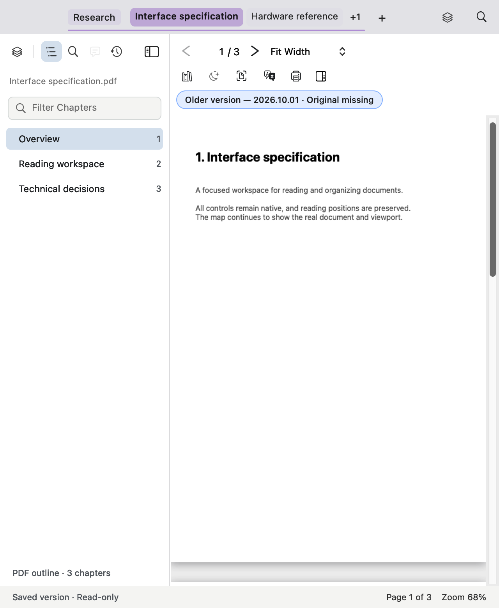
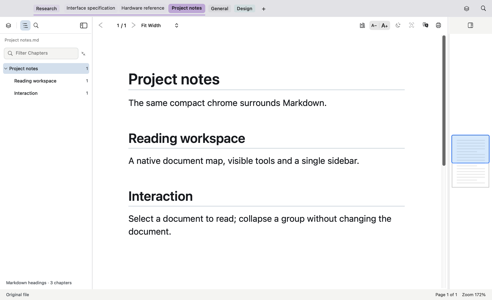
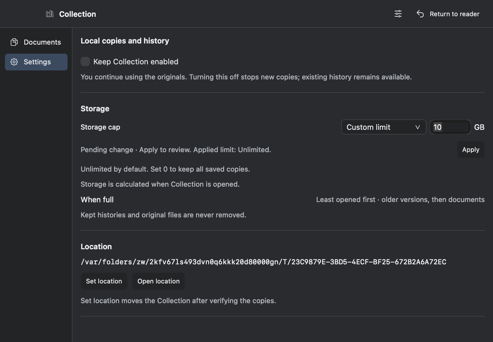

# Native workspace verification

The implementation is checked against `reader-workspace.fragment.html`. The browser proposal is a visual contract for chrome and information hierarchy; document rendering, the working map, search, updater, Collection storage and YAML state keep their native behavior.

## Headless reader evidence

Run from the repository root:

```sh
make -C portable -f Makefile -f mac/tests/workspace-probe.mk -j4 \
  mac-workspace-probe WORKSPACE_EVIDENCE_DIR=/tmp/sz-workspace-native
```

`SPDFMacWorkspaceProbe.mm` links the production reader and calls its actual window builder. It does not call the application entry point or launch delegate. It creates a private temporary state directory and a three-page PDF with outlines, supplies those pages to the real document canvas and map, and loads a Markdown document through the real session renderer. The fixture captures the view hierarchy with AppKit bitmap caching, never with a screenshot of the user's app. A fail-fast override rejects any attempt to order a window on screen. Disk persistence is stubbed at the delegate boundary.

The evidence matrix covers light and dark appearances; 1280, 880, 640 and 560-point windows; both side panels; hidden panels; presentation chrome; the real Find query/results panel; and the Markdown host. The native menu's Check for Updates item is located and validated. Its action must reach the updater as an explicit user request; the network entry point is replaced only during this assertion.

The probe uses incremental objects under `portable/build/workspace-probe/`, allowing repeated visual checks without relinking the app bundle or disturbing `dist`. PNGs and geometry output are evidence, not a pixel-perfect baseline: platform font rendering can vary. Review alignment, title clipping, selected tabs, tool discoverability and header boundaries directly.

## Regression gates

| Area | Commands | Required outcome |
|---|---|---|
| Update and release | `make -C portable mac-updater-tests release-pipeline-tests` | Version comparisons, exact-tag health checks, download limits, signing gates, safe publication and rollback contracts pass. No live update is installed. |
| Tabs and groups | `make -C portable mac-tab-strip-geometry-tests mac-tab-strip-interaction-tests mac-tab-strip-style-tests mac-tab-group-tests mac-tab-group-interaction-tests mac-tab-state-tests` | Correct hit targets and overflow; complete title metadata; collapse keeps the active document; drag ordering and persistent groups remain intact. |
| Sidebar and state | `make -C portable mac-sidebar-navigation-tests mac-sidebar-workspace-tests mac-group-management-tests mac-state-yaml-tests` | PDF/Markdown capabilities update with document switches; direct buttons and keyboard modes work; group/query/visibility state round-trips; hidden panels stay lazy. |
| Reader/map/window | `make -C portable mac-window-chrome-tests mac-window-shortcut-tests mac-minimap-window-tests mac-reading-theme-chrome-tests mac-launch-work-policy-tests` | Header controls retain hit ownership; map geometry and theming remain functional; restored frames and launch deferral remain intact. |
| Collection and command search | `make -C portable mac-collection-store-tests mac-collection-search-tests mac-collection-palette-tests mac-palette-results-tests mac-collection-reader-navigation-tests mac-collection-companion-link-tests` | Ranked results and navigation stay correct; collection storage is unchanged; helper links its exact source set without the reader or updater. |
| Markdown/native integration | `make -C portable mac-markdown-tests` | Rendering, host integration, comments availability, Collection previews and history continue to work at production optimization. |
| Packaging | `make -C portable mac-app`; `tools/check-file-sizes.sh` | Fresh reader and helper bundle build successfully, matching source artifacts; size limits hold. |

Check test exit codes. A printed success substring cannot substitute for the runner's result. Rebuild a target after relevant source changes before trusting an earlier pass.

## Integration risks to review

- The app globs `mac/*.mm`; Collection deliberately uses `mac/companion/sources.mk`. Shared chrome dependencies must be available in both without dragging the reader, MuPDF or updater into the helper.
- The Markdown integration runner has its own explicit source list. A production build alone does not prove the headless suites link.
- Sidebar modes are persisted identifiers. Their visual order can change without changing the identifiers stored in YAML.
- Extending panel headers into the toolbar row changes coordinate relationships. Check PDF and Markdown hosts, sidebar resizing, map hiding, short windows and presentation independently.
- Collapsing a group must change layout only. It must not change the active document or overwrite that document's position.
- Tab-only extension removal must not alter path identity, filenames in the sidebar, accessibility help, duplicate resolution, menus or updater assets.
- The updater launch hook remains deferred until first paint, its health handshake precedes scheduled checks, and every supported window process retains recurring checks. Chrome construction must not invoke these services.

## Baseline, 1 October 2026

Before completing the overhaul, `mac-updater-tests` and `release-pipeline-tests` exited 0. The updater reported 32 cases and release workflow reported 56 passed, 0 failed. The native workspace probe also exited 0 after integration: 18 light/dark PNGs, real PDF and Markdown hosts, real Find search results, presentation restore, updater menu routing, retained filename extensions, untruncated zoom labels and non-overlapping visible toolbar controls. Markdown capture waits for `navigationReady`, since Ready precedes the deferred viewport reveal. Repeat the remaining gates after the final production edits. No release was published and no running application was replaced by these checks.


## Review corrections and final evidence

The extended probe caught an initial archived-version crash: the pill's width constraint was activated before it shared the toolbar's hierarchy. The production fix attaches it first and puts it in its own row, preserving page/zoom controls in narrow windows. A separate source review found that Markdown text-size controls had been removed without another reachable entry point. They remain direct controls for Markdown, hidden for PDF, and the probe asserts that boundary. Empty Find guidance now points to the field above it.

After those corrections, the probe and updater/release gates exited 0. This checks the menu route without contacting the release server or installing an update. App launch, updater scheduling and the live update swap are covered by their focused suites rather than performed against the user's running reader.

These are actual AppKit content views captured offscreen. The PDF fixture refills map thumbnails after native zoom invalidation because it intentionally has no background render service. The thumbnails come from the same fixture PDF. Window-server traffic lights are outside the captured content view.







## Critic correction loops, 1 October 2026

Three review rounds now supersede the baseline above. Baseline critics scored similarity **7.7/10** and UX **7.8/10**. The first correction pass reached **8.9/10 / 8.8/10** under a fresh independent critic. That review found clipped outline selection/page numbers and an incorrect original-file footer on saved versions. After correction, the independent final review scores **9.2/10 similarity and 9.1/10 UX**, with no major or medium interface findings remaining. These are critic judgments about the native chrome, not a numeric pixel comparison or a claim of identical document rendering. See [ranked independent review](critic-loop-independent.md), [initial similarity findings](critic-loop-similarity.md), and [initial UX findings](critic-loop-ux.md).

The accepted native details now include 32-point outline rows, regular 12-point text, right-aligned page numbers, inset rounded selection, a chapter summary, 30-point rounded search fields, consistent direct icons, metadata above highlighted Find context, filename extensions sourced from real paths, and a non-contradictory saved-version footer. Collection Apply is directly below Storage cap, before help and Location. The command palette uses an Esc close affordance; Collection thumbnails retain a subtle actual-page boundary.

The full production-window probe now seeds extensionless tab titles, so it can detect the real filename bug rather than passing on conveniently full titles. It checks sidebar/table clipping, actual narrow-window map/sidebar toggles, preserved preferred widths, real two-version Collection history, PDF/Markdown rendering hosts, and updater menu routing. PDFKit fixtures refill document and map images after native cache invalidation; the probe intentionally does not start the app render service. All windows remain offscreen. The final probe exited 0, as did the full Markdown/Collection UI runner and the focused regression matrix (including 32 updater cases and 56 release-workflow cases).

Compact windows temporarily show one side panel when both would leave less than 320 points for reading. The last explicitly requested panel wins, both return when space allows, and preferred widths, visibility and compact-panel choice persist through YAML. This changes chrome layout only; document margins and map behavior remain intact.





The final performance follow-up makes repeated panel-policy evaluation a no-op for raw layout/render setters. A 1,000-request counter test verifies this, and the complete production-window probe passed again after the optimization (`/tmp/sz-workspace-validated.log`). Source-size ratcheting also passed; the main coordinator is reduced from15,730 to15,559 lines through the focused sidebar extraction.


Final packaging: `make -C portable mac-app` exited0 and rebuilt `dist/ShenzhenPDF.app` plus its Collection helper. `codesign --verify --deep --strict dist/ShenzhenPDF.app` exited0. The reader executable is newer than every native source/header,42,828,944 bytes. Bundle metadata remains26.9.23/build1 for this local development build. It has not been published or launched.
