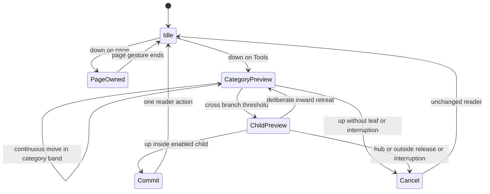

# Reader controls wheel — comparable interaction study

Research checked 24 September 2026. This supersedes the document-switch-wheel interpretation in the earlier
proposal. Its old review scores do not validate this interaction. Scope: controls affecting the current reading
experience only. Documents, Groups, Collection and library navigation do not belong in this wheel.

This is a desk study of official documentation and its embedded illustrations/demos. I did not operate the
comparable apps, measure their latency, or conduct a usability study. **Documented** below means the cited manual
states the behavior. **Inference / proposal** means our design judgment. An undocumented cancellation path is
left unknown instead of being borrowed from another app.

## What the examples actually establish

| Comparable | Documented trigger and movement | Selection / cancellation evidence | Useful lesson and limit |
|---|---|---|---|
| **Procreate QuickMenu, iPad** | A configurable Touch shortcut can start a continuous touch, directional drag and release. Six actions are configurable. | Release selects in its fast Touch path. The alternative tap opens a persistent menu. Its Preferences manual separately documents dismissal by tapping outside or continuing to paint; that does **not** establish center-return cancellation during a held stroke. | Strongest touch precedent for the requested single contact. Its recommended finger shortcut assumes Pencil painting; the same canvas-wide finger trigger would conflict with reading. [QuickMenu](https://help.procreate.com/procreate/handbook/interface-gestures/quickmenu), [Preferences](https://help.procreate.com/procreate/handbook/actions/actions-preferences) |
| **Sketchbook Pro Lagoon, desktop** | Hold a Lagoon category icon, move toward a tool, lift when highlighted. Preferences also documents expert flicks without waiting for icons. | Lift/release selects the highlighted tool. The cited passages do not specify center/outside cancellation. | Strong precedent for a dedicated origin, directional selection and a novice-visible/expert-fast path. Desktop stylus/right-mouse behavior is not proof of phone touch behavior. [Basic UI](https://help.sketchbook.com/docs/basic-ui-elements), [Preferences](https://help.sketchbook.com/docs/preferences-in-sketchbook) |
| **Concepts Tool Wheel, iOS/Android/Windows** | Persistent wheel: tap one of up to eight outer tools. Inner settings expose size, opacity and smoothing controls. Hold-drag relocates the wheel; it can become a toolbar. | The documented tool choice is a tap. No continuous radial release-to-select or held-gesture cancellation is established by this manual. | Useful compact hierarchy and adaptable layout; not evidence of the requested one-stroke trigger. Borrow the separation of tool and parameter, not an imagined marking gesture. [Workspace](https://concepts.app/en/manual/workspace) |
| **Samsung Air command, Galaxy devices** | Remove the S Pen, or hover and press its button; the floating icon is another entry. The menu exposes configurable pen-feature/app shortcuts. | The cited guide describes opening the menu and choosing commands; it does not document finger-down→slide→release selection or that gesture's cancellation. | Input modality separates invocation from ordinary touch. It depends on pen hardware or a separate invocation, so it is not the requested general finger solution. Features vary by model/software. [Air command guide](https://www.samsung.com/us/support/answer/ANS10002892/) |

The distinction matters: a circular menu is a visual arrangement; a marking menu is an input protocol. Of these
examples, Procreate explicitly documents the desired same-contact touch sequence. Sketchbook supplies a closely
related dedicated-origin protocol. Concepts and Samsung clarify alternatives and tradeoffs rather than proving
all radial interfaces work the same way.

## Four sequences, without invented steps

These diagrams summarize the cited behavior. `UP` marks the end of a contact. A second contact is not silently
folded into the first.

```text
Procreate — configured Touch fast path [documented]
DOWN with Touch shortcut ── keep contact / drag toward action ── UP ── action
                      └── ordinary tap ends ── latched menu ── another tap selects
```

The practical borrowing is the uninterrupted fast path and predictable action placement. The handbook recommends
Touch for people painting with Pencil, while its gesture guide also documents finger painting. **Inference:** a
reader cannot assume that the finger is available for global shortcuts. [Procreate gestures](https://help.procreate.com/procreate/handbook/interface-gestures/gestures).

```text
Sketchbook Pro — Lagoon [documented desktop sequence]
DOWN on category icon ── hold / reveal tools ── drag to highlight ── UP ── tool
Expert path: directional flick can activate without waiting for icons to appear.
```

Do not substitute the mobile feature under the same name. The mobile manual documents a marking-menu control,
and its Rapid UI describes a non-dominant-hand trigger that exposes an editor while the other hand selects.
That is a different interaction. Android's optional two-handed fullscreen mode keeps its windows open only while
the trigger is held. **Inference:** dedicated controls can protect the drawing surface, but a two-handed editor
is a poor default for one-handed reading. [Rapid UI](https://help.sketchbook.com/docs/hiding-the-ui-while-you-draw),
[mobile preferences](https://help.sketchbook.com/docs/preferences-in-sketchbook).

```text
Concepts — persistent wheel [documented]
TAP outer tool ── tool becomes active
TAP inner preference ── slider/presets ── drag slider to change value
HOLD + DRAG wheel ── reposition / transform into toolbar   [different operation]
```

**Inference:** retain separate treatment of discrete commands and continuous values. A “Night” toggle and a
brightness slider should not share an ambiguous release behavior. Concepts is also evidence that a list/bar
alternative can preserve access to the same tools; it does not prove our proposed hierarchy is usable.

```text
Samsung Air command [documented]
Remove pen OR hover + hardware button OR floating-icon tap ── menu ── choose command
```

**Inference:** a clearly owned invocation reduces ambiguity. The phone reader needs an owned **on-screen Tools
origin**, since a stylus button is not universally available. We should not claim Samsung demonstrates a finger
marking gesture or derive cancellation semantics from its circular appearance.

## Reader references: the page already owns these gestures

PDF Expert's iOS guide documents two-finger zoom and fitting to width/page through zooming. Its current help
catalog includes scrolling, page jumps, bookmarks, themes, read-aloud, search and content selection. **Inference:**
reader controls have enough breadth to need grouping, but two-finger input is already important reading input.
[PDF Expert zoom](https://support.readdle.com/pdfexpert/en_US/reading-pdfs/zooming-modes-in-pdf-expert-for-ios),
[reader help catalog](https://support.readdle.com/pdfexpert/en_US/using-pdf-expert).

Adobe's Android navigation guide documents smart double-tap zoom, page-edge tap zones in page-by-page mode and a
scrubber manipulated by long-press-and-slide. That guide contains older UI conventions, so it is a behavioral
reference, not a claim about every current toolbar. Adobe's current mobile accessibility guide explicitly uses
standard TalkBack and VoiceOver gestures. [Android navigation](https://www.adobe.com/devnet-docs/acrobat/android/en/navigatesearch.html),
[current accessibility](https://helpx.adobe.com/acrobat/mobile/accessibility/gesture-features.html).

Apple's current iPhone Preview instructions use touch-and-hold on the first word followed by selection-handle
movement for text selection. This directly argues against reusing page long-press as our invocation.
[Preview text selection](https://support.apple.com/en-gb/guide/iphone/iph73ca5c8e6/ios).

These are product-level conflict examples, not OS gesture-exclusion rules. Platform edge/navigation requirements
belong to the separate Android/iOS gesture-contract research. None justifies disabling a system gesture so that
our menu can win.

## Proposed trigger contract, derived from the comparison

This section is our proposal, not behavior claimed for the apps above.

1. Reserve a visible **Tools** control in app-owned reader chrome, inside the system safe region. Keep that small
   origin available when the rest of the chrome is hidden; otherwise “reveal chrome first” adds the forbidden
   preliminary tap. A gesture starts only when its initial down is inside this control.
2. On touch-down, establish the origin and display the inward control fan. There is no mandatory hold timer,
   second tap or preliminary menu. The user may immediately slide. A quick down/up with no eligible selection
   performs no command; it does not silently latch a menu and alter the next gesture.
3. While the same contact moves, only preview selection. Execute at most one control action on a valid release.
   Pointer cancellation, ownership loss, app interruption, outside release or a return to the cancel region
   executes nothing. These cancellation choices must be implemented and tested; the source manuals do not
   establish them for us.
4. A contact beginning in page content remains page-owned through its entire lifetime—even if it later crosses
   the Tools control. Page pan/scroll/pinch and text selection must receive no delayed interception. A second
   finger during a Tools gesture cancels the menu; do not synthesize the original contact into an already-running
   page pinch. The next fresh gesture proceeds normally.
5. System-edge/navigation-origin contacts remain OS-owned. Do not enlarge the Tools target into those regions,
   request gesture exclusions, defer system edges, or infer a page-origin “intent” after movement begins.
6. Screen readers, switch access and keyboard users receive a conventional Reader controls list containing the
   same commands. That is an accessibility equivalent, not a prerequisite for the one-contact gesture. The
   list can be exposed through a separately labeled standard button/action; it does not require changing the
   continuous gesture's release rules.

## Exploratory geometry — superseded by the final interaction study

The numeric candidate below was explored before the agreed prototype: the final study and command-wheel
prototype use a fixed Tools-control center, 90 dp category gate, 62 dp retreat, 24 dp cancel hub, and a
108–160 dp child band with up to eight children across the entire upper fan. The 3–4-child/radius-132
recommendation below is retained as an explicitly superseded alternative, not the implementation contract.

### The geometry problem: hierarchy without twenty tiny slices

A full circle can fit six ordinary actions, but **all** reader controls will not fit as twenty small, labeled
wedges. A bottom-origin full circle also spends half its geometry below the thumb or toward the system edge.
The right comparison is therefore a flat inward fan versus a hierarchical inward fan, not a prettier circle.

| Candidate geometry | Same-contact path | Capacity / advantage | Cost / failure to avoid |
|---|---|---|---|
| Flat inward fan, 4–6 actions | Down Tools → direction → release | Short path and stable motor memory | Fits a frequent subset, not the full control inventory. A More sector must not become a mandatory second tap for normal commands. |
| Six categories with children squeezed into their same narrow wedges | Down → category wedge → child in its angular subdivision → release | Looks like one coherent wheel | Reject as default: six categories over 180° give 30° each; three children make 10° targets. At radius 170 dp, an arc is only about 30 dp wide. |
| **Six-category fan, then expanded child fan** | Down Tools → cross category band → continue outward/bend into broad child → release | Offers hierarchy in one continuous contact; one family’s children are visible at a time | Longer path and a visual transition. Category must freeze before children activate, or curved paths will switch branches unintentionally. Needs real touch testing. |
| Full centered wheel with nested rings | Down Tools → travel to relocated center → category → child → release | More symmetric space | Adds a travel corridor/recenter requirement and risks wrong selection beneath the moving thumb. It does not meet the desired clean direct route as well. |

**Selected candidate:** the expanded-child fan, now specified in [the canonical study](control-wheel-study.md). The exploratory four-child layout used a larger family radius and a different family map. It was retired because it did not cover the audited reader inventory without adding more levels. The current candidate uses six families (Navigate, Zoom, View, Find, Notes, Document), family lock at radius 90 and a shared 108–160 child band with up to eight children. Zoom/page parameters can continue into a rail at radius 172. These numbers are prototype choices, not findings from the source apps.

The expanded menu uses a bend in the path; it is not equivalent to a one-direction flick. Category and child order stay stable so that practice can form a repeatable movement. Layout freezes for the contact. Format, capability or layout changes cancel it. At insufficient safe bounds or large text, the explicit ordinary Controls list remains available; the design does not shrink targets to preserve the wheel metaphor. Physical reach, child-label readability and angular boundary errors remain device-study questions.

## What the next prototype must show

Use a **sequence of four actual states**, with the finger path superimposed on the same reader and the same origin:

```text
1 DOWN on Tools      2 MOVE through Zoom      3 CONTINUE into Fit width      4 UP
  categories appear    Zoom is previewed        Zoom locks; leaf highlighted  fit-width takes effect
  finger remains down  no setting changes       no setting changes            wheel disappears
```

Show a separate cancel sequence with the same first three frames, then inward retreat or outside release and an
unchanged page. Add a page-origin scroll crossing the launcher, a pinch, text-selection long-press, and an
OS-edge-origin swipe; the wheel must remain absent. A still image of an already-open fan cannot demonstrate any
of these requirements. A presentation should put the comparable sequence beside the proposed sequence and call
out the borrowed rule, rather than displaying an orphan screenshot of a circular control.



That state diagram is proposed behavior. The test evidence must show pointer down/move/up order and resulting
reader state, not infer it from a screenshot. In particular, require: zero actions before release; exactly one
action after release; no preliminary taps; no document identity change; no activation from page/system origins;
no timer-dependent branch selection; a discoverable equivalent list; safe cancel on multi-touch/interruption;
and explicit unavailable states. Native validation must still cover actual engine gesture ownership, Android
Back/system navigation, iOS edges, TalkBack/VoiceOver and a physical thumb. No prior prototype score covers this
corrected control wheel.
