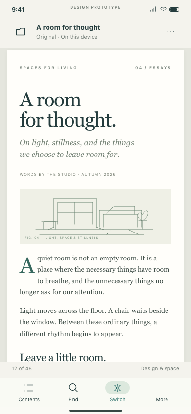
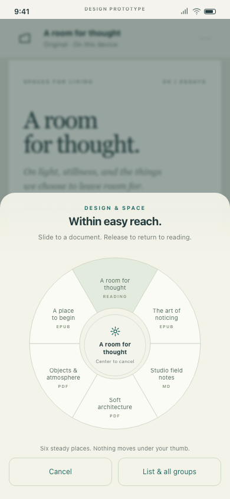
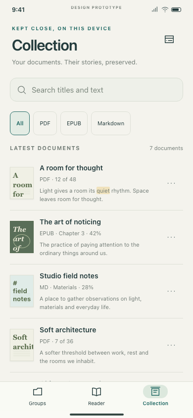
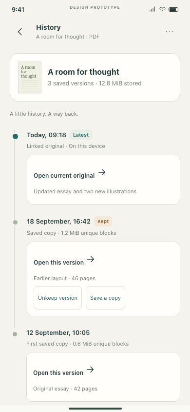
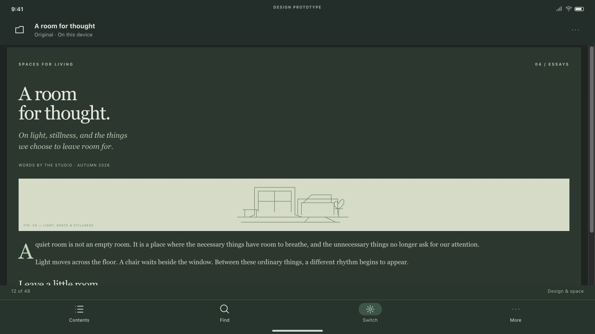
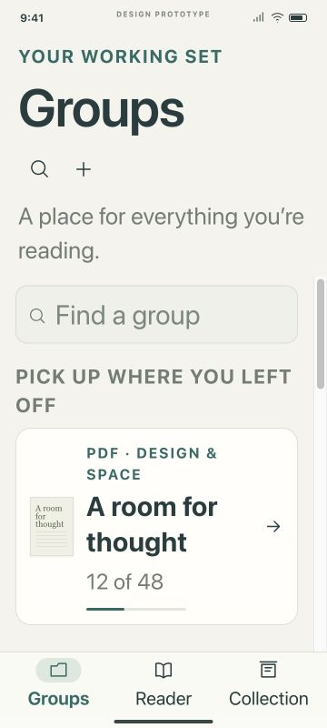
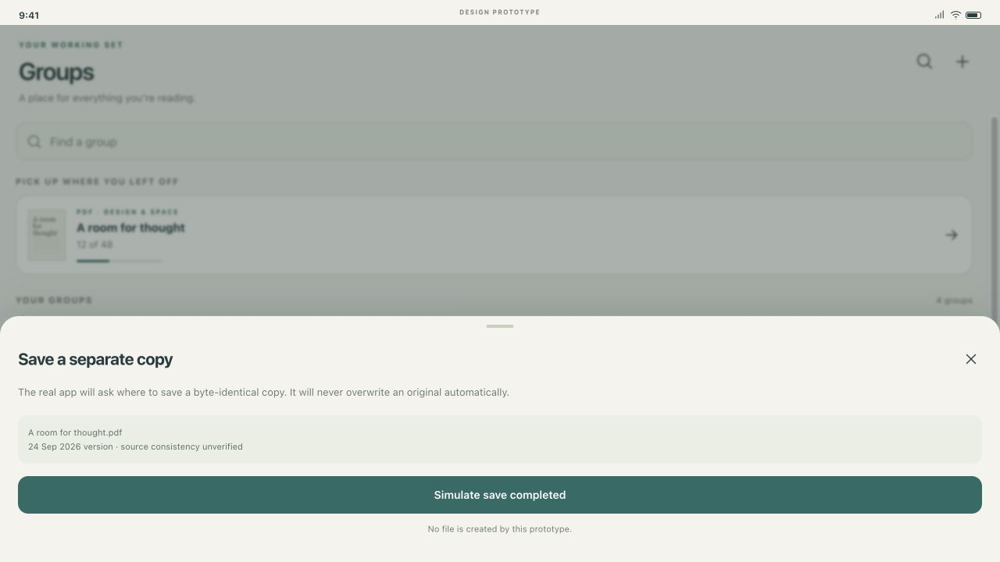
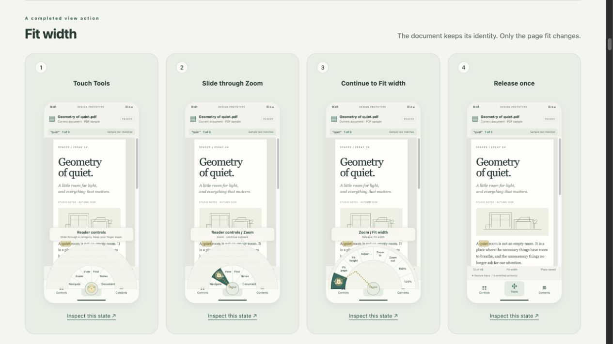
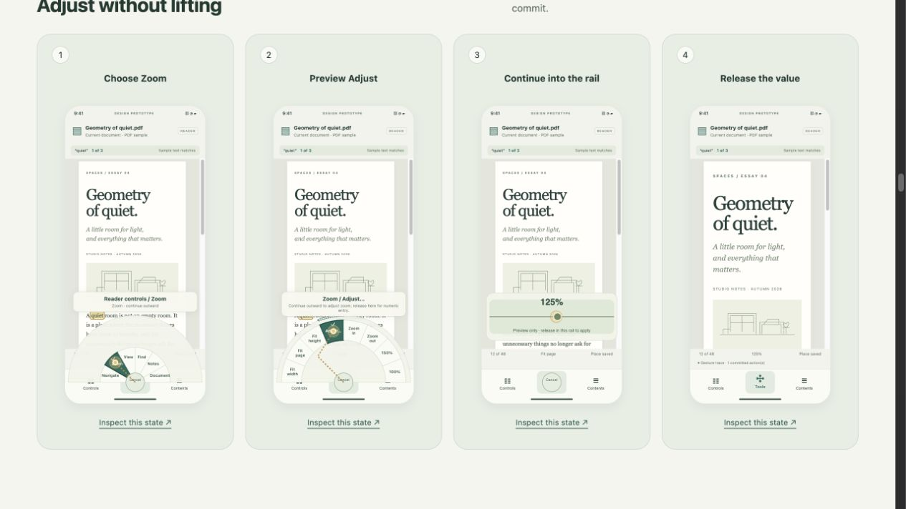

# Mobile design journal · 24 September 2026

**Revision notice:** the original document-switching wheel below was rejected. Its grades are historical. The current reader-controls study and appended correction log supersede that interaction.

## Scope and sequence

The prior desktop performance/release work was complete before this design task began. A separate creative technical director developed the mobile direction; an independent critic reviewed the specification before reviewing mockups. Root integrated the contracts, built the browser document and exercised the prototype in the Codex browser. No desktop app was launched or modified for this proposal.

## Decisions and reasons

1. **Reading and organization are separate.** A single-document reader avoids squeezing desktop tabs onto a phone. Groups remain persistent workspaces on their own screen. Browsing a group does not switch the document.
2. **The weapon wheel switches documents.** Six stable positions and a neutral current document support spatial memory. A center-arming corridor avoids accidental selection while moving up from the launcher. A normal tap list is the complete accessible alternative.
3. **Choose a familiar UI development loop, then prove the native seams.** React Native/Expo/TypeScript provides shared components and browser scenarios; native PDF/EPUB adapters must demonstrate fidelity and performance early. HTML mockups are interaction designs, not the future production shared UI.
4. **Make savings measurable.** Fixed 1 MiB blocks are the initial simple exact storage format. A preregistered mixed corpus compares total storage against whole-file content-addressed storage. If the target fails, evaluate maintained content-defined chunking or narrow the claim. No guaranteed EPUB recompression savings.
5. **Separate durable bytes from source truth.** A complete capture can be durably saved without proving that its provider stayed unchanged. Separate newest-capture and verified-recovery pointers determine default opens and history labels.
6. **One writer, explicit lifetimes.** Foreground TypeScript owns SQLite commands; native byte operations use opaque leases. Temporary handover allows at most active A and incoming B, with numeric staging/extraction bounds and reserve checks. Failed B leaves A readable.

## Review trail

| Global round | Phase | Score | Principal correction |
|---|---|---|---|
| 1 | Text | 8.37 | Navigation ownership, database writer, stale search, realistic storage benchmark |
| 2 | Text | 9.24 | Distinguish newest capture from verified recovery; reconcile handover disk budgets |
| 3 | Text | 9.44 | Preserve last verified recovery target during cleanup even with newer unverified bytes |
| 4 | Text | 9.57 | Text accepted; no unresolved major or medium findings |
| 5 | Visual | 8.64 | Repair document context, genuine 200% typography, focus, search and revision labels |
| 6 | Visual | 9.14 | Fix dark foreground inheritance, verified recovery return and row-specific export |
| 7 | Visual | 9.47 | Fix the same export identity issue in the direct unverified-only recovery action |
| 8 | Visual | 9.57 | Accepted; no unresolved blocker, major or medium findings in reviewed flows |

The complete independent reports are in `reviews/` and embedded in the browser document. Visual review follows text acceptance; final visual results are recorded there without substituting native implementation claims.

## Visual direction

Warm paper, deep green accents, serif reading samples and restrained chrome. Thumbnails anchor Collection results while text snippets remain beside them. History shows dated versions and a single Latest badge, separate from ordinary document rows.

These initial screenshots document the design iteration, not a frozen certification of final source. Early large-text screenshots represent the initial enlarged variant; the critic correctly required a true 200% mode before final approval.

## Validation and corrections

The director's initial fixture harness recorded 21 passing checks and no JavaScript errors. Root independently used the live browser to verify PDF sample → tap switcher → EPUB sample; separate Groups; Collection query filtering and direct document opening; dated History → Return to latest; and cleanup accounting (312+48 MiB → 286+12 MiB = 298 MiB). Search location fidelity remains native-engine work; this fixture exposes sample passages only.

The live pass found a stale filtered result count, default highlighting without a query, and an older-version footer date mismatch. The visual critic additionally inspected invoking-control focus, context-menu selection isolation, per-document history identity, global search reachability and genuine 200% text scaling. These were sent back to the director as concrete corrections.

Browser evidence covers appearance, modeled navigation and DOM accessibility only. It does not prove native TalkBack, physical touch geometry, Android URI permissions, PDF/EPUB reading, storage durability, startup latency or iPhone compatibility. The specification contains separate acceptance gates for those.

## Earlier result — superseded wheel

Text **9.57/10**; visual prototype **9.57/10**. Eight total independent review rounds, with text accepted before visual review began. The final pass corrected all reviewed major/medium findings; native implementation gates remain open by design. Root ran 18 focused state assertions, JavaScript syntax validation, local HTML reference validation, the repository file-size ratchet and whitespace checks. Final live-browser evidence and source hashes are in `prototype-evidence/final/`.

## Corrected brief: reader controls only · 24 September 2026

The user rejected the document-switching wheel. That was an interpretation error, not a styling problem. The current proposal removes documents, Groups and library navigation from the wheel. The previous grades remain historical; they do not validate this revision.

A creative director researched primary manuals for Procreate, Sketchbook, Concepts and Samsung, alongside Acrobat/PDF Expert reading gestures, Android/Apple platform guidance and marking-menu research. A separate inventory agent audited the desktop controls. Root synthesized a finite current-document command map and compared page hold, edge swipe, two fingers, invisible hot zones, floating buttons and reserved chrome. The selected prototype begins immediately on a visible Tools control outside the document viewport and system gesture area.

Six control families expand to a broad child fan. The gesture keeps one contact through command selection; release commits. Zoom/page scrubbing can continue into a value rail without lifting. Text entry, annotation placement and system destinations remain explicit task inputs. The study shows six complete four-frame sequences, not a single open-wheel image.

The independent critic caught an event-rate-dependent correction bug: a straight cross-fan path could retain a family with sparse events but unlock it with dense events. Segment-based inward retreat and outward relock now agree, with a regression test. Further corrections removed footer interference over the fan, preserved current zoom values, explained disabled commands, made the parameter continuation discoverable, trapped dialog focus among actually visible controls, restored focus to the invoker, disclosed small-layout fallbacks, and kept embedded match scrolling local. Root also corrected numeric zoom rendering to scale text rather than merely widen its container.

Root verified actual pointer traces and ordinary document scrolling, the equivalent Controls list, 200% text, numeric state, keyboard focus, 320 px narrow and 844×320 short layouts. All 34 pure gesture tests pass. The final independent review rates the design/prototype 9.35/10 with no remaining major/medium finding in that scope. It does not score native gesture safety or participant success, which remain untested. Full results, screenshots and source fingerprints are in [the evidence log](control-wheel-evidence/README.md).

The canonical mobile spec and browser entry point now use this corrected design. The broader architecture remains accessible as an appendix. No native reader or desktop application code changed during this revision.
