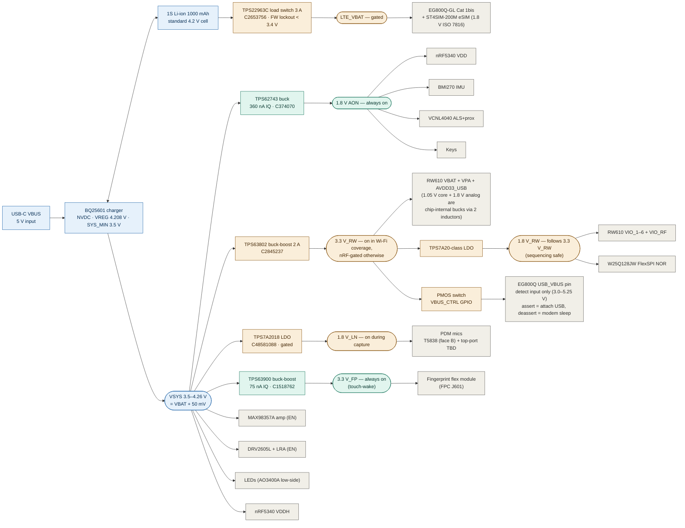

# Power tree — remote-motherboard (rev D, 2026-09-01)

Mirrors `电源树-power-tree-locked-2026.08.24.drawio` rev D (bare RW610 HVQFN ·
fingerprint 3.3 V_FP always-on TPS63900 · no OTG) and the locked table in
`architecture-decisions.md`.

**Legend:** green = always-on · amber = gated/conditional · blue = source path
· gray = load.

Notes (from the locked table):

- **RW610 supplies only** VBAT/VPA/AVDD33_USB (3.3 V) and VIO pads (1.8 V);
  AVDD18/VCORE come from the chip's internal bucks through two mandatory
  external inductors. Sequencing: VBAT/VPA no later than any rail, PDn held
  low until stable — satisfied by construction since 1.8 V_RW derives from
  3.3 V_RW.
- **LTE hangs off the BAT node** through the load switch; VREG = 4.208 V
  keeps the node under the module's 4.3 V absolute max (standard 4.2 V cell
  mandatory, no 4.35/4.4 V cell).
- **No OTG / no 5 V boost** — EG800Q USB_VBUS is a detect input; the PMOS
  from 3.3 V_RW drives it for USB attach/detach control.
- Reset supervision: custom discrete circuit (STM6520/6519 dropped).
