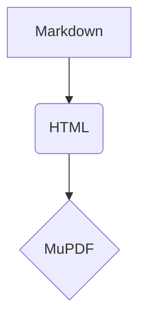

<div align="center">

# ShenzhenPDF Fixture

 

**A README-style document exercising every construct the Windows Markdown reader renders.**

</div>

This paragraph has *emphasis*, **strong text**, `inline code`, a [link](https://example.com/ "Example"),
an internal [anchor link](#tables), ~~struck text~~, H<sub>2</sub>O and E=mc<sup>2</sup>, a key cap
<kbd>Ctrl</kbd>+<kbd>F</kbd>, an autolink https://shenzhen.example/, a [[Wiki Page|wikilink]],
CJK 深圳 東京 한글, and emoji 🚀 ✓.

> A blockquote with a left border and muted text, GitHub-style. It wraps onto a second line to show
> the border height.

> [!NOTE]
> Callouts render with a bold title line.

## Lists

- First item
- Second item
  - Nested item
    - Deep item
- [x] Done task
- [ ] Open task

3. Third
4. Fourth

## Tables

| Feature    | macOS | Count | Notes                                                                    |
| ---------- | :---: | ----: | ------------------------------------------------------------------------ |
| Tabs       |   ✓   |    12 | Long cell text that should wrap inside its own column rather than push the table off the page edge. |
| Search     |   ✓   |     3 | Short                                                                    |
| Dark theme |   ✓   | 1,204 | Zebra row                                                                |
| Print      |   ✓   |     7 | Plain row                                                                |

## Code

```c
static int render(const spdf_document* doc) {
    // a comment
    return spdf_render_page_rgba(doc, 0, 1.5f, "out.png");
}
```

```python
def greet(name: str) -> str:
    """Docstring."""
    return f"Hello, {name}!"  # comment
```

```json
{ "name": "shenzhen-pdf", "version": 26.9, "tags": ["md", null, true] }
```

```yaml
# settings
markdownFontScale: 1.25
theme: dark
tags:
  - md
```

```bash
export SPDF_OUT='C:\spdf-build\track-md'
cmd //c "$WT\portable\win\build-native.cmd" && echo done
```



```
no language: plain text stays plain
```

### Details

<details>
<summary>Build notes</summary>

Hidden-by-default content rendered expanded, with **Markdown** inside.

</details>

<script>alert("never evaluated")</script>
<p onclick="alert(1)" style="color:red">An HTML paragraph whose handlers and styles are stripped.</p>

#### A fourth-level heading

Fourth-level headings stay out of the chapter outline but keep their anchor.

---

## Images


An inline image  inside a sentence keeps its flow.

## Math

Inline math $x^2 + y^2 = z^2$, Greek $\alpha \to \omega$, fractions $\frac{1}{2}$ and $\frac{a}{b}$,
a root $\sqrt{a^2 + b^2}$, sets $A \subseteq B$ and text $\text{if } n \ge 1$.

$$\int_0^\infty e^{-x} \, dx = 1$$

## Long section

Paragraph one of the long section. Filler text repeats so the document runs onto further pages and the
search test has a page to find. Lorem ipsum dolor sit amet, consectetur adipiscing elit, sed do eiusmod
tempor incididunt ut labore et dolore magna aliqua.

Paragraph two of the long section. Ut enim ad minim veniam, quis nostrud exercitation ullamco laboris nisi
ut aliquip ex ea commodo consequat. Duis aute irure dolor in reprehenderit in voluptate velit esse cillum
dolore eu fugiat nulla pariatur.

Paragraph three of the long section. Excepteur sint occaecat cupidatat non proident, sunt in culpa qui
officia deserunt mollit anim id est laborum. Sed ut perspiciatis unde omnis iste natus error sit voluptatem
accusantium doloremque laudantium.

Paragraph four of the long section. Nemo enim ipsam voluptatem quia voluptas sit aspernatur aut odit aut
fugit, sed quia consequuntur magni dolores eos qui ratione voluptatem sequi nesciunt.

Paragraph five of the long section. Neque porro quisquam est, qui dolorem ipsum quia dolor sit amet,
consectetur, adipisci velit, sed quia non numquam eius modi tempora incidunt ut labore et dolore magnam
aliquam quaerat voluptatem.

Paragraph six of the long section. Ut enim ad minima veniam, quis nostrum exercitationem ullam corporis
suscipit laboriosam, nisi ut aliquid ex ea commodi consequatur.

Paragraph seven of the long section. Quis autem vel eum iure reprehenderit qui in ea voluptate velit esse
quam nihil molestiae consequatur, vel illum qui dolorem eum fugiat quo voluptas nulla pariatur.

Paragraph eight of the long section. At vero eos et accusamus et iusto odio dignissimos ducimus qui
blanditiis praesentium voluptatum deleniti atque corrupti quos dolores et quas molestias excepturi sint.

Paragraph nine of the long section. Temporibus autem quibusdam et aut officiis debitis aut rerum
necessitatibus saepe eveniet ut et voluptates repudiandae sint et molestiae non recusandae.

Paragraph ten of the long section. Itaque earum rerum hic tenetur a sapiente delectus, ut aut reiciendis
voluptatibus maiores alias consequatur aut perferendis doloribus asperiores repellat.

## Colophon

The last section carries the unique word zanzibar for the search test.
