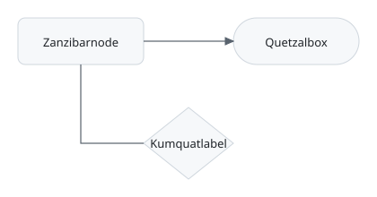

# SVG diagram

The figure below is an SVG file referenced as an image, which is the route the
Markdown design memo proposed for drawing Mermaid, js-sequence and flowchart
fences as vector figures.

This paragraph is the control. It carries the word Aardvark exactly once, and
that word appears nowhere inside the picture; the picture's own three labels
appear nowhere in the prose. A search that finds the one and not the other has
therefore told us something about the picture rather than about the search.
