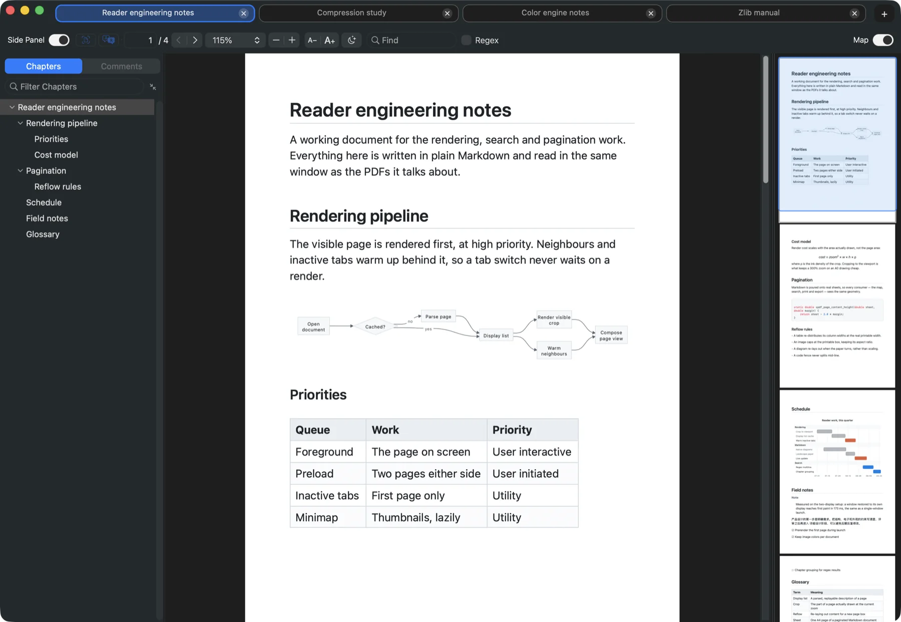
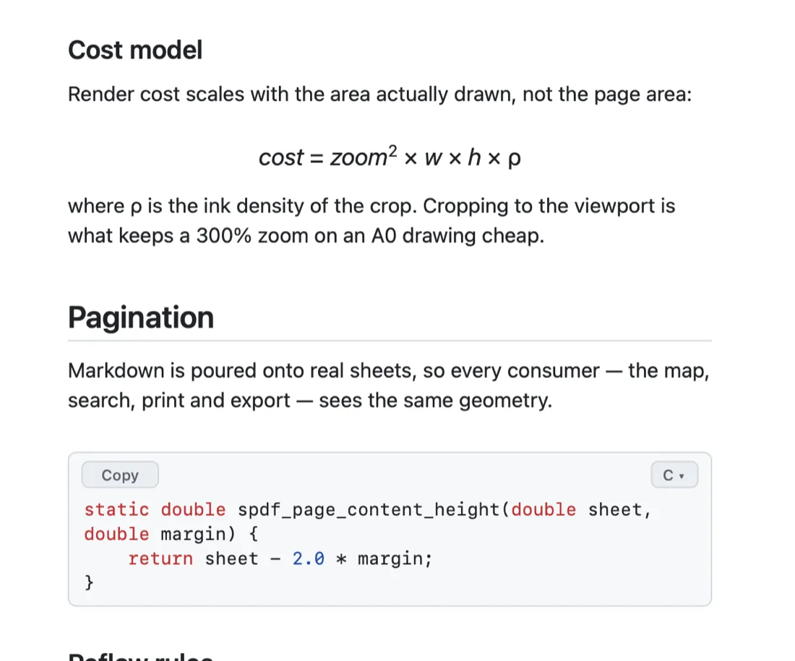
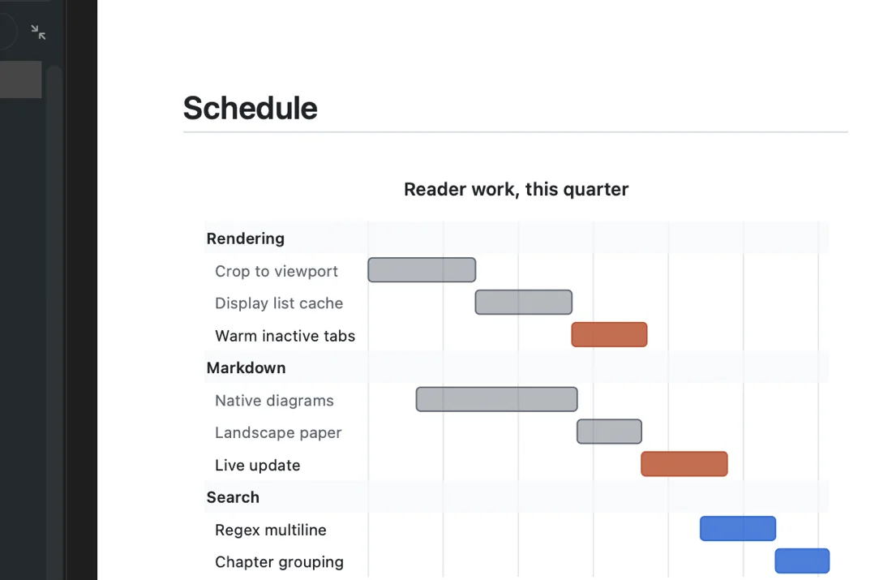
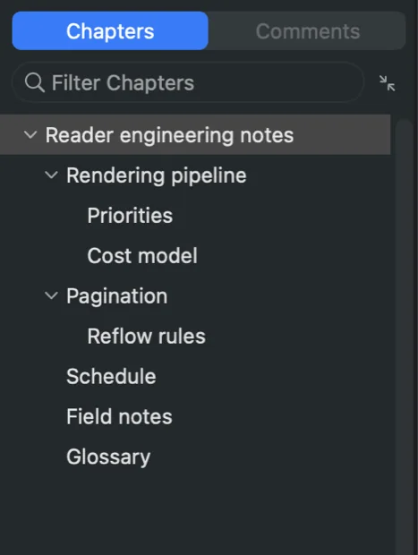
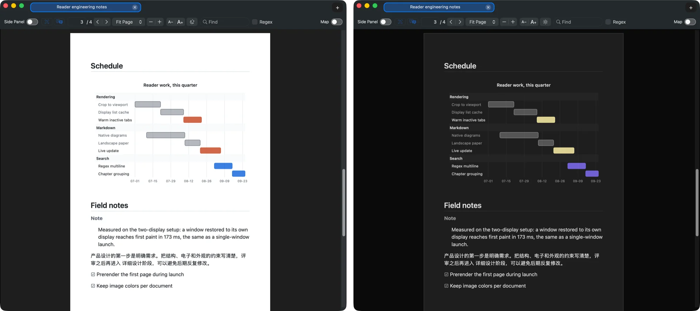

<h1 align="center">ShenzhenPDF</h1>
<p align="center"><b>A fast, tabbed native Mac reader for PDFs and Markdown, with on-device OCR and offline translation built in.</b></p>

<div align="center">

<a href="https://github.com/casimir-engineering/shenzhen-pdf/releases/latest/download/ShenzhenPDF-mac-arm64.dmg"></a>

<sub>Latest <b>26.9.5-2</b> · Apple Silicon</sub>

<a href="https://github.com/casimir-engineering/shenzhen-pdf/releases/latest">All releases</a> · <a href="https://github.com/casimir-engineering/shenzhen-pdf">Source</a>

</div>

<p align="center"></p>

<p align="center">Type anywhere to search. Jump anywhere with the map. Launches instantly. Relaunches exactly as you left it.</p>

ShenzhenPDF opens PDFs (and more) instantly, keeps documents in tidy tabs, and does the heavy work — OCR and translation — entirely on-device. **Inspired by SumatraPDF, a separate project, not affiliated with it.** Everything below, exhaustively: **[docs/features.md](docs/features.md)**.

<sub><a href="#reading">Reading</a> · <a href="#markdown">Markdown</a> · <a href="#search">Search &amp; map</a> · <a href="#dark">Dark theme</a> · <a href="#powertools">OCR &amp; translation</a> · <a href="#fast">Speed</a> · <b><a href="docs/features.md">Full feature list</a></b></sub>

---

## <a id="reading"></a>Reading

<p align="center"></p>

- **Tabs and windows** — compact outlined tabs, drag to reorder, pull one out into its own window. Quit and relaunch to get every window back: its tabs, size, position, **the display it was on**, and the one you were using in front.
- **Resume where you left off** — page, zoom, scroll, search, and (for Markdown) page orientation, per document.
- **Option + scroll turns pages** <sub>macOS</sub> — anywhere in the window, at the speed you spin.
- **Presentation mode** (<kbd>Shift+Cmd+F</kbd> / <kbd>F5</kbd>), favorites and a command palette (<kbd>Cmd+K</kbd>), reopen-last-closed (<kbd>Cmd+Shift+T</kbd>).

## <a id="markdown"></a>Markdown, read like a document <sub>macOS</sub>

<p align="center"></p>

<table align="center"><tr>
<td width="50%" valign="top"></td>
<td width="50%" valign="top"></td>
</tr></table>

- **Real sheets, same reader** — GitHub-flavored typography, paginated onto A4; same tabs, chapters, map, search, zoom and export as a PDF. Rotate turns the paper landscape, and each file reopens on the sheet you last read it on.
- **Live update** — edit the file elsewhere and the page re-renders in the background and swaps in whole. Nothing blanks.
- **Diagrams, math, code** — mermaid, js-sequence and flowchart.js fences as native vector figures; `$…$` and `$$…$$` typeset natively; 31 highlighted languages with a picker and a Copy button on every block. Sanitized README HTML (badges, `<kbd>`, `<details>`, tables) renders natively. No web engine, no JavaScript, no network.

## <a id="search"></a>Search-oriented architecture

<p align="center"></p>

<table align="center"><tr>
<td width="36%" valign="top"></td>
<td width="64%" valign="top">

- **Type anywhere to search** — a live "current / total" counter, every hit highlighted in the page and marked in the map and on the scrollbar. <sub>macOS · Linux</sub>
- **Results grouped by chapter**, click to jump; regex, including patterns across line breaks. <sub>macOS · Linux</sub>
- **Nested chapters** <sub>macOS</sub> — a PDF's outline and a Markdown document's headings fold, with one expand / collapse all button beside the filter; each document remembers what you left collapsed.
- **Document map** — drag to scroll, click to jump, <kbd>Cmd</kbd>+scroll to zoom. <sub>macOS · Linux</sub>

</td></tr></table>

## <a id="dark"></a>Dark reading theme, for every document

<p align="center"></p>

- **One toggle** (<kbd>Shift+Cmd+I</kbd>) darkens PDF, XPS, EPUB and Markdown alike, onto soft #1E1E1E paper rather than pure black.
- **A remap, not an inversion** — rendered pages are remapped by lightness with their color kept, so a red warning stays red and a blue link stays blue. *Keep Image Colors* leaves photographs untouched, per document, on by default.
- **Exports stay light** — Print, Save as PDF and Copy Page always use the document's own colors.

## <a id="powertools"></a>Power tools — 100% on-device <sub>macOS · Linux</sub>

<p align="center"></p>

- **Offline translation (Argos Translate)** — a selection into a panel, or a whole PDF into a real translated file (`<name>_<lang>.pdf`) that opens when it finishes. ~19 languages incl. Chinese; text never leaves your machine.
- **Local OCR for scanned PDFs** — OCRmyPDF + Tesseract on your own machine; Simplified/Traditional Chinese, English and ~20 more, language data fetched on demand.
- **One-click toolchain install** — a missing tool or language pack is installed for you (Homebrew; apt/dnf/pacman/zypper) and the job resumes.

## <a id="fast"></a>Fast by design

- **Snappy native rendering** — the visible page first at high priority, neighbours and inactive tabs warmed quietly behind it; cached display lists and crop-to-viewport rendering keep repeats cheap. <sub>macOS · Linux</sub>
- **MuPDF-backed C core** — a compact ~93 KB core wrapping statically-linked MuPDF 1.27.2 behind a small stable ABI shared by both frontends.
- **Far more than PDF** — XPS, CBZ, EPUB/MOBI, FB2, HTML and images through MuPDF; Markdown through the native paginated renderer.

## Files, printing & updates

- **Verified daily auto-updater** — checked once a day off the launch path; every update verified offline against a pinned Developer ID (Team 66LJ4BV7Q3), hardened runtime and stapled notarization before an atomic swap with rollback.
- **Shenzhen Files as your file manager** <sub>macOS</sub> — install it and *Show in Folder* reveals there; *Settings ▸ File Manager* switches back to Finder. Picking a file always uses the native panel.
- **Native printing** with Fit / Actual Size / Custom scaling; **one-click default reader**; **human-readable YAML state** you can read, diff and edit.

## Platform support

- **macOS — the original** — Native AppKit + PDFKit.
- **Linux — parity on the reading path** — Native GTK4 + libadwaita app on the same portable C core and data formats: tabs (drag, detach, reattach), multi-window session restore, document map, chapter-grouped search sidebar, scrollbar heat-map, command palette, favorites, presentation mode, printing, auto-reload, properties panel, OCR, translation, and a minisign-verified auto-updater (deb + tarball). Instant launches via an optional resident mode. Built from `portable/linux/gtk4/`. Two features tagged above are genuinely absent here rather than merely untested: the **dark reading theme** and the **Markdown reader**, neither of which has any code in `portable/linux/gtk4/`.
- **Windows — native, not yet published** — A native Win32 + Direct2D app on the same portable C core and data formats, built from `portable/win/`: compact tabs with drag-to-reorder, presentation mode and full screen, session restore, the document map, a chapter-grouped search sidebar with incremental find, the scrollbar heat-map, the command palette with recents and favorites, a password prompt for encrypted PDFs, auto-reload when a file changes on disk, the document properties panel, native printing, on-device OCR and offline translation, and the dark reading theme. Markdown opens as paginated pages too, by a different route: converted to HTML and laid out on A4 by MuPDF's own engine rather than by a re-implementation of the macOS text stack, so it gets the GFM typography and palette, tables, syntax-highlighted code and the LaTeX subset, but not yet the native diagrams, the in-place language picker or the copy button. The auto-updater is ported and verified against Authenticode, but is scaffolding until there is something signed to update to — **there is no published Windows binary or installer yet**, so for now the app is built from source. The binary itself is ready to be one: it is a single statically-linked exe with MuPDF embedded, no DLLs and no VC redistributable, so it is **portable — download, double-click, run** — and **self-installing**: `ShenzhenPDF.exe --install` copies it to `%LOCALAPPDATA%\Programs\ShenzhenPDF`, adds a Start Menu shortcut, the `.pdf` association and an *Apps & features* entry, all under HKCU with no administrator rights, and `--uninstall` removes exactly those and keeps your settings unless you ask for `--purge`. The first launch asks which you want. A `ShenzhenPDF.portable` file beside the exe keeps settings and session in `ShenzhenPDF-data` next to it, for a copy on a USB stick. Annotations and the Comments sidebar are the largest gap that remains. A separate legacy Win32 C++ tree also remains in `src/`, independent of the portable core.

---

<details>
<summary><b>Build from source</b> (macOS / Linux / Windows)</summary>

<br>

### macOS

```sh
make -C portable mac-app      # build the app
make -C portable install      # build and install locally
make -C portable dmg          # build a DMG
```

Artifacts:

```text
dist/ShenzhenPDF.app
dist/ShenzhenPDF-mac-arm64.dmg
/Applications/ShenzhenPDF.app
```

Local development builds are ad-hoc signed. Public GitHub downloads must be Developer ID signed, notarized, stapled, and verified from the mounted DMG payload.

### Linux

Ubuntu/Debian:

```sh
sudo apt install build-essential pkg-config libgtk-4-dev libadwaita-1-dev libssl-dev unzip
make -C portable linux-gtk4
./portable/build/ShenzhenPDF-gtk4
```

Fedora:

```sh
sudo dnf install gcc make pkgconf-pkg-config gtk4-devel libadwaita-devel openssl-devel unzip
make -C portable linux-gtk4
./portable/build/ShenzhenPDF-gtk4
```

Or containerized (no host toolchain needed): `docker build -t shenzhen-build
portable/linux/dev && docker run --rm -v "$PWD:/work" -w /work shenzhen-build
make -C portable linux-gtk4`.

Packages: a `.deb` via `portable/linux/pkg/build-deb.sh <version>`, an
`.rpm` via `portable/linux/pkg/build-rpm.sh <version>` (builds inside a
Fedora container), and a Flatpak via the manifest in
`portable/linux/pkg/flatpak/` (see its README; Flathub submission notes
included).

### Windows

Needs Visual Studio 2022 Build Tools (MSVC toolset 14.44 or newer) and a
Windows SDK. Run from the Windows machine that owns the checkout, addressing
each script **by path** — some systems set
`NoDefaultCurrentDirectoryInExePath=1`, which stops `cmd` finding a script in
the current directory:

```bat
portable\win\mupdf-native-build.cmd     :: libmupdf for x64, once (~70 s)
portable\win\build-native.cmd           :: -> dist\ShenzhenPDF-win-x64.exe
```

**The built app is `dist\ShenzhenPDF-win-x64.exe`**, copied there by every
successful build, under the name a release carries and beside where the macOS
build leaves `ShenzhenPDF.app`. That is the one to run. It is a single
self-contained executable -- MuPDF, the fonts and the icon are compiled in, it
links nothing but Windows' own DLLs and needs no redistributable -- so it can be
copied anywhere and started. `--install` is optional, and only adds a Start Menu
entry, the `.pdf` association and a row in Apps.

Two environment variables control where things go, and both matter when more
than one build shares a machine:

```bat
set SPDF_OUT=C:\spdf-build                :: default; objects, test exes, scratch
set SPDF_MUPDF_LIBDIR=%SPDF_OUT%\mupdf    :: default; where libmupdf.lib is looked for
```

Give a parallel build its own `SPDF_OUT` (a running instance holds a lock on
`ShenzhenPDF.exe`), and point `SPDF_MUPDF_LIBDIR` at an already-built shared
copy so it does not rebuild MuPDF.

The test suite runs in Git Bash on the same machine:

```sh
bash portable/win/tests/run-tests-native.sh --list   # the case inventory, no build
bash portable/win/tests/run-tests-native.sh          # build and run everything
```

It exits 0 only if every selected case ran and passed, 1 on a failure and 2 if
anything was *blocked* by a missing prerequisite — which a complete run is,
since the cross-host pixel comparisons need a macOS host and the password suite
needs `qpdf`. `portable/win/README.md` is the full guide.

The exe it produces needs no installing — it is one statically-linked file with
MuPDF inside it, so `%SPDF_OUT%\ShenzhenPDF.exe` can simply be run or copied
anywhere. **The exe is also its own installer**, which is why there is no
installer to build:

```bat
portable\win\package-release.cmd %SPDF_OUT%\ShenzhenPDF.exe
:: -> dist\ShenzhenPDF-win-x64.exe + .sha256, and prints the ProductVersion

ShenzhenPDF.exe --install      :: optional, per-user, HKCU only, no admin
ShenzhenPDF.exe --uninstall    :: add --purge to delete settings too
ShenzhenPDF.exe --portable     :: state in ShenzhenPDF-data beside the exe
```

If you write a script that launches a real window, pass `--state-dir` or set
`SPDF_WIN_SETUP_NO_PROMPT=1`: the first-run question is a modal dialog and
appears before the window.

A separate legacy Win32 C++ tree, independent of the portable core, still
builds with `bun ./cmd/build.ts` into `./out/dbg64/SumatraPDF.exe`. It is not
rebranded and is not the app described above.

</details>

<details>
<summary><b>Data files &amp; locations</b></summary>

<br>

macOS: `~/Library/Application Support/ShenzhenPDF/`
Linux: `~/.config/shenzhenpdf/`
Windows: `%APPDATA%\ShenzhenPDF\`

Typical files (human-readable YAML you can read, diff, and edit; recents live
inside `settings.yaml`):

```text
settings.yaml
session.yaml
documents.yaml
favorites.yaml
bookmarks.yaml
```

`bookmarks.yaml` is macOS-only: it holds security-scoped bookmarks, which have
no counterpart on the other two platforms. The other four are the same schema
everywhere, so a `session.yaml` written by one frontend is read by the others.

On first launch after updating, existing `.json` state files are converted to
`.yaml` and the originals are kept next to them as `<name>.json.migrated-backup`.

</details>

<details>
<summary><b>Repository layout</b></summary>

<br>

- `portable/core/`: shared document, render, search, OCR-facing, and save core.
- `portable/mac/`: native macOS AppKit application.
- `portable/linux/gtk4/`: native Linux GTK4 + libadwaita application.
- `portable/win/`: native Windows Win32 + Direct2D application, its test harness and its build scripts.
- `src/`: the separate legacy Win32 C++ tree, independent of the portable core.
- `mupdf/`: MuPDF dependency.
- `ext/`: third-party dependencies.
- `portable/docs/`: release, updater, and portability notes.

</details>


## Legal & Attribution

Shenzhen PDF is free/open-source software. This repository retains source and dependencies that carry their own licenses and notices. Preserve the license files and per-file copyright notices when publishing:

- `COPYING`
- `COPYING.BSD`
- `AUTHORS`
- `mupdf/COPYING`
- third-party notices under `ext/`, `packages/`, and `mupdf/`

Upstream AGPL/BSD notices are preserved intact. See [NOTICE.md](NOTICE.md) for the publication notice. Shenzhen PDF is a separate project and is not affiliated with the SumatraPDF project. Before claiming that the repository contains no inherited code, perform a source audit and remove or rewrite the retained code first.
