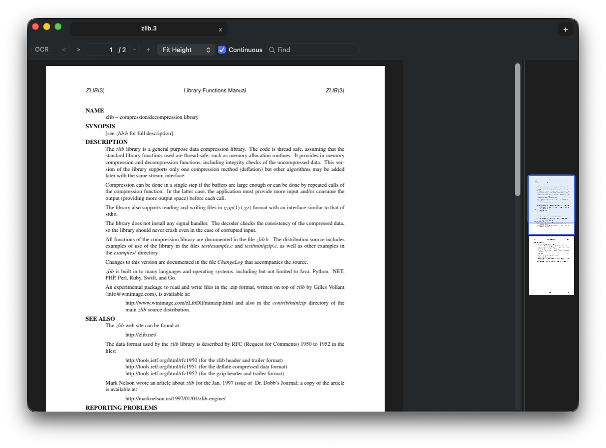
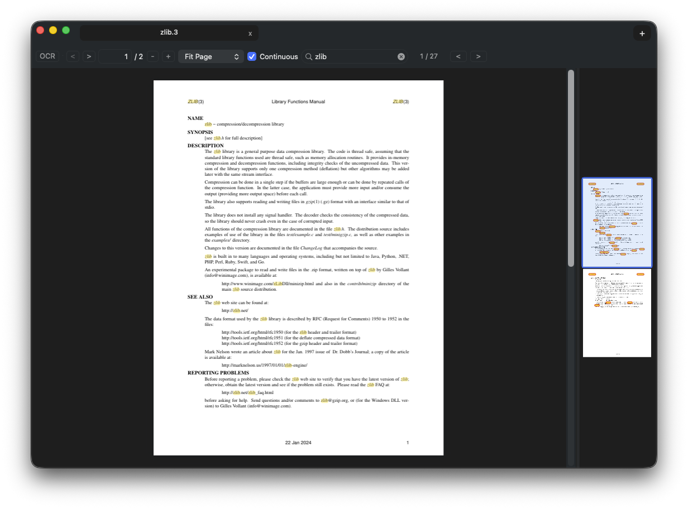

# Shenzhen PDF

Shenzhen PDF is a fast native document reader for macOS, Linux, and Windows,
with a portable MuPDF-backed core and frontends that keep the interface compact.
It follows the lightweight reader philosophy that made SumatraPDF pleasant to
use: open documents quickly, stay out of the way, make navigation/search fast,
and avoid heavy library-management chrome.

Shenzhen PDF is a separate project and is not affiliated with the SumatraPDF
project.

## Screenshots





## What Stands Out

- Native portable frontends for macOS and Linux. The macOS app is built with
  AppKit, the Linux app is built with GTK, and both share the portable document
  core instead of emulating Win32.
- Fast reader workflow: current-page-first rendering, background preloading,
  persistent per-tab document caches, remembered scroll/zoom state, restored
  sessions, recent files, favorites, and compact tabbed windows.
- Search that behaves like a reading tool: match counts, keyboard navigation,
  regex mode, highlighted results, minimap markers, per-document search memory,
  and a macOS Search sidebar that groups contextual results by chapter.
- A right-side document map with viewport dragging, page separators, search
  markers, remembered visibility/width, and special handling for long documents.
- OCR via OCRmyPDF/Tesseract with language selection, Chinese traineddata
  support, progress feedback, source backups, save-back behavior, and reload
  after processing.
- Offline translation via Argos Translate, including optional language package
  installation and translated PDFs saved next to the original.
- Reader polish on macOS: draggable/detachable tabs, multi-window session
  restore, presentation mode, native window arrangement shortcuts, smoother
  resizing, Preview-like trackpad panning, default-PDF-reader flow, and high
  quality PDF printing through the macOS print pipeline.
- Human-readable JSON state for settings, sessions, document state, favorites,
  and recent documents.

## Current Boundaries

- The macOS portable frontend is the most polished and recently validated path.
  The Linux GTK frontend shares the same core and data formats, but some of the
  latest behavior work is macOS-specific.
- The Windows C++/Win32 codebase remains in-tree and buildable in a Windows
  Visual Studio environment. Executable/resource branding should still be
  completed and verified before publishing Windows binaries under the Shenzhen
  PDF name.
- TestFlight packaging has a handoff script and checklist, but upload-ready
  packages require the publisher's Apple Distribution certificate, 3rd Party Mac
  Developer Installer certificate, App Store provisioning profile, and optionally
  Transporter.

## Build

### macOS

Build the app:

```sh
make -C portable mac-app
```

Build and install locally:

```sh
make -C portable install
```

Build a DMG:

```sh
make -C portable dmg
```

Build artifacts:

```text
dist/ShenzhenPDF.app
dist/ShenzhenPDF-mac-arm64.dmg
/Applications/ShenzhenPDF.app
```

Local development builds are ad-hoc signed. Public downloads must be Developer
ID signed and notarized. TestFlight builds use the App Store signing path below.

### Linux

Ubuntu/Debian:

```sh
sudo apt install build-essential pkg-config libgtk-3-dev libssl-dev
make -C portable linux
./portable/build/ShenzhenPDF-gtk
```

Fedora:

```sh
sudo dnf install gcc make pkgconf-pkg-config gtk3-devel openssl-devel
make -C portable linux
./portable/build/ShenzhenPDF-gtk
```

### Windows

```sh
bun ./cmd/build.ts
```

This creates:

```text
./out/dbg64/SumatraPDF.exe
```

Run the Windows build from an environment where the Visual Studio command-line
tools are available in `PATH`.

## TestFlight Handoff

The publisher needs an active Apple Developer Program account.

Create once in Apple Developer and App Store Connect:

1. An explicit macOS Bundle ID: `com.intuition.shenzhenpdf`.
2. An App Store Connect macOS app record using that Bundle ID.
3. A Mac App Store distribution provisioning profile.
4. An Apple Distribution certificate.
5. A 3rd Party Mac Developer Installer certificate.

Build the upload package:

```sh
MAC_BUNDLE_ID=com.intuition.shenzhenpdf \
MAC_VERSION=26.6.8 \
MAC_BUILD=1 \
MAC_APPSTORE_IDENTITY="Apple Distribution: Publisher Name (TEAMID1234)" \
MAC_INSTALLER_IDENTITY="3rd Party Mac Developer Installer: Publisher Name (TEAMID1234)" \
MAC_PROVISIONING_PROFILE="$HOME/Downloads/ShenzhenPDF_AppStore.provisionprofile" \
./portable/build-mac-testflight.sh
```

Expected output:

```text
dist/ShenzhenPDF-testflight-26.6.8-1.pkg
```

Open in Transporter:

```sh
OPEN_TRANSPORTER=1 ./portable/build-mac-testflight.sh
```

See [portable/docs/testflight.md](portable/docs/testflight.md) for the complete
handoff checklist.

## Data Files

macOS:

```text
~/Library/Application Support/ShenzhenPDF/
```

Linux:

```text
~/.config/shenzhenpdf/
```

Typical files:

```text
settings.json
session.json
documents.json
favorites.json
recent.json
```

## Repository Layout

- `portable/core/`: shared document, render, search, OCR-facing, and save core.
- `portable/mac/`: native macOS AppKit application.
- `portable/linux/`: native Linux GTK application.
- `src/`: Windows C++/Win32 application code.
- `mupdf/`: MuPDF dependency.
- `ext/`: third-party dependencies.
- `portable/docs/`: release, TestFlight, and portability notes.

## Legal And Attribution

Shenzhen PDF is free/open-source software. This repository currently retains
source and dependencies that carry their own licenses and notices. Preserve the
license files and per-file copyright notices when publishing:

- `COPYING`
- `COPYING.BSD`
- `AUTHORS`
- `mupdf/COPYING`
- third-party notices under `ext/`, `packages/`, and `mupdf/`

See [NOTICE.md](NOTICE.md) for the publication notice. Before claiming that the
repository contains no inherited code, perform a source audit and remove or
rewrite the retained code first.
