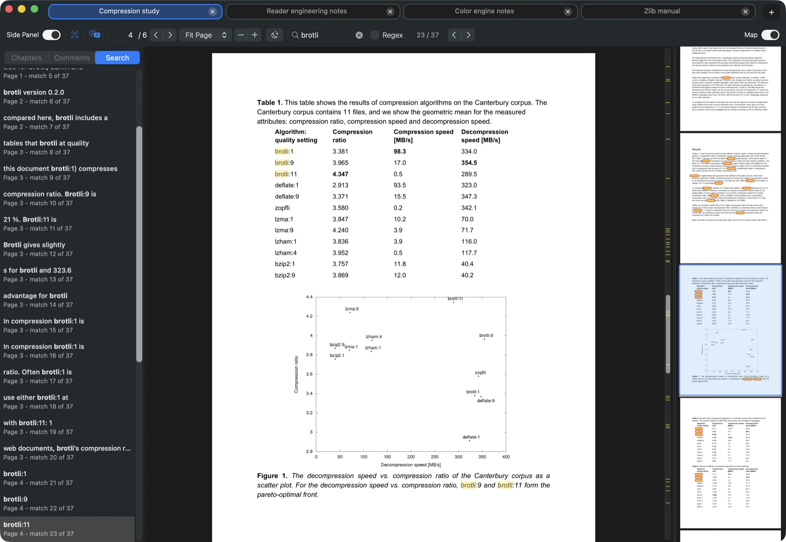
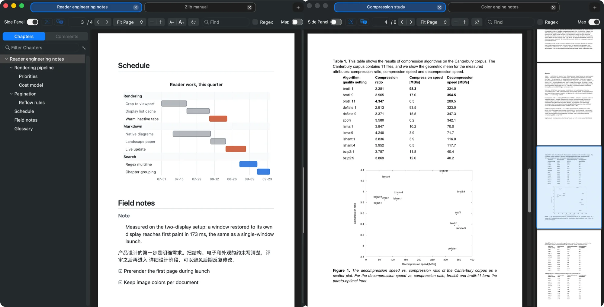
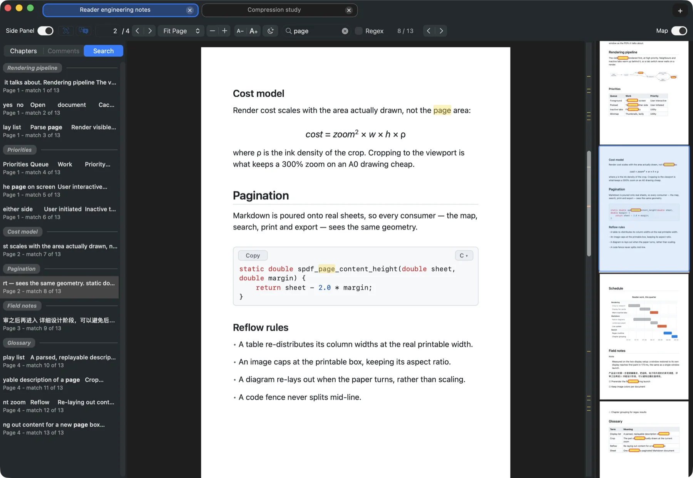
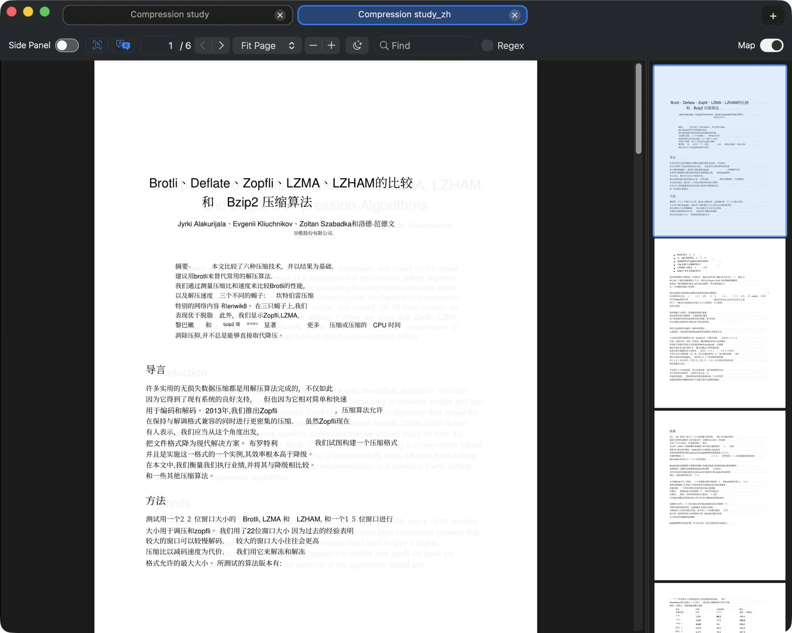

<h1 align="center">ShenzhenPDF</h1>
<p align="center"><b>A fast, tabbed native Mac reader for PDFs and Markdown, with on-device OCR and offline translation built in.</b></p>

<div align="center">

<a href="https://github.com/casimir-engineering/shenzhen-pdf/releases/latest/download/ShenzhenPDF-mac-arm64.dmg"></a>

<sub>Latest <b>26.8.29-2</b> · Apple Silicon</sub>

<a href="https://github.com/casimir-engineering/shenzhen-pdf/releases/latest">All releases</a> · <a href="https://github.com/casimir-engineering/shenzhen-pdf">Source</a>

</div>

<p align="center"></p>

<p align="center">Type anywhere to search. Jump anywhere in a long document using the map. Launches instantly. App restarts in the exact state you left it in.</p>

ShenzhenPDF opens PDFs (and more) instantly, keeps documents in tidy tabs, and does the heavy work - OCR and translation - entirely on-device. **Inspired by SumatraPDF, a separate project, not affiliated with it.**

<sub><a href="#reading">Reading</a> · <a href="#markdown">Markdown</a> · <a href="#search">Search &amp; map</a> · <a href="#powertools">OCR &amp; translation</a> · <a href="#fast">Speed</a></sub>

---

## <a id="reading"></a>Instant launch, intuitive interface, with all the features to do actual work

- **Compact tabbed windows** — Keep many documents in one tidy window; a space-efficient tab strip disambiguates same-named files and overflows into a "…" menu.
- **Draggable & detachable tabs** — Reorder by dragging, or pull a tab into its own window — it reopens exactly where you left it, carrying its view state.
- **Multi-window session restore** — Quit and relaunch to get every window back, each with its own tabs, selected tab, and size.
- **Resume exactly where you left off** — Reopen any document at the same page, zoom, fit mode, scroll position, and search.
- **Recents, reopen-last-closed & favorites** — Jump back into recent files, reopen a just-closed tab (<kbd>Cmd+Shift+T</kbd>), or star pages/docs and find them from a palette (<kbd>Cmd+K</kbd>).
- **Presentation mode** — Present full-screen with chrome-free advance and optional sleep prevention (<kbd>Shift+Cmd+F</kbd> / <kbd>F5</kbd>).

<p align="center"></p>

## <a id="markdown"></a>Markdown, read like a document <sub>macOS</sub>

- **GitHub-grade formatting, paginated** — Markdown opens as real A4 sheets in the same reader as PDFs: GitHub-flavored typography and palette, tables with grids, header bands and zebra striping, and fenced code in continuous rounded boxes. Same tabs, chapters, map, zoom presets, and presentation mode.
- **README HTML, sanitized and native** — The inline HTML that real READMEs lean on renders natively through a strict whitelist: centered `<div>`/`<p align>` blocks, HTML headings, badge images with `width`/`height` hints, `<kbd>` key caps, `<sub>`/`<sup>`, and simple HTML tables. `<details>` sections always render expanded with a bold ▸ summary line. Scripts, styles, iframes, forms, and event handlers are stripped — nothing is ever evaluated, no web engine involved.
- **Identical navigation, identical search** — Chapter jumps, page stepping, find with in-page highlights, map and scrollbar markers, chapter-grouped results, regex — all the PDF behavior, including an I-beam over text and a pointing hand over links.
- **31 syntax languages, chosen in place** — C, C++, Rust, Go, TypeScript, SQL, HTML, CSS, YAML, LaTeX, shell and more, picked from a searchable list anchored to the code block; Plain Text clears highlighting.
- **LaTeX math** — `$inline$` and `$$display$$` typeset natively — Greek letters, symbols, super/subscripts, fractions, roots — with display math centered. No web engine, no network.
- **Images, local and remote** — `https` images load lazily into a shared disk cache and render as centered figures with captions; right-click copies the image. Local images stay inside the document's verified directory.
- **Exports exactly what you see** — Save as PDF, Print, Copy Page, and Copy Page Image reproduce the on-screen pages: same margins, pagination, and text size. Adjustable text size (<kbd>A−</kbd> / <kbd>A＋</kbd>) is remembered across documents.

## <a id="search"></a>Search-oriented architecture

<p align="center"></p>

- **Incremental search with live count** — Type anywhere to start searching and every match appears instantly with a running "current / total" counter, highlighted in-page. <sub>macOS · Linux</sub>
- **Chapter-grouped results sidebar** — Every match listed with a snippet, grouped under its chapter heading; click to jump. <sub>macOS · Linux</sub>
- **Regex & multiline search** — Regular-expression matching, including patterns that span line and paragraph breaks; invalid patterns fail gracefully. <sub>macOS · Linux</sub>
- **Document map (minimap)** — A live right-side thumbnail strip with a draggable viewport: drag to scroll, click to jump, Cmd-scroll to zoom — search hits show as yellow markers. Scales to hundreds of pages. <sub>macOS · Linux</sub>
- **Scrollbar heat-map** — The scrollbar doubles as a match heat-map — a tick per hit, the active one hotter; each tab remembers its query across switches and relaunches. <sub>macOS · Linux</sub>

## <a id="powertools"></a>Power tools — 100% on-device <sub>macOS · Linux</sub>

<p align="center"></p>

- **Local OCR for scanned PDFs** — Make image-only PDFs searchable on your own machine with OCRmyPDF + Tesseract; no document is ever uploaded. Runs one job per core, deskews scans, backs up the original, and swaps in only confirmed text.
- **Chinese + ~20 languages** — Pick the OCR language up front — Simplified/Traditional Chinese alone or with English, plus ~20 more; missing data fetched on demand.
- **One-click toolchain install** — Missing OCRmyPDF, Tesseract, or a language pack? The app installs it (Homebrew on macOS; apt/dnf/pacman/zypper on Linux) and resumes automatically, with a live copyable log.
- **Offline translation (Argos Translate)** — Translate a selection or a whole PDF on-device across ~19 languages incl. Chinese — text never leaves your machine. Whole-doc mode writes a real translated PDF (`<name>_<lang>.pdf`) with text overlaid at each line's position and opens it automatically; cancellable mid-run.

## <a id="fast"></a>Fast by design

- **Snappy native rendering** — The page you're viewing renders first at high priority while nearby pages and inactive tabs warm up quietly — tab-switching is instant. Cached display lists and crop-to-viewport rendering make repeat renders cheap; stale renders abort within milliseconds. <sub>macOS · Linux</sub>
- **MuPDF-backed C core** — A compact ~93 KB C core wraps statically-linked MuPDF 1.27.2 behind a small stable ABI shared by both frontends — no Win32 emulation. Adds highlights/comments, page rotate, and single-page PDF export on top of viewing.
- **Far more than PDF** — Opens everything MuPDF recognizes — XPS, CBZ comics, EPUB/MOBI e-books, images, FB2, and HTML — plus Markdown through a native paginated renderer. PDF is the primary, most-polished path.

## Files, printing & updates

- **Verified daily auto-updater** — A once-a-day background check against GitHub Releases, kept off the launch path. Every update is verified offline against a pinned Apple Developer ID (Team 66LJ4BV7Q3), hardened runtime, bundle id, and stapled notarization before an atomic swap. An installation failure restores the working app immediately; a mismatched relaunch keeps and reveals the previous `.old` app for manual recovery.
- **High-quality native printing** — Prints through the standard macOS pipeline with Fit / Actual Size / Custom scaling
- **One-click default reader & readable YAML state** — Make ShenzhenPDF the system default for PDFs in a click; settings, sessions, favorites, and recents live as human-readable YAML you can read, diff, and edit. Existing JSON state files migrate automatically (originals kept as `.migrated-backup`). <sub>YAML state: macOS · Linux</sub>

## Platform support

- **macOS — the original** — Native AppKit + PDFKit.
- **Linux — full parity** — Native GTK4 + libadwaita app on the same portable C core and data formats: tabs (drag, detach, reattach), multi-window session restore, document map, chapter-grouped search sidebar, scrollbar heat-map, command palette, favorites, presentation mode, printing, auto-reload, properties panel, OCR, translation, and a minisign-verified auto-updater (deb + tarball). Instant launches via an optional resident mode. Built from `portable/linux/gtk4/`.
- **Windows — legacy** — A separate Win32 C++ tree remains in-tree but is independent of the portable core; no published Windows binary.

---

<details>
<summary><b>Build from source</b> (macOS / Linux / Windows)</summary>

<br>

### macOS

```sh
make -C portable mac-app      # build the app
make -C portable install      # build and install locally
make -C portable dmg          # build a DMG
```

Artifacts:

```text
dist/ShenzhenPDF.app
dist/ShenzhenPDF-mac-arm64.dmg
/Applications/ShenzhenPDF.app
```

Local development builds are ad-hoc signed. Public GitHub downloads must be Developer ID signed, notarized, stapled, and verified from the mounted DMG payload.

### Linux

Ubuntu/Debian:

```sh
sudo apt install build-essential pkg-config libgtk-4-dev libadwaita-1-dev libssl-dev unzip
make -C portable linux-gtk4
./portable/build/ShenzhenPDF-gtk4
```

Fedora:

```sh
sudo dnf install gcc make pkgconf-pkg-config gtk4-devel libadwaita-devel openssl-devel unzip
make -C portable linux-gtk4
./portable/build/ShenzhenPDF-gtk4
```

Or containerized (no host toolchain needed): `docker build -t shenzhen-build
portable/linux/dev && docker run --rm -v "$PWD:/work" -w /work shenzhen-build
make -C portable linux-gtk4`.

Packages: a `.deb` via `portable/linux/pkg/build-deb.sh <version>`, an
`.rpm` via `portable/linux/pkg/build-rpm.sh <version>` (builds inside a
Fedora container), and a Flatpak via the manifest in
`portable/linux/pkg/flatpak/` (see its README; Flathub submission notes
included).

### Windows (legacy)

```sh
bun ./cmd/build.ts
```

This creates `./out/dbg64/SumatraPDF.exe`. Run from an environment where the Visual Studio command-line tools are on `PATH`. This Win32 tree is legacy and not yet rebranded under the ShenzhenPDF name.

</details>

<details>
<summary><b>Data files &amp; locations</b></summary>

<br>

macOS: `~/Library/Application Support/ShenzhenPDF/`
Linux: `~/.config/shenzhenpdf/`

Typical files (human-readable YAML you can read, diff, and edit; recents live
inside `settings.yaml`):

```text
settings.yaml
session.yaml
documents.yaml
favorites.yaml
bookmarks.yaml
```

On first launch after updating, existing `.json` state files are converted to
`.yaml` and the originals are kept next to them as `<name>.json.migrated-backup`.

</details>

<details>
<summary><b>Repository layout</b></summary>

<br>

- `portable/core/`: shared document, render, search, OCR-facing, and save core.
- `portable/mac/`: native macOS AppKit application.
- `portable/linux/gtk4/`: native Linux GTK4 + libadwaita application.
- `src/`: Windows C++/Win32 application code.
- `mupdf/`: MuPDF dependency.
- `ext/`: third-party dependencies.
- `portable/docs/`: release, updater, and portability notes.

</details>


## Legal & Attribution

Shenzhen PDF is free/open-source software. This repository retains source and dependencies that carry their own licenses and notices. Preserve the license files and per-file copyright notices when publishing:

- `COPYING`
- `COPYING.BSD`
- `AUTHORS`
- `mupdf/COPYING`
- third-party notices under `ext/`, `packages/`, and `mupdf/`

Upstream AGPL/BSD notices are preserved intact. See [NOTICE.md](NOTICE.md) for the publication notice. Shenzhen PDF is a separate project and is not affiliated with the SumatraPDF project. Before claiming that the repository contains no inherited code, perform a source audit and remove or rewrite the retained code first.
